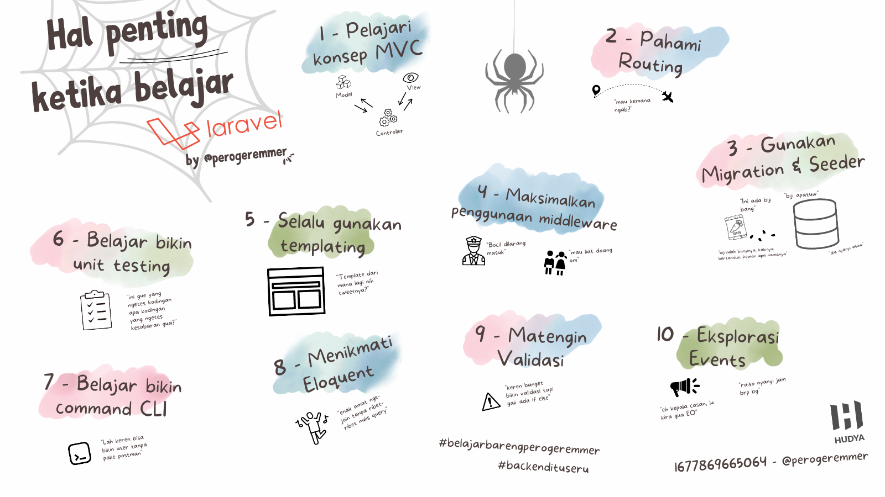
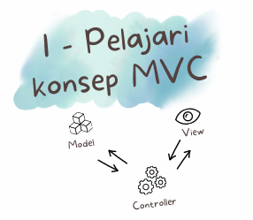
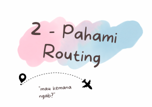
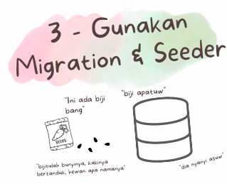

# Hal penting ketika belajar Laravel

by [@perogeremmer](https://twitter.com/perogeremmer)

Ketika lo kuliah, pasti lo bakalan ketemu mata kuliah pemrograman web. Nah tiap kampus kan beda-beda ya materinya pake apa, ada yang pake Code Igniter, ada yang pake PHP Native, atau ada yang mulai ngenalin framework, yaitu Laravel.

Laravel itu sendiri adalah framework PHP buatan Taylor Otwell yang mana framework ini dibuat biar kesannya tuh indah. Btw, kesan yang pengen dibuat si Taylor ini bukan omong kosong, kenyataanya laravel emang se-indah itu ges.

Struktur patternnya yang cantik, arsitektur desainnya yang kokoh, dan library-nya yang full udah bakalan bisa buat elo yang lagi belajar mau bikin web, jadi cepet banget bikin sebuah web.

Gimana enggak? Apapun hal dasar yang dibutuhkan untuk membangun web, udah ada di Laravel coy!

## Gimana cara belajar Laravel?

Ya baca aja dokumentasinya, atau ambil kelas online dimana aja yang elo suka deh, yang penting lo mau belajar aja.

Nah btw, banyak juga kan mahasiswa yang bingung, sebenernya bagian di Laravel apa aja sih yang penting ketika kita baru pertama kali belajar?

Oke gue akan bantu jelasin ke kalian biar kalian gampang engeh nih dan jadi jelas roadmapnya.

## Pelajari Konsep MVC



MVC atau Model View Controller adalah konsep dimana kita ngebagi layer logic menjadi 3 bagian, dimana tampilan akan ditempatkan pada view, logic business ditempatkan pada controller, dan logic database berada pada model.

Nantinya model akan ngurusin logic ke db, controller bakalan ngevalidasi dan menginisiasi model supaya masukin/update/ngambil/ngehapus data dari database dan controller bakalan ngembaliin lagi dalam bentuk view supaya jadi respon, yang mana pada umumnya ya bentuknya HTML.

Nah sebenernya gak harus mateng banget MVC, sambil jalan belajar Laravel pun kalian bisa pelajarin bagaimana konsep ini bekerja. 😄

## Pahami Routing



Pas belajar Laravel kalian juga bakalan nyobain yang namanya routing, dimana routing ini akan bekerja sebagai lalu lintas alur aplikasi web yang kalian bikin. Nah routing di laravel tuh keren banget guys, bisa sisipin middleware khusus untuk satu routing aja, ada yang namanya grouping, ada yang namanya prefix.

Ah pokoknya kalo kalian bisa memahami konsep routing bekerja, kalian bisa bikin URL kalian jadi keliatan cantik.

Misalnya pake konsep RESTful:

- `GET` - `/users`
- `GET` - `/users/{id}`
- `POST` - `/users`
- `PUT` - `/users/{id}`
- `DELETE` - `/users/{id}`

Kalo misalnya setiap Route user ada action gimana? Gampil, kita cakepin ajah.

- `GET` - `/users/{id}/bank-account`
- `GET` - `/users/{id}/account-history`
- `GET` - `/users/{id}/transaction-history`

> Menggunakan hypens (-) akan selalu lebih baik daripada pake underscode / snake case (_) karena lebih **readable** untuk URL

Atau bisa juga dibuat prefix by action:

- `GET` - `/users/{id}/history/transaction`
- `GET` - `/users/{id}/history/bank`
- `GET` - `/users/{id}/history/account`

So simple kan?

## Gunakan Migration & Seeder



Biasain deh pake migration & seeder buat ngedevelop laravel, soalnya bakalan ngebantu kamu banget.

Migration dipake buat bikin perubahan pada database kamu kaya pembuatan tabel baru, penambahan kolom baru, maupun penambahan index jadi lebih cepat dan bisa di-track.

Kamupun bakalan lebih gampang ngisi data di database pake seeder alih-alih buka PHPMyAdmin kamu terus ngisi satu-satu HAHAHAHA 🤣. Ngaku, siapa yang suka begini?

Migration dan Seeder juga bakalan ngebantu kalo project ini dikerjain gak sendirian, tapi bareng-bareng, jadi gak ada lagi tuh istilah `"eh bagi export sqlnya dong"` kata temen kalian. Tinggal kalian balikin `"Jalanin aja migration dan seedernya, jangan manja 🙂"`.

Selalu inget juga bahwa migration ada istilah up dan down, yang mana up artinya ketika migration dijalanin, dan down artinya ketika migration di-rollback.

Rollback itu istilah dimana kalian balik ke state atau keadaan sebelumnya, jadi kalo misalkan ketika nambahin kolom eh kerasa ada yang lupa ditambahin nih pas development di local, kalian bisa rollback dan tambahin kolom baru tersebut terus kemudian jalanin lagi kaya biasa, voila, kalian bisa nambahin kolom baru tanpa harus buat migration baru.

> Cara ini hanya berlaku di local aja ya, soalnya kalo udah masuk server production dan sudah terlanjur di up, ada baiknya bikin migration baru kalo mau nambahin kolom untuk mencegah data loss.

## Maksimalin Penggunaan Middleware


Siapa yang pas belajar malah ngang-ngong-ngang-ngong pas bagian materi kondisi alias if else. Nah gak boleh lagi ya, soalnya middleware ini konsepnya juga sama kaya if else.

Middleware adalah sebuah proses dimana sebuah request akan diperiksa dan dijalankan pada bagian tersebut. Umumnya kalo di web, middleware akan dilewati pada saat **sebelum** masuk ke controller dan **sesudah** controller mengembalikan nilai.

Nah di Laravel itu middlewarenya keren banget alias sudah komplit apapun yang kalian butuhin secara default udah ada di Laravel, guys.

## Selalu Gunakan Templating


Siapa nih yang pas kuliah gedeg banget pas belajar HTML karena satu bagian yang sama harus di-copas beberapa kali pada file HTML yang lain? Nah kalo udah pake laravel gak ada lagi tuh istilah ini.

Laravel punya yang namanya template engine `blade` yang mana powerful banget guys. Banyak fungsi di template engine ini salah satunya adalah templating menggunakan base template, dimana konsepnya adalah:

- Head
- Body
  - Navbar
  - Konten
- Scripts

Nah dengan pake templating, kalian bisa bikin satu file yang jadi template dan ngisi bagian kontennya aja. Enak banget deh bisa bikin kerjaan cepet kelar!

Eh iya, si blade ini tuh punya banyak banget fungsi kaya include, extends, section, sampe push untuk nge-inject script HTML. Baca-baca dan cobain aja sesuai studi kasus kebutuhan kalian.

## Belajar Bikin Unit Testing


Pernah gak sih ngerasa mager banget nyoba-nyobain aplikasi kalian dengan kasus yang sama terus harus diklik-klik berulang kali? Kalo aplikasinya masih cuma CRUD doang sih enak ya, tapi kalo kalian lagi bikin produk berbentuk web pake Laravel misalnya aplikasi peminjaman perpustakaan dan harus ngetes-ngetesin satu-satu fungsinya lagi mager gak sih?

Itu dia makanya ada unit testing, kamu bisa belajar bikin unit test supaya ngetes URL kamu dengan kasus yang mirip ketika di-klik.

> Ohiya, psst, jangan kasitahu siapa-siapa ya, janji? Kalo kamu jago bikin unit testing pas belajar apalagi selalu membiasakan diri, kamu ada possibility untuk di-hire sebagai engineer loh, soalnya factnya adalah engineer tuh males nulis test. Nulis test itu emang capek dan nyebelin, tapi strategis untuk jangka panjang, jadi jangan males ya! 😜

Selain itu, laravel juga punya unit testing yang bisa mensimulasikan kamu kaya ngebuka browser beneran secara otomatis tanpa ngeklik-klik, keren banget dah pokoknya. Namanya [Laravel Dusk](https://laravel.com/docs/10.x/dusk) dan bisa kamu liat-liat di yutub ya bentuknya~

## Belajar bikin CLI


Selama kamu belajar programming dasar kan kamu bikin aplikasi dalam bentuk CLI tuh, nah laravel juga bisa guys, namanya [Laravel Artisan Command Console](https://laravel.com/docs/10.x/artisan), terkesan gak keren ya? Lagian buat apa web bikin CLI segala?

Eits gak gitu brodi, banyak fungsinya loh secara teknis, misalnya kalian perlu command sederhana untuk ngerubah user A menjadi superadmin, kalo misalnya fiturnya belom ada dalam bentuk tampilan web dan aktivitasnya juga gak setiap hari, bikin aja command CLI-nya terlebih dahulu. Simple, gak makan waktu, dan pastinya memenuhi kebutuhan!

CLI ini juga bisa dipake untuk banyak kasus misalnya ngirim report per-jam, ngirim email notifikasi, atau ngirim notifikasi ke aplikasi android kalian.

Keren gak sih? Jadi jangan ngeremehin aplikasi console ya.

## Menikmati Model Eloquent


Siapa yang mau ribet-ribet nulis query join? Nah kalo pake ORM pasti gampang banget. Eits gak tau ya? ORM (Object-Relational Mapping) adalah sebuah library untuk mempermudah developer berinteraksi dengan database, misalnya mau nge-select data, kamu bisa dengan modal gini doang:

```php
$model->get();
```

Yang mana, hasil dari fungsi di atas adalah sama aja kaya ngejalanin

```sql
SELECT * FROM table;
```

Itu baru SQL-nya, belom manggil fungsi Laravelnya.

Makanya ada Eloquent di Laravel tuh enak banget guys, bener-bener salah satu keajaiban dunia!

Eloquent juga gak sebatas bikin kamu gampang nge-query aja, atribut relasinya yang bisa bikin kamu dapetin data dari table yang berelasi juga bikin kamu ngoding gampang banget, asli.

## Matengin Validasi


Matengin? Yaelah dikira makanan kali ya, tapi serius dah Laravel tuh punya validasi yang keren banget, kalian bisa bikin validasi HTTP gak ada bikin if-else lagi, soalnya dia punya library validation begini:

```php
$validated = $request->validate([
    'title' => 'required|unique:posts|max:255',
    'body' => 'required',
]);
```

Modal begini doang bisa tau kalo input dengan name `title` dan `body` kamu itu dibutuhin, terus titlenya harus unique di table posts, dan maksimal panjang titlenya 255. Kurang keren apa coba?

Kamu gak butuh lagi bikin if else if else yang banyak cuma buat validasi, Laravel udah manjain kamu banget.

## Eksplorasi Events


Events adalah salah satu konsep di laravel dimana kita bisa melakukan modularisasi alias misahin kode ke sebuah bagian yang bisa dipanggil berulang kali.

Konsep ini bakalan bikin kode kamu jadi reusable alias bisa dipake berulang kali, dan juga bikin kode kamu lebih rapih tentunya karena gak ditulis di controller berkali-kali.

Cuma modal events aja, contoh misalnya abis user ngelakuin pendaftaran kalian mau kirim email. Nah pake events kalian bisa ngirimin email ke user tersebut dengan template email registrasi. Kalopun misalnya nanti user registrasinya pake akun gmail atau akun facebook, kalian juga bisa panggil events yang sama ketika user registrasi pake password.

Satu events, bisa dipanggil di tiga fungsi berbeda. Kurang enak apa coba?

<hr/>

Laravel emang manjain developer banget, soalnya banyaknya hal di Laravel bakalan ngebuat kamu jadi gampang banget mau ngapa-ngapain dan pastinya kerjaan kamu jadi makin cepet kelar.

Gak ada alasan untuk gak belajar Laravel ketika mau bikin web cepat tapi gak mau ngabisin waktu untuk belajar.

Nyatanya, pake Laravel juga bisa bikin kamu untuk mendaftar kerja lebih cepat, selama.... logic dan jam terbang kamu bagus 😉
