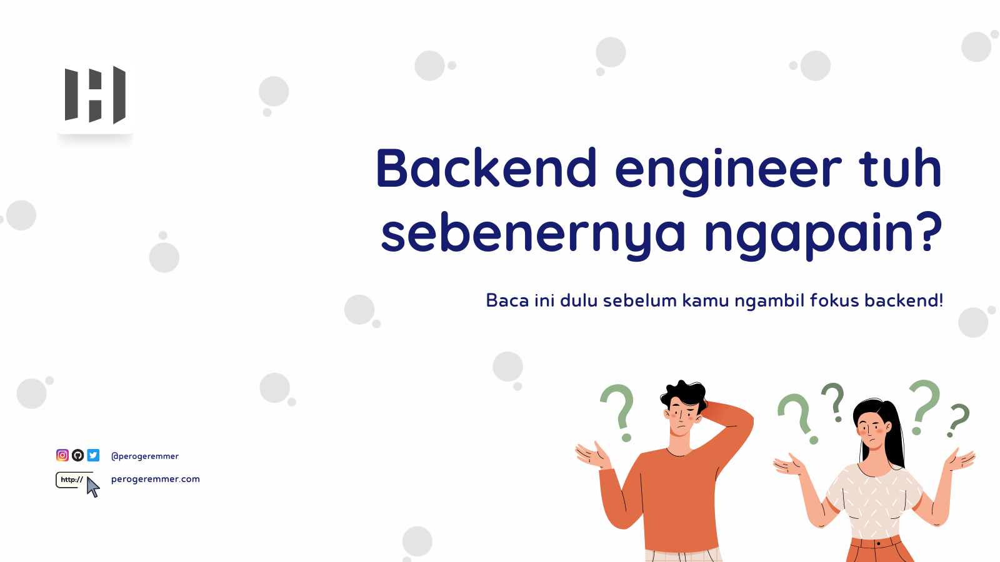

<br/>

**Table of contents**

- [Emang Backend Engineer Tuh Ngapain?](#emang-backend-engineer-tuh-ngapain)
- [Backend Engineer / Developer](#backend-engineer--developer)
- [Emang apa bedanya jalan di server sama client? 🤔](#emang-apa-bedanya-jalan-di-server-sama-client-)
- [Gimana cara jadi Backend Devloper?](#gimana-cara-jadi-backend-devloper)
- [Matematika? BENERAN? 🤯](#matematika-beneran-)
- [Terus harus belajar apa untuk ambil backend?](#terus-harus-belajar-apa-untuk-ambil-backend)
- [Apa lagi?](#apa-lagi)

## Emang Backend Engineer Tuh Ngapain?

Banyak mahasiswa yang sejujurnya pasti bingung, ketika ngeliat role backend engineer atau devloper. Sebenernya ini kerjaan ngapain sih? Karena kayanya belibet banget kalo diperhatiin sama kalian di [roadmap.sh](https://roadmap.sh/backend).

Sebenernya sih jujurly, backend itu gak ribet, pola pikir kalian yang ngerasa bahwa backend tuh ribet. Basically, backend sama aja kaya Frontend Engineer dengan domain yang khusus merucut kepada Backend.

## Backend Engineer / Developer

Gampangnya, backend devloper itu adalah seseorang yang menggunakan teknologi yang berjalan di server-side, alias teknologi yang biasanya berjalan di server.

## Emang apa bedanya jalan di server sama client? 🤔

Ya beda, beda perlakuan, beda habbit, sama beda teknologinya juga. Kalo kalian kenal dengan istilah **Javascript** nah ini adalah teknologi yang sebenernya berjalan di sisi client, atau gampangnya, nempel di browser kalian.

Kalo backend, teknologinya itu cenderung pake teknologi yang berjalan di sisi server. Misalnya bahasa Java, Go, Python.

Biar gampangnya coba aja deh liat gambaran di bawah ini:
::: mermaid
graph LR;
    device(Perangkat)<-->app(Aplikasi E-commerce)
    app(Aplikasi E-commerce)<-->server(Server)
    server(Server)<-->db(Database)
:::

Misalnya lo buka salah satu e-commerce dari aplikasi, nah aplikasi itu butuh data dari aplikasi yang berjalan server, nah aplikasi yang berjalan pada server akan mengambilkan data dari database sesuai permintaan pengguna.

> Aplikasi yang berjalan di server? Apaan tuh? 🤔

Namanya API atau application programming interface. Aplikasi ini adalah script yang menjadi barrier atau gerbang sebelum aplikasi e-commerce yang berbentuk aplikasi android/ios atau website meminta data sesuai kebutuhan dari database.

API ini menyaring informasi bahkan hak akses sebelum informasi yang dibutuhkan dikembalikan, misalnya ketika lo ngeliat daftar keranjang lo, API ini akan memastikan lo cuma boleh ngeliat keranjang lo doang, ngga bisa ngeliat keranjang pengguna lain, begitu juga dengan pengguna lain, ngga akan bisa mereka ngeliat keranjang lo.

API juga yang mengolah dan menyaring misalnya ada flash sale, lo mau masukin barang ke keranjang, atau lo mau bayar. Semua aktivitas ini dikirimkan dari aplikasi android/iOS kalian ke API dan akan disaring lalu diolah.

> Kenapa harus disaring? 🤔

Karena ada banyak kondisi di dalamnya, misalnya ada flash sale dan kuotanya cuma 10 barang. API ini yang akan jadi barrier untuk memeriksa sebenernya ini yang minta beli barang, barangnya beneran udah abis apa blom? Kalo udah abis maka pembeli ke-11 dan sesudahnya akan dapat pesan bahwa barangnya udah habis.

## Gimana cara jadi Backend Devloper?

Ehm, matematika.


> src: [tenor.com](https://tenor.com)

## Matematika? BENERAN? 🤯

Ya, beneran, sebenernya matematika ini ga cuma ngomongin ngitung aljabar linear atau kalkulus.

Tapi memahami seni logika dari step by stepnya sebuah masalah untuk diselesaikan dengan sebuah problem solving versi kita sendiri. Jadi sebenernya matematika ini emang penting kalo mau jadi backend devloper, dan bukan sesuatu yang bisa lo hindarin.

Untuk apa kabur dari matematika? Math is fun! :smile:

Matematika bakalan ngebantu kalian berpikir secara runtut, pragmatis, dan tepat. Soalnya, ngomongin backend itu berarti ngomongin logika yang tepat untuk menyelesaikan masalah.

> Lah berarti frontend atau mobile gak nyelesain masalah bang? 😕

Ya gak gitu, maksudnya banyak case-case yang butuh perhitungan adanya di backend, misalnya rumus perhitungan barang dimana barang itu ada diskon (ini sih masih kasus sederhana).

Ada juga kasus integrasi dimana lo harus memahami rumus bit 256 yang akan di konversi jadi 1, kemudian ditambahkan dengan bit sisa yang ada, biasanya ini kejadian di low level language untuk ngomong ke mesin.

## Terus harus belajar apa untuk ambil backend?

Sebenernya ada banyak banget sih

1. **Matematika** ➕

   Sebenernya ini gak bisa ditawar sih, minimal ya, matematika bagian logika (premis) itu bisa deh, misalnya:

   ```
   Hari ini hujan
   Ani tidak pergi

   Hari ini hujan, artinya apa?
   ```

   Yep, **ani tidak pergi**. Matematika logika gini penting untuk jadi seorang backend devloper, soalnya lo bakalan ketemu kondisi-kondisi lainnya yang lebih kompleks.

   Kamu bisa minimal ngelatih beginian dengan terbiasa main puzzle, atau catur, intinya logika kamu harus bagus kalo mau mantep di backend. Permainan strategi kaya Age of Empire juga akan ngebantu otak kamu ngestimulus pengambilan keputusan, meskipun gak sesederhana di game ya kalo ngomongin backend 😆

2. **Belajar dasar pemrograman** 📑

   Gak cuma jadi seorang backend devloper, tapi dasar pemrograman itu udah makanan wajib kalo lo mau terjun ke pemrograman, masa iya mau jadi programmer gak bisa ngoding? Aneh lah bos.

   Iya gue tau, mungkin lo nanya apa aja sih dasar pemrograman?

   - Syntax (Penulisan)
   - Variabel
   - Operator
   - Tipe Data (String, Integer, Array, Boolean, Object/Dictionary)
   - Kondisi
   - Perulangan
   - Class & Fungsi
   - Object Oriented Programming

   Belajar studi kasus pembuatan aplikasi sederhana, misalnya Todo List,

3. **Belajar basis data (database)**

   Menjadi seorang backend yang baik, berarti harus bisa bikin struktur database yang baik, termasuk juga pemilihan tipe kolom, hingga membuat query yang baik.

   Nah kalo misalnya lo ngelamar jadi backend nantinya, banyak perusahaan yang ngasih lo studi kasus bikin table di database doang, abis itu lo bakalan ditanya pertanyaan-pertanyaan yang relate sama database, meskipun sekarang jenis database ada banyak, tapi hingga saat ini database yang paling umum dipake itu database tipe relasi (RDBMS - Relational Database Management System), misalnya MySQL.

   Apa aja yang harus dipelajari di MySQL?

   - Table, Kolom dan tipenya
   - Query dasar table (CREATE, DROP, ALTER)
   - Query dasar data (SELECT, INSERT, UPDATE, DELETE)
   - Join Data (INNER JOIN, LEFT JOIN, RIGHT JOIN)
   - Normalisasi
   - Query Advance (GROUP BY, ORDER BY, LIMIT, OFFSET, TRIGGER, PROCEDURE, VIEW, DATE FORMAT)

   Belajar studi kasus membuat database untuk data warehouse.

4. **Repeat** 🔁

   Ulangin step 1-3 sampe bosen, serius. Mungkin kedengeran aneh, tapi nyatanya banyak orang yang pas terjun kerja itu gak mateng 1-3nya. Gak tau cara select data yang di-join, gak tau cara ngambil rata-rata jumlah total transaksi per-hari.

   Coba lakukan mentoring dengan orang yang lebih berpengalaman untuk dapetin hal-hal baru yang bisa kamu explore.

5. **Belajar web programming** 🌍

   Belajar web programming setelah kamu udah bosen sama empat hal di atas, kamu bisa mulai belajar HTML, CSS, Javascript.

   **Iya, emang gak enak.**

   Serius, CSS itu part paling nyebelin dan pasti banyak yang gak suka, tapi gak berarti kamu segitunya gabisa, kamu harus bisa dan tau dasarnya, meskipun **gak jago**.

   Dari belajar web programming kamu jadi bisa bikin aplikasi yang keliatan tampilannya, kalo selama ini di pemrograman dasar kan kamu ngeliatnya hanya berbasis console aja.

<hr/>

## Apa lagi?

Sebenernya masih banyak sih yang bisa dilakukan dan dipelajarin sebagai seorang backend, tapi untuk permulaan di awal blog ini, saya cuma pengen nulis ini aja sih. Nantinya kamu bisa baca-baca lagi lebih detailnya mengenai backend disini~

Semoga pada betah baca ya :)
