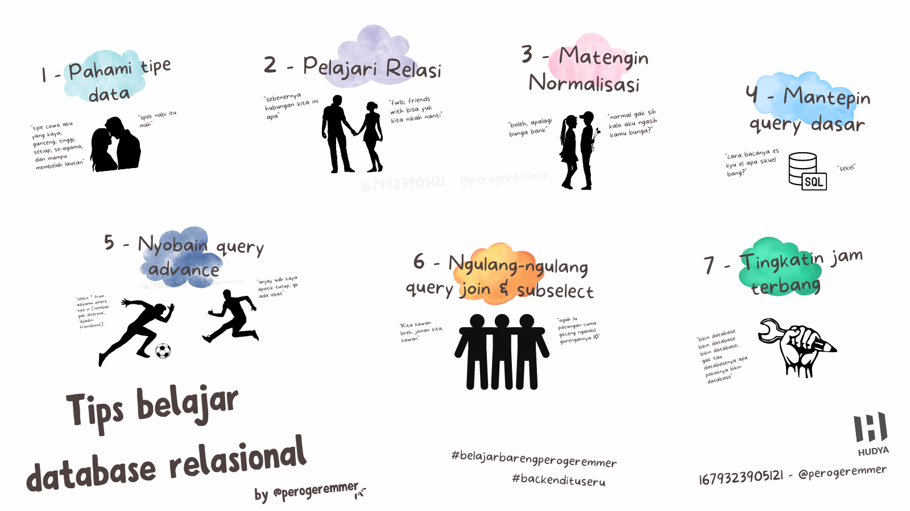
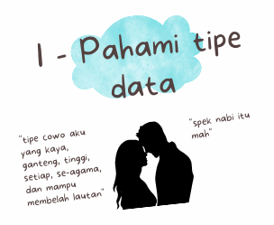
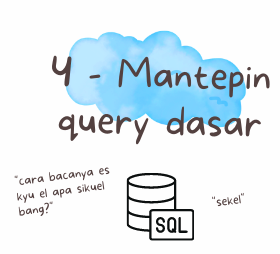
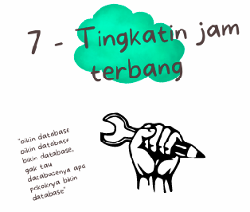

# Tips Belajar Database Relasional

by [@perogeremmer](https://twitter.com/perogeremmer)

Hai mahasiswa, pasti ketemu sama pelajaran Database Relasi kan pada kuliah Basdat alias basis data?

Nah pelajaran basis data ini penting banget kalo kalian pengen jadi anak backend, soalnya tanpa database, ya gimana caranya kalian bisa jadi anak backend ye kan?

Gue gak akan bahas secara detail apasih database relasional, kalian bisa googling itu sendiri, jangan manja ye? ok? 😜

## Gimana cara belajar database biar `gampang`?

Gue bosen banget sebenernya ditanya pertanyaan kaya gini, soalnya dan faktanya, satu-satunya cara belajar database biar gampang ya diulang-ulang aja, karena lo gak akan bisa jadi seorang master tanpa ngulang-ngulang materi.

Tapi, gue juga setuju, untuk mempermulus kalian belajar, kita bisa pecah-pecah masalah agar belajarnya bisa bertahap dan dikejar satu persatu.

Berikut udah gue pecahin apa aja tips belajar database relasi biar kalian makin gampang memahaminya untuk mengejar step by step!

## Pahami Tipe Data



Pahamin tipe data, sumpah. Ini yang termasuk bagian sering di-skip padahal ini hal yang penting buat dipelajarin, lo harus tau kapan pake `Char` and `Varchar`. Padahal keduanya mirip, tapi bedanya `Varchar` ini ketika lo bilang panjangnya 10 dan lo ngisi 5 karakter doang, dia bener-bener cuma ngisi 5 karakter di dalam storage, 5 sisanya di-skip, sedangkan `char`, ketika di-set 10 dan lo ngisi 5, lo akan tetep mengisi 10 karakter di storage.

> Tau gitu kenapa gak pake varchar aja bang, kan lebih fleksibel?

Iya bisa, tapi untuk performa, `char` jelas jauh lebih bagus daripada `varchar`. Ini kita ngomongin performa untuk skala besar ya, kalo database elo cuma isinya 100 baris, ya kagak kerasa lah hahahaha.

Performa ini maksudnya ngomong performa ketika kolom `char` tersebut kena bagian pencarian, jelas akan lebih cepet daripada `varchar`.

Pake `char` ketika tau format yang pasti dalam nilai pada kolom itu, misalnya udah fix 20 karakter aja, yaudah 20 karakter aja jangan lebih, kalopun ada yang nilainya 10 karakter, gapapa.

## Pelajari Relasi


Pelajari relasi yang ada di database relasi, namanya aja **Relational Database Management System (RDBMS)** ya pasti ada relasi lah antar data ataupun tabel.

Ada tiga hal dasar yang perlu dipelajarin:

* One to Many ➡️ Kalo sebuah nilai **bisa punya lebih dari satu data** berelasi dengan nilai lainnya di tabel lain.
* One to One ➡️ Kalo sebuah nilai **cuma punya satu data** berelasi dengan satu nilai di tabel lain.
* Many to Many ➡️ Kalo banyak nilai **bisa punya lebih dari satu data** berelasi dengan nilai lainnya di tabel lain.

Ketiga data ini paling enak dipelajarinnya pake Excel/Spreadsheets sambil belajar normalisasi, karena dengan tiga hal dasar ini kamu jadi tahu cara kerja database tuh sebenernya gimana. Cocok buat kamu yang awam dan kaga bisa ngebayangin di kepala, udah pake excel aja sih hahaha.

Yang ini gue kaga jelasin detail ya soalnya bisa dipelajarin sendiri pas bareng sama normalisasi.

## Matengin Normalisasi


Normalisasi ini berkaitan sama relasi di bagian kedua, soalnya pake normalisasi kamu tau desain yang harusnya kamu bikin, sebenernya ada banyak, tapi yang dasar kamu perlu tau tiga hal ini:

* First Normal Form (1NF) ➡️ Bentuk pertama, dimana satu nilai harus unique. Misalnya tabel customer gak perlu punya dua data untuk nama depan dan belakang.
* Second Normal Form (2NF) ➡️ Bentuk kedua, dimana bentuk dasarnya harus 1NF terus harus bergantung sama nilai pada tabel lainnya. Contohnya sih paling gampang nomor telfon pengguna yang bisa lebih dari 1.
* Third Normal Form (3NF) ➡️ Bentuk ketiga, dimana bentuk dasarnya harus 2NF terus harus bergantung ke kunci utama (primary key) untuk mengurangi data redundan, misalnya data transaksi yang mana nyimpen ID customer sama ID barang.

Masing-masing bentuk ini akan mempengaruhi perilaku terhadap relasi pada nomor dua, misalnya relasi tabel a ke b itu one to many atau one to one atau bahkan many to many.

Nantinya kamu bisa pahamin pake studi kasus beneran, apakah akan dipost di blog ini? Ya liat aja deh nanti 🤣

## Mantepin Query Dasar



Mantepin query dasar kalian artinya adalah kalian pelajarin query dasar di mysql dengan menjawab beberapa pertanyaan berikut kalian bisa belajar query dasar:

* Gimana cara buat database?
* Gimana cara hapus database?
* Gimana cara buat tabel?
* Gimana cara hapus tabel?
* Gimana cara ubah nama tabel?
* Gimana cara ubah tabel dan nambah kolom baru?
* Gimana cara ubah tabel dan ngeganti salah satu tipe kolom?
* Gimana cara nambahin data di salah satu tabel?
* Gimana cara ngerubah salah satu data di salah satu tabel?
* Gimana cara ngerubah lebih dari satu data di salah satu tabel?
* Gimana cara ngehapus salah satu data di salah satu tabel?
* Gimana cara ngehapus lebih dari satu data di salah satu tabel?
* Gimana cara nampilin seluruh data di salah satu tabel?
* Gimana cara nampilin sebagian data di salah satu tabel?
* Gimana cara nampilin seluruh data di salah satu tabel pake satu kondisi?
* Gimana cara nampilin seluruh data di salah satu tabel pake dua kondisi?

Udah bisa jawab? Sekarang cobain simple task ini:

Bikin database tentang warehouse (gudang) dengan satu tabel aja yaitu `products` dengan kolom berikut:

* id integer auto increment primary key
* name varchar(235) not null
* description text
* price biginteger default 0
* stock biginteger default 0
* created_at timestamp default current_timestamp

Sekarang isi datanya sekitar 20 data dengan query berikut:

```sql
INSERT INTO your_table_name (name, description, price, stock) VALUES
('Tomato Goods', 'The tomato goods', 1000000, 10),
('Banana Toys', 'The banana toys', 1500000, 15),
('Orange Tools', 'The orange tools', 2000000, 20),
('Carrot Gadgets', 'The carrot gadgets', 2500000, 25),
('Pineapple Accessories', 'The pineapple accessories', 3000000, 30),
('Potato Electronics', 'The potato electronics', 3500000, 35),
('Cabbage Apparel', 'The cabbage apparel', 4000000, 40),
('Onion Beauty', 'The onion beauty', 4500000, 45),
('Broccoli Kitchen', 'The broccoli kitchen goods', 5000000, 50),
('Mango Music', 'The mango music', 5500000, 55),
('Papaya Sporting', 'The papaya sporting goods', 6000000, 60),
('Grape Books', 'The grape books', 6500000, 65),
('Kiwi Movies', 'The kiwi movies', 7000000, 70),
('Pumpkin Home', 'The pumpkin home goods', 7500000, 75),
('Pear Outdoors', 'The pear outdoor goods', 8000000, 80),
('Cherry Baby', 'The cherry baby goods', 8500000, 85),
('Apple Office', 'The apple office goods', 9000000, 90),
('Peach Industrial', 'The peach industrial goods', 9500000, 95),
('Lemon Health', 'The lemon health goods', 10000000, 100),
('Ginger Beauty', 'The ginger beauty goods', 10500000, 105),
('Garlic Sports', 'The garlic sporting goods', 11000000, 110),
('Blueberry Industrial', 'The blueberry industrial goods', 11500000, 115),
('Cucumber Automotive', 'The cucumber automotive goods', 12000000, 120),
('Strawberry Home', 'The strawberry home goods', 12500000, 125),
('Avocado Kitchen', 'The avocado kitchen goods', 13000000, 130),
('Eggplant Fashion', 'The eggplant fashion goods', 13500000, 135),
('Radish Beauty', 'The radish beauty goods', 14000000, 140),
('Watermelon Industrial', 'The watermelon industrial goods', 14500000, 145),
('Blackberry Music', 'The blackberry music goods', 15000000, 150);
```

Lalu jawab pertanyaan berikut:

* Gimana cara kita nampilin barang yang stocknya antara 100 - 130?
* Gimana cara kita nampilin barang dengan harga terendah?
* Gimana cara kita nampilin barang harga tertinggi di antara stock 40 - 90?
* Gimana cara kita ngitung total seluruh stock barang?
* Gimana cara kita nampilin nama barang doang pada barang yang harganya lebih besar dari 6500000?

Udah bisa? Ya selamat, one step ahead 😃

## Nyobain Query Advance


Ketika kamu udah bosen sama query dasar, udah saatnya kamu cobain query advance. Kaya misalnya:

* SUBQUERY
* UNION
* GROUP BY
* HAVING
* JOIN

Btw gue gak mau panjang lebar lagi jelasin disini, soalnya bisa kaga kelar 7 hari 7 malem kalo harus jabarin di post ini, better nanti gue buatin studi kasus aja yak hehehe.

Tapi pake query advance di atas lo bisa dapetin hal-hal yang lebih kompleks, misalnya lo pengen ngitung jumlah pendapatan pada tabel transaksi di bulan maret. Nah lo harus pake `group by`. Soalnya kalo gak pake `group by` fungsi `SUM` jadi malah ngekalkulasi semua datanya cuy, makanya harus dikasih `group by`. Nah tuh gue kasih paham kan, sekarang tinggal lo coba pelajarin dulu.

## Ngulang-ngulang query JOIN dan Subselect (Subquery)


Maksudnya ngulang-ngulang tuh lo cobain dengan berbagai kasus digabung dengan kasus-kasus di nomor 4, misalnya gimana nih kalo tabel A di join tabel B, lalu kondisinya begini.

Sumpah kalo di industri IT tuh emang bakalan begini, jadi kaga ada alasan lo males atau pusing ngelakuinnya, emang begini nasib backend, jadi daripada ngeluh, ya dikerjain aja. 😎

Pokoknya pahami kapan pake JOIN dan anak-anaknya kaya LEFT JOIN, RIGHT JOIN, INNER JOIN termasuk kapan pake sub-select. Keduanya sama-sama bermanfaat dan bisa berguna tergantung sikon (susah juga jelasin situasi kondisi kaya apa karena bisa beda-beda casenya).

`Inget, jangan bosen ngulang kalo belom jago.`

## Tingkatin Jam Terbang



Terakhir, tingkatin jam terbang.

Kalo ini sih udah gak perlu dikasitau lagi lah ya, udah lakuin aja, tingkatin jam terbang, caranya gimana? Berikut database yang bisa lo bikin berdasarkan studi kasus:

* Database Perpustakaan: Database ini berisi informasi tentang koleksi buku di perpustakaan, seperti judul, pengarang, penerbit, tahun terbit, jumlah halaman, dan nomor ISBN. Database ini juga dapat mencakup informasi tentang anggota perpustakaan, seperti nama, alamat, nomor telepon, dan nomor keanggotaan.

* Database Toko: Database ini berisi informasi tentang produk yang dijual di toko, seperti nama produk, deskripsi, harga, dan stok. Database ini juga dapat mencakup informasi tentang pelanggan, seperti nama, alamat, nomor telepon, dan riwayat pembelian.

* Database Sekolah: Database ini berisi informasi tentang murid-murid di sebuah sekolah, seperti nama, alamat, tanggal lahir, dan nomor induk siswa. Database ini juga dapat mencakup informasi tentang guru dan karyawan, seperti nama, alamat, nomor telepon, dan posisi.

* Database Bank: Database ini berisi informasi tentang rekening nasabah, seperti nama nasabah, alamat, nomor telepon, dan saldo rekening. Database ini juga dapat mencakup informasi tentang transaksi, seperti penarikan dan setoran.

* Database Pegawai: Database ini berisi informasi tentang karyawan suatu perusahaan, seperti nama, alamat, nomor telepon, posisi, dan gaji. Database ini juga dapat mencakup informasi tentang proyek-proyek yang sedang dikerjakan, seperti judul, deskripsi, dan jadwal.

* Database E-Commerce: Database ini berisi informasi tentang produk yang dijual di toko online, seperti nama produk, deskripsi, harga, stok, dan gambar. Database ini juga dapat mencakup informasi tentang pelanggan, seperti nama, alamat, nomor telepon, dan riwayat pembelian.

* Database Apotek: Database ini berisi informasi tentang obat-obatan yang dijual di apotek, seperti nama obat, dosis, tanggal kadaluarsa, dan harga. Database ini juga dapat mencakup informasi tentang pelanggan, seperti nama, alamat, nomor telepon, dan riwayat pembelian.

* Database Hotel: Database ini berisi informasi tentang kamar-kamar yang tersedia di hotel, seperti nomor kamar, tipe kamar, fasilitas, harga, dan ketersediaan. Database ini juga dapat mencakup informasi tentang tamu, seperti nama, alamat, nomor telepon, dan riwayat menginap.

* Database Restoran: Database ini berisi informasi tentang menu makanan dan minuman yang tersedia di restoran, seperti nama, deskripsi, harga, dan gambar. Database ini juga dapat mencakup informasi tentang pelanggan, seperti nama, alamat, nomor telepon, dan riwayat pesanan.

* Database Laundry Management: Database ini berisi informasi tentang pelanggan yang menggunakan jasa laundry, seperti nama, alamat, nomor telepon, dan riwayat pencucian. Database ini juga dapat mencakup informasi tentang pakaian yang dicuci, seperti jenis pakaian, jumlah, dan status pencucian.

* Database Social Media: Database ini berisi informasi tentang pengguna media sosial, seperti nama, alamat email, tanggal lahir, dan riwayat aktivitas. Database ini juga dapat mencakup informasi tentang teman dan kelompok, serta postingan, gambar, dan video yang diunggah.

* Database Event Management: Database ini berisi informasi tentang acara yang diadakan, seperti nama acara, tanggal dan waktu, lokasi, dan peserta. Database ini juga dapat mencakup informasi tentang sponsor, donatur, dan jadwal acara.

* Database Fitness Center: Database ini berisi informasi tentang anggota pusat kebugaran, seperti nama, alamat, nomor telepon, dan riwayat latihan. Database ini juga dapat mencakup informasi tentang jenis kebugaran yang dipilih, jadwal latihan, dan progress latihan.

* Database Travel Agency: Database ini berisi informasi tentang paket wisata yang ditawarkan oleh agen perjalanan, seperti tujuan wisata, durasi, harga, dan fasilitas. Database ini juga dapat mencakup informasi tentang pelanggan, seperti nama, alamat, nomor telepon, dan riwayat perjalanan.

Banyak kan? Udah gak ada lagi alasan lo bingung bikin apa dan kaya gimana, kalo masih iya maka kemungkinannya cuma dua, lo kaga mau usaha lebih banyak atau lo denial kaga mau maju. 😉