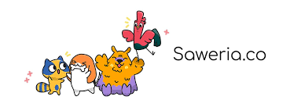

[![Twitter][twitter-shield]][twitter-url]

<hr/>

<!-- PROJECT LOGO -->
<br />
<div align="center">
  <a href="https://github.com/perogeremmer/blog">
    
  </a>

  <h3 align="center">Belajar Backend bareng <a href="https://twitter.com/perogeremmer">@perogeremmer</a></h3>

  <p align="center">
  
  </p>

  <p align="center">
    Temukan sumber pembelajaran backend disini, gak lengkap, tapi saya coba lengkapin. Jadwal nulis, seminggu sekali.
    <br />
    <br />
    <a href="https://github.com/perogeremmer/blog/tree/master/personal/campus">Insight Seputar Kampus 🎓</a>
    ·
    <a href="https://github.com/perogeremmer/blog/tree/master/personal/career">Karir di Backend ⌨️</a>
    ·
    <a href="https://github.com/perogeremmer/blog/tree/master/tutorial/series">Tutorial Series 📚</a>
  </p>
</div>

<!-- ABOUT THE PROJECT -->
## Tentang Blog

Jujur aja saya bingung, saya udah punya medium, saya punya website pribadi, tapi saya ngerasa gak nyaman untuk menulis, saya galau, ini curhatan, dan ini serius.

Setelah saya berpikir dan bertapa 7 hari 7 malam tanpa henti, menatap bintang-bintang, akhirnya saya ngerasa ini adalah tempat terakhir saya berlabuh untuk menulis.

Mungkin kesannya aneh nulis di Github, tapi saya rasa ini hal yang paling sederhana buat saya, selain saya gak butuh ngehosting dan ngedevelop website sendiri, saya juga gak perlu ngabisin duit untuk ngurusin resource blognya.

-- I think this is the main reason ```saya juga gak perlu ngabisin duit untuk ngurusin resource blognya```.

Ohiya seputar tentang saya:

* Saya ngoding sejak 2015 di perkuliahan, saya udah ngedalemin backend dan kerja sebagai backend developer.
* Saya gak jago, tapi saya seneng belajar, makanya saya bikin ginian.
* Saya pasti pernah salah, makanya kalo misalnya ada yang pengen didiskusikan, langsung [kesini aja](https://github.com/perogeremmer/blog/discussions).

Ohiya saya juga buka mentoring secara gratis 15 menit aja kok, bisa langsung [kesini aja](https://adplist.org/mentors/muhamad-hudya-ramadhana).

Terakhir, kalo kalian mau request tutorial sih boleh aja, tapi nyawer dulu ya, soalnya kan ngulik juga butuh tenaga ges, klik aja gambar di bawah ini.

<div style="display: flex;">
  <div style="padding: 10px">
    <a href="https://saweria.co/perogeremmer"> </a>
  </div>
  <div style="padding: 10px">
    
  </div>
</div>

<div align="center">

</div>

<!-- MARKDOWN LINKS & IMAGES -->
[twitter-shield]: https://img.shields.io/twitter/follow/perogeremmer?style=social
[twitter-url]: https://twitter.com/perogeremmer
