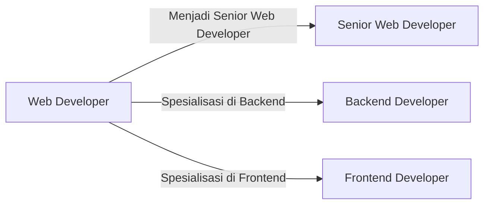

# Study Plan - The Web Developer Introduction

## Overview

Halaman ini ditujukan untuk membuat study plan, judul kali ini disebut ***The Web Developer Introduction***. Study plan ini ditujukan untuk beberapa kalangan:

- Orang yang sudah mempelajari basic fundamental coding.
- Orang yang sudah mempelajari dasar database relasi (RDBMS).
- Orang yang ingin berkarir sebagai web developer.

## You need to know

Web Developer adalah role paling umum di bidang teknologi, umumnya web developer akan berurusan dengan web dan mengerjakan pekerjaan yang cukup banyak, hal ini karena menjadi web developer membutuhkan kemampuan yang generalis.

Setelah menjadi web developer, kamu dapat menuju beberapa cabang sebagai berikut:

 

Menjadi seorang web developer artinya dapat membuat web yang berinteraksi dengan user, umumnya, teknologi yang dipakai oleh web developer adalah teknologi yang bergerak dengan server-side, seperti:

- PHP (recommended)
- Python
- NodeJS

Bahasa yang paling sering digunakan adalah PHP, hal ini disebabkan komunitas PHP yang banyak sekali di Internet dan banyak teknologi yang sudah memanfaatkan PHP seperti Wordpress, dan framework terkenalnya yaitu Laravel.

## Plan

Rancangan studi ini dibangun menggunakan bahasa yang HTML, CSS, JS, dan PHP. Kalaupun kamu memilih NodeJS, sebenarnya akan sama saja rancangannya. hanya implementasi dari NodeJS yang agak berbeda.

 

| Tahap | Pembelajaran                        | Overview                                                                                                                                                                                                 | Target                                                                                                                                                                                                                                                                                |
| ----- | ----------------------------------- | -------------------------------------------------------------------------------------------------------------------------------------------------------------------------------------------------------- | ------------------------------------------------------------------------------------------------------------------------------------------------------------------------------------------------------------------------------------------------------------------------------------- |
| 1     | Dasar HTML                          | Memahami dasar HTML, bagaimana cara membuat file html, apa itu index.html, bagaimana cara membuat head, dan body, serta menulis elemen paragraf di Body.                                                 | Kamu dapat membuat sebuah web bernama index.html dan tulisan hello world!                                                                                                                                                                                                             |
| 2     | Tag, Elemen dan Atribut             | Pahami bahwa HTML memiliki elemen dan atribut, seperti tag img yang memiliki atribut src. Lalu ada tag list.                                                                                             | Kamu bisa membuat biodata sederhana dengan beberapa kombinasi tag seperti paragraf, heading, img, anchor, dan list                                                                                                                                                                    |
| 3     | Dasar CSS                           | Memahami dasar pembuatan CSS, seperti jenis inline, internal, dan external, lalu atribut-atribut dasar seperti color, margin, padding, height, width                                                     | Buat web biodata kamu yang sebelumnya tidak berwarna agar lebih variatif dengan CSS                                                                                                                                                                                                   |
| 4     | Dasar Javascript                    | Memahami dasar Javascript, tipe data, dan bagaimana cara membuat Javascript internal dan external. Setelahnya coba juga buat fungsi dan coba manipulasi DOM (ubah atribut class / elemen) pada HTML.     | Buatlah program layaknya lampu, dimana ada tiga buah teks dan tiga buah button (tombol). Apabila tombol 1 ditekan, teks 1 harus berganti warna, apabila ditekan kembali teks tersebut harus kembali ke warna semula. Lakukan ini untuk ketiga teks dan beri aksi untuk ketiga tombol. |
| 5     | Responsif Web                       | Memahami dasar pembuatan web responsif dengan media query, setelahnya belajar juga bagaimana cara membuat konsep 12-grid pada CSS .                                                                      | Cobalah untuk membuat web dengan konsep dasar navbar pada bagian atas, sidebar pada bagian kanan atau kiri, dan konten body, serta footer                                                                                                                                             |
| 6     | Combining Basic Things              | Belajar mengkombinasikan HTML, CSS, dan Javascript                                                                                                                                                       | Cobalah untuk membuat web todo-list dengan menggunakan HTML, CSS, dan Javascript. Setiap todo yang dibuat akan disimpan pada array di Javascript.                                                                                                                                     |
| 7     | Choosing CSS Framework              | CSS memiliki framework, untuk saat ini yang paling terkenal akan kemudahannya adalah Bootstrap, coba pelajari bootstrap dan rasakan bagaimana bootstap membantu kamu membuat web lebih mudah             | Cobalah lakukan hal yang sama pada projek sebelumnya (membuat todo-list), namun kali ini menggunakan bantuan framework bootstrap.                                                                                                                                                     |
| 8     | Introduction to PHP Native          | Cobalah belajar untuk membuat web dengan PHP, caranya sederhana, coba install PHP Terlebih dahulu (Pada windows kamu dapat menggunakan XAMPP), lalu coba buat index.php dan boom, coba cetak Hello World | Buat web sederhana dengan kode PHP, sederhana, cukup satu folder `belajarphp` dan buat `index.php` dengan mencetak hello world lalu akses `localhost/belajarphp`                                                                                                                      |
| 9     | Connecting PHP Native to Database   | Cobalah untuk menghubungkan PHP Native ke Database, tujuannya agar kamu bisa membuat aplikasi CRUD                                                                                                       | Buat aplikasi CRUD dengan database MySQL.                                                                                                                                                                                                                                             |
| 10    | Understanding Common Things Web App | Setelah berhasil dengan CRUD, kamu akan maju ke aplikasi yang lebih advance, cobalah buat fitur login, dan kembangkan app kamu menjadi beberapa tabel.                                                   | Buat aplikasi CRUD dengan database MySQL dengan fitur Login.                                                                                                                                                                                                                          |

 

## Notes

- Pembelajaran HTML, CSS, dan Javascript dapat diakses pada website community knowledge seperti <https://w3schools.com>, namun saya juga menulis hal-hal dasar yang bisa kamu coba [disini](../tutorial/series/web-with-html/basic-html/).
- Pembelajaran PHP Native dapat diakses pada <https://w3schools.com> juga, namun saya juga menulis hal-hal dasar yang bisa kamu coba [disini](../tutorial/series/web-with-php-native/).
