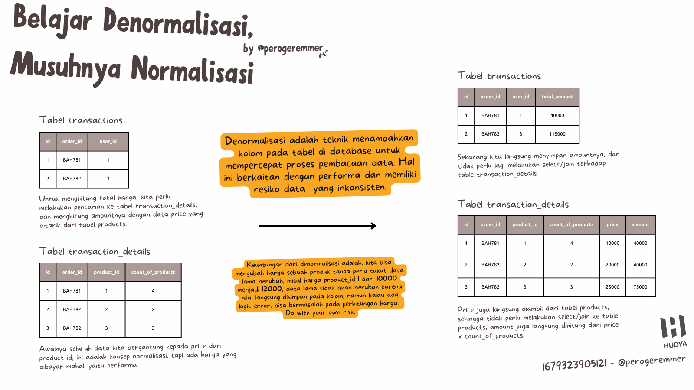
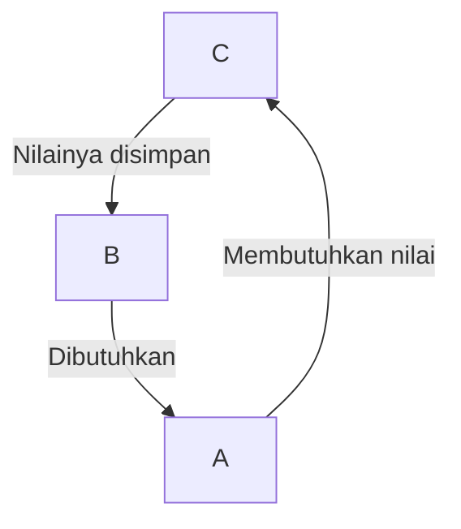

 

by [@perogeremmer](https://twitter.com/perogeremmer)

**Table of contents**

- [Belajar Denormalisasi, Musuhnya Normalisasi](#belajar-denormalisasi-musuhnya-normalisasi)
- [Kapan denormalisasi harus dilakukan?](#kapan-denormalisasi-harus-dilakukan)
- [Apa contoh denormalisasi lainnya bang?](#apa-contoh-denormalisasi-lainnya-bang)
- [Karakteristik nilai yang cocok](#karakteristik-nilai-yang-cocok)
- [Apa lagi keuntungan denormalisasi?](#apa-lagi-keuntungan-denormalisasi)
- [Resikonya apa bang?](#resikonya-apa-bang)

## Belajar Denormalisasi, Musuhnya Normalisasi

Kalo di postingan yang tentang [memahami normalisasi](memahami-normalisasi-database-relasi.md), sekarang kita malah belajar denormalisasi.

Denormalisasi tuh apa?

Denormalisasi adalah teknik untuk menambahkan kolom pada tabel di databse kita untuk mempercepat proses pembacaan data, biasanya hal ini sih digunain supaya ngejar performa.

> Maksudnya performa bang?

Simplenya, kalo kita perlu nge-join atau nge-relasiin table yang mana ngegabungin dua tabel, kita bakalan terkena efek performa, maksudnya adalah kita bakalan bikin performa jadi lambat karena ada dua tabel yang datanya banyak, terus digabung untuk dicari sebuah nilai.

Jadi, dengan denormalisasi, kita gak lagi bergantung pada konsep primary key di normalisasi, melainkan nilai yang kita butuhin itu dikeluarin dari tabel sana dan **disimpan bulat-bulat**.

> Jadi ada kemungkinan datanya gak konsisten ya datanya bang?

Betul, ini adalah resiko yang harus dibayar mahal untuk ngejar performa. Di satu sisi, membuat normalisasi emang bikin data kita konsisten, tapi di sisi gelapnya, itu bikin pencarian data jadi lambat, apalagi kalo datanya udah jutaan.

## Kapan denormalisasi harus dilakukan?

Sebenernya ada dua opsi, ketika udah kena efek performa, atau bahkan dari awal.

Artinya, programmer / backend / architect yang bikin udah harus tahu kolom apa yang bakalan jadi kunci pencarian atau yang mengefek ke performa.

Tentu, hal ini akan berhubungan dengan **pengalaman** ges. Tanpa pengalaman, your theory is still shit. Teori normalisasi yang kalian pelajarin itu, gak buruk, tapi kalo ditelen mentah-mentah tanpa tau kapan harus pake dan kapan gak pake, *you gonna be a bad backend devs*.

Misalnya, kita tau kalo kolom `price` dan `amount` bakalan jadi kuncian untuk menghitung harga dan total pendapatan, ya instead of harus ngejoin, kita keluarin aja untuk mempercepat proses.

Tentu, hal ini dilakukan dengan resiko. Dengan catatan, dari sisi kode aplikasi backend (API) gak boleh ada yang salah, alias jangan sampe menulis nilai yang tidak benar.

As example, kalo misalnya kode dari backend malah ada typo yang bikin `price` jadi `amount` aja alias kebalik, ya kelar. Maka dari itu perlu maintenance yang baik juga dari sisi aplikasi.

> Konyol banget bang masa iya bisa kebalik?

Manusia gak luput dari kesalahan, kesalahan-kesalahan kaya gini tentu aja ada, dan ini yang harus di-make sure.

## Apa contoh denormalisasi lainnya bang?

Sebenernya banyak contoh denormalisasi lain, tapi yang paling gampang dan keliatan ya, tadi `price` sama `amount`. Bisa juga misalnya kamu punya tiga tabel, dimana tabel ketiga ini nilainya bakalan dibutuhin sama tabel pertama.

Contohnya misalnya gini:

A butuh nilai dari kolom C, tapi nilai dari kolom C harus lewat B dulu.

Bayangkan kalau, jumlah datanya:

- A: 12 juta
- B: 10 juta
- C: 20 juta

Ini pasti bakalan bermasalah banget kalo A join ke B lalu B join ke C supaya A bisa dapet nilai C.

> Solusinya gimana bang?

Bikin kolom baru untuk nyimpan nilai yang dibutuhkan dari kolom C, atau, gunakan kolom dengan tipe `JSON` kalau sekiranya gak mau boros kolom.

## Karakteristik nilai yang cocok

Tentu gak semuanya perlu denormalisasi, hal ini untuk menghindari performa.

In my opinion, or even based on my experience, karakter kolom yang perlu di-denormalisasi adalah:

- Kolom yang sering terlibat di business logic aplikasi
- Kolom yang ngasih dampak langsung ke data lama

Contoh, amount, price, atau misalnya atribut lain yang gak terlibat langsung, kalo misalnya kamu bikin aplikasi sosmed, kamu bisa bikin kolom `count_likes` sama `count_comments`. Alih-alih ngitung dari tabel `likes` atau `comments`.

Tentu kolom `count_likes` sama `count_comments` bakalan bikin performa aplikasi kamu lebih ngebut, karena apa? Yap, kaga perlu ngitung lagi di tabel sebelah. Setiap ada yang ngelike pada sebuah posts, update kolom `count_likes` di tabel posts.

Jauh lebih worth daripada dihitung di tabel `likes` 😄

## Apa lagi keuntungan denormalisasi?

Selain performa, kita juga bisa dapet keuntungan dari mencegah adanya data baru. Kalo misalnya normalisasi dan mau merubah harga, tentu kamu gak bisa rubah harga produk di tabel products.

> Kenapa emangnya bang?

Lo bayangin aja, misal ada customer yang udah beli produk dengan id 2. Let's say total dia belanja 40 ribu karena dia beli 2 produk.

Besoknya ada yang ganti nilai harganya di price dari 20 ribu ke 40 ribu. Bingung lah customer lama, perasaan kemarin kan totalnya 40 ribu ya? Kok jadi 80 ribu sekarang?

Ini karena pas ngitung, ada perubahan harga di tabel produk, makanya bikin perhitungannya jadi salah.

Sekarang coba bayangin kalo misalnya kita tempelin kolom price dan amount di table `transaction` dan `transaction_details`. Kalopun besoknya dirubah lagi harganya, gak akan berdampak karena nilai dari data lama udah disimpen bulet-bulet!

Kalo misalnya pake normalisasi, alih-alih ngerubah harga, kita harus bikin data baru yang nyimpen harga nilai baru, biar apa? Biar gak ketiban nilai dari data-data lama yang bergantung ke kolom itu.

Terus data lama harus ditandai dihapus (soft delete) atau diubah statusnya jadi inactive, bukannya dihapus beneran 😅. Gak tau soft delete ya? Nanti kita bahas ya disini, stay tune!

## Resikonya apa bang?

Jelas, inkonsistensi data, tadi kan gue juga udah bilang di atas. Contoh, gue pernah kejadian kolom amount diisi nilai 0, tapi pricenya ada. Kenapa? Ya jelas, ada bug logic dari sisi business logic di aplikasi (API). Akibatnya apa? Reportingnya bermasalah, tim bingung dan gondok karena bikin reporting mereka berantakan.

Tentu, nge-denormalisasi ini butuh pengalaman atau bahkan guidance atau bahkan senior yang punya pengalaman supaya kalian gak tersesat.

Tapi tentu juga kalian harus paham, bahwa kadang kita hanya perlu melaju dan nyobain aja dengan **meminimalisir resiko**. Jadi bukannya gak boleh nyoba, ya boleh aja kalo pengen nyobain, tapi bener-bener pertimbangkan matang-matang hal yang akan terjadi kalo kalian lakuin.

Semoga bermanfaat! 😃