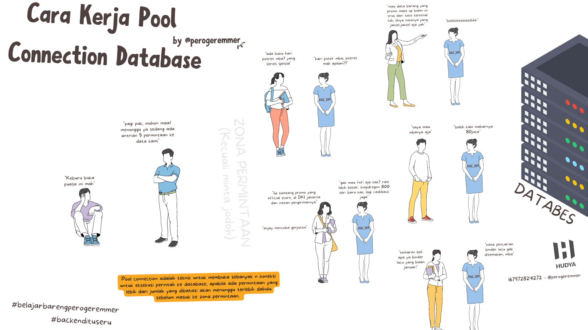
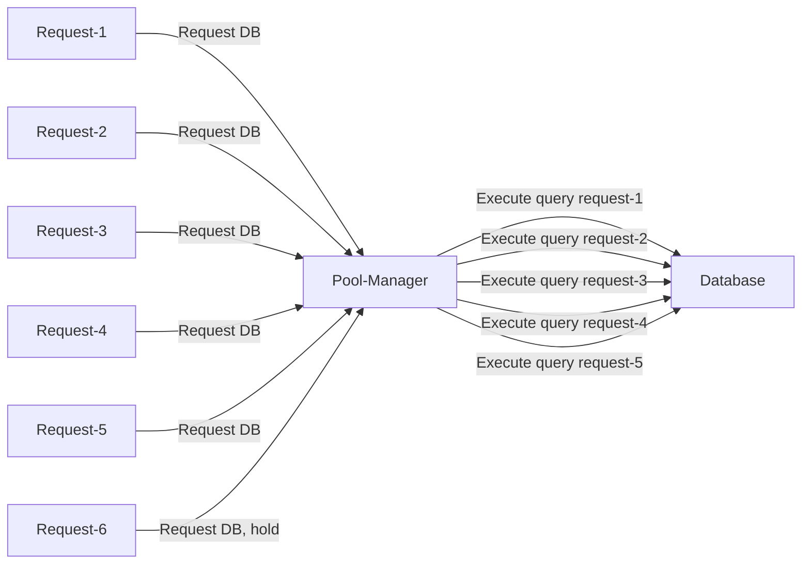
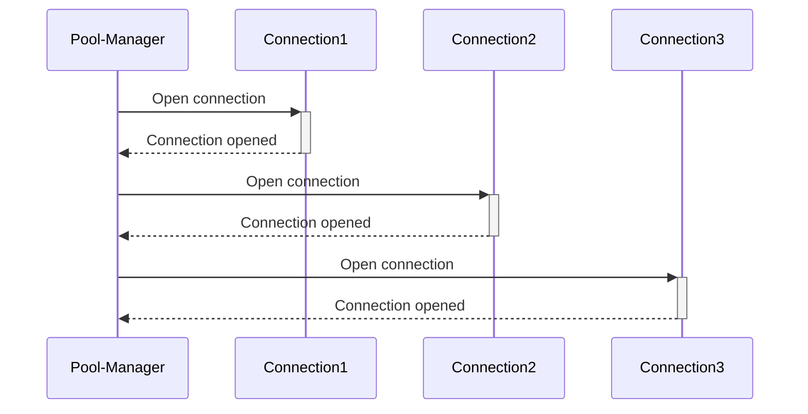

 

by [@perogeremmer](https://twitter.com/perogeremmer)

**Table of contents**

- [Cara Kerja Pool Connection Database](#cara-kerja-pool-connection-database)
- [Pool connection tuh apaan?](#pool-connection-tuh-apaan)
- [Cara kerja pool connection?](#cara-kerja-pool-connection)
- [Berapa nilai n yang baik untuk pool connection?](#berapa-nilai-n-yang-baik-untuk-pool-connection)
- [Apakah semua backend pasti pake pool connection?](#apakah-semua-backend-pasti-pake-pool-connection)

## Cara Kerja Pool Connection Database

Ketika belajar laravel atau ketika mulai lebih banyak kenal sama backend, pasti bakalan denger istilah **pool connection**. Sebenernya ini gak cocok buat newbie, tapi gapapa, biarpun ini buat yang tingkat lanjut, yang penting kita tetep semangat belajar.

## Pool connection tuh apaan?

Gampangnya, pool connection adalah teknik dimana kita membuka koneksi ke database sebanyak n (n adalah nilai yang kita atur) dimana koneksi tersebut akan dimanage oleh pool manager yang mengatur jalan maksudnya request data.

> Kenapa koneksi aja harus diatur bang?

Jadi gini, sebenernya ketika aplikasi backend yang kita buat ingin meminta data ke database, kita perlu membuka koneksi terlebih dahulu.

Ibarat pintu, kalau koneksi dibuka tutup tentu bakalan bikin sibuk kinerja server.

Nah daripada kita buka tutup, ya kita buka aja tapi kita jagain biar kenapa? Biar gak ada tamu yang nggak diizinkan masuk.

> Apa jadinya kalau dibuka doang tanpa ditutup?

Wah, yang jelas sih bikin resource server kamu **meledag**.

Ibarat lampu di rumah kalo dinyalain semuanya tanpa dimatiin tentu bikin listrik bengkak, dan ini juga sama kaya server, server kamu bisa bengkak banget resourcenya kaya CPU-nya jadi tinggi, RAM-nya juga kemakan.

Ini adalah gambaran dari pool connection:

## Cara kerja pool connection?

Kurang lebih kaya begini, jadi pool manager akan membuka koneksi sebanyak n, disini gue kasih contoh n-nya adalah 3.

Pool-Manager bakalan ngebuka sebanyak n dan disimpen di memory, atau bahkan gampangnya, array.

Ketika nanti dibutuhkan tinggal cek dari si array yang nyimpen object connection tersebut, dan dipinjemin ke request, selama request masih jalan ya koneksi akan terus dipake sama client, ketika dah beres koneksi tersebut dikembaliin lagi terus disimpen di array lagi.

## Berapa nilai n yang baik untuk pool connection?

Umumnya, pool connection itu defaultnya di-set antara 5-15 pada framework. Karena 10 pool connection harusnya sudah cukup untuk menangani request yang masuk dari Request.

Request ini maksudnya adalah API kita sendiri, jadi API kita meminta kepada pool, pool memeriksa berapa banyak koneksi yang kepake, dan kalau lebih dari jumlah n ya ditahan.

> Bisa gak kita bikin lebih dari 50?

Bisa aja, tapi malah ga kepake segitu dan malah bikin bengkak resource server kalian lagi, makanya kalo ngerasa ada masalah di query yang lambat, bisa coba cek querynya juga.

Gak melulu semua salah pool connection, dan untuk menemukan masalah lemot itu emang harus di-track dari berbagai kemungkinan.

## Apakah semua backend pasti pake pool connection?

Udah pasti! Soalnya pool connection bakalan bikin request jadi lebih cepat karena gak nunggu buka tutup yang bikin resource jadi kerja berat. Sehingga, lebih baik buka di awal sebanyak n connection, simpan pada memory, terus pake ketika dibutuhkan.

Pool connection ngurangin latency yang ada di aplikasi kalian dan juga memperbaiki performa aplikasi kalian ketika berkomunikasi sama database, karena gak perlu buka tutup koneksi.
