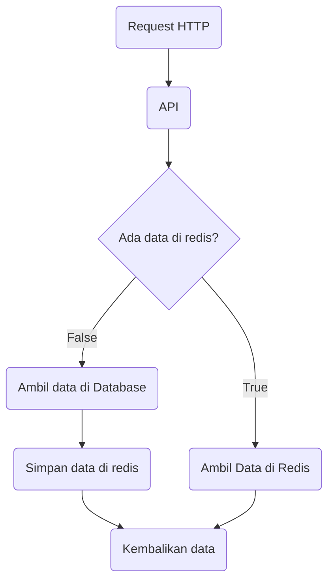

# Cara pake Redis (yang mungkin aja ini udah benar)

Aneh banget ya kalo dari judul blognya, kaya berasa si paling pintar banget gue nulis ini.

Ah tapi enggak juga, gue cuma pengen berbagi insight, soalnya ketika kalian masuk backend, dan lagi develop satu kasus dimana kasusnya ini data yang dibaca harus cepet. Nah loh, apa nih caranya?

Ya tentu aja klean gak bakalan asing sama istilah `cache`. Cache ini artinya kalian bakalan nyimpen data sementara yang dipindahin dari lokasi yang dalem ke lokasi luar.

> Maksudnya gimana bang?

Anggaplah kalian harus nyari buku pemrograman dengan judul "membangun web menggunakan laravel" di antara seluruh buku teknologi yang ada di toko buku.

Nah kan kalo nyari butuh waktu ya, kalo gitu karena ini buku lagi best seller dipindahin deh posisinya di meja bagian depan yang keliatan ketika mau ke kategori teknologi.

> Lah kalo kaya gini berarti cache itu mirip sama pinned gitu ya?

Kurang lebih sih begitu, soalnya tujuannya cache kan mempercepat proses pencarian, jadi daripada nyari-nyari di antara tumpukan buku teknologi, yaudah kita atur posisinya di tempat paling keliatan.

> Kalo cachenya ada banyak, jadi gak efektif juga dong, bang?

Secara teori sih gitu, makanya kan gak semua hal di-cache, umumnya data yang dijadiin cache itu data-data penting yang sering banget ditampilin atau bahkan dibutuhkan.

> Contohnya gimana bang?

Misalnya ada satu fitur untuk menghitung jumlah transaksi per-hari, daripada fitur tersebut terus-terusan nge-query data ke database untuk harian, mending kita query sekali ke database terus simpen ke cache. Sehingga kita bisa dapet hal yang sama tanpa perlu nge-query berulang-ulang.

## Cara pake redis

Nah banyak yang baru kenal itu kaya bingung, redis apaan dah? Cara pakenya gimana dah? Let me show you how to redis yang mudah-mudahan, proper hehehe~ 🤣

## 1. Redis itu front-liner

Redis bisa sangat bermanfaat, tapi sebenernya kebutuhannya apa sih? tbh sih ya banyak sebenernya, salah satunya ya mempercepat proses ketika ngambil data ke Database.

Maksudnya gimana bang? Liat flowchart di bawah ini:



Enak kan? Jadi kita bisa rely on redis alias bergantung dah ama redis.
Lebih kerennya lagi kita bisa set data kita di redis akan expired atau hilang secara otomatis terserah kita mau berapa detik, atau berapa hari.

Jadi kuncinya adalah kita nanya dulu sama redis, kalo gak ada, kita cariin datanya di DB, kita buatin deh datanya terus simpen kebutuhannya.

### 2. Penggunaan Redis Single Key (Strings)

Jadi, redis itu bisa nyimpen satu nilai dengan satu nama sendiri. Beda sama SQL yang butuh table nah kalo redis itu pakenya prefix, atau kita bisa bilang `key`.

Misalnya kalo di SQL ada table users, bentuknya gini kan:
id  | email | name              |
-- | --   | --   |
1  | hudya@mail.com    | Hudya
2  | perogeremmer@mail.com   | perogeremmer

Ketika kita pengen nyari yang idnya 1 gimana? Yep, begini:

```sql
SELECT * FROM users WHERE id = 1
```

Nah kalo di redis gak gitu cuy. Kurang lebih gambarannya gini:
key  | value |
-- | --   |
1  | hudya@mail.com    |
2  | perogeremmer@mail.com   |

Bentar-bentar, terus cara ngambil datanya gimana?

```bash
GET nama_key

GET 1
> hudya@mail.com
```

Agak aneh gak sih kalo nulisnya 1? Makanya kita nyebutnya prefix. Prefix itu kaya gabungan antara key dengan identifier atau pengenal.

Misalnya, prefixnya adalah user kemudian diikuti simbol pemisah untuk membedakan nilai satu dengan yang lain:

```
GET user:1
> hudya@mail.com
```

Nah kalo kaya gini lebih enak gak sih bosku? Jelas dong! 👍

Eh tapi apa iya cuma nyimpen nama doang? Gak keren banget gak sih? Ya nggak dong, kita bisa nyimpen object atau kalo di Python tuh dictionary.

```bash
GET user:1
> "{\"id\": \"1\", \"name\": \"hudya\", \"email\": \"hudya@mail.com\"}"
```

Jadi kita bisa nyimpen dictionary atau object pada sebuah data di redis.

Biasanya kasus apaan sih bang untuk nyimpen data ginian? Paling gampang sih, report.

### Hah? Gimana tuh bang?

Misalnya, anggaplah di aplikasi kita, kita bisa ngedata berapa jumlah transaksi di lokasi x selama periode bulan maret 2022.

Nah kalo kita ngitung manual pake query SQL kan lama ya, bisa sekitar 5-10 detik apalagi dengan query yang kompleks, nah daripada user suruh nungguin selama itu setiap mereka request, kalian bikin lama sekali aja, terus simpen datanya dalam bentuk object / dictionary di redis, abis itu set expire, misalnya 1 jam.

Selama 1 jam si user tersebut atau bahkan user lain nge-akses data yang sama, bisa cepet deh daripada nunggu lama 😄

Tapi tentu cara ini ada kelemahan, misalnya ada data berubah pada periode bulan maret 2022, jadinya ya gak keupdate dong kecuali datanya udah expired.

Alhasil user yang pertama kali nge-request harus agak lama dulu, misalnya 8 detik, abis itu jadi cepet banget deh karena kan udah disimpen di redis.

Contoh:

```bash
GET report:lokasi_x:2023-01-02
> "[{\"hours\": \"12\", \"total_in\": 23, \"total_out\": 230}, {\"hours\": \"13\", \"total_in\": 110, \"total_out\": 10},]"
```

Nah tinggal kembaliin ke frontend, udah dah enak banget frontend tinggal ngolah di dalam chart 😎

## 3. Penggunaan Redis dengan List (multiple data)

Nah ini nih, pasti kalian yang belajar programming gak asing sama `list` atau kita biasa sebut `array`. Nah di redis juga bisa kita pake ginian kasusnya apa? Paling gampang sih, notifikasi.

Misalnya ada tampilan notifikasi kaya gini:

> src: [Dribble - Kevin Dukkon](https://dribbble.com/shots/17502424-Notifications-Recommendations)

<br/>

Nah kita bisa bikin si notifikasi pake yang namanya `list` di redis. Konsep list ini mirip cara kerja array pada programming.

Misal:

```bash
[1, 2, 4]
```

Nah kita bisa nambah dari depan atau yang disebut `LPUSH` alias `LEFT PUSH` atau dari belakang alias `RPUSH` atau `RIGHT PUSH`.

Jadi kaya nge-insert data dari index 0, atau insert data dari index terakhir, semua sih tergantung kita butuhnya gimana.

Dan tentu aja, gak perlu angka doang bro, kita bisa nyimpen langsung objeknya, misalnya:

```bash
LRANGE user:notification:1 0 -1
> 1) "{\"title\": \"Discount Available\", \"message\": \"We recommend a 10% discount for <strong>Unit #305</strong> in Vancouver House\", \"tag\": \"VAN/305\", \"created_at\": 1677086986343}"
> 2) "{\"title\": \"Discount Available\", \"message\": \"We recommend a 25% discount for <strong>Unit #803</strong> in Zephyr East\", \"tag\": \"ZEP/803\", \"created_at\": 1673087035536}"
```

Jadi ketika user ingin menampilkan notifikasi, kita kaga perlu tuh repot-repot nyimpen ke DB, cukup simpen aja di redis.

### Fun fact

Sadar gak sih kalian kalo buka aplikasi payment seperti OVO atau Gojek, bagian data notifikasinya gak bakalan nampilin data lama kalian, misalnya kaya tahun lalu. Paling gak nampilin notifikasi 30 hari belakang ini. Coba kalian buka pada halaman notifikasi, atau emang notifikasi saya yang kedikitan yah? Hehehe 😆

Kenapa gitu? Soalnya emang dibatasin, sayang banget nyimpen data notifikasi kalian yang udah bertahun-tahun itu dan gak ada manfaatnya (it's sad but fact 🤣). Jadi cara mengakalinya adalah ya disimpen di redis, terus di set setiap 30 hari jadi hilang. Atau, karena ini bentuknya list, dia bakalan ngecek, kalo jumlahnya udah lebih dari 100 notifikasi, maka yang lebih dari 100 akan dihapus, jadi cuma nyimpen 100 notifikasi terakhir aja.

## 4. Ngakalin data transaksi pake LIST

Anggaplah gini, kalian dapet tantangan bikin sebuah program yang sifatnya temporary. Alias gak berjalan di server, tapi berjalan di sebuah lokasi (client-side) misalnya server untuk ujian computer based-test yang sifatnya offline untuk mempercepat proses. Kalian ditantang program tersebut berjalan pake PC (Standard desktop) atau micro-computer, misalnya Raspberry PI.

Pertanyaanya, haruskah kita pake SQL atau NoSQL? Kalau server kalian misalnya PC dengan high-spec, jawabannya boleh-boleh aja. Kalo pake Raspberry PI? In my honest opinion, it's overkill!

Ngapain pake resource gede untuk proses hal yang sederhana? Better kita pake Redis aja :)

Kasus tambahan, misalnya program kalian itu berjalan pada sebuah lokasi selama 30 hari berturut-turut dan gak ada koneksi internet, anggaplah lokasinya terpelosok.

Program itu juga bisa membuat admin ngecek misalnya tanggal 23 nomor induk / identitas siapa aja yang ujian, terus jawaban mereka apa.

Dari kasus ini, kita bisa pake cara berikut:

1. Masukkan data transaksi per-hari di dalam redis pada list, misalnya list dengan nama `exam:{tanggal}` dan isinya adalah ID nomor induk atau identitas mereka.
2. Buat lagi data bentuknya bisa list lagi atau strings yang menyimpan activity dari nomor identitas tersebut. Misalnya:

```bash
LRANGE exam:2022-04-23 0 -1
> 1) 1921681109
> 2) 1921681111

GET result:1921681109
> "{\"answers\": \"[{\"no\": \"1\", \"answer\": \"B\", \"score\": 1, \"created_at\": 1673087035536}]\", \"finished_at\": 1673087035536}"

LRANGE results:1921681109 0 -1
> 1) "{\"no\": \"1\", \"answer\": \"B\", \"score\": 1, \"created_at\": 1673087035536}"
> 2) "{\"no\": \"1\", \"answer\": \"B\", \"score\": 1, \"created_at\": 1673087035536}"
```

Mau pake list atau strings? Terserah kalian :) Masing-masing ada kelebihan dan kekurangan termasuk pas ngolah datanya.

### Kenapa kita harus pake prefix tanggal begitu bang?

Soalnya redis kan beda cuy kaya SQL, SQL mah enak ya:

```sql
SELECT * FROM exam_results ORDER BY created_at DESC:
```

Kemudian masalah beres, tapi kan kita pake redis yah, jadi cara handlenya agak tricky 😆

Ya emang solusi ini gak cocok buat lo yang mageran, dan gamau ribet, tapi kalo concern-nya adalah **performa**. Cara ini bisa aja dilakukan, apalagi handling traffic di client (bukan server) yang gerakannya cepet dan minim resource, tentu cara ini dan redis adalah solusinya.

## 5. Gunakan konsep prefix yang tepat

Kita perlu membuat prefix yang tepat, tujuannya biar kita gampang identifikasi data yang kita butuhkan, menurut gue ada dua cara:

### Mid-identifier
Prefix dibuat dengan minimal tiga kombinasi dimana id diletakkan ditengah atau setelah object/service yang utama. Contoh:
```bash
{service/object}:{id}:{sub service/action}
```

Misalnya:
```bash
user:1:profile
user:1:last-transaction
user:1:last-online
user:1:online-status
```

### Last-identifier

Prefix dibuat dengan minimal tiga kombinasi dimana id selalu diletakkan di akhir dari seluruh kombinasi prefix. Contoh:
```bash
{service/object}:{sub service/action}:{id}
```

Misalnya:
```bash
user:profile:1
user:last-transaction:1
user:last-online:1
user:online-status:1
```

<br/>

Mana yang bagus? Ya sama aja sih, tinggal pake salah satu yang kalian mau aja.

> Emang harus pake tanda titik dua bang buat pemisahnya?

Gak juga bos, elo bisa pake titik dua, titik, underscore (_), kutip, atau apapun itu, tapi paling enak sih misahin pake titik dua aja hehehe. Gak deng bukan masalah enak atau gak, tapi bisa dibilang yang paling *common*.


## Catatan Terakhir, biasain set expire data

Kalo kalian dapet challenge kaya yang gue bahas di atas dimana data harus disimpan di lokal dan programnya jalan dengan koneksi internet yang minim di sebuah lokasi terpencil atau bahkan gak ada sama sekali, selalu consider simpen data di Redis dengan meng-set expire data tersebut, tujuannya apa? Ya jelas, biar kaga lupa.

Kalo gue sih menyarankan 30 hari aja disimpen, kan lumayan lama tuh, ya dalam sebulan anggap lah setiap hari ketujuh misalnya di weekend akan ada sinkronisasi data ke server. Kan enak tuh jadi datanya gak perlu ngebebanin di lokal kalian 🤣
