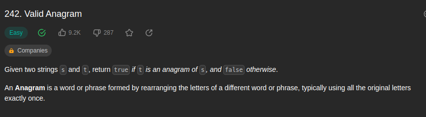
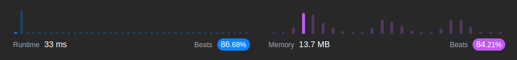

<br/>

by [@perogeremmer](https://twitter.com/perogeremmer)

**Table of contents**

- [Introduction](#introduction)
  - [Example 1](#example-1)
  - [Example 2](#example-2)
- [Constraints](#constraints)
- [Problem Solving](#problem-solving)
- [Test Case](#test-case)
- [Result](#result)

## Introduction

Given two strings s and t, return true if t is an anagram of s, and false otherwise.

An Anagram is a word or phrase formed by rearranging the letters of a different word or phrase, typically using all the original letters exactly once.

--

Jadi ada kasus dimana kita nemuin kata yang susunannya sama tapi kalo diacak akan jadi kata yang beda, misalnya `agaran` sama `nagara`. susunannya sama, masing-masing punya tiga a, satu r, satu g, dan satu n, tapi menjadi dua kata yang beda.

Tugas kita adalah mengembalikan `true` kalau kata pertama adalah anagram dari kata kedua, dan sebaliknya.

Soal LeetCode [disini](https://leetcode.com/problems/valid-anagram/).

### Example 1

```
Input: s = "anagram", t = "nagaram"
Output: true
```

### Example 2

```
Input: s = "rat", t = "car"
Output: false
```

## Constraints

```
- 1 <= s.length, t.length <= 5 * 104
- s and t consist of lowercase English letters. 
```

Artinya panjang teksnya pertama adalah minimal 1 karakter, dan panjang teks kedua adalah `5 x 104`. Selain itu kata kedua dan kata kedua ditulis dalam huruf kecil dalam bahasa inggris.

## Problem Solving

Gimana cara kita ngerjain ini? Sederhananya, kita harus paham, bahwa kita itu diminta mengembalikan true apabila ada elemen yang sama, ini mirip sama [Contains Duplicate](./217-contains-duplicate.md). Bedanya, ini tuh kata.

Artinya apa? Kita bisa saja memberhentikan prosesnya kalau emang ada elemen yang sama. Kenapa? Karena gak ada ketentuan bahwa kita gak boleh berhentiin proses selama perhitungan, fokusnya adalah, kalo ada yang sama, maka kembalikan nilai true. Mirip kan?

Btw ini saya pake Python ya, maka kita bisa keluarin output kaya begini:

```python
class Solution(object):
    def isAnagram(self, s, t):
        """
        :type s: str
        :type t: str
        :rtype: bool
        """
        # siapin dictionary/object dari kata pertama
        first_word = {}

        # siapin dictionary/object dari kata kedua
        second_word = {}

        # Kalau panjangnya gak sama, kembaliin false
        if len(s) != len(t):
            return False

        # looping kata pertama
        for word in s:
            
            # Kalau huruf sudah ada di object kata pertama, maka tambahin angka 1 (increment) lalu continue biar gak turun ke bawah
            if word in first_word:
                first_word[word] += 1
                continue

            # Kalau huruf belum ada di object kata pertama, maka set angka 1
            first_word[word] = 1

        # looping kata kedua
        for word in t:
            
            # Kalau huruf sudah ada di object kata kedua, maka tambahin angka 1 (increment) lalu continue biar gak turun ke bawah
            if word in second_word:
                second_word[word] += 1
                continue

            # Kalau huruf belum ada di object kata kedua, maka set angka 1
            second_word[word] = 1

        # Lakukan looping di object kata kedua
        for item in second_word:

            # Kalau huruf yang sedang di loop gak ada di object kata pertama, maka kita asumsikan false atau tidak memenuhi syarat.
            if item not in first_word:
                return False
            
            # Kalau jumlah huruf yang sedang di loop tidak sama jumlahnya antara objek kata pertama dan kedua, maka kita asumsikan false atau tidak memenuhi syarat.
            elif first_word[item] != second_word[item]:
                return False
            
        # Kalau setelah looping tidak ada yang masuk kondisi, maka kita asumsikan false
        return True
```

Bingung ya? hahaha, bentar saya jabarin ya.

```
teks 1: raga
teks 2: agar
```

Kita looping teks pertama dan simpan pada objek teks pertama dengan hasil berikut:
```
r = 1
a = 2
g = 1
```

Kita looping teks kedua dan simpan pada objek teks kedua dengan hasil berikut:
```
a = 2
g = 1
r = 1
```

Ini saya nulisnya gak ngasal, soalnya kan kita looping, jadi urutannya pasti begini.

Nah kalau kita looping objek teks kedua gimana hasilnya?

a = 2

a ini ada di objek teks pertama, jumlahnya pun dua.

g = 1

g ini ada di objek teks pertama, jumlahnya pun satu.

r = 1

r ini ada di objek teks pertama, jumlahnya pun satu.

Sehingga `agar` ini adalah anagram dari `raga`.

-- 

Contoh kedua:

```
teks 1: naga
teks 2: nata
```

Kita looping teks pertama dan simpan pada objek teks pertama dengan hasil berikut:
```
n = 1
a = 2
g = 1
```

Kita looping teks kedua dan simpan pada objek teks kedua dengan hasil berikut:
```
n = 1
a = 2
t = 1
```

Nah kalau kita looping objek teks kedua gimana hasilnya?

n = 1

n ini gak ada di objek teks pertama.

Meskipun a ada di objek teks pertama, tapi karena n udah gak ada, maka kita bisa hentikan loopingnya dan langsung kembalikan false, karena udah pasti gak teks kedua bukan anagram dari teks pertama.

Sehingga `naga` ini bukan anagram dari `nata`.

-- 

Tambahan

`naga` dan `natal`.

- naga = 4 huruf
- natal = 5 huruf

Kalo beda panjang udah pasti bukan anagram, titik! 🤣

## Test Case

Accepted - Runtime: 32 ms

```
Input
s = "anagram"
t = "nagaram"

Output
true

Expected
true
```

```
Input
nums = [1,2,3,4]

Output
false

Expected
false
```

```
Input
s = "rat"
t = "car"

Output
false

Expected
false
```

## Result

Hasilnya adalah sebagai berikut:



Wew, much better, kenapa karena kompleksitas kita O(n). Kita hanya looping sekali saja meskipun ada tiga looping, tentu ini jauh lebih cepat daripada O Log n

Ohiya Hasilnya ini gak stagnan ya alias bisa berubah-ubah, bisa aja beatsnya lagi naik, memory-nya juga, santai aja lah yang penting paham dulu~

---

Kalau kalian suka dengan konten ini jangan lupa dibagiin ke temen-temen dan minta doanya ya supaya saya sehat dan rejekinya lancar terus biar tetep bisa menulis 🙏🙋
