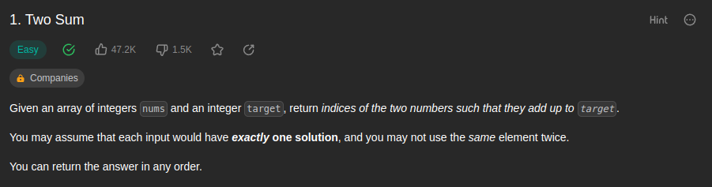
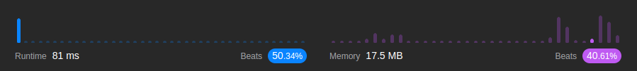

<br/>


by [@perogeremmer](https://twitter.com/perogeremmer)

**Table of contents**

- [Introduction](#introduction)
  - [Example 1](#example-1)
  - [Example 2](#example-2)
  - [Example 3](#example-3)
- [Constraints](#constraints)
- [Follow up](#follow-up)
- [Problem Solving](#problem-solving)
  - [Cara pertama](#cara-pertama)
  - [Cara kedua](#cara-kedua)
- [Result](#result)

## Introduction

Given an array of integers nums and an integer target, return indices of the two numbers such that they add up to target.

You may assume that each input would have exactly one solution, and you may not use the same element twice.

You can return the answer in any order.

--

Jadi ada kasus dimana akan diberikan array yang berisi integer dan sebuah target, target ini tuh kaya hasil penjumlahan dari array tersebut.

Kita bisa asumsiin bahwa setiap input hanya punya satu solusi, jadi kaya index-0 dan index-1 itu adalah sebuah solusi, tapi index-0 dijumlahkan dengan index-0 itu bukan solusi.

Kita bisa ngembaliin jawabannya kek gimana aja, misalnya index-0 dan index-1 atau sebaliknya.

Soal LeetCode [disini](https://leetcode.com/problems/two-sum/description/).

### Example 1

```
Input: nums = [2,7,11,15], target = 9
Output: [0,1]
Explanation: Karena index ke-0 + index ke-1 menghasilkan nilai 9, jadi dikembalikan [0, 1].
```

### Example 2

```
Input: nums = [3,2,4], target = 6
Output: [1,2]
Explanation: Karena index ke-1 + index ke-2 menghasilkan nilai 6, jadi dikembalikan [1, 2].
```

### Example 3

```
Input: nums = [3,3], target = 6
Output: [0,1]
```

## Constraints

```
- 2 <= nums.length <= 104
- 109 <= nums[i] <= 109
- 109 <= target <= 109
- Only one valid answer exists.
```

Artinya panjang arraynya maksimal sekitar 2-104, panjang indexnya maksimal sekitar 109, target penjumlahan yang dicari maksimal 109 dan hanya punya satu jawaban valid.

## Follow up

Can you come up with an algorithm that is less than O(n2) time complexity?

--

Bisa gka kita pake algoritma yang kompleksitasnya lebih rendah dari O(n2) atau O n pangkat 2.

## Problem Solving

Gimana cara kita ngerjain ini? Ini tuh cukup sederhana, tapi ngebingungin, kenapa? Karena kita kaya didorong dan dipaksa untuk looping di dalam looping, kenapa gitu?

Contoh:

```
input: nums = [2,4,6], target = 8
output: [0, 2]
```

Ada beberapa pendekatan untuk ini:

- Pertama, index loop saat ini ditambah nilai dari satu index didepannya.
- Kedua, index loop saat ini dicobain ditambah satu-satu dengan semua index dibelakang dia.

### Cara pertama

- 2 + 4 🔜 6
- 4 + 6 🔜 10

Cara ini memang kompleksitas rendah, yaitu O(n), tapi masalahnya targetnya adalah 8 dan cara pertama ini gak cocok.

### Cara kedua

- 2 + 4 🔜 6
- 2 + 6 🔜 8 ✅
- 4 + 6 🔜 10

Yeay, ketemu, tapi sebenernya cara ini gak baik, soalnya kita harus ngelooping pada saat angka 2 berjalan, jadi ada loop di dalam loop, artinya kompleksitas algoritma ini adalah O Log n.

Pertanyaannya, bisa gak kita buat O(n) aja? Jawabannya, bisa, dengan memanfaatkan hash-map alias dictionary 😅

Btw ini saya pake Python ya, maka kita bisa keluarin output kaya begini:

```python
class Solution:
    def twoSum(self, nums: List[int], target: int) -> List[int]:

        # Siapin hash-mapnya
        data = {}

        # Looping index dan nilainya dengan menggunakan fungsi enumerate di python
        for index, item in enumerate(nums):
            # Hasil pengurangan antara target dengan nilai loop saat ini kita simpan pada sebuah nilai yaitu diff
            diff = target - item

            # Kita cek hasil pengurangannya ada gak di hash-map
            if diff in data:
                # Kalau ada, kita kembaliin nilai dari pengurangan yang mana hasilnya adalah index, dan index saat ini
                return [data[diff], index]

            # Kalau gak ada, maka nilai dari looping saat ini, kita isi sebagai index
            data[item] = index

        return None
```

Bingung ya? hahaha, bentar saya jabarin ya.

```
input: nums = [2,4,6], target = 8
output: [0, 2]
```

Kita looping setiap nilainya:

iterasi pertama (nilai: 2)
```
diff = 8 - 2
diff = 6

Kita cek di dictionary, karena gak ada angka 2 maka kita set
data = {
    2: 0
}
```

Sisi kiri adalah nilai, sisi kanan adalah 0.
Nilai 2 berada pada index ke-0

iterasi kedua (nilai: 4)
```
diff = 8 - 4
diff = 4

Kita cek di dictionary, karena gak ada angka 4 maka kita set
data = {
    2: 0,
    4: 1
}
```

Sisi kiri adalah nilai, sisi kanan adalah 0.
Nilai 4 berada pada index ke-1.

4 ini bukan hasil pengurangan 8 dengan 4 ya, tapi emang iterasi kedua nilainya adalah 4.

iterasi ketiga (nilai: 6)
```
diff = 8 - 6
diff = 2

Kita cek di dictionary, ternyata ada
data = {
    2: 0,
    4: 1
}

Maka nilai yang kita kembalikan adalah data[diff], index 

# index adalah index saat ini.
```

Pada dictionary kita bisa melihat ada key 2 dengan memiliki nilai index-0, maka bisa dipastikan bahwa hasil pengurangan 8-6 adalah 2, dan 2 merupakan nilai index ke-0.

Sehingga kita bisa asumsikan bahwa index-0, dan index saat itu, yaitu index-2 adalah gabungan dari nilai yang dibutuhkan agar menghasilkan nilai target yaitu 8.

## Result

Hasilnya adalah sebagai berikut:


Wew, much better, kenapa karena kompleksitas kita O(n). Kita hanya looping sekali saja meskipun ada tiga looping, tentu ini jauh lebih cepat daripada O Log n

Ohiya Hasilnya ini gak stagnan ya alias bisa berubah-ubah, bisa aja beatsnya lagi naik, memory-nya juga, santai aja lah yang penting paham dulu~

---

Kalau kalian suka dengan konten ini jangan lupa dibagiin ke temen-temen dan minta doanya ya supaya saya sehat dan rejekinya lancar terus biar tetep bisa menulis 🙏🙋
