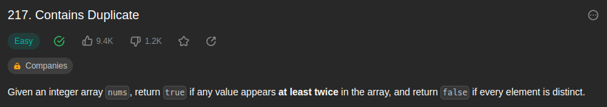
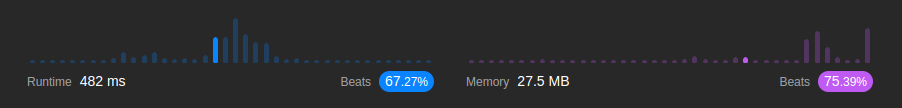

<br/>

by [@perogeremmer](https://twitter.com/perogeremmer)

**Table of contents**

- [Introduction](#introduction)
  - [Example 1](#example-1)
  - [Example 2](#example-2)
- [Constraints](#constraints)
- [Problem Solving](#problem-solving)
- [Test Case](#test-case)
- [Result](#result)

## Introduction

Given an integer array nums, return true if any value appears at least twice in the array, and return false if every element is distinct.

--

Jadi ada kasus dimana kita harus mengembalikan true kalau ada elemen yang sama.

Soal LeetCode [disini](https://leetcode.com/problems/contains-duplicate/).

### Example 1

```
Input: nums = [1,2,3,1]
Output: true
```

### Example 2

```
Input: nums = [1,2,3,4]
Output: false
Example 3:

Input: nums = [1,1,1,3,3,4,3,2,4,2]
Output: true
```

## Constraints

```
1 <= nums.length <= 105
-109 <= nums[i] <= 109
```

Artinya adalah panjang array bisa jadi berkisar antara nilai negatif -109 sampai nilai positif 109.

## Problem Solving

Gimana cara kita ngerjain ini? Sederhananya, kita harus paham, bahwa kita itu diminta mengembalikan true apabila ada elemen yang sama.

Artinya apa? Kita bisa saja memberhentikan prosesnya kalau emang ada elemen yang sama. Kenapa? Karena gak ada ketentuan bahwa kita gak boleh berhentiin proses selama perhitungan, fokusnya adalah, kalo ada yang sama, maka kembalikan nilai true.

Btw ini saya pake Python ya, maka kita bisa keluarin output kaya begini:

```python
class Solution(object):
    def containsDuplicate(self, nums):
        """
        :type nums: List[int]
        :rtype: bool
        """
        # Siapin hash/set/dictionary/object untuk nampung nilai
        arr = {}

        # Lakukan looping terhadap nums yang berisi list
        for item in nums:

            # Kalau nilainya ada di object, kita kembalikan true
            if item in arr:
                return True

            # Kalau nilainya gak ada di object, kita set nilainya dengan true
            arr[item] = True

        # Kembalikan false apabila sudah melakukan semua looping dan tidak ada yang sama
        return False
```

Intinya memanfaatkan object atau dictionary kita bisa membuat looping sederhana yang menyimpan nilai dari looping untuk melihat nilai yang sama.

Apabila nilainya belum ada di hash/dictionary, maka kita set nilainya, kalo udah ada langsung kita kembalikan True.

Kalo udah di-looping semua dan gak ada yang sama? Yaudah langsung return false, sederhana.

## Test Case

Accepted - Runtime: 18 ms

```
Input
nums = [1,2,3,1]

Output
true

Expected
true
```

```
Input
nums = [1,2,3,4]

Output
false

Expected
false
```

```
Input
nums = [1,1,1,3,3,4,3,2,4,2]

Output
true

Expected
true
```

## Result

Hasilnya adalah sebagai berikut:



Tidak keren banget tapi tidak buruk juga, yang penting kita paham bahwa solusi kita tetap diterima sambil belajar bagaimana cara improvenya :)

Ohiya Hasilnya ini gak stagnan ya alias bisa berubah-ubah, bisa aja beatsnya lagi naik, memory-nya juga, santai aja lah yang penting paham dulu~
