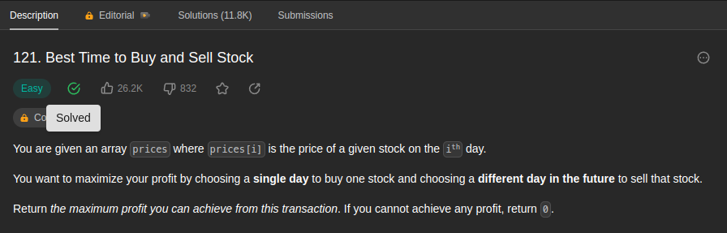
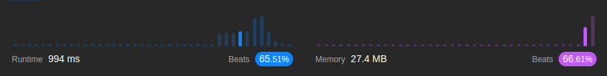

<br/>

by [@perogeremmer](https://twitter.com/perogeremmer)

**Table of contents**

- [Introduction](#introduction)
  - [Example 1](#example-1)
  - [Example 2](#example-2)
- [Constraints](#constraints)
- [Problem Solving](#problem-solving)
- [Result](#result)

## Introduction

You are given an array prices where prices[i] is the price of a given stock on the ith day.

You want to maximize your profit by choosing a single day to buy one stock and choosing a different day in the future to sell that stock.

Return the maximum profit you can achieve from this transaction. If you cannot achieve any profit, return 0.

--

Pada kasus ini, kita ditantang untuk menyelesaikan kasus dimana akan diberikan sebuah array yang mana harga pada setiap index adalah harga sebuah saham pada hari ke-x.

Kita pengen supaya dapetin profit yang maksimal untuk membeli terus milih hari yang akan datang untuk ngejual si saham.

Tugas kita adalah mengembalikan maximum profit yang bisa didapetin dari transaksi ini. Kalo kita gak dapet profit, ya kita kembaliin 0.

Soal LeetCode [disini](https://leetcode.com/problems/best-time-to-buy-and-sell-stock/description/).

### Example 1

```
Input: prices = [7,1,5,3,6,4]
Output: 5
Explanation: Beli hari kedua (harga = 1) dan jual harga kelima (harga = 6), profitnya = 6 - 1 = 5.
Catatan: Beli hari kedua dan jual hari pertama gak boleh, karena logikanya ya beli hari ini dulu dong baru jual besok.
```

### Example 2

```
Input: prices = [7,6,4,3,1]
Output: 0
Explanation: Pada ini karena gak ada yang menguntungkan maka max_profitnya = 0.
```

## Constraints

```
⚫ 1 <= prices.length <= 105
⚫ 0 <= prices[i] <= 104
```

Artinya panjang array berkisar 1 sampai 105 dan nilai dari pricesnya berkisar 0 sampai 104`.

## Problem Solving

Oke, disini kita akan menggunakan semacam `pointer` atau bisa dibilang jejak. Anjay.
Nah yang dimaksud jejak adalah, titik awal dan titik akhir.

Kalo kita main saham kan ada naik turun merah ya, tugas kita adalah nemuin titik awal dan akhir untuk dapetin profit terbanyak.

Solusinya akan jadi seperti ini:

```python
class Solution:
    def maxProfit(self, prices: List[int]) -> int:
        l, r = 0, 1
        max_profit = 0

        while r < len(prices):
            if prices[l] < prices[r]:
                profit = prices[r] - prices[l]

                if profit >= max_profit:
                    max_profit = profit
            else:
                l = r
            r += 1

        return max_profit
```

Oke saatnya kita jabarin.

Pertama, kita buat dua variabel yaitu `l` dan `r` ini adalah pointer atau penunjuk awal dan mulai untuk memeriksa dua keadaan, sebenernya poinnya sama aja kaya `prices[index + 1]` kalo kalian kepikirannya begitu, cuma ya ini dibuat lebih sederhana.

Kedua, kita buat variabel `max_profit`, ini adalah variable penyimpan nilai keuntungan maksimal yang kita dapetin dari daftar transaksinya.

Ketiga, kita looping, selama `r` lebih kecil dari panjang array prices, kita terus loop.

> Bang, kenapa r < panjang prices, kenapa gak l < panjang prices? Harusnya kan dimulai dari 0?

Jawabannya, karena l itu bernilai 0, sedangkan kita mau bandingin dua data, antara kanan dan kiri, kalo kita mulai dari 0 maka kita gak akan dapet yang lebih kecil dari 0. Maka dari itu perulangannya harus dimulai dari `r`.

Keempat, kita periksa kondisi, kalau nilai index `l` lebih kecil dari nilai index `r`, maka kita hitung profitnya. Kalau profitnya >= dari max profit, maka tiban nilai `max_profit`.

Kelima, kalau kondisi pertama tidak terpenuhi dimana nilai `prices[l]` tidak lebih kecil dari `prices[r]`, maka kita tiban nilai l dengan nilai r. Tujuannya adalah kalau misalnya nilainya tiba-tiba lebih kecil, misal nilai pertama adalah 10 dan nilai kedua adalah 5, maka jelas kita gak akan pernah dapet profit kalo index l-nya tidak digeser ke nilai kedua.

Keenam, kita naikkan nilai r dengan increment dengan nilai 1.

Terakhir, kembalikan nilai `max_profit`.

Bingung? Oke kita simulasiin:

```bash
prices = [1, 5, 10, 3]
```

Kalau kita baca dari nilai prices di atas, berapa profit maksimumnya? Yap, 9. Dengan membeli saham di hari pertama (nilai = 1) dan menjualnya pada hari ketiga (nilai = 10).

Pertama kita set `l, r = 0, 1` dan selanjutnya kita looping.

Pada iterasi pertama kita cek nilai `prices[l]` adalah 1 dan `prices[r]` adalah 5, maka jelas `prices[l] < prices[r]`. Nilai `max_profit` juga berubah, dari 0 menjadi 4, karena 5-1 = 4.

Sekarang nilai `l = 0`, dan nilai `r = 2`.

Pada iterasi kedua kita cek nilai `prices[l]` adalah 1 dan `prices[r]` adalah 10, maka jelas `prices[l] < prices[r]`. Nilai `max_profit` juga berubah, dari 4 menjadi 9, karena 10-1 = 9.

Sekarang nilai `l = 0`, dan nilai `r = 3`.

Pada iterasi ketiga kita cek nilai `prices[l]` adalah 1 dan `prices[r]` adalah 3, maka jelas `prices[l] < prices[r]`. Nilai `max_profit` tidak berubah, karena 3-1 = 2 sedangkan nilai `max_profit` sekarang adalah 9.

Jadi berapa nilai `max_profit`-nya? Yes, 9.

> Bang jelasin dong pas bagian yang kelima lo tulis, dimana kondisinya masuk ke else

Boleeeeeeh.

```bash
prices = [10, 1, 5, 2]
```

Kalau kita baca dari nilai prices di atas, berapa profit maksimumnya? Yap, 4. Dengan membeli saham di hari kedua (nilai = 2) dan menjualnya pada hari ketiga (nilai = 5).

Pertama kita set `l, r = 0, 1` dan selanjutnya kita looping.

Pada iterasi pertama kita cek nilai `prices[l]` adalah 10 dan `prices[r]` adalah 1, maka jelas `prices[l] > prices[r]`. Kondisi pertama yang kita tulis tidak terpenuhi, maka dari itu kita geser index l-nya menjadi nilai r, yaitu adalah 1.

Sekarang nilai `l = 1`, dan nilai `r = 2`.

Pada iterasi kedua kita cek nilai `prices[l]` adalah 1 dan `prices[r]` adalah 5, maka jelas `prices[l] < prices[r]`. Nilai `max_profit` juga berubah, dari 0 menjadi 4, karena 5-1 = 4.

Sekarang nilai `l = 1`, dan nilai `r = 3`.

Pada iterasi ketiga kita cek nilai `prices[l]` adalah 1 dan `prices[r]` adalah 2, maka jelas `prices[l] < prices[r]`. Nilai `max_profit` tidak berubah, karena 2 - 1 = 1, sedangkan nilai `max_profit` saat ini adalah 4.

Looping udah abis.

Jadi berapa nilai `max_profit`-nya? Yes, 4.

## Result

Hasilnya adalah sebagai berikut:


Yap, dengan memory yang kecil karena memang kasusnya sederhana, kita bisa mendapatkan hasil yang cukup memuaskan.

---

Kalau kalian suka dengan konten ini jangan lupa dibagiin ke temen-temen dan minta doanya ya supaya saya sehat dan rejekinya lancar terus biar tetep bisa menulis 🙏🙋
