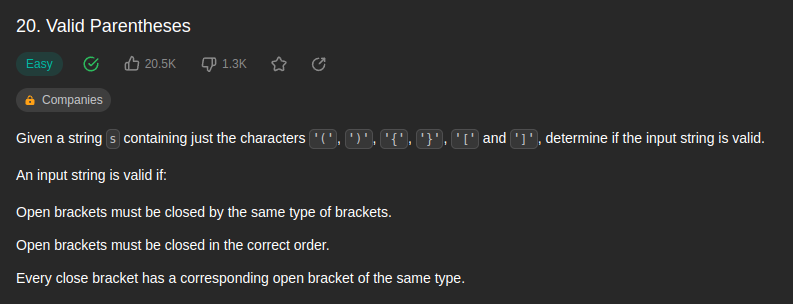
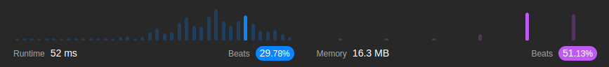

<br/>

by [@perogeremmer](https://twitter.com/perogeremmer)

**Table of contents**

- [Introduction](#introduction)
  - [Example 1](#example-1)
  - [Example 2](#example-2)
  - [Example 3](#example-3)
- [Constraints](#constraints)
- [Problem Solving](#problem-solving)
- [Result](#result)

## Introduction

Given a string s containing just the characters '(', ')', '{', '}', '[' and ']', determine if the input string is valid.

An input string is valid if:

Open brackets must be closed by the same type of brackets.
Open brackets must be closed in the correct order.
Every close bracket has a corresponding open bracket of the same type.

--

Pada kasus ini, kita ditantang untuk untuk memeriksa apakah karakter string yang di-input memiliki karakter '(', ')', '{', '}', '[' dan ']', nah kita harus memastikan apakah karakter yang di-input itu valid atau tidak.

Syarat karakternya valid adalah:

1. Setiap simbol yang dibuka harus ditutup dengan simbol yang setipe. Artinya kalau buka kurung ya harus diikuti tutup kurung.
2. Setiap simbol yang dibuka harus ditutup dengan urutan yang benar, jadi yang benar begini `(){}` bukan begini `(}{)` atau yang benar tuh begini `({})`. Intinya penutupan simbol harus tepat.
3. Setiap simbol yang ditutup harus sama tipenya kaya simbol yang dibuka, intinya sama aja sih kaya nomor satu.


Disini kita akan menggunakan konsep stack, stack itu adalah konsep dimana kita nyimpen nilai bertumpuk, kaya cucian piring. 

Soal LeetCode [disini](https://leetcode.com/problems/valid-parentheses/description/).

### Example 1

```
Input: s = "()"
Output: true
```

### Example 2

```
Input: s = "()[]{}"
Output: true
```

### Example 3

```
Input: s = "(]"
Output: false
```

## Constraints

```
⚫ 1 <= s.length <= 104
⚫ s consists of parentheses only '()[]{}'.
```

Artinya panjang karakter berkisar 1 sampai 104 dan karakter yang dikirim sbg nilai hanyalah `() {} []`.

## Problem Solving

Oke karena ini Stack, tentu aja kita bisa menggunakan salah satu tipe data, yaitu `array`.

Solusinya akan jadi seperti in

```python
class Solution:
    def isValid(self, s: str) -> bool:
        stack = []
        data = {
            "}": "{",
            "]": "[",
            ")": "(",
        }

        for char in s:
            if char not in data:
                stack.append(char)
                continue
            
            if stack and stack[-1] == data[char]:
                stack.pop()
                continue

            return False
        
        return True if not stack else False
```

Oke saatnya kita jabarin.

Pertama, kita punya variable `stack` yang kita gunakan untuk menampung karakter nantinya.

Kedua, kita punya variable `data` yang kita gunakan untuk nampung nilai bracket pembuka. Kenapa? Karena kita akan lakukan komparasi dari karakter yang kita tampung pada `stack`.

Ketiga, lakukan perulangan per-karakter, kalau karakter gak ada di data, maka kita masukkan ke stack. Gimana maksudnya? Lemme take example.

Misalnya input yang dikirim adalah `{}` ketika terjadi perulangan per-karakter dan sedang ada di bagian pertama, maka tentu saja karakter yang berada di perulangan adalah `{`. Tentu karakter tersebut tidak ada di data, karena yang ada di data adalah `}`.

```python
stack = []
# Ketika terjadi perulangan, maka stack akan terisi
stack = ["{"]
```

Keempat, apabila stack tidak kosong dan karakter terakhir pada stack sama dengan nilai data, maka isi stack kita pop (cabut).

Masih pada contoh ketiga, kalau misalnya perulangan kedua, maka karakter yang kita dapatkan adalah `}`. 

Karena stack sudah terisi karakter `{` dan `stack[-1]` yang artinya nilai dari index terakhir pada stack sesuai dengan ada yang di data, maka kita bisa pop (cabut) nilainya.

> Bentar bang, gue masih gak mudeng maksudnya apaan kok sesuai?

Ketika karakter kedua yang kita loop adalah `}` dan apabila kita print nilai `data["}"]` akan menghasilkan nilai `{`, sedangkan nilai terakhir pada variable `stack` adalah `{`. Tandanya apa? Kondisinya terpenuhi.  

Kelima, apabila kedua kondisi tidak terpenuhi, maka kita bisa lanjut ke bagian akhir, yaitu `return False`. Artinya, sudah dapat dipastikan bahwa karakter tersebut pastinya salah.

Keenam, apabila seluruh perulangan telah selesai, kita periksa nilai variable `stack`. Apabila nilai variable `stack` kosong (tidak ada yang tertinggal), maka dapat dipastikan seluruh parantesisnya valid alias apabila dibuka maka akan tertutup.

--

Gambaran yang terjadi di algoritma ketika dijalankan:

`input = "({})"`

iterasi pertama  - `(`
```python
stack = []
# karena ( tidak ada di data, maka kita input
stack = ["("]
```

iterasi kedua - `{`
```python
stack = ["("]
# karena ( tidak ada di data, maka kita input lagi
stack = ["(", "{"]
```

iterasi ketiga - `}`
```python
stack = ["(", "{"]
# karena ada nilai } di data, dan index terakhir pada stack adalah { yang mana sesuai pada nilai data, maka dianggap valid dan nilai terakhir diangkat (dicabut).
stack = ["("]
```

iterasi ketiga - `)`
```python
stack = ["("]
# karena ada nilai ) di data, dan index terakhir pada stack adalah () yang mana sesuai pada nilai data, maka dianggap valid dan nilai terakhir diangkat (dicabut).
stack = []
```

Karena stack kosong, maka nilai mengambalikan `true`.


## Result

Hasilnya adalah sebagai berikut:


Yap, dengan memory yang kecil karena memang kasusnya sederhana, kita bisa mendapatkan hasil yang cukup memuaskan.

---

Kalau kalian suka dengan konten ini jangan lupa dibagiin ke temen-temen dan minta doanya ya supaya saya sehat dan rejekinya lancar terus biar tetep bisa menulis 🙏🙋
