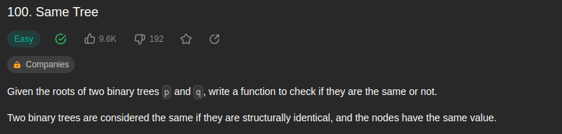
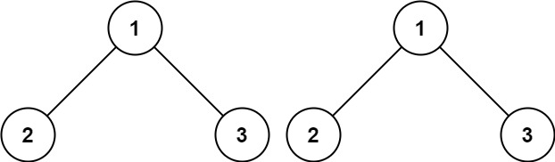
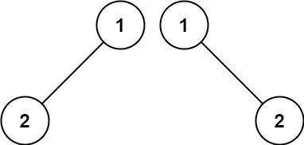
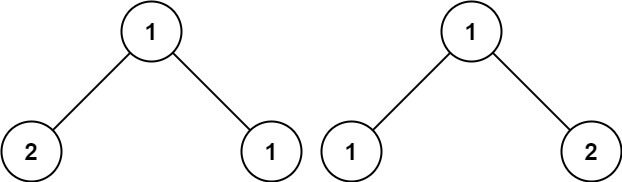
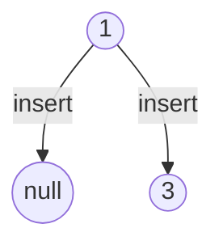
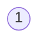
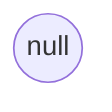
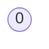
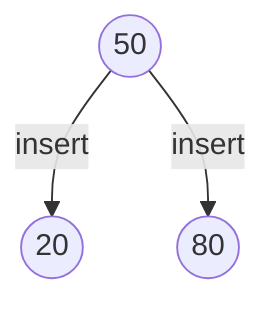
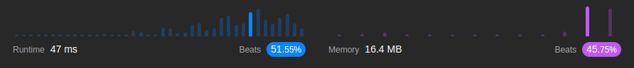

<br/>

by [@perogeremmer](https://twitter.com/perogeremmer)

**Table of contents**

- [Introduction](#introduction)
  - [Example 1](#example-1)
  - [Example 2](#example-2)
  - [Example 3](#example-3)
- [Constraints](#constraints)
- [Problem Solving](#problem-solving)
- [Result](#result)

## Introduction

Given the roots of two binary trees p and q, write a function to check if they are the same or not.

Two binary trees are considered the same if they are structurally identical, and the nodes have the same value.

--

Pada kasus ini, kita ditantang untuk memeriksa apakah dua buah Tree memiliki nilai dan struktur yang sama pada masing-masing bagian.

Nah kalo kalian belum belajar Tree, ada baiknya belajar [kesini terlebih dahulu](../../../../tutorial/series/data-structure/sorting/binary-search-tree.md). Disitu kalian akan belajar basic Tree. Jangan maksain baca ini kalo kalian belum paham konsep tree.

Soal LeetCode [disini](https://leetcode.com/problems/same-tree/).

### Example 1



```
Input: root = [4,2,7,1,3,6,9]
Output: [4,7,2,9,6,3,1]
```

### Example 2



```
Input: p = [1,2], q = [1,null,2]
Output: false
```

### Example 3



```
Input: p = [1,2,1], q = [1,1,2]
Output: false
```

## Constraints

```
⚫ The number of nodes in both trees is in the range [0, 100].
⚫ -104 <= Node.val <= 104
```

Artinya panjang cabang di tree berkisar 0 - 100 dan nilai dari cabangnya berkisar antara -104 sampai 104.

Inget ya, ada kemungkinan nilai null.

## Problem Solving

Oke karena ini Tree, masih inget dasar konsep Tree?

- Pasti ada akar, disini kita nyebutnya root
- Setiap akar bisa punya cabang
- Cabang sebelah kiri adalah nilai yang lebih kecil dari akar
- Cabang sebelah kanan adalah nilai yang lebih besar dari akar

Secara garis besar, kita perlu meriksa nilainya sama apa nggak antara satu dengan yang lain.

> Maksudnya gimana bang?

Artinya kita perlu memastikan bahwa nilai akar, dan termasuk cabangnya sudah terisi dengan benar atau belum.

Langkah yang perlu kita lakukan adalah:

1. Memastikan nilai akar antara Tree A dengan Tree B bernilai sama
2. Memastikan bahwa mereka sama-sama punya cabang dan nilainya pun sama

Sehingga hasil dari solusinya adalah sebagai berikut:

```python
# Definition for a binary tree node.
# class TreeNode:
#     def __init__(self, val=0, left=None, right=None):
#         self.val = val
#         self.left = left
#         self.right = right
class Solution:
    def isSameTree(self, p: Optional[TreeNode], q: Optional[TreeNode]) -> bool:
        if not p and not q: # Kita memeriksa apakah Tree A dan Tree B tidak memiliki nilai (null, angka kosong, atau memang tidak berisi)
            return True
        if p and q and p.val == q.val: # Kita memeriksa apakah Tree A dan B memiliki nilai dan nilai akar dari Tree A dan Tree B bernilai sama.
            return self.isSameTree(p.left, q.left) and self.isSameTree(p.right, q.right)
        else: # Jika tidak memenuhi semua kondisi, kita kembalikan false
            return False
```

Solusi pendek, yang masih bingung sini tak kasitahu.

Pertama, kita memastikan bahwa apakah Tree dan B tidak memiliki nilai, memiliki nilai null (None), atau hanya angka kosong.

Hal ini jujur aja ada di submission test-nya:

Tree A



Tree B



<br />

Tree B tidak memiliki cabang? Ya betul, jujurly saya juga kaget, soalnya di constraint tidak dijelaskan ada nilai `null`, tapi ternyata... ada.

Bahkan ada kasus dimana seperti ini:

Tree A



Tree B



Maka dari itu, solusi code yang kita lakukan seharusnya sudah tepat.

1. Kita cek apakah p dan q bernilai null, 0 (enol), atau bahkan memang tidak ada objeknya.
2. Kita cek apakah p dan q bernilai dan nilai akar dari p dan q memiliki nilai yang sama, jika iya maka kita lakukan rekursif dengan memanggil dirinya sendiri dengan mengisi parameter cabang kiri dan cabang kanan, kedua nilai harus bernilai sama dan menggunakan operator AND, sehingga masing-masing cabang harus bernilai `true`.

Sehingga yang terjadi adalah:

Tree A



Tree B


Pertama kita cek dulu p dan q, atau Tree A dan Tree B.

Akar Tree A yaitu 50
Akar Tree B yaitu 50

Kondisi pertama `Kita cek apakah p dan q bernilai null, 0 (enol), atau bahkan memang tidak ada objeknya` tidak terpenuhi, karena keduanya bernilai.

Kondisi kedua terpenuhi, karena akar dari Tree A dan Tree B sama-sama bernilai dan kemudian kedua nilainya sama yaitu 50 dan 50. Maka masuk ke kode bagian dalamnya. Masing-masing cabang akan memanggil dirinya sendiri dan menjalankan fungsi rekursif.

Cabang Kiri:

`Kita cek apakah p dan q bernilai dan nilai akar dari p dan q memiliki nilai yang sama, jika iya maka kita lakukan rekursif dengan memanggil dirinya sendiri dengan mengisi parameter cabang kiri dan cabang kanan, kedua nilai harus bernilai sama dan menggunakan operator AND, sehingga masing-masing cabang harus bernilai true`

- Akar dari cabang kiri Tree A bernilai 20
- Akar dari cabang kiri Tree B bernilai 20

Kondisi pertama terlewati, karena masing-masing bernilai 20.

Masuk ke kondisi kedua, karena Kedua nilainya sama, maka dia menjalankan fungsi untuk memeriksa nilai cabangnya, namun keduanya tidak memiliki cabang, jadi kembaliannya menjadi `true`.

Cabang kanan:

`Kita cek apakah p dan q bernilai dan nilai akar dari p dan q memiliki nilai yang sama, jika iya maka kita lakukan rekursif dengan memanggil dirinya sendiri dengan mengisi parameter cabang kiri dan cabang kanan, kedua nilai harus bernilai sama dan menggunakan operator AND, sehingga masing-masing cabang harus bernilai true`

- Akar dari cabang kanan Tree A bernilai 80
- Akar dari cabang kanan Tree B bernilai 90

Kondisi pertama terlewati, karena masing-masing bernilai 80 dan 90.

Masuk ke kondisi kedua, karena Kedua nilainya tidak sama, maka langsung ke kondisi else, jadi kembaliannya `false`.

- Cabang kiri = True
- Cabang kanan = False

```python
result = True AND False
result = False
```

Maka hasil dari Tree di atas adalah False karena pada cabang kanan Tree A bernilai 80 dan cabang kanan Tree B bernilai 90.

## Result

Hasilnya adalah sebagai berikut:


Yap, dengan memory yang kecil karena memang kasusnya sederhana, kita bisa mendapatkan hasil yang cukup memuaskan.

---

Kalau kalian suka dengan konten ini jangan lupa dibagiin ke temen-temen dan minta doanya ya supaya saya sehat dan rejekinya lancar terus biar tetep bisa menulis 🙏🙋
