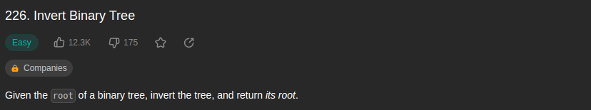
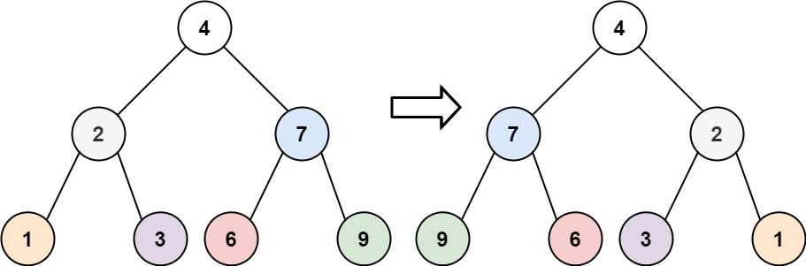
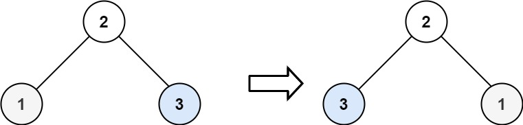
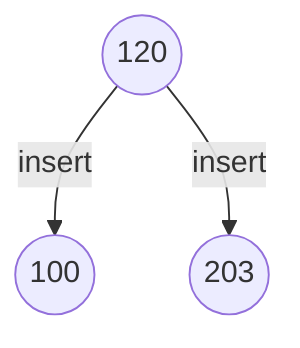
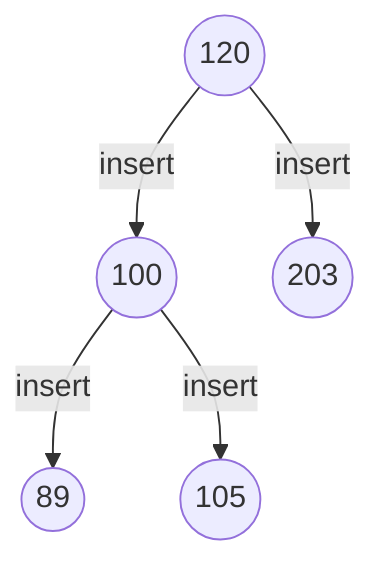
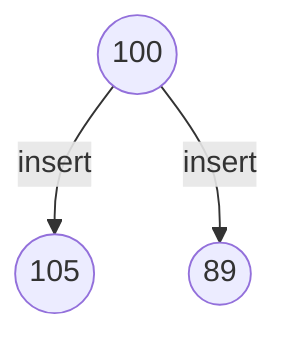
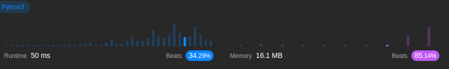

<br/>

by [@perogeremmer](https://twitter.com/perogeremmer)

**Table of contents**

- [Introduction](#introduction)
  - [Example 1](#example-1)
  - [Example 2](#example-2)
  - [Example 3](#example-3)
- [Constraints](#constraints)
- [Problem Solving](#problem-solving)
- [Result](#result)

## Introduction

Given the root of a binary tree, invert the tree, and return its root.

--

Pada kasus ini, kita ditantang untuk mengembalikan posisi sebuah tree dari kiri ke kanan, nah kalo kalian belum belajar Tree, ada baiknya belajar [kesini terlebih dahulu](../../../../tutorial/series/data-structure/sorting/binary-search-tree.md). Disitu kalian akan belajar basic Tree. Jangan maksain baca ini kalo kalian belum paham konsep tree.

Soal LeetCode [disini](https://leetcode.com/problems/invert-binary-tree/).

### Example 1



```
Input: root = [4,2,7,1,3,6,9]
Output: [4,7,2,9,6,3,1]
```

### Example 2



```
Input: root = [2,1,3]
Output: [2,3,1]
```

### Example 3

```
Input: root = []
Output: []
```

## Constraints

```
- The number of nodes in the tree is in the range [0, 100].
- -100 <= Node.val <= 100
```

Artinya panjang cabang di tree berkisar 0 - 100 dan nilai dari cabangnya berkisar antara -100 sampai 100.

## Problem Solving

Oke karena ini Tree, masih inget dasar konsep Tree?

- Pasti ada akar, disini kita nyebutnya root
- Setiap akar bisa punya cabang
- Cabang sebelah kiri adalah nilai yang lebih kecil dari akar
- Cabang sebelah kanan adalah nilai yang lebih besar dari akar

Secara garis besar, ini sama aja kaya mindahin variabel.

> Maksudnya gimana bang?

Masih inget dengan kode ini?

```python
left = 30
right = 40

# Gimana cara mindahin nilai left ke right tanpa menibannya?

tmp = left # Variabel sementara untuk menyimpan nilai kiri
left = right
right = tmp
```

Gak kebayang ya? Nih tak kasih gambaran sederhana.



<br />

Nilai 100 ada di sebelah kiri, nilai 203 ada di sebelah kanan, dan 120 adalah akar.

Dari kode di atas, Kita asumsikan sebagai berikut:

```python
left = 100
right = 203

# Gimana cara mindahin nilai left ke right tanpa menibannya?

tmp = left # Variabel sementara untuk menyimpan nilai kiri
left = right
right = tmp 
```

Sekarang kalo kita cetak right, berapa nilainya? Yap, 100.

Nah pada kasus ini, kita sudah diberikan class dasar dari si Leetcode.

```python
# Definition for a binary tree node.
# class TreeNode:
#     def __init__(self, val=0, left=None, right=None):
#         self.val = val
#         self.left = left
#         self.right = right

class Solution:
    def invertTree(self, root: Optional[TreeNode]) -> Optional[TreeNode]:
        pass
```

Dari contoh di atas, kita diberitahu bahwa untuk root yang akan diberikan, merupakan nilai dari Class TreeNode yang gambarannya sudah ada di atas bagian comment, sehingga, kita bisa langsung menulisnya menjadi seperti ini:

```python
# Definition for a binary tree node.
# class TreeNode:
#     def __init__(self, val=0, left=None, right=None):
#         self.val = val
#         self.left = left
#         self.right = right
class Solution:
    def invertTree(self, root: Optional[TreeNode]) -> Optional[TreeNode]:
        if not root:
            return None

        tmp = root.left
        root.left = root.right
        root.right = tmp

        self.invertTree(root.left)
        self.invertTree(root.right)

        return root
```

Karena parameter root merupakan objek dari class TreeNode, sehingga kita bisa langsung mengakses left maupun right. Nah karena pada kasus kita ini kita ingin menukar nilai kanan dan kiri, maka kita pakai variabel tmp.

<br/>

> Terus bang, kok ada `self.invertTree(root.left)` dan `self.invertTree(root.right)` sih?

Jadi gini, kan sebelumnya udah kita tuker tuh nilai yang kanan dan kiri, jadi sekarang kita memanggil fungsi secara rekursif (memanggil dirinya sendiri) dengan nilai yang sudah ditukar.

> Masih gak mudeng bang, hehehe 🤣

Tenang, tak bantu gambarin. Inget gambar di atas?


Sekarang bayangin kalau 100-nya ada cabang menjadi seperti ini:



<br/>

Terus apa? Ya nilainya juga kita tukar supaya menjadi seperti ini:



Kan awalnya nilai 100 ada di kiri, lalu skrg dia di kanan, nah ketika kita panggil fungsi `self.invertTree(root.right)` yang mana nilainya 100, dia memanggil dirinya sendiri.

```python
left = 89
right = 105

# Gimana cara mindahin nilai left ke right tanpa menibannya?

tmp = left # Variabel sementara untuk menyimpan nilai kiri
left = right
right = tmp 
```

Nah kalo kode ini dijalanin gimana? Ya 105 pindah ke kiri, 89 pindah ke kanan, gitu aja terus sampe kelar hahaha.

## Result

Hasilnya adalah sebagai berikut:


Yap, dengan memory yang kecil karena memang kasusnya sederhana, kita bisa mendapatkan hasil yang cukup memuaskan.

---

Kalau kalian suka dengan konten ini jangan lupa dibagiin ke temen-temen dan minta doanya ya supaya saya sehat dan rejekinya lancar terus biar tetep bisa menulis 🙏🙋
