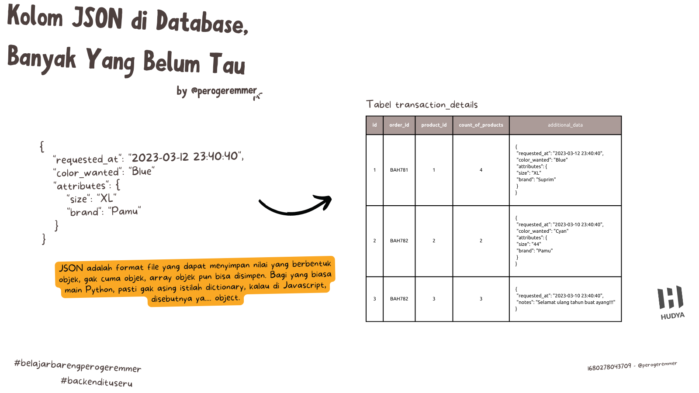

<br/>

by [@perogeremmer](https://twitter.com/perogeremmer)

**Table of contents**

- [Kenalan sama Kolom JSON di Database](#kenalan-sama-kolom-json-di-database)
- [Emang kolom JSON tuh apaan bang?](#emang-kolom-json-tuh-apaan-bang)
- [Apa manfaat JSON di database?](#apa-manfaat-json-di-database)
- [Kita bisa nyari nilai di dalam JSON gak bang?](#kita-bisa-nyari-nilai-di-dalam-json-gak-bang)
- [Berarti ngapain saya bikin kolom banyak bang? Manfaatin aja JSON](#berarti-ngapain-saya-bikin-kolom-banyak-bang-manfaatin-aja-json)
- [Kalo bang Hudya make JSON buat apa?](#kalo-bang-hudya-make-json-buat-apa)
- [Kalimat penutup](#kalimat-penutup)

## Kenalan sama Kolom JSON di Database

Well, well well, akhirnya kita kenalan sama kolom JSON di database ya. Btw sebenernya kolom ini nggak banyak yang tau loh, mahasiswa fresh graduate aja belom tentu pada tau. 😆

Nah di kesempatan kali ini, gue bakalan sharing tentang kolom JSON di database.

## Emang kolom JSON tuh apaan bang?

Sebelum tanya itu apaan, kita perlu tau dulu JSON itu apa. JSON tuh adalah format file yang bisa nyimpan nilai sebuah objek. Berasal dari kata **Javascript** Object Notation, yep lo gak salah baca, Javascript. Tujuannya adalah mempermudah pembacaan data dengan membuat key dan value yang lebih readable bentuknya, alias gampang dibaca.

> Maksudnya objek bang?

Ya objek, dimana ada pengenal (key) dan nilai (value), kalo lo sempet tau apa itu XML, nah JSON ini ibarat kata teknologi terbarukan dari XML itu sendiri. XML udah mulai ditinggalin karena... ribet.

Bayangin aja lo perlu bikin tag udah kaya HTML, kalo json kan gampang tinggal leppp.

```JSON
{
  "name": "Hudya"
}
```

tapi mentang-mentang JSON ini asalnya dari Javascript, ya hampir semua bahasa pemrograman sekarang bisa membuat tipe file ini, ibarat kata udah general lah tipe ini, udah common gitu bray.

JSON ini selain nyimpen objek, bisa juga nyimpen array of object, yap objek di dalam array.

```JSON
[
  {
    "name": "Hudya"
  }
]
```

So, cara ngolahnya ya sama kaya elo yang bikin array object aja di bahasa pemrograman.

## Apa manfaat JSON di database?



Simplenya, mempermudah penyimpanan data tanpa bikin kolom baru. Kita sama-sama tahu kalo mau nyimpen data di database kan perlu sebuah kolom, ibarat excel kita kalo mau nyimpen informasi lainnya harus bikin kolom bererot sampai kanan dan mentok.

Tapi bayangin aja, kalo misalnya ada satu kolom yang sebenernya ga penting harus diisi, atau kalo kaga ada isinya juga gapapa, sayang banget kan kalo harus dibuat kolom? Kalo nyimpen 5 informasi primary dan 15 informasi tambahan, masa iya harus bikin total 20 kolom?

Kenapa kita gak simplify aja jadi 6 kolom doang? 😉

tabel `transaction_details`
|id|order_id|product_id|count_of_products|
|-|-|-|-|
|1|BAH781|1|4|
|2|BAH782|2|2|
|3|BAH782|3|3|

Misal kita punya tabel transaction_details, nah ternyata ada tambahan fitur dimana kita juga harus menyimpan informasi yang bisa aja beda-beda penamaannya, karena frontend biasanya punya konstan sendiri.

Gimana caranya kita bisa nyesuain informasi ini biar dinamis ke frontend? Yep, pake JSON.

Anggap lah ya, di dalam tabel transaction_details, customer bisa memilih mau ukuran baju apa, terus misalnya mau warna apa? udah gitu kita diminta tau kapan si customer ini meminta request ini? terus brandnya apa? nah ini kalo dibikin kolom aja udah bisa jadi 4 kolom.

Daripada dibikin empat, mending bikin satu kolom tambahan dengan nama `additional_data`, isinya adalah json berikut:

```json
{
   "requested_at": "2023-03-12 23:40:40", 
   "color_wanted": "Blue"
   "attributes": {
      "size": "XL"
      "brand": "Pamu"
   }
}
```

Bayangin, kita bisa nyimpen informasi se-fleksibel ini, pake format JSON. Belom lagi kalo misalnya jenis barangnya beda, gak ada tuh warna, dan atribut, yang ada malah notes.

```JSON
{
 "requested_at": "2023-03-10 23:40:40", 
 "notes": "Selamat ulang tahun buat ayang!!!"
}
```

Kan kita suka liat tuh kalo beli barang kita bisa naruh notes gitu. Se-fleksibel ini kita bisa nyimpen informasi pake JSON, daripada bikin kolom baru.

## Kita bisa nyari nilai di dalam JSON gak bang?

Jelas bisa, pake query kaya begini:

```SQL
SELECT * FROM my_table WHERE JSON_EXTRACT(additional_data, '$.namakey') = 'pencarian';

-- sample
SELECT * FROM my_table WHERE JSON_EXTRACT(additional_data, '$.color_wanted') = 'search_term';

-- Kalo mau nampilin size
SELECT JSON_EXTRACT(json_data, '$.attributes.size') AS size FROM table_name;

-- kalo mau nampilin color_wanted
SELECT JSON_EXTRACT(json_data, '$.color_wanted') AS color_wanted FROM table_name;
```

Enak gak sih? Jawabannya, enak banget. Soalnya data jadi simple, gak makan tempat, bahkan gak harus selalu sama strukturnya, jadi jelas bisa ngirit size dari DB kamu nih guys.

## Berarti ngapain saya bikin kolom banyak bang? Manfaatin aja JSON

Ye, gak gitu malih, tentu JSON ada kekurangannya, salah satunya adalah masalah `INDEX`. Yep, kita gak bisa nge-index persis pada salah satu key yang ada di JSON tersebut, artinya tentu pencariannya gak akan maksimal, bos.

> Cara ngakalinnya gimana bang?

Menurut gue, cara paling sederhana adalah dengan tidak memasukkan nilai penting yang bakalan dicari (pas SELECT), ke dalam JSON.

JSON ini cuma atribut pelengkap yang kalo gak ada gapapa, kalo ada, ya bagus. Jadi gak cocok tuh kalo ID dimasukin JSON, terus misalnya product_id masuk JSON, better enggak.

Lebih baik masukkan informasi tambahan dari aplikasi kalian yang sifatnya bisa dinamis, jadi nanti dari logic business kalian bisa cek misalnya ada gak sih json key `color_wanted`?

## Kalo bang Hudya make JSON buat apa?

Jujur, gue waktu itu sempet make buat nyimpen perhitungan bulet-bulet sebuah posts, karena setelah gue analisa gue gak butuh kolom itu buat pencarian.

Misal gue ada table posts begini:

|id|text|user_id|created_at|
|-|-|-|-|
|1|Hello, World|1|2022-04-10 13:00:04|
|2|Hi Semuanya|1|2023-01-12 15:34:45|
|3|Postinganku tahun ini|2|2023-02-13 14:43:12|

Nah gue mau nyimpen nih berapa jumlah user yang ngelike dan ngecomment, yaudah gue simpen aja di kolom json:

|id|text|user_id|created_at|additional_data|
|-|-|-|-|-|
|1|Hello, World|1|2022-04-10 13:00:04|`{"count_likes": 30 "count_comments": 1}`|
|2|Hi Semuanya|1|2023-01-12 15:34:45|`{"count_likes": 13 "count_comments": 0}`|
|3|Postinganku tahun ini|2|2023-02-13 14:43:12|`{"count_likes": 11 "count_comments": 3}`|

Dengan begini gue jadi lebih gampang untuk tahu berapa jumlah likes dan comments tanpa perlu nge-join ke table comments dan likes! 😄

Inget selalu, pertimbangkan bahwa nilai yang kamu pake itu bukan **primary value**. Artinya, nilai yang akan selalu kena kolom pencarian pada saat nge-select.

Even gue bisa nyimpen nilai `is_private` di kolom json, sehingga gue tau post itu private apa gak (bisa dikomen apa gak.

## Kalimat penutup

Buat mahasiswa pasti gak banyak tau manfaatin kolom JSON ini, kamu bisa mulai manfaatin kolom ini di database, nanti ngolah logicnya di bahasa pemrograman yang kalian pake, misalnya Python, Java, Javascript, or even, Golang.

Tapi dengan manfaatin JSON, kalian bisa memnbuat data kalian lebih fleksibel, karena gak semua informasi akan dimasukkan ke dalam satu baris, kalo misalnya ada nilai yang gak perlu masuk ke JSON, gak usah dimasukin, nanti di logic bahasa pemrograman kalian bisa cek, ada gak sih key itu?

Misalnya gue di Python:

```python
import json

# Kita anggap variabel data bertipe byte ini dateng dari table kolom json
data = '{"color_wanted": "Blue"}'
data = json.loads(data)

color = data['color_wanted'].lower()

> blue
```

Jadi kita bisa ngolah nilai atau value dari database, pake logic bahasa pemrograman kalian, jadi jangan langsung kalian kembaliin ke client ya~
