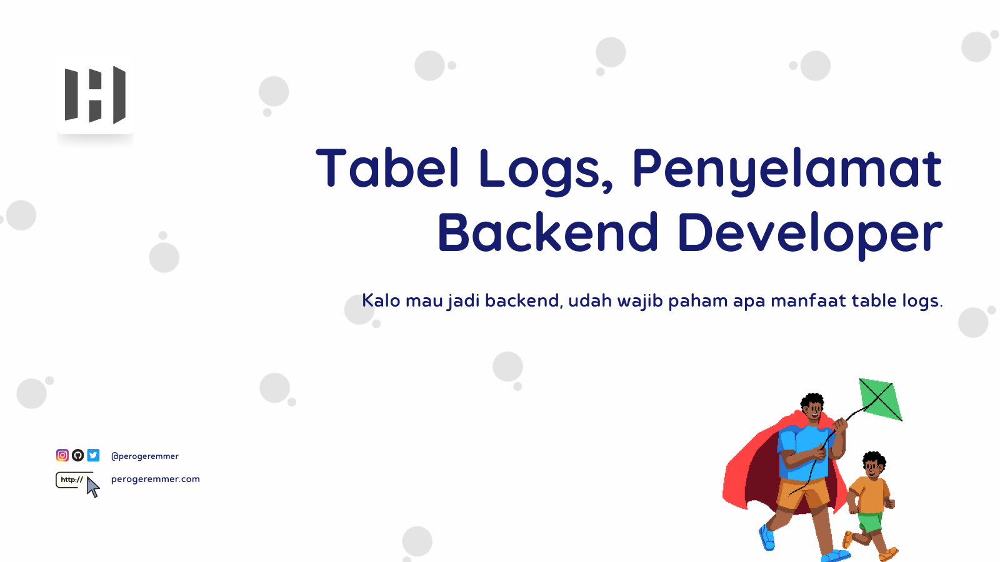
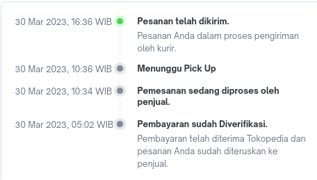
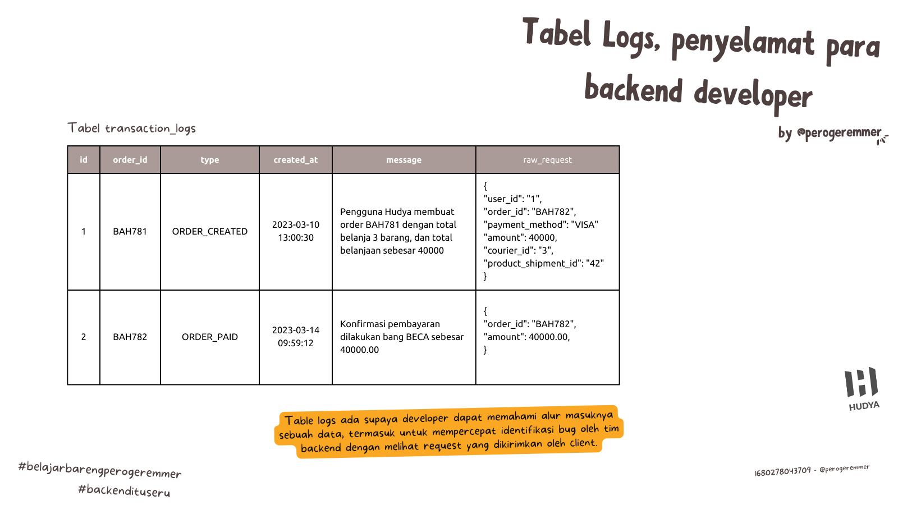
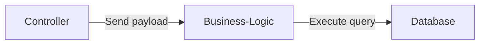

 

by [@perogeremmer](https://twitter.com/perogeremmer)

**Table of contents**

- [Tabel Logs Penyelamat Backend Developer](#tabel-logs-penyelamat-backend-developer)
- [Sebenernya, tabel logs tuh apaan?](#sebenernya-tabel-logs-tuh-apaan)
- [Terus manfaatnya apa bang?](#terus-manfaatnya-apa-bang)
- [Tapi bang, kan bisa curang ngisi langsung di tabel itu](#tapi-bang-kan-bisa-curang-ngisi-langsung-di-tabel-itu)
- [Apakah semua tabel harus dibuat logs?](#apakah-semua-tabel-harus-dibuat-logs)
- [Bukannya tabel logs bikin database jadi bengkak sizenya?](#bukannya-tabel-logs-bikin-database-jadi-bengkak-sizenya)
- [Belum bermanfaat buat saya](#belum-bermanfaat-buat-saya)

## Tabel Logs Penyelamat Backend Developer

Anjay judulnya udah lebay banget yak? 🤣 Ya gimana ya, emang tabel logs itu akan jadi penyelamat para backend developer. Kenapa gitu? Soalnya backend developer tuh gak tau data request dari client.

## Sebenernya, tabel logs tuh apaan?

Sederhananya, tabel logs adalah tabel yang dirancang untuk menyimpan informasi dari sebuah kejadian, ibarat kalian mesen barang di-ecommerce pasti kalian pernah liat urutan kaya gini kan?

Yap, ini namanya **logs**.

Tabel log akan menyimpan kejadian (event) atau pesan yang dibuat sama program kalian. Tujuannya apa? Biar kalian tau kejadian dari layanan kalian.

Contoh `table transaction_logs`

| id | transaction_id | user_id | transaction_type | transaction_date        | amount | status    | description            | source_account          | destination_account     | transaction_metadata                                       |
|----|----------------|---------|-----------------|-------------------------|--------|-----------|------------------------|-------------------------|-------------------------|------------------------------------------------------------|
| 1  | 1              | 1       | purchase        | 2023-04-01 17:17:22.047 | 100.00 | completed | Purchase of Item A     | 1234-5678-9012-3456     | 9876-5432-1098-7654     | {"sku": "A123", "color": "blue"}                          |
| 2  | 2              | 2       | refund          | 2023-04-01 17:17:22.047 | 50.00  | completed | Refund for Order B      | 1111-2222-3333-4444     | 5555-6666-7777-8888     | {"order_id": "B456", "reason": "defective"}               |
| 3  | 3              | 3       | transfer        | 2023-04-01 17:17:22.047 | 200.00 | pending   | Transfer to Friend      | 9999-8888-7777-6666     | 3333-4444-5555-6666     | {"friend_name": "John", "message": "Happy Birthday!"}     |

Dari tabel ini kita bisa liat misal `transaction_id` yang id-nya 1 itu ngelakuin transaksi tipe apa, terus ada metadata (atribut tambahan) apa.

## Terus manfaatnya apa bang?

Kalo misalnya (amit-amit), kejadian sesuatu, misalnya amount yang ada di tabel `transaction` salah karena ada kesalahan program yang bikin nilainya ketimpa. Kita bisa liat tuh di `transaction_logs`, ya amit-amit jangan sampe transaction_logsnya juga ikut salah ya, yang ada nangis kita 😭

Terus misalnya nih, kalo ada user yang **batu**, bilangnya "Ah saya gak ngerasa mesen". Menggunakan table `transaction_logs`, ya kita bisa track bahwa user ini beneran beli kok, orang ada datanya.

Atau.... ini sih sebenernya klasik ya... Misalnya tim kalian suka ngeganti-ganti hal yang sensitif, misalnya harga. Nah kita bisa simpen perubahan yang dilakukan sama tim kalian itu, jadi kalo misalnya akun si empunya ngelakuin perubahan terhadap harga produk a, maka akan di catat di tabel `price_logs` perubahan yang dilakukan, dari request yang dikirimkan, produk sebelum terubah, sama sesudah terubah.

Jadi enak tuh ke-track, gak bisa lagi tim internal kalian bilang "gak tau saya gak ngubah", lah gimana mau ngeles? Kan datanya ada di tabel `price_logs`!

## Tapi bang, kan bisa curang ngisi langsung di tabel itu

Bener, kecurangan emang selalu ada, emang gak ada jaminan bisa di-fitnah juga, makanya perlu orang yang jujur buat ngejagain akses db. Jangan kasih orang yang gak bisa dipercaya, makanya para lead atau CTO ya tentu punya tangan kanan yang bisa dipercaya, apalagi urusan data.

Tapi minimal, kita bisa ngurangin adanya kesalahan data yang bikin developer tunjuk-tunjukkan karena masalah bug. Dengan adanya tabel logs akan mempermudah dan mempercepat developer memahami kondisi ataupun alur program yang bikin datanya salah.

## Apakah semua tabel harus dibuat logs?

Ya nggak juga, tapi kalau ada informasi sensitif yang kalo berubah bisa bikin gempar satu produk, ada baiknya ya dibuat aja tabelnya. Misalnya:

- tabel harga
- tabel transaksi
- tabel produk
- tabel voucher

Informasi sensitif di atas bisa aja dibuat masing-masing sebuah tabel logs supaya kalau ada apa-apa, para backend developer bisa identifikasi root cause problemnya jauh-jauh-jauh dan jauh lebih cepat.

Kira-kira gini lah gambarannya backend developer ketika ngeliat isi data dari tabel logs. Masih gak paham juga? Oke gini deh:

Supaya backend developer paham sebenernya apa yang terjadi pada business logic, dan backend paham apa yang dikirimkan sama controller, backend langsung lari ke bagian database, dari situ dia bisa melakukan debugging dari belakang ke depan.

Artinya backend coba memahami outputnya, lalu ngetrack bagian kode apa yang possibility untuk bikin data tersebut menjadi kaya begitu. Masih gak paham juga?

Misal ada data x = 5, berapa banyak possibility untuk menghasilkan 5? Yep ada beberapa:

- x = 0 + 5
- x = 5 + 0
- x = 3 + 2
- x = 2 + 3
- x = 4 + 1
- x = 1 + 4

Pertanyaannya, kode mana yang bikin x menjadi 5? Ini lah yang dilakukan anak backend untuk memahami berdasarkan output yang terjadi.

Misalnya dia sadar ternyata ada salah menggunakan variabel, yang harusnya x malah z, pantes aja datanya 5, harusnya kan gak lima, gitu loh.

## Bukannya tabel logs bikin database jadi bengkak sizenya?

Yap, tentu aja itu resiko yang harus dibayar mahal, tapi kalau disuruh milih ya, debugging tanpa paham apa yang terjadi atau harus nambah biaya sedikit untuk nyimpen data, pilih mana?

Kalo saya sih, pilih bikin tabel logs dan bayar dikit, daripada harus pusing debugging tujuh keliling, most entrepreneur juga pasti begitu~

Kenapa saya bisa bilang bayar dikit?

1. Karena emang harga storage tuh murah.
2. Kepercayaan customer jadi turun kalo ada masalah dan lama fixnya.

Makanya, better punya daripada gak, daripada nanti ngawang-ngawang doang kek dukun!

Inget selalu, programmer itu gak boleh ngawang, harus clear root causenya. Kalo ngawang-ngawang doang alias nebak-nebak, maka ini bukan coding, melainkan kuis berhadiah!

## Belum bermanfaat buat saya

Saya pernah kejadian bahwa ada data yang error, dan bikin kolom amount jadi 0, ketika ngeliat di tabel logs ternyata messagenya yang ditulis adalah "pembayaran sebesar 5000", nah loh, kok bisa beda?

Ternyata emang ada bug, nilai amountnya selalu ketiban, berhubung saya pake ORM, jadi tiap ada perubahan dia auto commit ke database. Bayangin kalo gak ada tabel logs, mana saya tau kalo emang ahrusnya harganya 5000?

Tabel logs emang nggak bermanfaat setiap hari, tapi.... ketika ada kejadian yang anomali, atau bahkan perlu pembuktian.

Tabel ini bakalan bener-bener jadi pahlawan, dan kalian pasti bakalan bilang "gak nyesel gue bikin tabel logs, akhirnya gue bisa nemuin isunya".

Entah berapa kali gue terselamatkan gara-gara tabel logs, dan bahkan kalo ada masalah di API yang gue bangun, yang pertama kali gue buka dan periksa adalah logsnya. Setelahnya baru tuh cek kodenya.

Jadi gak kebalik, cek kode kemudian data. Menurut gue, yang penting data dulu yang dicek, valid gak? Kalo udah valid atau emang error dan tau yang bener gimana berdasarkan bukti, baru cek kodenya, ada bug gak? Ada unit test yang nggak dibuat gak?
