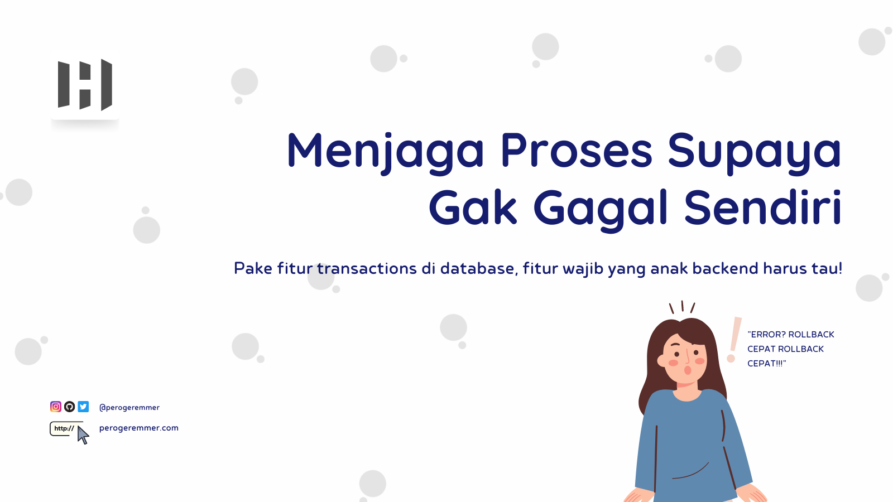
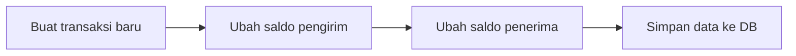
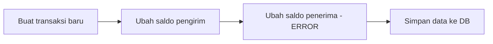
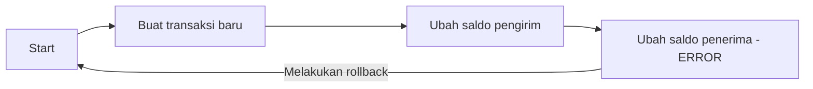

 

by [@perogeremmer](https://twitter.com/perogeremmer)

**Table of contents**

- [Transactions, Teknik Menjaga Proses Yang Gagal](#transactions-teknik-menjaga-proses-yang-gagal)
- [Fitur Transactions](#fitur-transactions)
- [Apakah semua proses harus menggunakan transactions?](#apakah-semua-proses-harus-menggunakan-transactions)
- [Apa kekurangan pake transactions?](#apa-kekurangan-pake-transactions)

## Transactions, Teknik Menjaga Proses Yang Gagal

Kamu pernah berpikir gak kalo misalnya ada beberapa proses di database sekaligus, tapi proses setelah proses pertama  ada kegagalan, gimana nasib proses pertama?

> hah maksudnya gimana bang? ribet lu.

Gini gini, anggap aja ya kita lagi bikin aplikasi e-wallet untuk fitur transfer, maka kemungkinan ada beberapa proses berikut:

Rinciannya sih kaya gini ya:

- Catat  di table transactions yang mencatat kejadian transfer
- Ubah saldo pada user pengirim sesuai jumlah yang ditransfer
- Ubah saldo pada penerima sesuai jumlah yang ditransfer

Sekarang bayangkan, kalo misalnya proses ketiga terjadi error atau kesalahan, pertanyaannya.. gimana atau apa yang terjadi pada proses pertama dan kedua? Kan secara proses, mereka sudah berjalan.

Jawabannya apa? Ya jelas, mereka sudah terlanjur **berubah**.

Sistem sudah mencatat terjadinya transaksi, pengirim sudah kehilangan saldo sesuai jumlah yang ditransfer, dan penerima malah tidak mendapatkan apapun.

Rasanya gimana yang dialamin user? Bingung, kesel dan ngamuk. Karena kalo ada di posisi kamu, tentu kamu juga gak mau kan kalo misalnya kejadiannya kaya begitu?

## Fitur Transactions

Nah, dari kasus di atas makanya ada sebuah fitur di database namanya transactions, gunanya adalah untuk dapat me-rollback suatu kejadian. Rollback atau bisa juga disebut mundur ke sebuah keadaan adalah sebuah fitur dimana kalo misalnya ada satu aja proses yang gagal, maka keseluruhan proses dianggap gagal.

Bisa dibilang transactions ini kaya operator logical AND dimana semua kondisi harus terpenuhi agar dapat mengeluarkan output atau memenuhi kondisi tersebut.

Contoh masih menggunakan kasus di atas:

- Sistem mencatat terjadinya transfer dari user Hudya ke user Andi sebesar 200.000.
- Sistem mengubah saldo Hudya dari 1.000.000 menjadi 800.000.
- Terjadi error pada saat merubah saldo Andi, terdapat parameter yang salah diinput ke database.

Pada saat terjadi error pada proses ketiga, database akan membatalkan keseluruhan proses, karena keseluruhan proses ini dianggap dalam sebuah sesi.

Sehingga, ketika ada satu proses yang bermasalah maka satu sesi tersebut akan dianggap gagal, saldo Hudya tidak akan berkurang, dan sistem tidak akan mencatat terjadinya transfer.

## Apakah semua proses harus menggunakan transactions?

Hmm sebenernya gak juga, kalau misalnya prosesnya hanya ada satu proses saja, misalnya menambahkan data saja, atau melakukan perubahan data sih enggak apa. Namun apabila terjadi lebih dari satu proses pada sebuah fitur atau flow, maka sangat disarankan menggunakan transactions guna mencegah masalah di kemudian hari.

Tujuan utama dari transactions adalah untuk menjaga data agar tetap konsisten, sehingga walau terjadi kesalahan baik saat penginputan data di database maupun pada proses terjadinya code, datanya akan tetap bisa di-rollback atau dikembalikan pada state sebelum terjadinya masalah.

## Apa kekurangan pake transactions?

Apa masalah yang terjadi pada saat menggunakan transactions?
Dari sisi kode tentunya struktur pada saat menggunakan transactions akan berbeda dengan kode pada umumnya, karena harus disisipkan ke dalam sebuah sesi. Selain itu, database akan bekerja lebih banyak dari fungsi biasa yang tidak menggunakan transactions.

Namun dari semua kekurangan menggunakan transactions, tetap **sangat disarankan** menggunakan transactions untuk mencegah data yang tidak konsisten, mengapa? Kita bisa dengan murah dan mudah mengupgrade resource pada server, tapi kita akan sangat kesulitan dan meghabiskan waktu apabila terjadi data yang tidak konsisten.

Contoh apa saja kasus yang bisaa menggunakan transaction?

- Ketika transfer saldo yang mana harus menggunakan beberapa proses
- Pembelian barang checkout  yang melibatan beberapa proses pencatatan transaksi
- Flash sale yang mana barang biasanya terbatas, sehingga ketika barang habis, proses pemasukan ke keranjang tidak tercatat.
