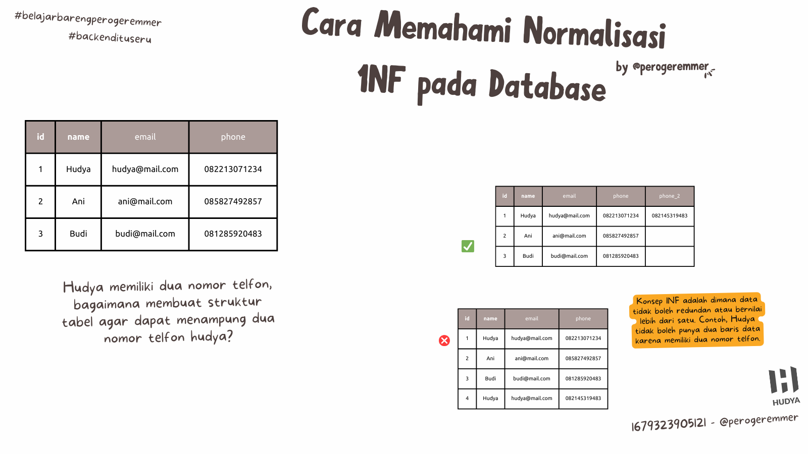
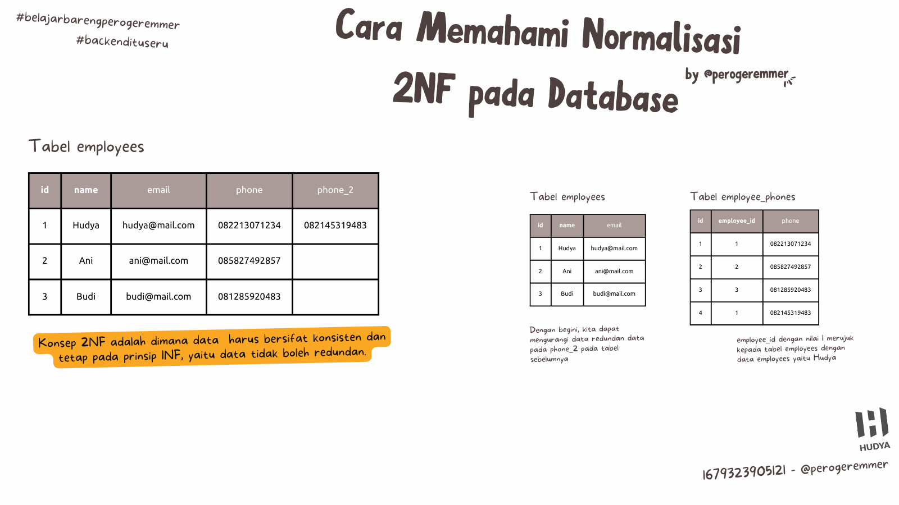
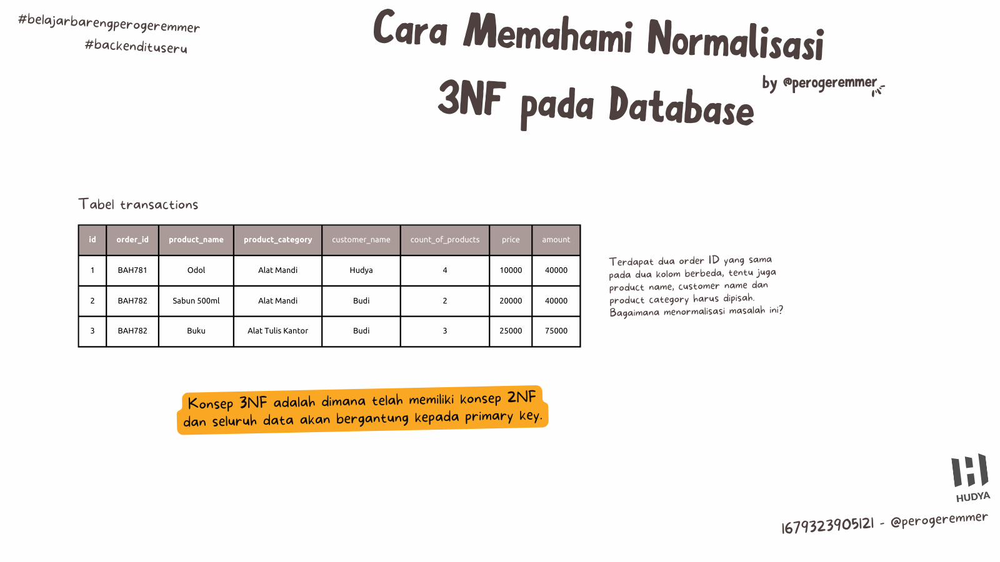
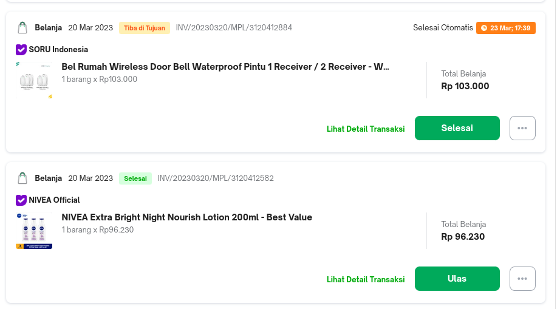
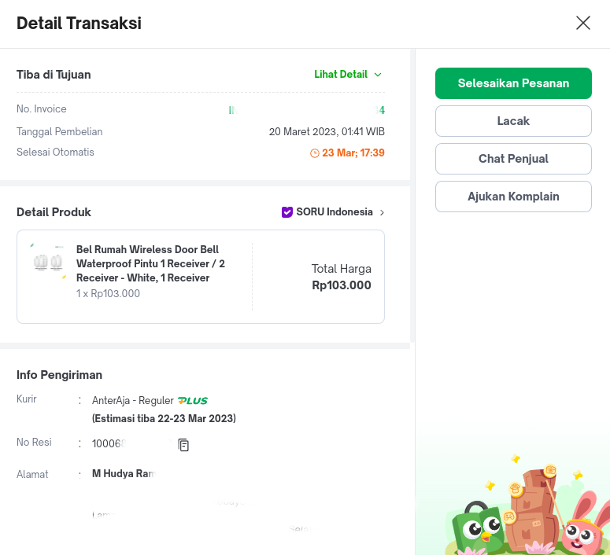
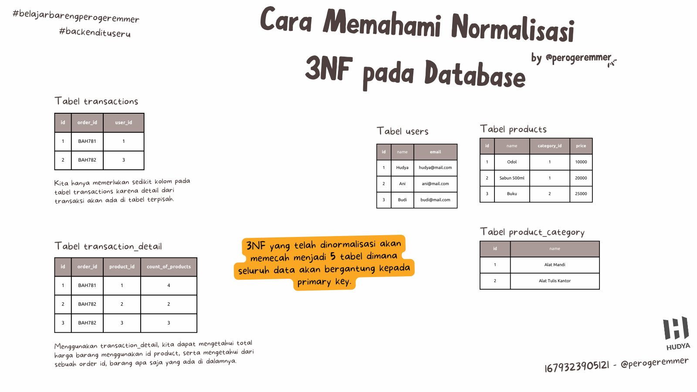

 

**Table of contents**

- [Memahami Normalisasi Database Relasi](#memahami-normalisasi-database-relasi)
- [Sebenernya normalisasi tuh apaan?](#sebenernya-normalisasi-tuh-apaan)
- [Apa aja jenis normalisasi?](#apa-aja-jenis-normalisasi)
- [First Normal Form (1NF)](#first-normal-form-1nf)
- [Second Normal Form (2NF)](#second-normal-form-2nf)
- [Third Normal Form (3NF)](#third-normal-form-3nf)
  - [Kenapa gitu bang?](#kenapa-gitu-bang)
  - [Saatnya membuat tabel baru](#saatnya-membuat-tabel-baru)
- [Kelemahan Normalisasi](#kelemahan-normalisasi)

## Memahami Normalisasi Database Relasi

Setelah kemarin kita ngebacot tentang [tips belajar database](../insight/career/tips-belajar-database-relasional.md), sekarang kita ngomongin normalisasi database relasi.

## Sebenernya normalisasi tuh apaan?

> src: tenor.com

Normalisasi adalah aturan untuk ngebuat data pada database kamu agar terorganisir dengan baik, alias menghindari data redundan.

Data redundan itu sendiri artinya data yang double, kamu juga kalo pake excel ada data yang sama pasti males kan? Buat apa kalo datanya sama?

Selain untuk menghindari data redundan, gunanya juga untuk mempercepat berbagai proses dan menghindari perubahan yang terlalu masif alias banyak akibat data redundan.

> Nanti dijelasin ya maksudnya data masif itu apa, jadi jangan banyak tanya dulu xixixi

## Apa aja jenis normalisasi?

Sebenernya sih ada banyak (ga sebanyak yang elo kira sih), yang saya tahu ada enam:

- First Normal Form (1NF)
- Second Normal Form (2NF)
- Third Normal Form (3NF)
- Boyce-Codd Normal Form (BCNF)
- Fourth Normal Form (4NF)
- Fifth Normal Form (5NF)

Kita akan bahas cukup sampai 3NF aja, kenapa karena pada dasarnya paling banyak yang dipake ya cuma 3NF aja untuk pembelajaran dasar, sekalian biar kepala kita kaga pecah hehehe.

## First Normal Form (1NF)

First normal form adalah konsep dimana data itu sebenernya kaga boleh redundan, jadi kita harus membuat gimanapun caranya, data itu jadi cuma satu doang.

Kalo kita liat di gambar, kita bisa liat bahwa ada satu tabel namanya `employees`, terus ada tiga data.

|id|name|email|phone|
|-|-|-|-|
|1|Hudya|hudya@mail.com|082213071234|
|2|Ani|ani@mail.com|085827492857|
|3|Budi|budi@mail.com|081285920483|

Pertanyaannya, gimana cara menyelesaikan masalah dimana Hudya punya dua data nomor telfon? Nambahin data baru? Jadi redundan dong?

|id|name|email|phone|
|-|-|-|-|
|1|Hudya|hudya@mail.com|082213071234|
|2|Ani|ani@mail.com|085827492857|
|3|Budi|budi@mail.com|081285920483|
|4|Hudya|hudya@mail.com|082145319483|

Nah, tujuan 1NF itu kan ngilangin data redundan.

Kita akan bikin tabelnya menjadi seperti ini:

|id|name|email|phone|phone_2|
|-|-|-|-|-|
|1|Hudya|hudya@mail.com|082213071234|082145319483|
|2|Ani|ani@mail.com|085827492857|`NULL`|
|3|Budi|budi@mail.com|081285920483|`NULL`|

Sehingga data `phone_2` untuk user lain akan diisi null alias datanya nggak ada.

Tentu, cara ini ada kelemahannya, gimana kalo misalnya kita mau nyimpen lima nomor telfon? Untuk stick pada solusi ini kita harus nambahin sampai `phone_5`, tapi masalahnya, kan gak setiap orang **pasti** punya lima nomor telfon? Kita akan beresin itu di 2NF.

## Second Normal Form (2NF)

Second Normal Form adalah konsep dimana data itu harus pake konsep 1NF dimana data gak boleh redundan, dan gak ada data yang setengah-setengah keisi.

Maksudnya gimana? Cek tabel 1NF yang sebelumnya.

tabel `employees`
|id|name|email|phone|phone_2|
|-|-|-|-|-|
|1|Hudya|hudya@mail.com|082213071234|082145319483|
|2|Ani|ani@mail.com|085827492857|`NULL`|
|3|Budi|budi@mail.com|081285920483|`NULL`|

Ada data `NULL` yang artinya ini data parsial, alias setengah-setengah keisi. Untuk mengatasi masalah ini, makanya kita punya 2NF.

Kita harus pisah jadi dua tabel, sehingga jadi seperti ini:

tabel `employees`
|id|name|email|
|-|-|-|
|1|Hudya|hudya@mail.com|
|2|Ani|ani@mail.com|
|3|Budi|budi@mail.com|

table `employee_phones`
|id|user_id|phone|
|-|-|-|
|1|1|082213071234|
|2|2|085827492857|
|3|3|081285920483|
|4|1|082145319483|

Nah dengan konsep ini kita gak perlu khawatir dimana Ani sama Budi kan kaga punya nomor telfon, nah biar bikin kolom datanya irit sehingga seluruh data akan mengacu kepada data primary, ya maka dibuat tabel `employee_phones`.

## Third Normal Form (3NF)

Untuk kasus 3NF kita akan menggunakan kasus berbeda, dimana gak bisa pake kasus sebelumnya, umumnya 3NF ini adalah kasus dimana terjadi pada tabel transaksi.

Maksudnya gimana? Cek tabel berikut:

tabel `transactions`
|id|order_id|product_name|product_category|customer_name|count_of_products|price|amount|
|-|-|-|-|-|-|-|-|
|1|BAH871|Odol|Alat Mandi|Hudya|4|10000|40000|
|2|BAH872|Sabun 500ml|Alat Mandi|Budi|2|20000|40000|
|3|BAH873|Buku|Alat Tulis Kantor|Budi|3|25000|75000|

Masalah disini adalah tabelnya gak masuk ke normal form, untuk mengatasi ini kita perlu mengubahnya hingga 3NF yang mana harus ada sebuah tabel yang menampung nilai untuk customer, products dan product categories.

Selain itu kita juga perlu membuat satu tabel baru untuk menyimpan detail dari setiap transaction karena agar tidak perlu menyimpan nilai lebih dari satu pada tabel transaction, jadi setiap barang yang kita beli akan ada detail dari transaksi.

### Kenapa gitu bang?

Coba cek e-commerce kalian, ketika di halaman transaksi kalian akan lihat hal seperti ini kan?

Ini artinya data ini merupakan transaksi kalian, dan kita bisa liat ada tombol **Lihat Detail Transaksi**.

Ini merupakan detail dari transaksinya, yang artinya ada sebuah tabel yang menyimpan detail dari transaksi ini. Ini lah yang kita gunakan, 3NF.

### Saatnya membuat tabel baru

Kita perlu memisahkan data tersebut menggunakan tabel sendiri, coba cek tabel di bawah ini:

tabel `users`
|id|name|email|
|-|-|-|
|1|Hudya|hudya@mail.com|
|2|Ani|ani@mail.com|
|3|Budi|budi@mail.com|

tabel `products`
|id|name|category_id|price|
|-|-|-|-|
|1|Odol|1|10000|
|2|Sabun 500ml|1|20000|
|3|Buku|2|25000|

tabel `product_categories`
|id|name|
|-|-|
|1|Alat Mandi|
|2|Alat Tulis Kantor|

tabel `transactions`
|id|order_id|user_id|
|-|-|-|
|1|BAH781|1|
|2|BAH782|3|

tabel `transaction_details`
|id|order_id|product_id|count_of_products|
|-|-|-|-|
|1|BAH781|1|4|
|2|BAH782|2|2|
|3|BAH782|3|3|

Dengan memisahkan tabel seperti ini, maka sudah lengkap lah kita membuat normalisasi bentuk 3NF karena pada tabel transaction_detail, seluruh informasi bergantung kepada tabel sesuai keynya, misal untuk tahu berapa harga `product_id` nilai 1, maka kita cek ke tabel `products`, yaitu odol dengan harga 10.000, apabila `order_id` `BAH781` membeli sebanyak 4 barang, maka total pembeliannya adalah 40.000.

Kita juga bisa tahu bahwa user dengan id 2 memiliki `order_id` `BAH782` yang mana terdapat jumlah sebanyak 5 barang yang ia beli, dimana datanya didapet dari tabel `transaction_details`.

> Perlu diingat, bahwa kasus 3NF biasanya terjadi pada tabel transaksi yang membutuhkan gabungan key dari tabel lainnya dimana data akan bergantung pada nilai key yang dimasukkan. Kadang kamu akan melihat beberapa contoh 2NF yang dianggap menjadi 3NF, padahal sebenarnya memang hanya mentok di 2NF saja.

## Kelemahan Normalisasi

Ets seriusan nih ada kelemahan normalisasi? Iya, kalo berpacu kepada konsep normalisasi, emang sebenernya mantap sekali untuk membuat data konsisten.

Tapi teori tinggal teori, kadang kita gak bisa idealis-idealis amat, makanya ada yang namanya denormalisasi, artinya ngerombak struktur yang **terlalu** normal. Emang yang serba berlebihan tuh kaga baik sih.

> Maksudnya gimana bang?

Bisa dibayangin dari kasus 3NF tadi, kita perlu untuk ngambil harga barang odol dari tabel barang, kalo misalnya datanya masih dikit sih enak, kalo datanya udah banyak tetep aja akan makan waktu saat pencarian dan perhitungan.

> Terus enaknya gimana bang?

Ya, denormalisasi. Ada momennya kita bikin normal, tapi ketika udah mulai kena isu performa, ya mulai dipertimbangkan lagi denormalisasi. Artinya, jangan normal amat dikit-dikit bikin tabel baru.

> Konsekuensinya apa bang?

Ya jelas, datanya bisa aja redundan, salah, gak akurat. Makanya perlu di-makesure baik-baik secara algoritma di aplikasi sebelum datanya disimpan di DB.

> Kelebihannya apa bang?

Jelas, performa yang lebih cepat karena gak perlu join-join untuk melihat data pada tabel lainnya.

> Contoh paling gampang apa bang?

Harga, sama jumlah pendapatan, misalnya di tabel transactions kita nambahin `count_of_products` sama `total_amount`, nah ini namanya denormalisasi. Soalnya secara normalisasi kita bisa dapetin data tersebut dengan melihat ke tabel `transaction_details` terus ngitung totalnya. Tapi karena ada bayaran mahal untuk ini yaitu performa, yaudah deh mending tambahin aja hehehe.

> Ajarin denormalisasi dong bang!

Tunggu ya, nanti gue share proses denormalisasi di database~
