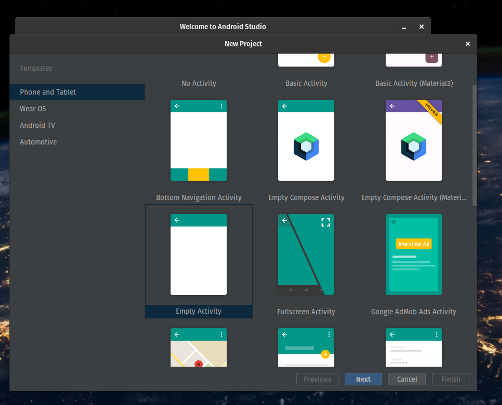
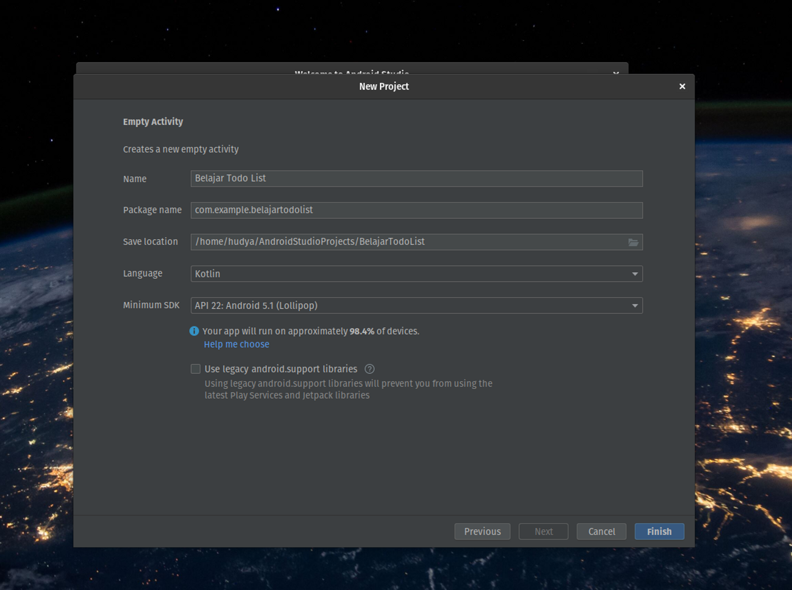
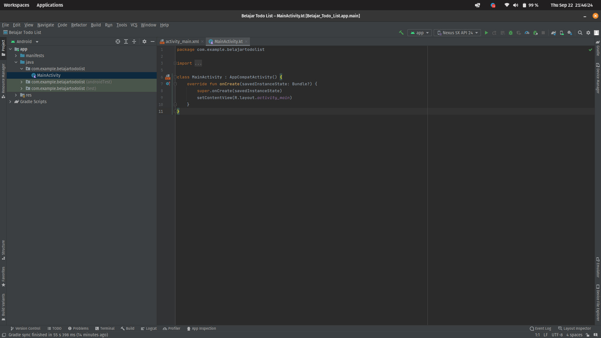
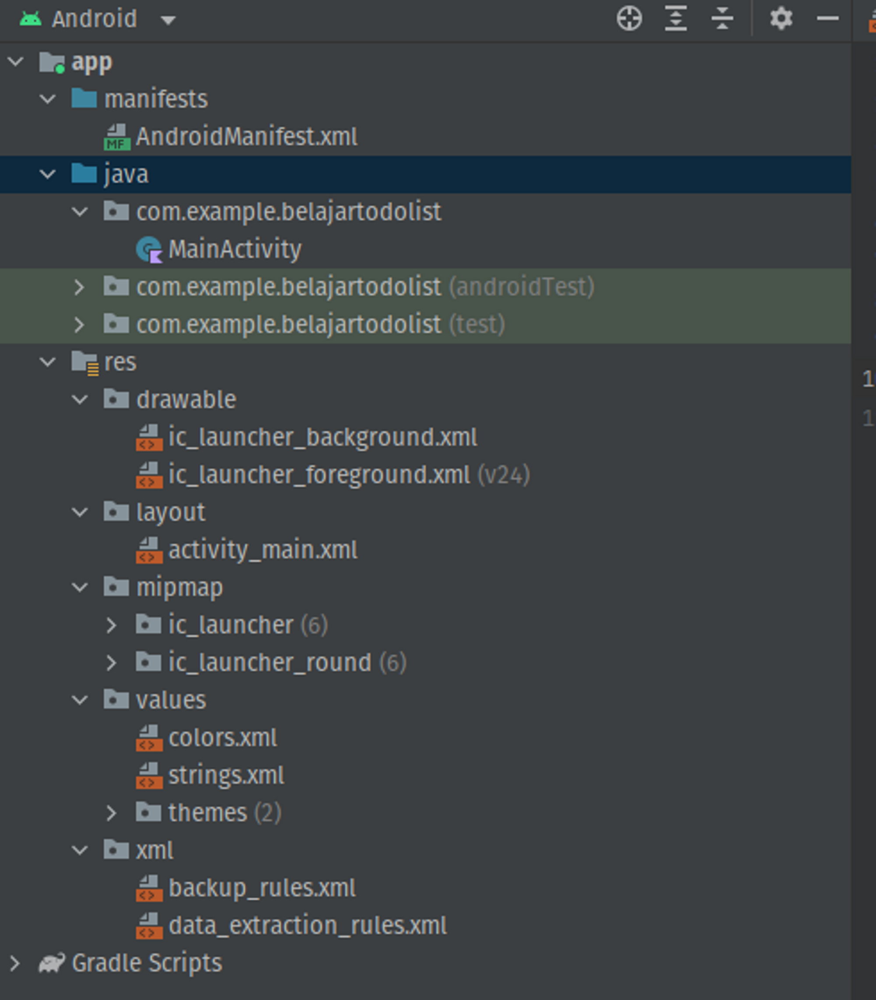
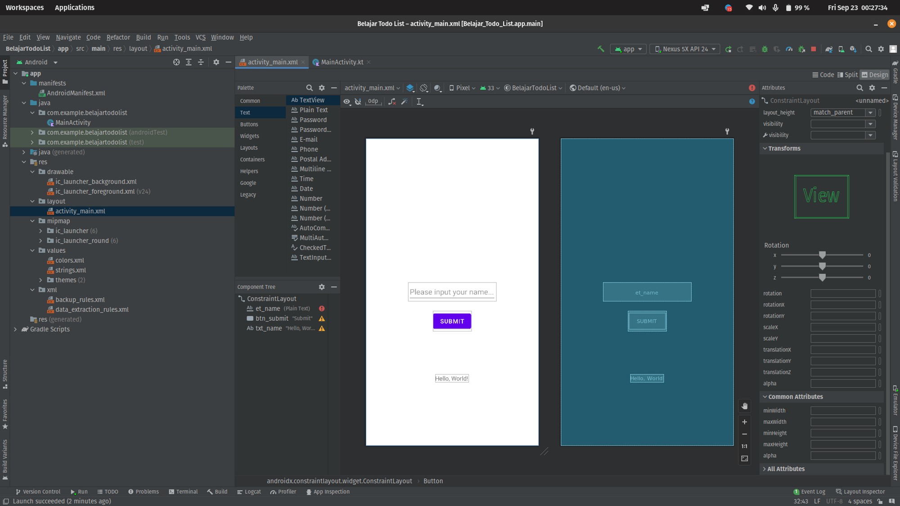
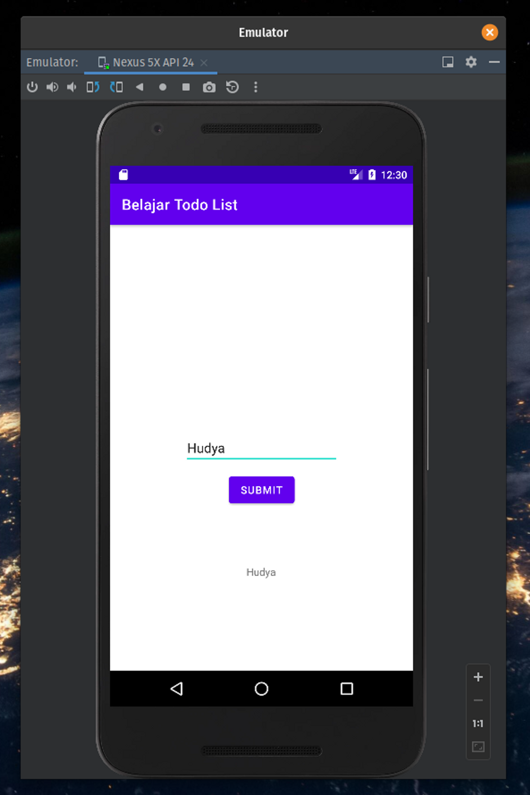
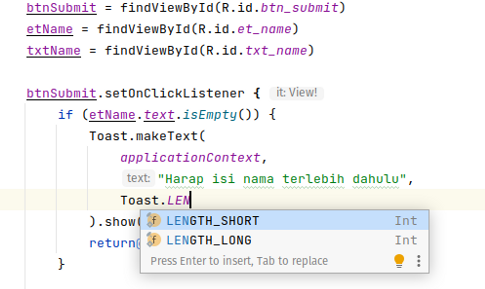
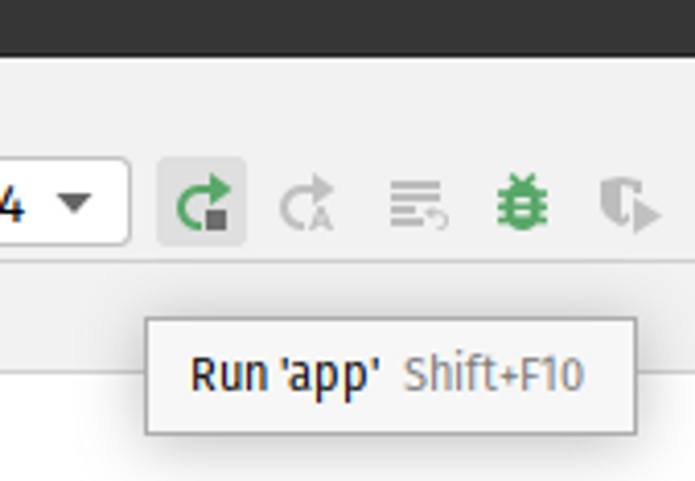
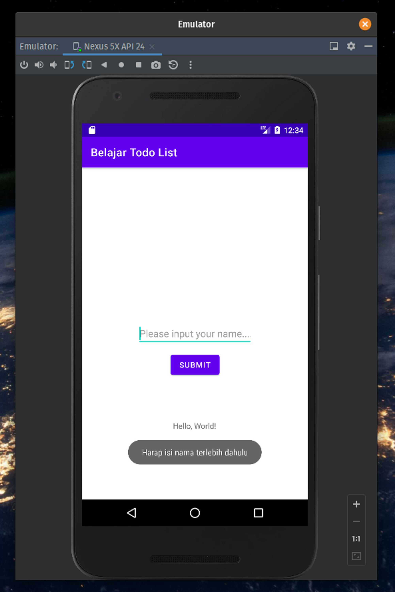

by [@perogeremmer](https://twitter.com/perogeremmer)

## Introduction

Halo semuanya, kalau kalian masuk kesini, saya udah anggap kalian udah menyiapkan semuanya terkait kebutuhan android development kalian ya, kalau belum silahkan cek kebutuhan kalian disini:

1. [Download android studio](https://developer.android.com/studio)
2. [Membuat projek pertama](https://youtu.be/rKnx_zdPyzM)
3. [Menjalankan projek di emulator](https://youtu.be/JCXYtOtRRSs)

Untuk aplikasi android nantinya akan kita bangun menggunakan Native Android dan akan menggunakan Kotlin.

<br />

## Code Time

<br />

Pertama, bikin dulu project androidnya dan pilih yang empty activity.

> [!IMPORTANT]
> Untuk Android Studio versi baru, apabila kamu melihat Empty View Activity, pilih Empty View Activity



Kedua, tulis nama projectnya “Belajar Todo List”



Untuk SDK bebas sih kalian bisa pilih apa aja, tapi saran saya yang rendah aja misalnya lollipop, setelahnya klik finish.

Berikut adalah tampilan awal aplikasi native android yang akan kita bangun.



File `MainActivity.kt` adalah file utama atau bisa kita sebut MainClass kalau di java.

Sekarang kita bedah dulu ges isi struktur foldernya:



- manifests: Informasi seputar aplikasi android kamu.
- Java Package Nama File: Main Activity adalah file utama dari projek kalian.
- res → layout: File tampilan yang akan ditampilkan di mobile

Sekarang buat tampilan agar menjadi seperti ini:



Bagaimana caranya? Cukup drag and drop saja, tapi kita perlu rapihkan kodenya agar kita dapat membuat komponen menyesuaikan letak posisinya, pastikan hasil akhirnya seperti kode dibawah ini:

```xml
<?xml version="1.0" encoding="utf-8"?>
<androidx.constraintlayout.widget.ConstraintLayout xmlns:android="http://schemas.android.com/apk/res/android"
    xmlns:app="http://schemas.android.com/apk/res-auto"
    xmlns:tools="http://schemas.android.com/tools"
    android:layout_width="match_parent"
    android:layout_height="match_parent"
    tools:context=".MainActivity">

    <EditText
        android:id="@+id/et_name"
        android:layout_width="wrap_content"
        android:layout_height="wrap_content"
        android:ems="10"
        android:inputType="textPersonName"
        android:hint="Please input your name...."
        app:layout_constraintBottom_toBottomOf="parent"
        app:layout_constraintEnd_toEndOf="parent"
        app:layout_constraintStart_toStartOf="parent"
        app:layout_constraintTop_toTopOf="parent" />

    <Button
        android:id="@+id/btn_submit"
        android:layout_width="wrap_content"
        android:layout_height="wrap_content"
        android:text="Submit"
        app:layout_constraintBottom_toBottomOf="parent"
        app:layout_constraintEnd_toEndOf="parent"
        app:layout_constraintStart_toStartOf="parent"
        app:layout_constraintTop_toTopOf="@id/et_name"
        app:layout_constraintVertical_bias="0.2" />

    <TextView
        android:id="@+id/txt_name"
        android:layout_width="wrap_content"
        android:layout_height="wrap_content"
        android:text="Hello, World!"
        app:layout_constraintBottom_toBottomOf="parent"
        app:layout_constraintEnd_toEndOf="parent"
        app:layout_constraintStart_toStartOf="parent"
        app:layout_constraintTop_toTopOf="@id/btn_submit"
        />

</androidx.constraintlayout.widget.ConstraintLayout>
```

Pada file tampilan kita membuat tiga komponen yaitu Edit Text, Button, dan sebuah Text View. Jadi pada proyek sederhana pada introduction kita ingin menerima input dari edit text (input) lalu setelah tombol ditekan maka akan muncul pada text view.

<br />

Dapat dilihat pada kode di atas juga masing-masing komponen memiliki id sebagai identitas. Hal ini digunakan pada logic yang akan kita lakukan pada main class nantinya. Selain itu terdapat juga width dan height yang berisi `wrap_content`, artinya bahwa panjang atau tinggi dari masing-masing komponen menyesuaikan isi dari konten tersebut, yang biasa main CSS pastinya nggak asing dengan bentuk seperti ini.

<br />

Lalu ada empat atribut tambahan, yaitu pada bagian contstraint. Kita kan pake constraint layout nih ges, yaitu layout atau tampilan yang membuat kita menjadi lebih fleksibel untuk mendesain isi kontennya, selain itu constraint layout juga mendapat banyak support dari Android itu sendiri. Selain constraint layout ada juga yang namanya linear layout, bedanya adalah linear layout jauh lebih mudah karena setiap komponen akan ditempatkan baris demi baris dari atas ke bawah, namun ini membuat kita menjadi tidak fleksibel.

<br />

pada bagian constraint juga kita dapat mengatur peletakan posisi, seperti contoh text view yang berada pada bagian bawah, sehingga kita harus bilang bahwa bagian atas text view adalah id dari `btn_submit`, sehingga posisi dari text view tersebut berada di bawah.

<br />

Selain itu ada juga vertical bias pada atribut button yang dapat menandakan bahwa ruang pada jarak antar komponen hanya berkisar 0.2 saja. Kalau kita hapus maka jaraknya akan cukup jauh.
<br />

Sekarang ubah kode pada `MainActivity.kt` kalian hingga menjadi seperti ini:

```kotlin
import androidx.appcompat.app.AppCompatActivity
import android.os.Bundle
import android.widget.Button
import android.widget.EditText
import android.widget.TextView

class MainActivity : AppCompatActivity() {

    lateinit var btnSubmit : Button
    lateinit var etName : EditText
    lateinit var txtName : TextView

    override fun onCreate(savedInstanceState: Bundle?) {
        super.onCreate(savedInstanceState)
        setContentView(R.layout.activity_main)

        btnSubmit = findViewById(R.id.btn_submit)
        etName = findViewById(R.id.et_name)
        txtName = findViewById(R.id.txt_name)

        btnSubmit.setOnClickListener {
            txtName.text = etName.text
        }
    }
}
```

> [!NOTE]
> 💡 Copy-nya hati-hati ya! Baca dulu jangan asal copas! SESUAIKAN SAMA CODE KALIAN!

Sekarang pada class MainActivity kita melihat terdapat fungsi onCreate, fungsi ini adalah fungsi yang dijalankan ketika screen tersebut atau class tersebut dijalankan. Ibarat method constructor atau bahkan lifecycle yang bisa kita temui pada framework web seperti React atau Vue yang memiliki method sejenis yaitu mounted atau created.

Pada class ini juga kita membuat tiga variabel awal untuk button, edit text, dan text view. Setelahnya masing-masing variabel tersebut kita sandingkan dengan komponen id dari tampilan yang kita bangun pada `activity_main.xml`, lalu kita buat trigger yaitu ketika button submit ditekan, maka blok kode pada setOnClickListener akan dijalankan.

Hasil akhir apabila dijalankan sebelum dan sesudah namanya di-input:



Sekarang kita akan menambahkan validasi, yaitu berupa pesan toast yang muncul apabila kita tidak mengisi data nama pada edit text.

Ubah sedikit kode pada MainActivity.kt dengan kode berikut:

```kotlin

import androidx.appcompat.app.AppCompatActivity
import android.os.Bundle
import android.widget.Button
import android.widget.EditText
import android.widget.TextView
import android.widget.Toast

class MainActivity : AppCompatActivity() {

    lateinit var btnSubmit : Button
    lateinit var etName : EditText
    lateinit var txtName : TextView

    override fun onCreate(savedInstanceState: Bundle?) {
        super.onCreate(savedInstanceState)
        setContentView(R.layout.activity_main)

        btnSubmit = findViewById(R.id.btn_submit)
        etName = findViewById(R.id.et_name)
        txtName = findViewById(R.id.txt_name)

        btnSubmit.setOnClickListener {
            if (etName.text.isEmpty()) {
                Toast.makeText(
                    applicationContext,
                    "Harap isi nama terlebih dahulu",
                    Toast.LENGTH_SHORT
                ).show()
                return@setOnClickListener
            }

            txtName.text = etName.text
        }
    }
}
```

Kita menambahkan validasi untuk memeriksa jumlah panjang dari edit text name, apabila panjangnya kurang daripada satu karakter, maka akan muncul sebuah pesan.

Menggunakan toast, kita akan membuat semacam pesan yang muncul pada bagian bawah, dan pada fungsi makeText dari toast tersebut membutuhkan 3 parameter, yaitu konteks dari aplikasi, pesan, lalu panjangnya toast.

Kita dapat mengganti `Toast.LENGTH_SHORT` dengan `Toast.LENGTH_LONG`, caranya bagaimana? Cukup tekan CTRL + SPACE ketika menulis `Toast.LEN`. CTRL + SPACE adalah shortcut dari IDE Android Studio untuk membantu kamu menemukan fungsi atau variabel yang ada pada library atau projek kamu, alias mempercepat pekerjaanmu.



Menggunakan validasi, kita menambahkan baris return, mengapa harus di-return? Supaya baris kodenya tidak lanjut ke bagian bawah dan langsung dikembalikan isi dari fungsi tersebut, kalau tidak percaya coba saja komen pada bagian `return@setOnClickListener` lalu jalankan kembali projek kalian menggunakan tombol berikut.



Sekarang coba saja tekan tombol tanpa mengisi apapun, hasilnya akan keluar seperti ini:



Gimana? Mudah kan untuk introduction ke Android, semoga kamu makin semangat belajar ya! 🙂

## Challenge

Bagaimana cara membuat teks pada edit text menjadi kosong sesaat setelah kita merubah text view dengan id txt_name? 

Jawaban ada [disini](./challenge/1-introduction.md).
