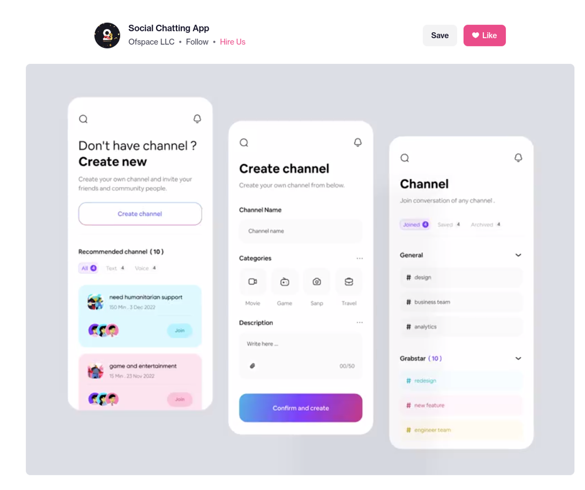
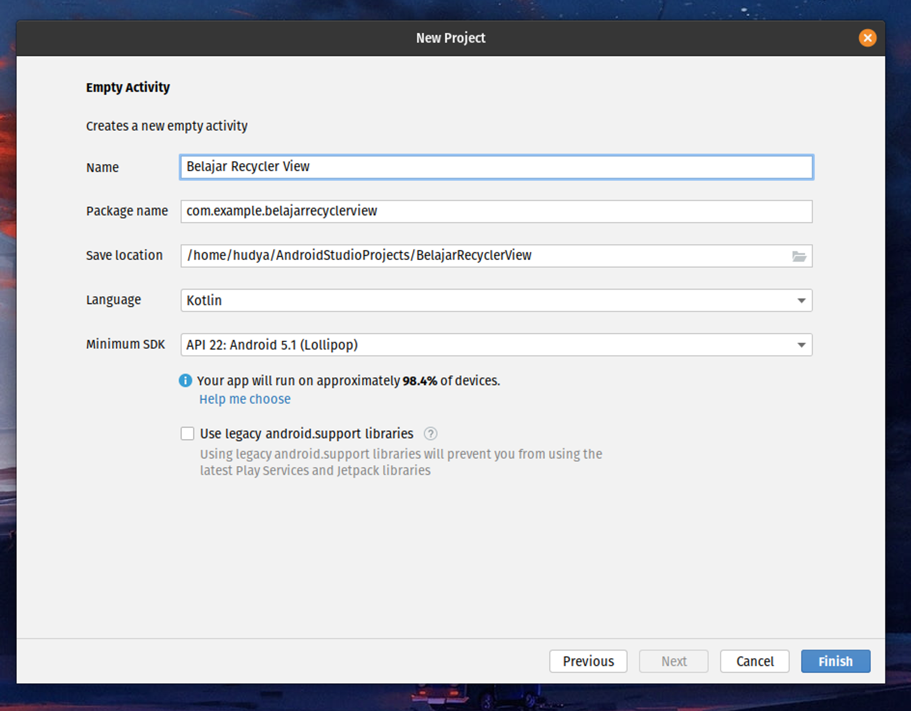
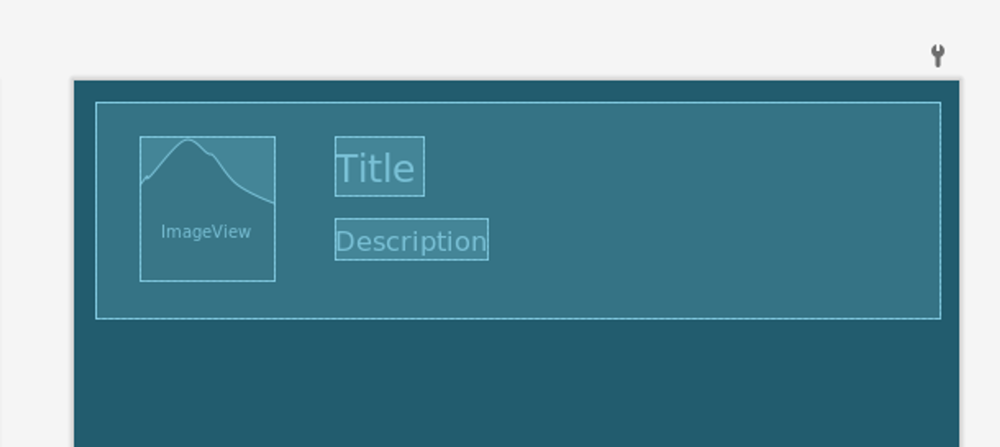
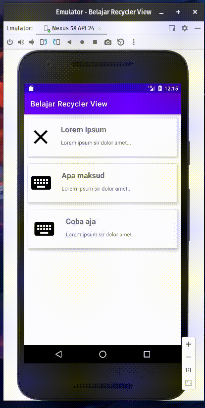

# 9. Membuat Autentikasi

Sebelumnya pada materi [list view](./5-belajar-list-view.md), kamu sudah belajar tentang menampilkan data secara list view. 

Sekarang kita akan membuat tampilan menggunakan Recycler View, dan inilah alasan kenapa Recycler View lebih baik dari List View.

1. Berisi blok kode ViewHolder secara default, A ViewHolder mendeskripsikan tampilan item dan metada mengenai peletakan posisi pada Recycler View.
2. Membuat animasi lebih mudah.
3. Mendukung tampilan horizontal, vertikal, baris dan tampilan yang lebih fleksibel.

Contohnya tampilan ini:



Source: https://dribbble.com/shots/20109265-Social-Chatting-App

Tampilan di atas dapat dibangun menggunakan recycler view. Pada dasarnya Recycler view sama saja seperti List View, bedanya adalah Recycler View agak sedikit ribet namun hal ini wajar karena Recycler View sangatlah fleksibel. Kita bahkan dapat melakukan re-use terhadap view yang kita bangun.

Tutorial ini hanya akan menjelaskan konsep dasar recycler view, apabila kamu butuh disambungkan dengan API, maka gunakan sedikit logicmu.

Pertama, kita akan membuat sebuah projek baru pilih saja tipenya empty activtiy lalu beri saja nama `Belajar Recycler View` .



Setelahnya kita tambahkan dulu dua dependencies utama pada aplikasi kita pada build.gradle (app)

```kotlin
implementation 'androidx.recyclerview:recyclerview:1.2.0'

implementation 'androidx.cardview:cardview:1.0.0'
```

Keseluruhan code akan menjadi seperti ini:

```kotlin
plugins {
    id 'com.android.application'
    id 'org.jetbrains.kotlin.android'
}

android {
    namespace 'com.example.belajarrecyclerview'
    compileSdk 32

    defaultConfig {
        applicationId "com.example.belajarrecyclerview"
        minSdk 22
        targetSdk 32
        versionCode 1
        versionName "1.0"

        testInstrumentationRunner "androidx.test.runner.AndroidJUnitRunner"
    }

    buildTypes {
        release {
            minifyEnabled false
            proguardFiles getDefaultProguardFile('proguard-android-optimize.txt'), 'proguard-rules.pro'
        }
    }

    compileOptions {
        sourceCompatibility JavaVersion.VERSION_1_8
        targetCompatibility JavaVersion.VERSION_1_8
    }
    kotlinOptions {
        jvmTarget = '1.8'
    }
    buildFeatures {
        viewBinding true
    }
}

dependencies {
    implementation 'androidx.recyclerview:recyclerview:1.2.0'

    implementation 'androidx.cardview:cardview:1.0.0'

    implementation 'androidx.core:core-ktx:1.7.0'
    implementation 'androidx.appcompat:appcompat:1.5.1'
    implementation 'com.google.android.material:material:1.7.0'
    implementation 'androidx.constraintlayout:constraintlayout:2.1.4'
    implementation 'androidx.legacy:legacy-support-v4:1.0.0'
    implementation 'androidx.lifecycle:lifecycle-livedata-ktx:2.5.1'
    implementation 'androidx.lifecycle:lifecycle-viewmodel-ktx:2.5.1'
    implementation 'androidx.recyclerview:recyclerview:1.2.1'
    testImplementation 'junit:junit:4.13.2'
    androidTestImplementation 'androidx.test.ext:junit:1.1.4'
    androidTestImplementation 'androidx.test.espresso:espresso-core:3.5.0'
}
```


> [!NOTE]
> ⚠️ Jangan lupa untuk melakukan sync terhadap gradle dengan cara klik File > Sync project with gradle files.

Kita menambahkan dependency recycler view supaya dapat mengakses library recycler view, lalu kita tambahkan card view karena kita ingin membuat tampilan seperti card.

Mari kita rubah tampilan activity_main.xml dengan kode berikut:

```xml
<?xml version="1.0" encoding="utf-8"?>
<LinearLayout
    xmlns:android="http://schemas.android.com/apk/res/android"
    xmlns:tools="http://schemas.android.com/tools"
    android:layout_width="match_parent"
    android:layout_height="match_parent"
    android:orientation="vertical"
    tools:context=".MainActivity">

    <androidx.recyclerview.widget.RecyclerView
        android:id="@+id/recyclerview"
        android:layout_width="match_parent"
        android:layout_height="match_parent"
        tools:itemCount="5"
        tools:listitem="@layout/item_detail" />

</LinearLayout>
```

Sekarang buat file baru bernama DataViewModel dengan kode sebagai berikut:

```kotlin
data class DataViewModel(val image: Int, val title: String, val description: String) {}
```

class DataViewModel ini akan berfungsi sebagai model data yang akan dilempar ke Adapter.

Kemudian buat tampilan baru bernama `item_detail.xml` pada layout dengan cara klik kanan pada folder layout lalu pilih new > layout resource file. Masukkan kode berikut:

```xml
<?xml version="1.0" encoding="utf-8"?>
<androidx.cardview.widget.CardView
    xmlns:android="http://schemas.android.com/apk/res/android"
    xmlns:app="http://schemas.android.com/apk/res-auto"
    xmlns:tools="http://schemas.android.com/tools"
    android:layout_width="match_parent"
    android:layout_height="100dp"
    android:layout_margin="10dp"
    app:cardElevation="6dp">

    <androidx.constraintlayout.widget.ConstraintLayout
        android:layout_width="match_parent"
        android:layout_height="match_parent">

        <ImageView
            android:id="@+id/imageview"
            android:layout_width="62dp"
            android:layout_height="67dp"
            android:layout_marginStart="32dp"
            android:layout_marginEnd="32dp"
            app:layout_constraintBottom_toBottomOf="parent"
            app:layout_constraintEnd_toStartOf="@+id/txt_title"
            app:layout_constraintHorizontal_bias="0.761"
            app:layout_constraintStart_toStartOf="parent"
            app:layout_constraintTop_toTopOf="@+id/txt_title"
            app:layout_constraintVertical_bias="0.0" />

        <TextView
            android:id="@+id/txt_title"
            android:layout_width="wrap_content"
            android:layout_height="wrap_content"
            android:text="Title"
            android:textSize="20sp"
            android:textStyle="bold"
            app:layout_constraintBottom_toBottomOf="parent"
            app:layout_constraintEnd_toEndOf="parent"
            app:layout_constraintHorizontal_bias="0.316"
            app:layout_constraintStart_toStartOf="parent"
            app:layout_constraintTop_toTopOf="parent"
            app:layout_constraintVertical_bias="0.219" />

        <TextView
            android:id="@+id/txt_description"
            android:layout_width="wrap_content"
            android:layout_height="wrap_content"
            android:text="Description"
            app:layout_constraintBottom_toBottomOf="parent"
            app:layout_constraintEnd_toEndOf="parent"
            app:layout_constraintHorizontal_bias="0.0"
            app:layout_constraintStart_toStartOf="@+id/txt_title"
            app:layout_constraintTop_toBottomOf="@+id/txt_title"
            app:layout_constraintVertical_bias="0.289" />

    </androidx.constraintlayout.widget.ConstraintLayout>

</androidx.cardview.widget.CardView>
```

Menggunakan card view dan constraint layout, kita akan membuat tampilan menjadi seperti ini:



Nantinya akan ada image (icon), lalu judul dan deskripsi.

Setelahnya kita buat sebuah Adapter dengan nama `CustomAdapter.kt`, klik kanan pada package kalian lalu pilih new class kotlin. Masukkan kode berikut:

```kotlin
import android.view.LayoutInflater
import android.view.View
import android.view.ViewGroup
import android.widget.ImageView
import android.widget.TextView
import android.widget.Toast
import androidx.recyclerview.widget.RecyclerView

class CustomAdapter(private val mList: List<DataViewModel>) : RecyclerView.Adapter<CustomAdapter.ViewHolder>() {

    override fun onCreateViewHolder(parent: ViewGroup, viewType: Int): ViewHolder {
        val view = LayoutInflater.from(parent.context)
            .inflate(R.layout.item_detail, parent, false)

        return ViewHolder(view)
    }

    override fun onBindViewHolder(holder: ViewHolder, position: Int) {
        val dataModel = mList[position]
        holder.setupView(dataModel.title, dataModel.description, dataModel.image)
    }

    override fun getItemCount(): Int {
        return mList.size
    }

    class ViewHolder(view: View) : RecyclerView.ViewHolder(view) {

        var title : TextView
        var description : TextView
        var image : ImageView

        init {
            title = view.findViewById(R.id.txt_title)
            description = view.findViewById(R.id.txt_description)
            image = view.findViewById(R.id.imageview)
        }

        fun setupView(titleData: String, descriptionData: String, imageData : Int) {
            title.text = titleData
            description.text = descriptionData
            image.setImageResource(imageData)

            itemView.setOnClickListener {
                Toast.makeText(it.context, "Kamu memilih ${titleData}", Toast.LENGTH_SHORT).show()
            }
        }
    }
}
```

Phew, panjang ya? It’s okay, lemme tell you one by one.

```kotlin

    override fun onCreateViewHolder(parent: ViewGroup, viewType: Int): ViewHolder {
        val view = LayoutInflater.from(parent.context)
            .inflate(R.layout.item_detail, parent, false)

        return ViewHolder(view)
    }

```

Bagian ini adalah bagian ketika view holder alias tampilan dari listnya sedang dibangun, kita menggunakan tampilan `item_detail.xml` dengan memasukkannya sebagai tampilan ViewHolder.

```kotlin
override fun onBindViewHolder(holder: ViewHolder, position: Int) {
        val dataModel = mList[position]
        holder.setupView(dataModel.title, dataModel.description, dataModel.image)
    }
```

Ketika seluruh tampilannya sudah muncul, barulah fungsi ini berjalan, `onBindViewHolder` akan menjalankan perintah dari fungsi `setupView` dengan mengisi 3 parameter yang dibutuhkan yaitu title, description, dan image.

```kotlin
// return the number of the items in the list
    override fun getItemCount(): Int {
        return mList.size
    }
```

Tidak perlu dijelaskan lah ya, jelas dari nama fungsinya aja udah ketauan, untuk menghitung jumlah item di dalam ViewHolder.

```kotlin

    class ViewHolder(view: View) : RecyclerView.ViewHolder(view) {

        var title : TextView
        var description : TextView
        var image : ImageView

        init {
            title = view.findViewById(R.id.txt_title)
            description = view.findViewById(R.id.txt_description)
            image = view.findViewById(R.id.imageview)
        }

        fun setupView(titleData: String, descriptionData: String, imageData : Int) {
            title.text = titleData
            description.text = descriptionData
            image.setImageResource(imageData)

            itemView.setOnClickListener {
                Toast.makeText(it.context, "Kamu memilih ${titleData}", Toast.LENGTH_SHORT).show()
            }
        }
    }
```

ViewHolder adalah Inner Class, artinya sebuah class di dalam sebuah class. Disini, ViewHolder berfungsi sebagai custom view holder, artinya kita mengubah fungsi dasar ViewHolder agar dapat digabungkan dengan logic yang kita butuhkan. Disini kurang lebih sama seperti kode onCreate yang kita lakukan, yaitu melakukan inisiasi terhadap objek, melakukan set objek terhadap id di xml dan mempunyai fungsi setupView, yang mana fungsi setupView ini akan mengisi masing-masing nilai di dalam objek dan membuat fungsi setOnClickListener apabila card ditekan.

ViewHolder custom ini dibuat karena apabila code kita tempel pada OnBindViewHolder secara langsung akan mempengaruhi performa aplikasi itu sendiri.

Sekarang kita ubah fungsi MainActivity dengan kode berikut:

```kotlin
import androidx.appcompat.app.AppCompatActivity
import android.os.Bundle
import androidx.recyclerview.widget.LinearLayoutManager
import androidx.recyclerview.widget.RecyclerView

class MainActivity : AppCompatActivity() {
    override fun onCreate(savedInstanceState: Bundle?) {
        super.onCreate(savedInstanceState)
        setContentView(R.layout.activity_main)

        val recyclerview = findViewById<RecyclerView>(R.id.recyclerview)
        recyclerview.layoutManager = LinearLayoutManager(this)

        val data = ArrayList<DataViewModel>()

        data.add(DataViewModel(com.google.android.material.R.drawable.ic_m3_chip_close, "Lorem ipsum", "Lorem ipsum sir dolor amet..."))
        data.add(DataViewModel(com.google.android.material.R.drawable.ic_keyboard_black_24dp, "Apa maksud", "Lorem ipsum sir dolor amet..."))
        data.add(DataViewModel(com.google.android.material.R.drawable.ic_keyboard_black_24dp, "Coba aja", "Lorem ipsum sir dolor amet..."))

        val adapter = CustomAdapter(data)
        recyclerview.adapter = adapter
    }
}
```

Untuk kode MainActivity, kita hanya memanggil recyclerview saja dan kita set layoutManagernya menjadi LinearLayoutmanager. Kita dapat membuat LinearLayoutManager menjadi horizontal dengan menambahkan config untuk membuat Layout menjadi horizontal.

Sekarang jalankan dan lihat hasil akhirnya:

