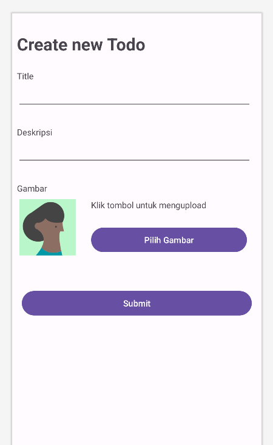
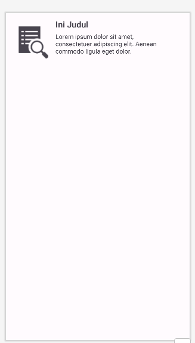
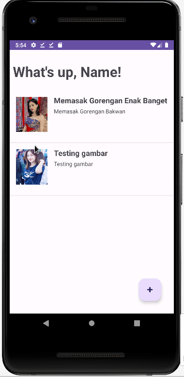

# 11. Upload gambar dengan Base64

Menggunakan projek yang ada pada [9 - membuat autentikasi](./9-membuat-autentikasi.md), kita akan mencoba mengupload gambar dengan Base64.

Pertama, kita perlu mengubah file `activity_create_todo.xml` agar menjadi seperti ini.



```xml
<?xml version="1.0" encoding="utf-8"?>
<androidx.constraintlayout.widget.ConstraintLayout xmlns:android="http://schemas.android.com/apk/res/android"
    xmlns:app="http://schemas.android.com/apk/res-auto"
    xmlns:tools="http://schemas.android.com/tools"
    android:layout_width="match_parent"
    android:layout_height="match_parent"
    tools:context=".CreateTodoActivity">

    <TextView
        android:id="@+id/label_header"
        android:layout_width="wrap_content"
        android:layout_height="wrap_content"
        android:layout_marginStart="8dp"
        android:layout_marginTop="24dp"
        android:text="Create new Todo"
        android:textSize="28dp"
        android:textStyle="bold"
        app:layout_constraintBottom_toBottomOf="parent"
        app:layout_constraintEnd_toEndOf="parent"
        app:layout_constraintHorizontal_bias="0.0"
        app:layout_constraintStart_toStartOf="parent"
        app:layout_constraintTop_toTopOf="parent"
        app:layout_constraintVertical_bias="0.011" />

    <TextView
        android:id="@+id/label_title"
        android:layout_width="wrap_content"
        android:layout_height="wrap_content"
        android:layout_marginTop="24dp"
        android:text="Title"
        app:layout_constraintStart_toStartOf="@+id/label_header"
        app:layout_constraintTop_toBottomOf="@+id/label_header" />

    <EditText
        android:id="@+id/et_title"
        android:layout_width="0dp"
        android:layout_height="wrap_content"
        android:layout_marginEnd="16dp"
        android:ems="10"
        android:inputType="text"
        android:text=""
        app:layout_constraintEnd_toEndOf="parent"
        app:layout_constraintStart_toStartOf="@+id/label_title"
        app:layout_constraintTop_toBottomOf="@+id/label_title" />

    <TextView
        android:id="@+id/label_desc"
        android:layout_width="wrap_content"
        android:layout_height="wrap_content"
        android:layout_marginTop="28dp"
        android:text="Deskripsi"
        app:layout_constraintStart_toStartOf="@+id/et_title"
        app:layout_constraintTop_toBottomOf="@+id/et_title" />

    <EditText
        android:id="@+id/et_description"
        android:layout_width="0dp"
        android:layout_height="wrap_content"
        android:layout_marginEnd="16dp"
        android:ems="10"
        android:gravity="start|top"
        android:inputType="textMultiLine"
        app:layout_constraintEnd_toEndOf="parent"
        app:layout_constraintStart_toStartOf="@+id/label_desc"
        app:layout_constraintTop_toBottomOf="@+id/label_desc" />

    <Button
        android:id="@+id/btn_submit"
        android:layout_width="0dp"
        android:layout_height="wrap_content"
        android:layout_marginStart="16dp"
        android:layout_marginEnd="16dp"
        android:text="Submit"
        app:layout_constraintBottom_toBottomOf="parent"
        app:layout_constraintEnd_toEndOf="parent"
        app:layout_constraintHorizontal_bias="0.0"
        app:layout_constraintStart_toStartOf="parent"
        app:layout_constraintTop_toBottomOf="@+id/img_todo"
        app:layout_constraintVertical_bias="0.193" />

    <Button
        android:id="@+id/btn_image"
        android:layout_width="0dp"
        android:layout_height="wrap_content"
        android:layout_marginTop="24dp"
        android:layout_marginEnd="24dp"
        android:text="Pilih Gambar"
        app:layout_constraintEnd_toEndOf="parent"
        app:layout_constraintHorizontal_bias="0.0"
        app:layout_constraintStart_toStartOf="@+id/txt_nama_gambar"
        app:layout_constraintTop_toBottomOf="@+id/txt_nama_gambar" />

    <ImageView
        android:id="@+id/img_todo"
        android:layout_width="104dp"
        android:layout_height="93dp"
        android:layout_marginStart="6dp"
        android:layout_marginTop="8dp"
        app:layout_constraintStart_toStartOf="parent"
        app:layout_constraintTop_toBottomOf="@+id/txt_gambar"
        tools:srcCompat="@tools:sample/avatars" />

    <androidx.appcompat.widget.AppCompatImageView
        android:id="@+id/selected_image"
        android:layout_width="match_parent"
        android:layout_height="wrap_content"
        app:layout_constraintStart_toStartOf="parent"
        app:layout_constraintTop_toBottomOf="@+id/txt_gambar"
        android:layout_margin="16dp"
        android:adjustViewBounds="true" />

    <TextView
        android:id="@+id/txt_gambar"
        android:layout_width="wrap_content"
        android:layout_height="wrap_content"
        android:layout_marginTop="28dp"
        android:text="Gambar"
        app:layout_constraintEnd_toEndOf="parent"
        app:layout_constraintHorizontal_bias="0.022"
        app:layout_constraintStart_toStartOf="parent"
        app:layout_constraintTop_toBottomOf="@+id/et_description" />

    <TextView
        android:id="@+id/txt_nama_gambar"
        android:layout_width="wrap_content"
        android:layout_height="wrap_content"
        android:layout_marginStart="20dp"
        android:layout_marginTop="8dp"
        android:text="Klik tombol untuk mengupload"
        app:layout_constraintStart_toEndOf="@+id/img_todo"
        app:layout_constraintTop_toBottomOf="@+id/txt_gambar" />

</androidx.constraintlayout.widget.ConstraintLayout>
```

Sekarang kita perlu menambahkan beberapa kode.

Pertama, buat fungsi untuk mengupload gambar dan merubahnya ke Base64. Tambahkan kode berikut pada `CreateTodoActivity.kt`.

```kotlin
private val changeImage =
    registerForActivityResult(
        ActivityResultContracts.StartActivityForResult()
    ) {
        if (it.resultCode == Activity.RESULT_OK) {
            val data = it.data
            val imgUri = data?.data
            thumbnail.setImageURI(imgUri)

            // Membuat Bitmap dari Uri
            val bitmap = MediaStore.Images.Media.getBitmap(contentResolver, imgUri)

            // Mengkonversi Bitmap menjadi base64
            val base64String = convertToBase64(bitmap)
            thumbnailImage = base64String
        }
    }

fun convertToBase64(bitmap: Bitmap): String {
    val outputStream = ByteArrayOutputStream()
    bitmap.compress(Bitmap.CompressFormat.PNG, 100, outputStream)
    val byteArray = outputStream.toByteArray()
    return Base64.encodeToString(byteArray, Base64.DEFAULT)
}
```


Kedua, kita menambahkan fungsi pada saat tombol untuk menambahkan gambar ditekan:

```kotlin
btnImage.setOnClickListener {
    val pickImg = Intent(Intent.ACTION_PICK, MediaStore.Images.Media.INTERNAL_CONTENT_URI)
    changeImage.launch(pickImg)
}
```

> [!NOTE]
> Jangan lupa untuk melakukan import terhadap library yang dibutuhkan

<br />

Selanjutnya, kita perlu merubah pada saat data dibuat:

```kotlin
var todoModel = TodoModel(
    Title = etTitle.text.toString(),
    Description = etDescription.text.toString(),
    Image = thumbnailImage
)
this.create(todoModel)
```

Terakhir, file `TodoModel.kt` juga perlu diubah agar menjadi seperti ini:
```kotlin
data class TodoModel(
    val Id: String? = null,
    val Title: String? = null,
    val Description: String? = null,
    val Image: String? = null,
)
```


---

<br />

Sekarang pergi ke todo_item.xml lalu ubah agar tampilan berubah dengan kode berikut:

```xml
<?xml version="1.0" encoding="utf-8"?>
<androidx.constraintlayout.widget.ConstraintLayout xmlns:android="http://schemas.android.com/apk/res/android"
    xmlns:app="http://schemas.android.com/apk/res-auto"
    xmlns:tools="http://schemas.android.com/tools"
    android:orientation="vertical"
    android:layout_width="match_parent"
    android:layout_height="wrap_content">


    <TextView
        android:id="@+id/txt_title"
        android:layout_width="wrap_content"
        android:layout_height="wrap_content"
        android:layout_marginStart="16dp"
        android:layout_marginTop="12dp"
        android:text="Ini Judul"
        android:textSize="19dp"
        android:textStyle="bold"
        app:layout_constraintStart_toEndOf="@+id/img_thumbnail"
        app:layout_constraintTop_toTopOf="parent" />

    <TextView
        android:id="@+id/txt_description"
        android:layout_width="253dp"
        android:layout_height="58dp"
        android:layout_marginVertical="30dp"
        android:text="Lorem ipsum dolor sit amet, consectetuer adipiscing elit. Aenean commodo ligula eget dolor."
        app:layout_constraintBottom_toBottomOf="parent"
        app:layout_constraintEnd_toEndOf="parent"
        app:layout_constraintHorizontal_bias="0.0"
        app:layout_constraintStart_toStartOf="@+id/txt_title"
        app:layout_constraintTop_toTopOf="@+id/txt_title"
        app:layout_constraintVertical_bias="0.983" />

    <ImageView
        android:id="@+id/img_thumbnail"
        android:layout_width="79dp"
        android:layout_height="88dp"
        android:layout_marginStart="16dp"
        android:layout_marginTop="16dp"
        app:layout_constraintStart_toStartOf="parent"
        app:layout_constraintTop_toTopOf="parent"
        app:srcCompat="?android:attr/actionModeFindDrawable"
        android:scaleType="centerCrop"
        />
</androidx.constraintlayout.widget.ConstraintLayout>
```

Nantinya akan ada gambar seperti ini:



Sekarang kita ubah dulu pada bagian TodoAdapter.kt agar dapat merender gambarnya:
```kotlin

class TodoAdapter (var ctx: Context, var resource: Int, var item: ArrayList<TodoModel>): ArrayAdapter<TodoModel>(ctx, resource, item) {

    override fun getView(position: Int, convertView: View?, parent: ViewGroup): View {
        val layoutInflater = LayoutInflater.from(ctx)
        val view = layoutInflater.inflate(resource, null)

        val title = view.findViewById<TextView>(R.id.txt_title)
        val description = view.findViewById<TextView>(R.id.txt_description)
        val thumbnail = view.findViewById<ImageView>(R.id.img_thumbnail)

        title.text = item[position].Title
        description.text = item[position].Description

        val image = item[position].Image
        if (image != null) {
            val base64String = image.toString()
            if (base64String != "null") {
                val bitmap = convertToBitmap(base64String)
                thumbnail.setImageBitmap(bitmap)
            }
        }

        return view
    }

    fun convertToBitmap(base64String: String): Bitmap {
        val decodedBytes = Base64.decode(base64String, Base64.DEFAULT)
        return BitmapFactory.decodeByteArray(decodedBytes, 0, decodedBytes.size)
    }
}
```

> [!NOTE]
> Jangan lupa import file yang diperlukan!


---

<br />

Sekarang pergilah ke MainActivty lalu ubah kode pada method `getData` dengan kode berikut:

```kotlin
fun getData() {
    val db = Firebase.firestore
    db.collection("todo")
        .get()
        .addOnSuccessListener { result ->
            val Items = ArrayList<TodoModel>()
    
            for (document in result) {
                Log.d(TAG, "${document.id} => ${document.data}")
                Items.add(
                    TodoModel(
                        document.id.toString(),
                        document.data.get("title").toString(),
                        document.data.get("description").toString(),
                        document.data.get("image").toString()
                    )
                )
            }
    
            val adapter = TodoAdapter(this, R.layout.todo_item, Items)
            listTodo.adapter = adapter
        }
        .addOnFailureListener { exception ->
            Log.w(TAG, "Error getting documents.", exception)
        }
    }
```

Kita juga perlu mengubah pada saat gambar ditekan, agar kita simpan pada shared preference sebagai **temporary** data agar menampilkan gambar pada halaman detail pada saat ingin melakukan perubahan data.

```kotlin
listTodo.setOnItemClickListener { adapterView, view, position, id ->
    val item = adapterView.getItemAtPosition(position) as TodoModel

    val intent = Intent(this, CreateTodoActivity::class.java)
    intent.putExtra("id", item.Id.toString())
    intent.putExtra("title", item.Title.toString())
    intent.putExtra("description", item.Description.toString())

    // Menyimpan ke SharedPreferences
    val sharedPref = getSharedPreferences("tmp_data", Context.MODE_PRIVATE)
    with (sharedPref.edit()) {
        putString("tmp_image", item.Image.toString())
        apply()
    }

    startActivity(intent)
}
```

> [!NOTE]
> Btw kita pake shared preference ini karena data base64 terlalu besar untuk dibawakan melalui Intent.

Sekarang kembali ke CreateTodoActivity.kt agar pada saat melakukan edit, bisa menampilkan gambar:

```kotlin
if (!id.isNullOrBlank()) {
    editMode = true
    var title = intent.getStringExtra("title").toString()
    labelHeader.setText("Ubah Todo: $title")
    etTitle.setText(title)
    etDescription.setText(intent.getStringExtra("description").toString())

    val sharedPref = getSharedPreferences("tmp_data", Context.MODE_PRIVATE)
    var base64String = sharedPref.getString("tmp_image", "")
    base64String = base64String.toString()

    if (base64String != "null" && base64String.isNotEmpty()) {
        val bitmap = convertToBitmap(base64String)
        thumbnail.setImageBitmap(bitmap)
    }

}
```

Tambahkan juga method berikut pada bagian bawah kode:

```kotlin
fun convertToBitmap(base64String: String): Bitmap {
    val decodedBytes = Base64.decode(base64String, Base64.DEFAULT)
    return BitmapFactory.decodeByteArray(decodedBytes, 0, decodedBytes.size)
}
```

Agar hasilnya lebih smooth kita bisa memberikan jeda seolah-olah aplikasinya sedang bekerja dengan class `Timer`.

Hasilnya adalah sebagai berikut:

