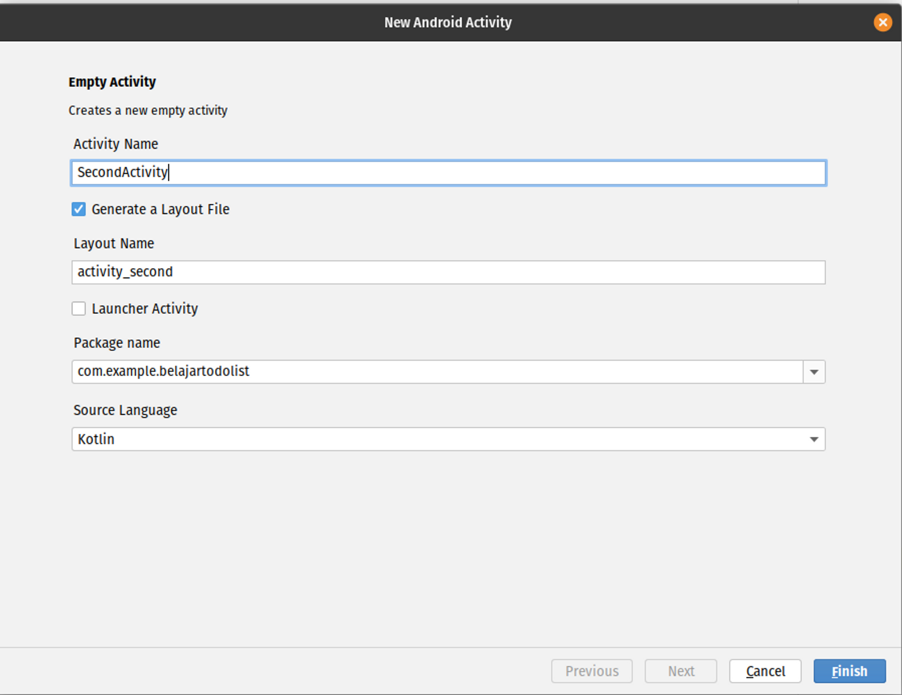
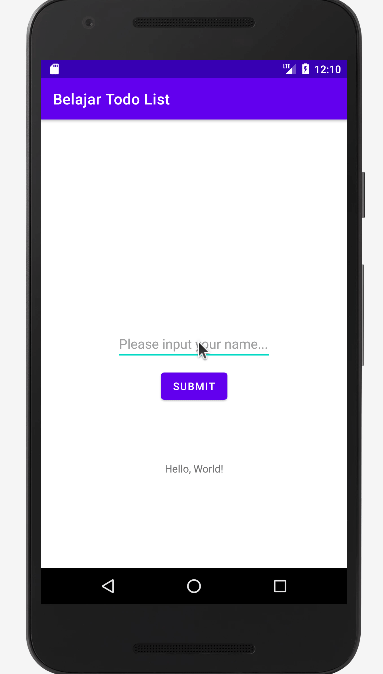

by [@perogeremmer](https://twitter.com/perogeremmer)

## Introduction

Pada tutorial sebelumnya kita sudah berkenalan dengan setOnClick Listener, sekarang bagaimana kalau kita membuat layar baru untuk berpindah?

<br />

## Code Time

<br />

Pertama kita perlu membuat activity baru, perhatikan gambar berikut:


Sekarang isi saja activity yang akan kita buat dengan data berikut:



Dengan membuat activity baru, kita otomatis mendapat dua file baru yaitu class `SecondActivity.kt` dan file `activity_second.xml`.

Sekarang kita ubah file `activity_second.xml` dengan kode berikut:

```xml
<?xml version="1.0" encoding="utf-8"?>
<androidx.constraintlayout.widget.ConstraintLayout xmlns:android="http://schemas.android.com/apk/res/android"
    xmlns:app="http://schemas.android.com/apk/res-auto"
    xmlns:tools="http://schemas.android.com/tools"
    android:layout_width="match_parent"
    android:layout_height="match_parent"
    tools:context=".SecondActivity">

    <TextView
        android:id="@+id/txt_result"
        android:layout_width="wrap_content"
        android:layout_height="wrap_content"
        android:text="TextView"
        app:layout_constraintBottom_toBottomOf="parent"
        app:layout_constraintEnd_toEndOf="parent"
        app:layout_constraintStart_toStartOf="parent"
        app:layout_constraintTop_toTopOf="parent"
    />

</androidx.constraintlayout.widget.ConstraintLayout>
```

Kira-kira tampilannya akan menjadi seperti ini, sederhana sekali hanya butuh text view.


Sekarang kita ubah file `SecondActivity.kt` dengan kode berikut:

```kotlin
import android.content.Intent
import androidx.appcompat.app.AppCompatActivity
import android.os.Bundle
import android.widget.TextView

class SecondActivity : AppCompatActivity() {
    lateinit var txtResult : TextView

    override fun onCreate(savedInstanceState: Bundle?) {
        super.onCreate(savedInstanceState)
        setContentView(R.layout.activity_second)

        txtResult = findViewById(R.id.txt_result)

        var result = intent.getStringExtra("result")
        txtResult.text = result
    }
}
```

Pada file SecondActivity.kt method onCreate kita mengambil data intent yaitu data yang dilempar antar activity berupa String dengan atribut name result, setelahnya text view resultnya kita isi dengan data dari intent tersebut.

Terakhir, kita ubah `MainActivity.kt` dengan kode berikut:

```kotlin
import android.content.Intent
import androidx.appcompat.app.AppCompatActivity
import android.os.Bundle
import android.widget.Button
import android.widget.EditText
import android.widget.TextView
import android.widget.Toast

class MainActivity : AppCompatActivity() {

    lateinit var btnSubmit : Button
    lateinit var etName : EditText
    lateinit var txtName : TextView

    override fun onCreate(savedInstanceState: Bundle?) {
        super.onCreate(savedInstanceState)
        setContentView(R.layout.activity_main)

        btnSubmit = findViewById(R.id.btn_submit)
        etName = findViewById(R.id.et_name)
        txtName = findViewById(R.id.txt_name)

        btnSubmit.setOnClickListener {
            if (etName.text.isEmpty()) {
                Toast.makeText(
                    applicationContext,
                    "Harap isi nama terlebih dahulu",
                    Toast.LENGTH_SHORT
                ).show()
                return@setOnClickListener
            }

            val intent = Intent(this, SecondActivity::class.java)
            intent.putExtra("result", etName.text.toString())
            startActivity(intent)
        }
    }
}
```

Pada kode `MainActivity.kt` dapat kita lihat bahwa kita memanggil class Intent dengan dua parameter, yaitu this (class yang sedang kita akses) dengan parameter kedua yaitu activity class dari target yang mana targetnya adalah `SecondActivity.kt`.

Kemudian kita memanggil fungsi `putExtra` dengan parameter pertama teks `result` sebagai key dari data yang dilempar dan parameter kedua nilai dari edit text name. 

Terakhir kita panggil fungsi `startActivity` dengan parameter data intent tersebut.

Sekarang kita coba deh hasilnya adalah sebagai berikut:


Result

## Challenge

Sekarang coba buat hasilnya supaya ketika dia kembali ke halaman sebelumnya, edit text atau inputnya menjadi kosong.

Expected Result:



> [!NOTE]
> 💡 Kata kunci browsing
> 1.  Activity Lifecycle Kotlin
> 2. Keyword Google “kotlin function after back from second activity”
