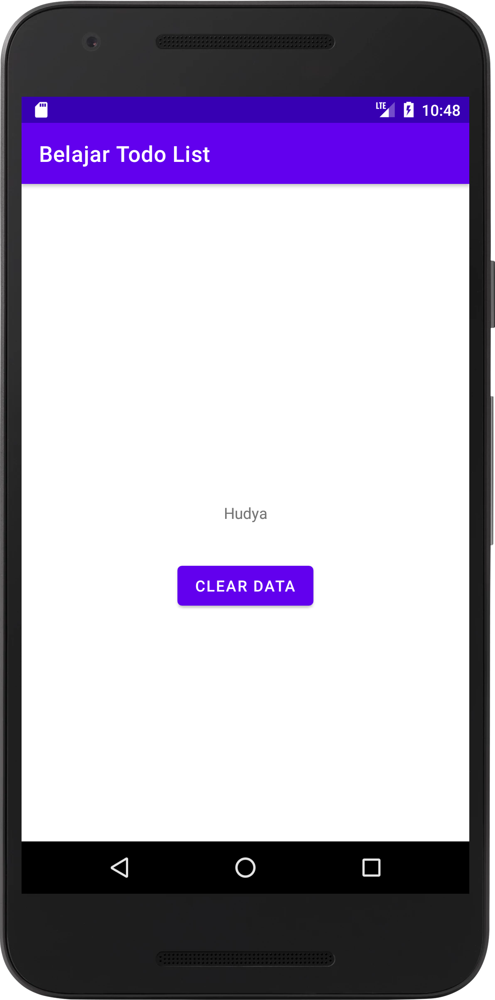
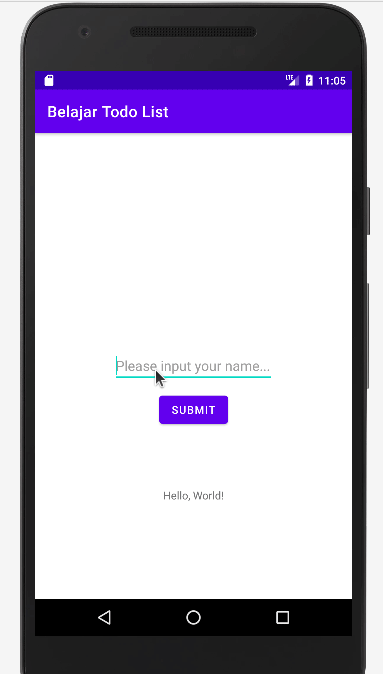
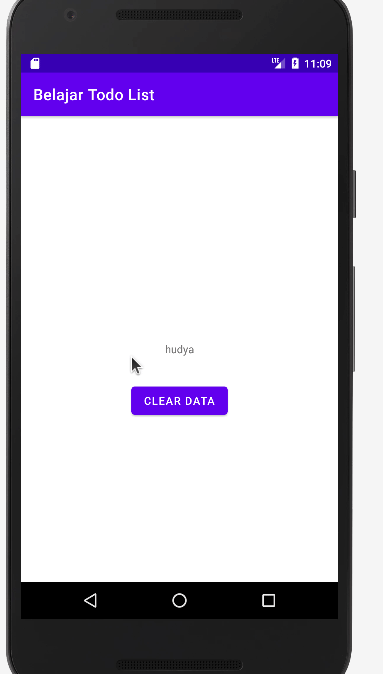
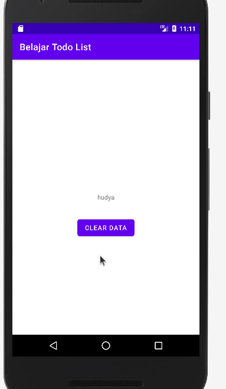

by [@perogeremmer](https://twitter.com/perogeremmer)

## Introduction

Pada materi kali ini kita akan membahas cara membuat sesi di Android. Apa itu sesi? Sesi adalah sebuah penanda pada sistem dimana kita menyimpan sebuah nilai di dalamnya.

Contohnya adalah, apabila kita masuk ke dalam ruang ujian pada saat ujian, maka kita dapat dikatakan memiliki sesi pada ujian. Apabila sesi tersebut sudah habis kita boleh meninggalkan ruang ujian.

Hal ini juga berlaku pada Android, kita dapat membuat sebuah sesi dimana apabila pengguna telah berhasil melakukan login dan telah masuk ke beranda, maka dia tidak dapat menekan tombol kembali ke halaman login.

<br />

## Code Time

<br />

Masih menggunakan proyek yang kemarin ya, pertama, kita tambahkan sebuah tombol clear data pada `activity_second.xml` melalui kode berikut:

```xml
<?xml version="1.0" encoding="utf-8"?>
<androidx.constraintlayout.widget.ConstraintLayout xmlns:android="http://schemas.android.com/apk/res/android"
    xmlns:app="http://schemas.android.com/apk/res-auto"
    xmlns:tools="http://schemas.android.com/tools"
    android:layout_width="match_parent"
    android:layout_height="match_parent"
    tools:context=".SecondActivity">

    <TextView
        android:id="@+id/txt_result"
        android:layout_width="wrap_content"
        android:layout_height="wrap_content"
        android:text="TextView"
        app:layout_constraintBottom_toBottomOf="parent"
        app:layout_constraintEnd_toEndOf="parent"
        app:layout_constraintStart_toStartOf="parent"
        app:layout_constraintTop_toTopOf="parent"
    />

    <Button
        android:id="@+id/btn_clear"
        android:layout_width="wrap_content"
        android:layout_height="wrap_content"
        android:text="Clear Data"
        app:layout_constraintVertical_bias="0.2"
        tools:layout_editor_absoluteX="154dp"
        tools:layout_editor_absoluteY="419dp"
        app:layout_constraintBottom_toBottomOf="parent"
        app:layout_constraintEnd_toEndOf="parent"
        app:layout_constraintStart_toStartOf="parent"
        app:layout_constraintTop_toTopOf="@id/txt_result"
        />

</androidx.constraintlayout.widget.ConstraintLayout>
```

<br />

Kurang lebih hasil dari tampilannya akan menjadi seperti ini:




<br />

Sekarang kita ubah terlebih dahulu file `MainActivity.kt` pada bagian setOnClickListener dengan kode berikut:

```kotlin
................
................

		btnSubmit.setOnClickListener {
            if (etName.text.isEmpty()) {
                Toast.makeText(
                    applicationContext,
                    "Harap isi nama terlebih dahulu",
                    Toast.LENGTH_SHORT
                ).show()
                return@setOnClickListener
            }

            var name = etName.text.toString()

            val sharedPreference =  getSharedPreferences(
                "app_preference", Context.MODE_PRIVATE
            )

            var editor = sharedPreference.edit()
            editor.putString("name", name)
            editor.commit()

            val intent = Intent(this, SecondActivity::class.java)
            intent.putExtra("result", name)
            startActivity(intent)
        }
```

<br />

Dapat dilihat dari kode di atas, kita menggunakan fungsi `getSharedPereferences` dengan nama preferences `app_preference` lalu menggunakan konteks mode `private`, yang artinya shared preferences ini hanya bisa diakses oleh aplikasi kita dan tidak dapat diakses oleh aplikasi lain.

Fungsi `putString` pada variabel editor membuat kita dapat menulis sesi berdasarkan key atau atribut yang kita tulis.

Terakhir, panggil fungsi `commit` untuk menyimpan data tersebut.

Sekarang ubah isi file `SecondActivity.kt` pada method `onCreate` dengan code berikut:

```kotlin
override fun onCreate(savedInstanceState: Bundle?) {
    super.onCreate(savedInstanceState)
    setContentView(R.layout.activity_second)

    txtResult = findViewById(R.id.txt_result)
    btnClear = findViewById(R.id.btn_clear)

    var result = intent.getStringExtra("result")
    txtResult.text = result

    btnClear.setOnClickListener {
        val sharedPreference =  getSharedPreferences(
            "app_preference", Context.MODE_PRIVATE
        )

        var editor = sharedPreference.edit()
        editor.clear()
        editor.remove("name")
        editor.commit()

        Toast.makeText(
            applicationContext,
            "Sesi berhasil dihapus!",
            Toast.LENGTH_SHORT
        ).show()
    }
}
```

Karena kita sudah menambahkan button clear data, maka apabila di-klik kita akan menghapus sesi yang sudah kita simpan. Setelahnya akan mengeluarkan toast message “Sesi berhasil dihapus”.

Masih pada file yang sama, sekarang buat fungsi baru bernama `onBackPressed` lalu tuliskan kode berikut:

```kotlin
override fun onBackPressed() {
    val sharedPreference =  getSharedPreferences(
        "app_preference", Context.MODE_PRIVATE
    )

    var name = sharedPreference.getString("name", "").toString()

    if (name.isEmpty()) {
        super.onBackPressed()
        return
    }

    Toast.makeText(
        applicationContext,
        "Kamu masih memiliki sesi, harap hapus data terlebih dahulu!",
        Toast.LENGTH_SHORT
    ).show()
}
```

Pada method `onBackPressed` kita memeriksa apakah sesi name pada shared preference telah diisi. Apabila kosong maka kita izinkan tombol back ditekan, namun apabila sesi dengan key name tidak kosong, maka tampilkan toast message.

```kotlin
import android.content.Context
import androidx.appcompat.app.AppCompatActivity
import android.os.Bundle
import android.widget.Button
import android.widget.TextView
import android.widget.Toast

class SecondActivity : AppCompatActivity() {
    lateinit var txtResult : TextView
    lateinit var btnClear : Button

    override fun onCreate(savedInstanceState: Bundle?) {
        super.onCreate(savedInstanceState)
        setContentView(R.layout.activity_second)

        txtResult = findViewById(R.id.txt_result)
        btnClear = findViewById(R.id.btn_clear)

        var result = intent.getStringExtra("result")
        txtResult.text = result

        btnClear.setOnClickListener {
            val sharedPreference =  getSharedPreferences(
                "app_preference", Context.MODE_PRIVATE
            )

            var editor = sharedPreference.edit()
            editor.clear()
            editor.remove("name")
            editor.commit()

            Toast.makeText(
                applicationContext,
                "Sesi berhasil dihapus!",
                Toast.LENGTH_SHORT
            ).show()
        }
    }

    override fun onBackPressed() {
        val sharedPreference =  getSharedPreferences(
            "app_preference", Context.MODE_PRIVATE
        )

        var name = sharedPreference.getString("name", "").toString()

        if (name.isEmpty()) {
            super.onBackPressed()
            return
        }

        Toast.makeText(
            applicationContext,
            "Kamu masih memiliki sesi, harap hapus data terlebih dahulu!",
            Toast.LENGTH_SHORT
        ).show()
    }
}
```

Hasil akhirnya akan seperti ini:




## Challenge

Sekarang kita tidak dapat kembali sebelum menghapus data, ada tantangan untukmu, bagaimana cara mendisable button clear data sesaat setelah dihapus. Mengapa seperti itu? Agar tidak ditekan berkali-kali seperti ini:



Ekspektasi:



