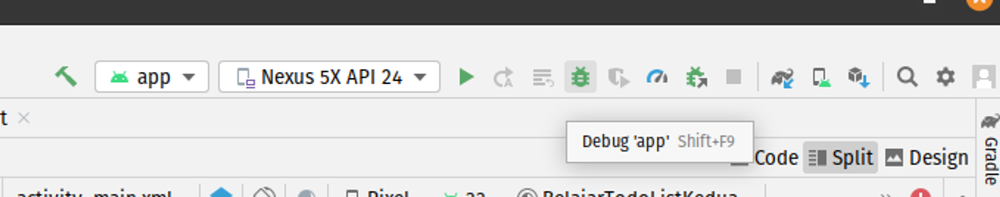

by [@perogeremmer](https://twitter.com/perogeremmer)

## Introduction

Pada materi kali ini kita akan membahas debugging, apa itu debugging?

> [!NOTE]
> 💡 Debug code is computer code introduced to a computer program to test for errors or to help determine the cause of an error. —Wikipedia

Jadi secara harfiah, debugging adalah proses untuk mengidentifikasi bagian kode yang menyebabkan error.

Apabila kamu perhatikan pada bar tools bagian kanan, kita dapat menemukan logo serangga:

Ya, logo serangga ini merupakan fitur untuk melakukan debug pada code yang kita tulis.

Bagaimana cara kerjanya? Pergi ke `MainActivity.kt` lalu berikan tanda merah dengan cara menekan bagian putih di sebelah kanan baris kode.

Baris merah merupakan debug breakpoints, artinya adalah titik atau baris yang akan dilewati dan diperiksa nilainya. Setiap breakpoint akan dilewati dan akan muncul pada bagian terminal debugger. Sekarang klik tombol debug.

Ketika kamu menulis nama dan klik tombol submit, maka code akan berjalan sesuai breakpoint yang dipilih. Misalnya pada baris 26 tentu saja setelah tombol ditekan maka akan memeriksa kondisi yaitu apabila edit text nama kosong.

Kita dapat melihat tombol resume program, artinya program akan berjalan secara code setelah ditekan resume program.

 

Dengan debugger kita juga dapat melihat isi variabel yang sudah terlewati oleh breakpoints.

 

Debugger akan membantu kita melakukan banyak hal terkait debugging dan memeriksa baris kode mana yang bermasalah.

Sekarang kita ubah MainActivity.kt dengan kode berikut:

Kita tambahkan throw exception, dapat kita lihat bahwa kode tidak berjalan ke bagian bawah. Ketika debugger dijalankan:

> [!NOTE]
> Debugger akan mempermudah kamu mengidentifikasikan masalah kamu lebih cepat, dengan debugger, kamu juga akan lebih mudah mengetahui isi variabel ketimbang melakukan print / console.log