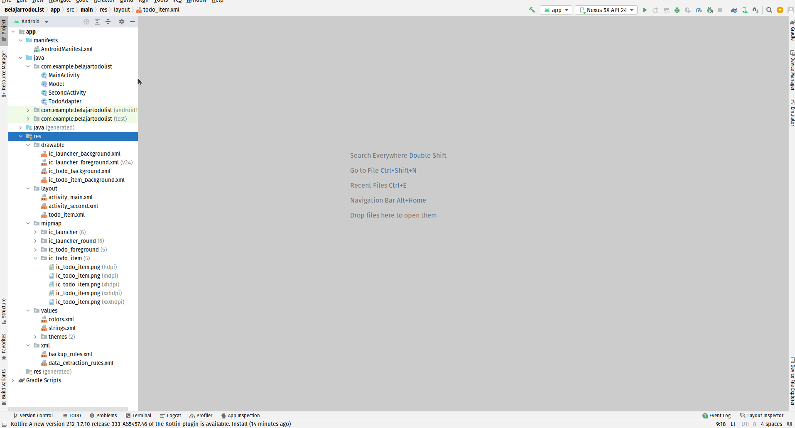
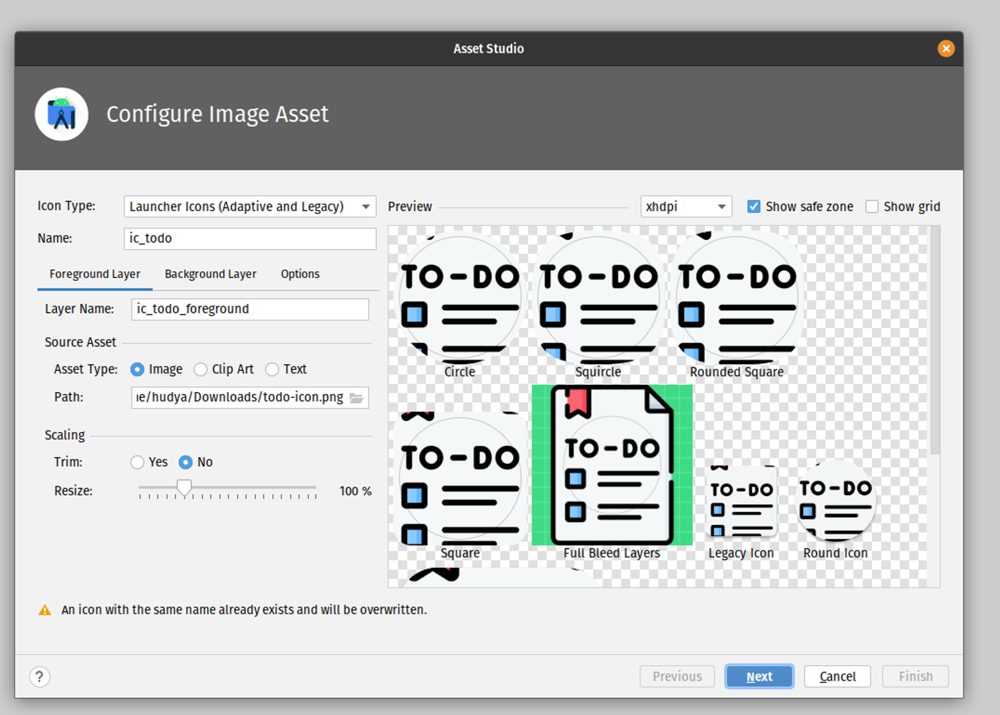
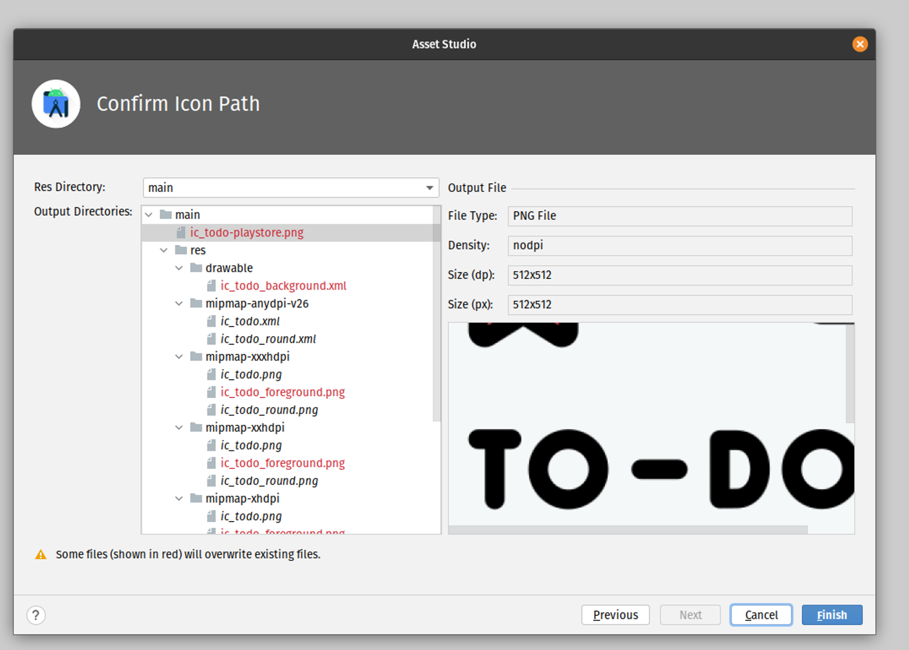
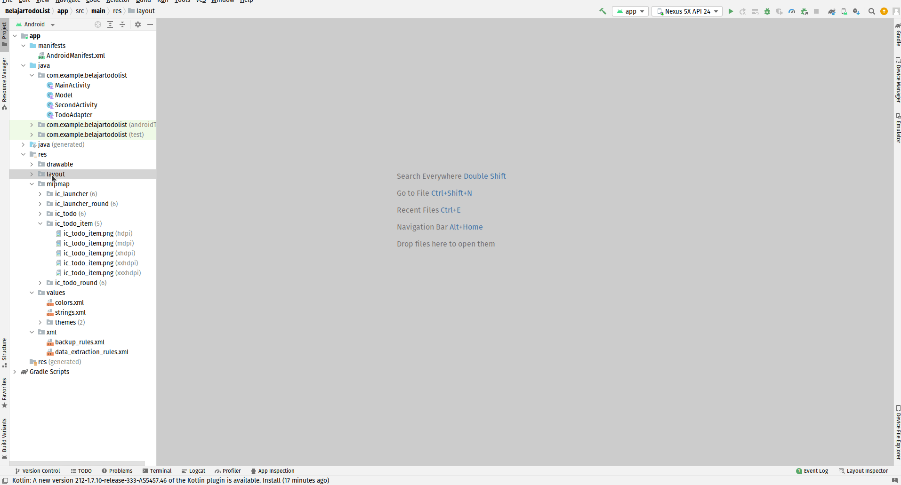
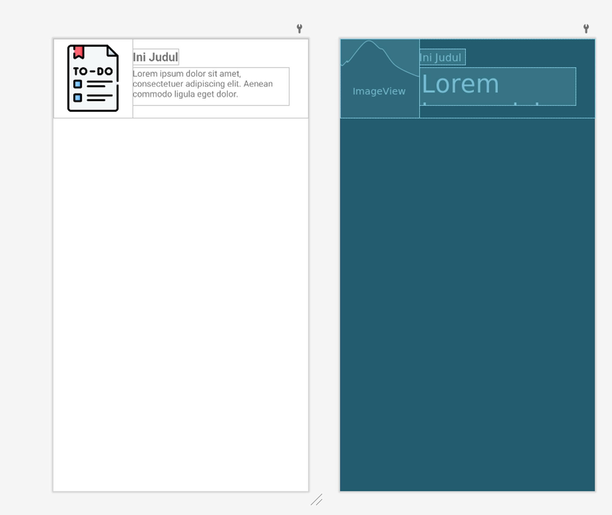
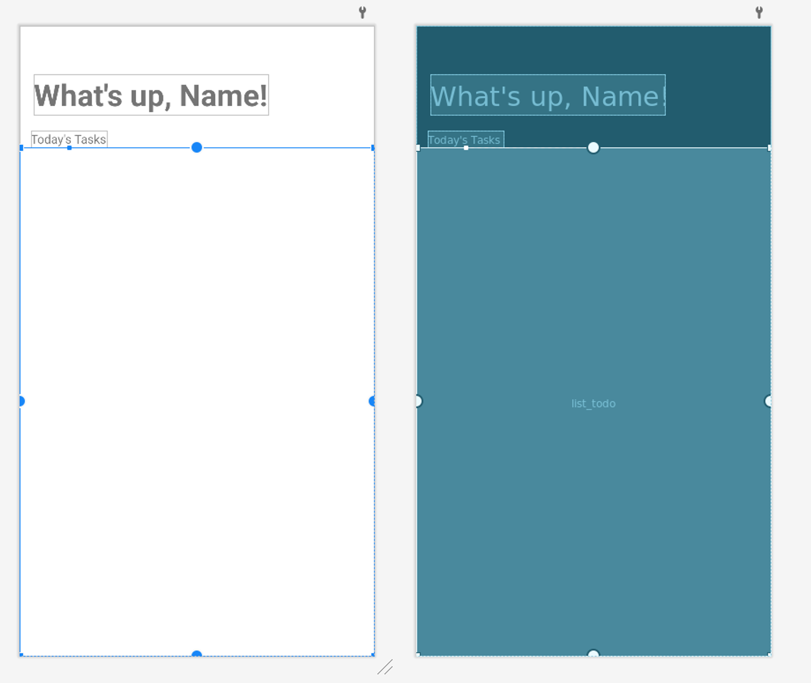
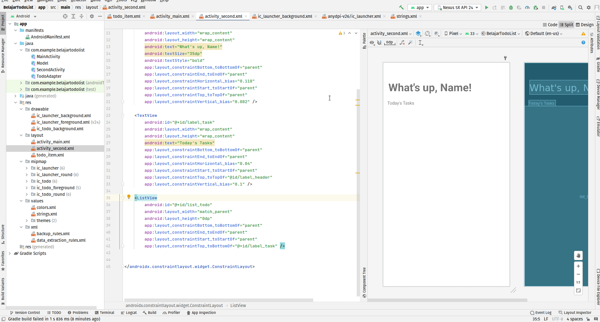
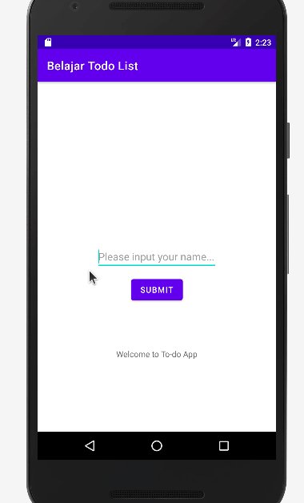
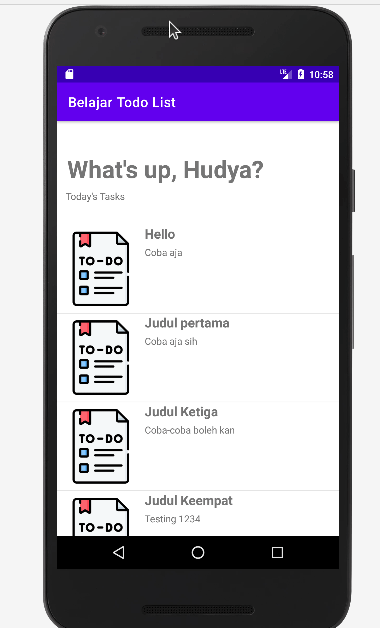

# 5. List View, Tampilan Berbentuk List

Pada tutorial kali ini, kita akan membuat sebuah tampilan list view. List view adalah sebuah tampilan berbentuk list yang akan menampilkan data yang kita inginkan.

Pertama kamu harus mendownload icon berikut untuk kita masukkan ke dalam list:


Kemudian kita perlu menambahkan icon baru ke dalam app kita, caranya adalah klik kanan pada `res > new > image asset`



Sekarang kamu akan menemukan pop up berikut, yaitu asset studio dimana setiap gambar yang di-import ke dalam projekmu akan dibuatkan masing-masing ukurannya.

Untuk nama tulis saja ic_todo untuk icon todo.



Klik icon folder pada path lalu pilih gambar yang telah kalian download. Setelahnya kalian bisa klik next.



Kemudian akan ada tampilan confirm icon path untuk memberi konfirmasi terkait gambar apa saja yang akan di-generate. Setelahnya klik finish.

Sekarang buat file layout baru, klik kanan pada file dan pilih layout, lalu masukkan nama `todo_item`.



Masukkan kode berikut pada `todo_item.xml`:

```xml
<?xml version="1.0" encoding="utf-8"?>
<androidx.constraintlayout.widget.ConstraintLayout xmlns:android="http://schemas.android.com/apk/res/android"
    xmlns:app="http://schemas.android.com/apk/res-auto"
    xmlns:tools="http://schemas.android.com/tools"
    android:orientation="vertical"
    android:layout_width="match_parent"
    android:layout_height="wrap_content">

    <ImageView
        android:id="@+id/icon_image"
        android:layout_width="wrap_content"
        android:layout_height="wrap_content"
        android:src="@mipmap/ic_todo_foreground"
        android:padding="10dp"
        app:layout_constraintStart_toStartOf="parent"
        app:layout_constraintTop_toTopOf="parent">
    </ImageView>

    <TextView
        android:id="@+id/txt_title"
        android:layout_width="wrap_content"
        android:layout_height="wrap_content"
        android:layout_marginVertical="67dp"
        android:text="Ini Judul"
        android:textSize="19dp"
        android:textStyle="bold"
        app:layout_constraintLeft_toRightOf="@id/icon_image"
        tools:ignore="MissingConstraints"
        tools:layout_editor_absoluteY="16dp" />

    <TextView
        android:id="@+id/txt_description"
        android:layout_width="252dp"
        android:layout_height="61dp"
        android:layout_marginVertical="30dp"
        android:text="Lorem ipsum dolor sit amet, consectetuer adipiscing elit. Aenean commodo ligula eget dolor."
        app:layout_constraintStart_toStartOf="@id/txt_title"
        app:layout_constraintTop_toTopOf="@id/txt_title" />
</androidx.constraintlayout.widget.ConstraintLayout>
```

Hasil akhirnya akan menjadi seperti ini:



Desain di atas adalah tampilan untuk item setiap list yang akan dibangun.

Sekarang saatnya kita memperbarui tampilan pada activtiy_second.xml dengan kode berikut:

```xml
<?xml version="1.0" encoding="utf-8"?>
<androidx.constraintlayout.widget.ConstraintLayout xmlns:android="http://schemas.android.com/apk/res/android"
    xmlns:app="http://schemas.android.com/apk/res-auto"
    xmlns:tools="http://schemas.android.com/tools"
    android:layout_width="match_parent"
    android:layout_height="match_parent"
    tools:context=".SecondActivity">

    <TextView
        android:id="@+id/label_header"
        android:layout_width="wrap_content"
        android:layout_height="wrap_content"
        android:text="What's up, Name!"
        android:textSize="35dp"
        android:textStyle="bold"
        app:layout_constraintBottom_toBottomOf="parent"
        app:layout_constraintEnd_toEndOf="parent"
        app:layout_constraintHorizontal_bias="0.118"
        app:layout_constraintStart_toStartOf="parent"
        app:layout_constraintTop_toTopOf="parent"
        app:layout_constraintVertical_bias="0.082" />

    <TextView
        android:id="@+id/label_task"
        android:layout_width="wrap_content"
        android:layout_height="wrap_content"
        android:text="Today's Tasks"
        app:layout_constraintBottom_toBottomOf="parent"
        app:layout_constraintEnd_toEndOf="parent"
        app:layout_constraintHorizontal_bias="0.04"
        app:layout_constraintStart_toStartOf="parent"
        app:layout_constraintTop_toTopOf="@id/label_header"
        app:layout_constraintVertical_bias="0.1" />

    <ListView
        android:id="@+id/list_todo"
        android:layout_width="match_parent"
        android:layout_height="0dp"
        app:layout_constraintBottom_toBottomOf="parent"
        app:layout_constraintEnd_toEndOf="parent"
        app:layout_constraintStart_toStartOf="parent"
        app:layout_constraintTop_toBottomOf="@+id/label_task" />

</androidx.constraintlayout.widget.ConstraintLayout>
```

Hasil akhirnya adalah, kita membuat sebuah container dari tampilan list pada aplikasi kita:



Terkadang kita bingung bagaimana cara mengatur desain agar lebih baik, karena kita menggunakan constraint, maka kita perlu menarik relasi ibarat X dan Y pada matematika pada setiap komponen di dalamnya, perhatikan video berikut:



Menggunakan tab design kita bisa memaksimalkan tampilan yang kita miliki dengan menarik relasi posisi dari sebuah komponen yang bergantung kepada komponen lainnya, lalu kita bisa mengatur jaraknya.

Sekarang buat class baru pada package kalian lalu beri nama `Model.kt`, masukkan kode berikut:

```kotlin
data class Model(
    val Id: String? = null,
    val Icon: String? = null,
    val Title: String? = null,
    val Description: String? = null,
)
```

Kita membuat sebuah class data binding dimana data yang akan dimasukkan ke tampilan android akan dibuatkan sebuah class setter getternya terlebih dahulu pada class `Model.kt`.

Setelahnya buat class baru bernama `TodoAdapter.kt` lalu masukkan kode berikut:

```kotlin

import android.content.Context
import android.view.LayoutInflater
import android.view.View
import android.view.ViewGroup
import android.widget.ArrayAdapter
import android.widget.ImageView
import android.widget.TextView

class TodoAdapter (var ctx: Context, var resource: Int, var item: ArrayList<Model>): ArrayAdapter<Model>(ctx, resource, item) {

    override fun getView(position: Int, convertView: View?, parent: ViewGroup): View {
        val layoutInflater = LayoutInflater.from(ctx)
        val view = layoutInflater.inflate(resource, null)

        val title = view.findViewById<TextView>(R.id.txt_title)
        val description = view.findViewById<TextView>(R.id.txt_description)
        val img = view.findViewById<ImageView>(R.id.icon_image)

        title.text = item[position].Title
        description.text = item[position].Description

        return view
    }
}
```

Kita membuat sebuah class adapter yang dapat diibaratkan adalah sebuah colokan dan tampilan list view yang akan kita bangun adalah kepala charge yang akan menyolok ke tampilannya.

Sekarang kita ubah kode pada `SecondActivity.kt` dengan kode berikut:

```kotlin
import androidx.appcompat.app.AppCompatActivity
import android.os.Bundle
import android.widget.*

class SecondActivity : AppCompatActivity() {
    lateinit var labelHeader : TextView
    lateinit var listTodo : ListView

    override fun onCreate(savedInstanceState: Bundle?) {
        super.onCreate(savedInstanceState)
        setContentView(R.layout.activity_second)

        labelHeader = findViewById(R.id.label_header)
        listTodo = findViewById(R.id.list_todo)

        var result = intent.getStringExtra("result")
        labelHeader.text = "What's up, $result?"

        val Items = ArrayList<Model>()
        Items.add(Model("1", "", "Hello", "Coba aja"))
        Items.add(Model("2", "", "Judul pertama", "Coba aja sih"))
        Items.add(Model("3", "", "Judul Ketiga", "Coba-coba boleh kan"))
        Items.add(Model("4", "", "Judul Keempat", "Testing 1234"))
        Items.add(Model("5", "", "Judul Kelima", "Coba aja perhatikan semuanya deh"))

        val adapter = TodoAdapter(this, R.layout.todo_item, Items)
        listTodo.adapter = adapter
    }
}
```

Dengan model yang kita bangun, kita akan membuat tampilan dari data yang dikirimkan pada ArrayList.

Sekarang jalankan kembali dan hasilnya akan menjadi seperti ini:



# Challenge

Tidak akan seru apabila tidak ada tantangan, menggunakan kode yang sama, bagaimana caranya ketika salah satu todo ditekan, maka akan muncul toast text berupa judul dari todo tersebut.

<aside>
💡 Kata kunci pencarian:

- How to get item when click list view kotlin

</aside>

## Hasil



Jawaban? Klik disini