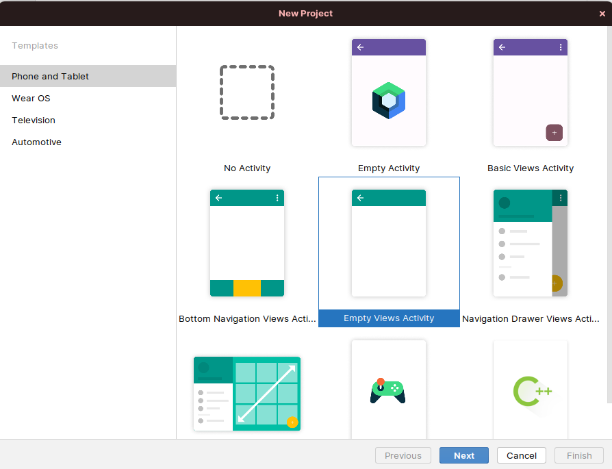

# 6. Integrasi dengan Firebase

Pada tutorial kali ini, kita akan coba untuk melakukan integrasi dengan firebase. Firebase adalah layanan cloud dari Google yang memberikan kemudahan akses database secara online yang disimpan pada layanan bernama Firestore Database.

Nah karena Android merupakan produk resmi dari Google, sehingga integrasi dengan firebase akan sangat mudah dilakukan.

Pertama, kita buat projek baru terlebih dahulu, kita pilih empty views activity.



Alasannya adalah karena kita ingin membuat todo list dengan firebase, dimana data disimpan secara cloud.

Nah sekarang kita ganti namanya menjadi `todo firebase`. Untuk package name dan minimum SDK, silahkan menyesuaikan device kalian. Kalau sudah tekan finish.


<br />

---

<br />

Selanjutnya, pergi ke [console firebase](https://console.firebase.google.com) dan klik Add project, lihat GIF berikut:


Tunggu hingga proses pembuatan project selesai hingga seperti ini lalu klik continue.

 

Sekarang kembali ke android studio dan klik tools > Firebase, lihat GIF berikut:


Buka kembali android studio kamu, dan cek hasilnya apabila terkonek dengan akun firebase kamu akan menjadi seperti ini:


Sekarang klik juga Add Cloud Firestore to your app dan klik install dependencies (add dependencies to your app), klik saja confirm to change, tunggu hingga proses graddling selesai dan lihat sudah terkoneksi.


<br />

Setelahnya kita perlu menyiapkan databasenya, lakukan langkah berikut:


1. Kembali ke console firebase
2. Klik build pada bagian kiri lalu pilih firestore database
3. Pilih bagian create database
4. Setelahnya pilih bagian testing mode, dan next.
5. Data center locationnya pilih Jakarta, lalu next, sisanya tinggal enable saja. Terus tunggu hingga selesai.

<br />


Kalau sudah selesai begini nanti bentuknya. Klik start collection lalu tambahkan sample data.


<br />

Sekarang kita akan mencoba untuk melihat apakah datanya benar-benar sudah masuk:


Pergi ke Android Studio, pilih `MainActivity.kt` lalu ubah kodenya agar menjadi seperti ini:

```kotlin
import android.content.ContentValues.TAG
import androidx.appcompat.app.AppCompatActivity
import android.os.Bundle
import android.util.Log
import com.google.firebase.firestore.ktx.firestore
import com.google.firebase.ktx.Firebase

class MainActivity : AppCompatActivity() {
    override fun onCreate(savedInstanceState: Bundle?) {
        super.onCreate(savedInstanceState)
        setContentView(R.layout.activity_main)

        val db = Firebase.firestore
        db.collection("todo")
            .get()
            .addOnSuccessListener { result ->
                for (document in result) {
                    Log.d(TAG, "${document.id} => ${document.data}")
                }
            }
            .addOnFailureListener { exception ->
                Log.w(TAG, "Error getting documents.", exception)
            }
    }
}
```

> ![WARNING]
> Perhatikan nama package kalian jangan sampai dihilangkan.

<br />

Sekarang pergi ke bagian logcat dan lihat bahwa kita berhasil menyambungkan aplikasi dengan Firebase dan datanya sudah berhasil diambil.


Next kita akan lanjutkan membuat list view todo, menambahkan todo, update todo, dan menghapus todo.