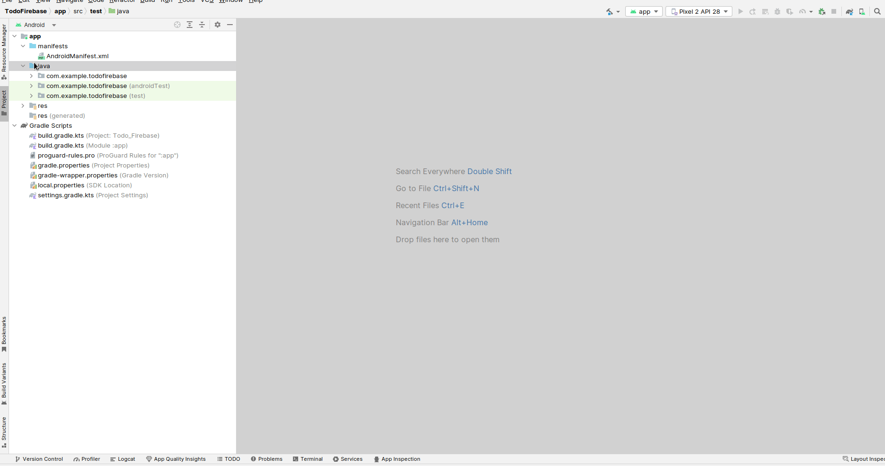
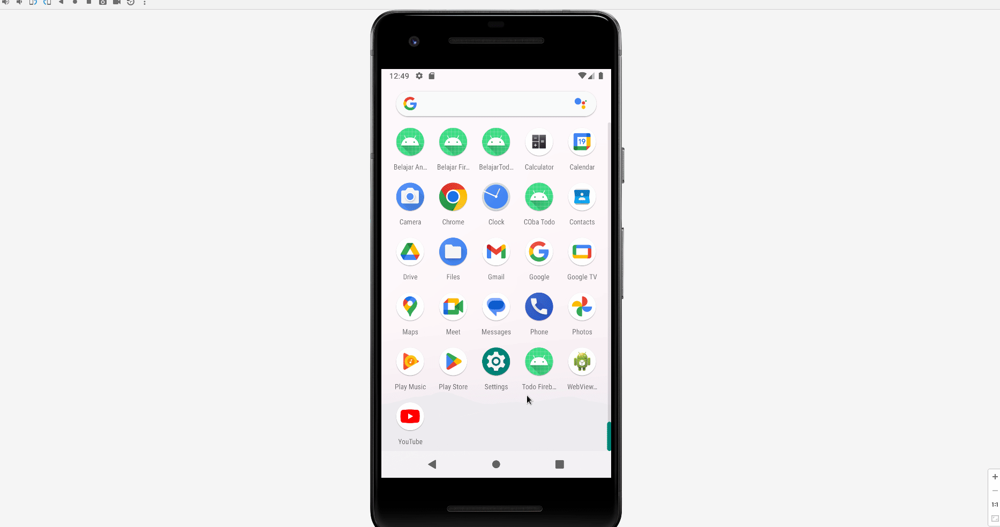

# 7. Menambahkan dan Melihat Todo

Setelah melakukan integrasi pada tutorial [sebelumnya](./6-integrasi-dengan-firebase.md), kita akan coba membuat dimana aplikasi dapat menambahkan dan melihat todo.

Pertama kita buat dulu resource baru bernama `todo_item.xml` pada folder `res > layout`.

```xml
<?xml version="1.0" encoding="utf-8"?>
<androidx.constraintlayout.widget.ConstraintLayout xmlns:android="http://schemas.android.com/apk/res/android"
    xmlns:app="http://schemas.android.com/apk/res-auto"
    xmlns:tools="http://schemas.android.com/tools"
    android:orientation="vertical"
    android:layout_width="match_parent"
    android:layout_height="wrap_content">


    <TextView
        android:id="@+id/txt_title"
        android:layout_width="wrap_content"
        android:layout_height="wrap_content"
        android:layout_marginStart="16dp"
        android:layout_marginTop="16dp"
        android:text="Ini Judul"
        android:textSize="19dp"
        android:textStyle="bold"
        app:layout_constraintStart_toStartOf="parent"
        app:layout_constraintTop_toTopOf="parent" />

    <TextView
        android:id="@+id/txt_description"
        android:layout_width="252dp"
        android:layout_height="wrap_content"
        android:layout_marginVertical="30dp"
        android:text="Lorem ipsum dolor sit amet, consectetuer adipiscing elit. Aenean commodo ligula eget dolor."
        app:layout_constraintBottom_toBottomOf="parent"
        app:layout_constraintEnd_toEndOf="parent"
        app:layout_constraintHorizontal_bias="0.0"
        app:layout_constraintStart_toStartOf="@+id/txt_title"
        app:layout_constraintTop_toTopOf="@+id/txt_title"
        app:layout_constraintVertical_bias="0.733" />
</androidx.constraintlayout.widget.ConstraintLayout>
```

Sebenarnya ini mirip dengan tampilan Todo pada tutorial [kelima](./5-belajar-list-view.md). Namun disini kita tidak menggunakan icon.

Lalu pada activity_main.xml kita juga ubah agar menjadi seperti ini:

```xml
<?xml version="1.0" encoding="utf-8"?>
<androidx.constraintlayout.widget.ConstraintLayout xmlns:android="http://schemas.android.com/apk/res/android"
    xmlns:app="http://schemas.android.com/apk/res-auto"
    xmlns:tools="http://schemas.android.com/tools"
    android:layout_width="match_parent"
    android:layout_height="match_parent"
    tools:context=".MainActivity">

    <TextView
        android:id="@+id/label_header"
        android:layout_width="wrap_content"
        android:layout_height="wrap_content"
        android:layout_marginStart="8dp"
        android:layout_marginTop="24dp"
        android:text="What's up, Name!"
        android:textSize="35dp"
        android:textStyle="bold"
        app:layout_constraintBottom_toBottomOf="parent"
        app:layout_constraintEnd_toEndOf="parent"
        app:layout_constraintHorizontal_bias="0.0"
        app:layout_constraintStart_toStartOf="parent"
        app:layout_constraintTop_toTopOf="parent"
        app:layout_constraintVertical_bias="0.011" />

    <ListView
        android:id="@+id/list_todo"
        android:layout_width="match_parent"
        android:layout_height="0dp"
        android:layout_marginTop="24dp"
        app:layout_constraintBottom_toBottomOf="parent"
        app:layout_constraintEnd_toEndOf="parent"
        app:layout_constraintStart_toStartOf="parent"
        app:layout_constraintTop_toBottomOf="@+id/label_header" >
    </ListView>

    <com.google.android.material.floatingactionbutton.FloatingActionButton
        android:id="@+id/btn_create_todo"
        android:layout_width="wrap_content"
        android:layout_height="wrap_content"
        android:layout_marginEnd="32dp"
        android:layout_marginBottom="32dp"
        android:clickable="true"
        app:layout_constraintBottom_toBottomOf="parent"
        app:layout_constraintEnd_toEndOf="parent"
        app:srcCompat="@android:drawable/ic_input_add" />

</androidx.constraintlayout.widget.ConstraintLayout>
```

Akan terdapat error merah-merah, namun kamu tidak perlu khawatir, hal ini dikarenakan kita belum melakukan penambahan module material design untuk menambahkan floating button, yaitu tombol yang melayang pada kanan bawah.

Pergi ke build.gradle.kts dan tambahkan dependencies berikut, lalu lakukan sync.

```plain
implementation("com.google.android.material:material:1.3.0-alpha02")
```

<br />

Perhatikan GIF berikut untuk cara menambahkan dependencies.



Apabila sudah selesai, sekarang harusnya projekmu sudah tidak ada merah-merah yang error lagi.

Sekarang buat class baru bernama `TodoModel` pada package kita, lalu masukkan kode berikut:

```kotlin
data class TodoModel(
    val Id: String? = null,
    val Title: String? = null,
    val Description: String? = null,
)
```

<br />

Sekarang buat class lagi untuk adapter dengan nama `TodoAdapter` lalu masukkan kode berikut:

```kotlin
import android.content.Context
import android.view.LayoutInflater
import android.view.View
import android.view.ViewGroup
import android.widget.ArrayAdapter
import android.widget.ImageView
import android.widget.TextView

class TodoAdapter (var ctx: Context, var resource: Int, var item: ArrayList<TodoModel>): ArrayAdapter<TodoModel>(ctx, resource, item) {

    override fun getView(position: Int, convertView: View?, parent: ViewGroup): View {
        val layoutInflater = LayoutInflater.from(ctx)
        val view = layoutInflater.inflate(resource, null)

        val title = view.findViewById<TextView>(R.id.txt_title)
        val description = view.findViewById<TextView>(R.id.txt_description)

        title.text = item[position].Title
        description.text = item[position].Description

        return view
    }
}
```

Kembali ke MainActivity, kita ubah kodenya menjadi seperti ini:

```kotlin

import android.content.ContentValues.TAG
import androidx.appcompat.app.AppCompatActivity
import android.os.Bundle
import android.util.Log
import android.widget.ListView
import com.google.android.material.floatingactionbutton.FloatingActionButton
import com.google.firebase.firestore.ktx.firestore
import com.google.firebase.ktx.Firebase

class MainActivity : AppCompatActivity() {

    lateinit var listTodo : ListView
    lateinit var btnCreateTodo : FloatingActionButton

    override fun onCreate(savedInstanceState: Bundle?) {
        super.onCreate(savedInstanceState)
        setContentView(R.layout.activity_main)

        listTodo = findViewById(R.id.list_todo)
        btnCreateTodo = findViewById(R.id.btn_create_todo)

        val db = Firebase.firestore
        db.collection("todo")
            .get()
            .addOnSuccessListener { result ->
                val Items = ArrayList<TodoModel>()

                for (document in result) {
                    Log.d(TAG, "${document.id} => ${document.data}")
                    Items.add(
                        TodoModel(
                            document.id.toString(),
                            document.data.get("title").toString(),
                            document.data.get("description").toString()
                        )
                    )
                }
                
                val adapter = TodoAdapter(this, R.layout.todo_item, Items)
                listTodo.adapter = adapter
            }
            .addOnFailureListener { exception ->
                Log.w(TAG, "Error getting documents.", exception)
            }
    }
}
```

<br />

Perhatikan bagian ini:

```kotlin
val db = Firebase.firestore
db.collection("todo")
    .get()
    .addOnSuccessListener { result ->
        val Items = ArrayList<TodoModel>()

        for (document in result) {
            Log.d(TAG, "${document.id} => ${document.data}")
            Items.add(
                TodoModel(
                    document.id.toString(),
                    document.data.get("title").toString(),
                    document.data.get("description").toString()
                )
            )
        }

        val adapter = TodoAdapter(this, R.layout.todo_item, Items)
        listTodo.adapter = adapter
    }
    .addOnFailureListener { exception ->
        Log.w(TAG, "Error getting documents.", exception)
    }
```

Kode ini bertugas untuk membaca data dari firebase yang mana ketika response berhasil didapatkan pada addOnSuccessListener, kita memasukkan model pada array list dengan objek `TodoModel` dengan melakukan looping terhadap data document di firebase, lalu memasukkannya ke adapter setelah seluruh datanya sudah dimasukkan ke array list.

<br />

Sekarang klik `new > activity`, dan seperti biasa pilih `empty views activity` (atau empty activity kalau di android studio versi lama).

Beri nama `CreateTodoActivity` lalu klik finish untuk dibuat. Sekarang pergi ke `res > layout`, cari `activity_create_todo.xml` dan tempelkan kode berikut:

```xml
<?xml version="1.0" encoding="utf-8"?>
<androidx.constraintlayout.widget.ConstraintLayout xmlns:android="http://schemas.android.com/apk/res/android"
    xmlns:app="http://schemas.android.com/apk/res-auto"
    xmlns:tools="http://schemas.android.com/tools"
    android:layout_width="match_parent"
    android:layout_height="match_parent"
    tools:context=".CreateTodoActivity">

    <TextView
        android:id="@+id/label_header"
        android:layout_width="wrap_content"
        android:layout_height="wrap_content"
        android:layout_marginStart="8dp"
        android:layout_marginTop="24dp"
        android:text="Create new Todo"
        android:textSize="28dp"
        android:textStyle="bold"
        app:layout_constraintBottom_toBottomOf="parent"
        app:layout_constraintEnd_toEndOf="parent"
        app:layout_constraintHorizontal_bias="0.0"
        app:layout_constraintStart_toStartOf="parent"
        app:layout_constraintTop_toTopOf="parent"
        app:layout_constraintVertical_bias="0.011" />

    <TextView
        android:id="@+id/label_title"
        android:layout_width="wrap_content"
        android:layout_height="wrap_content"
        android:layout_marginTop="24dp"
        android:text="Title"
        app:layout_constraintStart_toStartOf="@+id/label_header"
        app:layout_constraintTop_toBottomOf="@+id/label_header" />

    <EditText
        android:id="@+id/et_title"
        android:layout_width="0dp"
        android:layout_height="wrap_content"
        android:layout_marginEnd="16dp"
        android:ems="10"
        android:inputType="text"
        android:text=""
        app:layout_constraintEnd_toEndOf="parent"
        app:layout_constraintStart_toStartOf="@+id/label_title"
        app:layout_constraintTop_toBottomOf="@+id/label_title" />

    <TextView
        android:id="@+id/label_desc"
        android:layout_width="wrap_content"
        android:layout_height="wrap_content"
        android:layout_marginTop="28dp"
        android:text="Deskripsi"
        app:layout_constraintStart_toStartOf="@+id/et_title"
        app:layout_constraintTop_toBottomOf="@+id/et_title" />

    <EditText
        android:id="@+id/et_description"
        android:layout_width="0dp"
        android:layout_height="wrap_content"
        android:layout_marginEnd="16dp"
        android:ems="10"
        android:gravity="start|top"
        android:inputType="textMultiLine"
        app:layout_constraintEnd_toEndOf="parent"
        app:layout_constraintStart_toStartOf="@+id/label_desc"
        app:layout_constraintTop_toBottomOf="@+id/label_desc" />

    <Button
        android:id="@+id/btn_submit"
        android:layout_width="0dp"
        android:layout_height="wrap_content"
        android:layout_marginEnd="16dp"
        android:text="Submit"
        app:layout_constraintBottom_toBottomOf="parent"
        app:layout_constraintEnd_toEndOf="parent"
        app:layout_constraintHorizontal_bias="1.0"
        app:layout_constraintStart_toStartOf="@+id/et_description"
        app:layout_constraintTop_toBottomOf="@+id/et_description"
        app:layout_constraintVertical_bias="0.092" />

</androidx.constraintlayout.widget.ConstraintLayout>
```


Kembali lagi ke `CreateTodoActivity` lalu ubah dengan kode berikut:

```kotlin

import android.content.ContentValues.TAG
import androidx.appcompat.app.AppCompatActivity
import android.os.Bundle
import android.util.Log
import android.widget.Button
import android.widget.EditText
import android.widget.Toast
import com.google.firebase.firestore.ktx.firestore
import com.google.firebase.ktx.Firebase

class CreateTodoActivity : AppCompatActivity() {
    lateinit var etTitle : EditText
    lateinit var etDescription : EditText
    lateinit var btnSubmit : Button

    override fun onCreate(savedInstanceState: Bundle?) {
        super.onCreate(savedInstanceState)
        setContentView(R.layout.activity_create_todo)

        etTitle = findViewById(R.id.et_title)
        etDescription = findViewById(R.id.et_description)
        btnSubmit = findViewById(R.id.btn_submit)

        btnSubmit.setOnClickListener {
            if (etTitle.text.isEmpty()) {
                Toast.makeText(
                    applicationContext,
                    "Harap isi judul todo terlebih dahulu",
                    Toast.LENGTH_SHORT
                ).show()
                return@setOnClickListener
            }

            if (etDescription.text.isEmpty()) {
                Toast.makeText(
                    applicationContext,
                    "Harap isi deskripsi todo terlebih dahulu",
                    Toast.LENGTH_SHORT
                ).show()
                return@setOnClickListener
            }

            var todoModel = TodoModel(
                Title = etTitle.text.toString(),
                Description = etDescription.text.toString()
            )

            val db = Firebase.firestore
            db.collection("todo")
                .add(todoModel)
                .addOnSuccessListener { documentReference ->
                    Toast.makeText(
                        applicationContext,
                        "Berhasil menambahkan Todo!",
                        Toast.LENGTH_SHORT
                    ).show()

                    finish()
                }
                .addOnFailureListener { e ->
                    Log.w(TAG, "Error adding document", e)
                }
        }
    }
}
```

Perhatikan baris berikut:

```kotlin
var todoModel = TodoModel(
    Title = etTitle.text.toString(),
    Description = etDescription.text.toString()
)

val db = Firebase.firestore
db.collection("todo")
    .add(todoModel)
    .addOnSuccessListener { documentReference ->
        Toast.makeText(
            applicationContext,
            "Berhasil menambahkan Todo!",
            Toast.LENGTH_SHORT
        ).show()

        finish()
    }
    .addOnFailureListener { e ->
        Log.w(TAG, "Error adding document", e)
    }
```

Pada baris ini kita menambahkan data ke model

<br />

Sekarang kembali ke MainActivity, dan kita akan menambahkan action untuk pindah ke tampilan create todo. Tambahkan kode berikut ke fungsi `onCreate` pada `MainActivity`.

```kotlin
btnCreateTodo.setOnClickListener {
    val intent = Intent(this, CreateTodoActivity::class.java)
    startActivity(intent)
}
```

Eits, jangan lupa import tombolnya, keseluruhan file akan menjadi seperti ini:

```kotlin

import android.content.ContentValues.TAG
import androidx.appcompat.app.AppCompatActivity
import android.os.Bundle
import android.util.Log
import android.widget.ListView
import com.google.android.material.floatingactionbutton.FloatingActionButton
import com.google.firebase.firestore.ktx.firestore
import com.google.firebase.ktx.Firebase
import android.content.Intent

class MainActivity : AppCompatActivity() {

    lateinit var listTodo : ListView
    lateinit var btnCreateTodo : FloatingActionButton

    override fun onCreate(savedInstanceState: Bundle?) {
        super.onCreate(savedInstanceState)
        setContentView(R.layout.activity_main)

        listTodo = findViewById(R.id.list_todo)
        btnCreateTodo = findViewById(R.id.btn_create_todo)

        val db = Firebase.firestore
        db.collection("todo")
            .get()
            .addOnSuccessListener { result ->
                val Items = ArrayList<TodoModel>()

                for (document in result) {
                    Log.d(TAG, "${document.id} => ${document.data}")
                    Items.add(
                        TodoModel(
                            document.id.toString(),
                            document.data.get("title").toString(),
                            document.data.get("description").toString()
                        )
                    )
                }

                val adapter = TodoAdapter(this, R.layout.todo_item, Items)
                listTodo.adapter = adapter
            }
            .addOnFailureListener { exception ->
                Log.w(TAG, "Error getting documents.", exception)
            }

        btnCreateTodo.setOnClickListener {
            val intent = Intent(this, CreateTodoActivity::class.java)
            startActivity(intent)
        }
    }
}
```

<br />

Apabila berhasil akan menjadi seperti ini:



Ada yang aneh, mengapa setelah data kita tambahkan, data tersebut tidak muncul ke list-view, padahal setelah kita buka kembali aplikasinya dia menjadi muncul, tau kenapa?

Jawabannya sederhana, karena kita tidak melakukan load kembali terhadap halaman list view pada bagian menambahkan todo.

Sekarang, silahkan selesaikan tugas ini, bagaimana cara membuat data baru tersebut muncul setelah menambahkan data baru?

Clue: `onResume activity`.