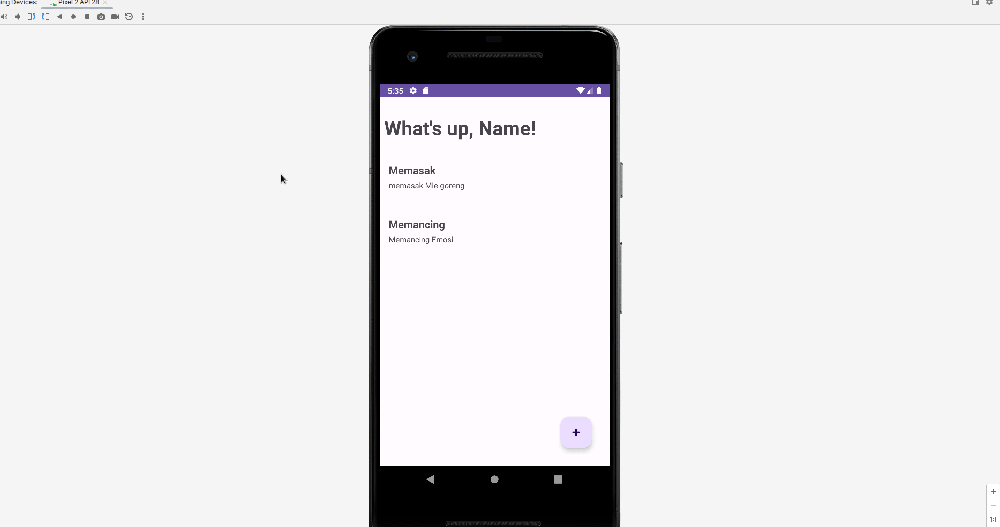
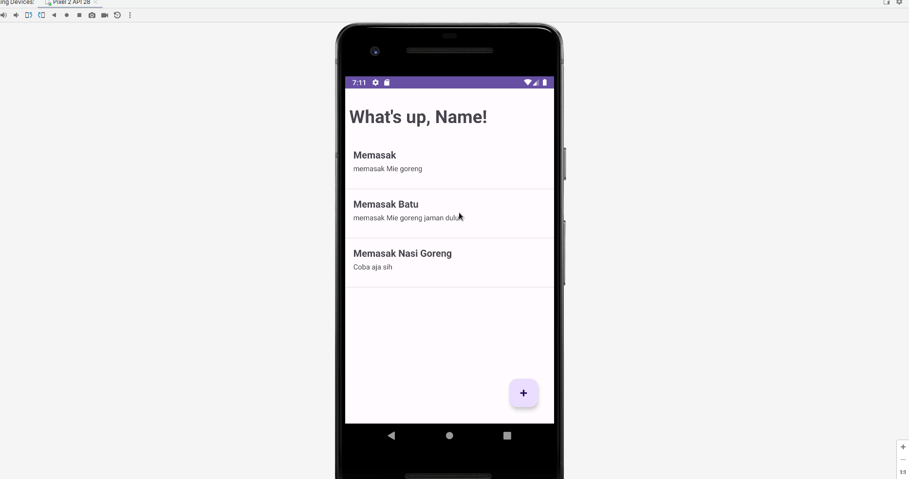

# 8. Menghapus dan mengubah data

Setelah berhasil membuat dan melihat keseluruhan data, kita ingin mencoba untuk menghapus dan mengubah data. Bagaimana caranya?

Pertama, pergi ke MainActivity.kt lalu tambahkan kode berikut:

```kotlin
fun deleteItem(id: String, title: String) {
    val db = Firebase.firestore
    db.collection("todo").document(id).delete()
        .addOnSuccessListener {
            Toast.makeText(
                applicationContext,
                "Berhasil menghapus todo: $title",
                Toast.LENGTH_SHORT
            ).show()
        }
        .addOnFailureListener { exception ->
            Toast.makeText(
                applicationContext,
                "Gagal menghapus todo: $title.",
                Toast.LENGTH_SHORT
            ).show()
            Log.w(TAG, "Error getting documents.", exception)
        }
}
```

Jadi kita akan menambahkan fungsi untuk menghapus data pada firebase dengan nama fungsi `deleteItem` yang menerima parameter berupa `id` dan `title`. Nah pada fungsi ini kita menjalankan fungsi delete sesuai SDK firebase.

Apabila berhasil maka akan muncul toast berhasil, apabila gagal akan muncul toast gagal, dan exceptionnya akan dicatat pada catlog.

Setelahnya kembali ke fungsi onCreate, kita tambahkan kode berikut di dalamnya:

```kotlin
listTodo.setOnItemLongClickListener { adapterView, view, position, id ->
    val item = adapterView.getItemAtPosition(position) as TodoModel

    var title = item.Title.toString()
    
    val builder = AlertDialog.Builder(this)
    builder.setMessage("Apakah kamu ingin menghapus todo: $title?")
        .setCancelable(false)
        .setPositiveButton("Hapus") { dialog, id ->
            deleteItem(item.Id.toString(), title)
            getData()
        }
        .setNegativeButton("Batal") { dialog, id ->
            dialog.dismiss()
        }

    val alert = builder.create()
    alert.show()

    return@setOnItemLongClickListener true
}
```

Nah pada fungsi ini kita menggunakan `setOnItemLongClickListener`, yang mana fungsi ini akan dijalankan ketika kita menekan salah satu item pada todo list secara agak panjang (klik dan tahan). 

Apabila kita melakukan konfirmasi dengan menekan tombol positive (Hapus), maka fungsi `deleteItem` akan berjalan dengan dua argumen yang kita lempar, yaitu id document firebase dan judul berdasarkan todo list tersebut yang kita dapatkan dari adapter view pada bagian ini `val item = adapterView.getItemAtPosition(position) as TodoModel`.

<br />

Coba jalankan dan lihat hasilnya:



---

<br />

Sekarang kita akan coba mengubah data, kencangkan sabuk pengaman karena ini akan panjang, guys.

Pertama, pergi ke `MainActivity.kt` lalu tambahkan kode berikut pada fungsi `onCreate`:

```kotlin
listTodo.setOnItemClickListener { adapterView, view, position, id ->
    val item = adapterView.getItemAtPosition(position) as TodoModel

    val intent = Intent(this, CreateTodoActivity::class.java)
    intent.putExtra("id", item.Id.toString())
    intent.putExtra("title", item.Title.toString())
    intent.putExtra("description", item.Description.toString())
    startActivity(intent)
}
```

Disini kita menambahkan fungsi apabila todo list-nya ditekan, dia akan pindah ke halaman pembuatan todo dengan menambahkan beberapa data intent seperti `id`, `title`, dan `description`.

Bedanya apa dengan ketika menghapus? Fungsi `setOnItemClickListener` adalah fungsi ketika salah satu item todo list ditekan, namun pada bagian menghapus, kita menggunakan `setOnItemLongClickListener` yaitu saat salah satu item todo list ditekan namun ditahan di-saat yang bersamaan. Jadi tentu saja berbeda fungsi.

<br/>

Sekarang pergi ke CreateTodoActivity.kt lalu tambahkan dua fungsi berikut:

```kotlin
fun update(todoModel: TodoModel) {
    val db = Firebase.firestore
    db.collection("todo").document(todoModel.Id.toString()).set(todoModel)
        .addOnSuccessListener { documentReference ->
        Toast.makeText(
            applicationContext,
            "Berhasil merubah Todo!",
            Toast.LENGTH_SHORT
        ).show()

        finish()
    }
        .addOnFailureListener { e ->
            Log.w(TAG, "Error adding document", e)
        }
}

fun create(todoModel: TodoModel) {
    val db = Firebase.firestore
    db.collection("todo")
        .add(todoModel)
        .addOnSuccessListener { documentReference ->
            Toast.makeText(
                applicationContext,
                "Berhasil menambahkan Todo!",
                Toast.LENGTH_SHORT
            ).show()

            finish()
        }
        .addOnFailureListener { e ->
            Log.w(TAG, "Error adding document", e)
        }
}
```

Kita membuat dua fungsi yaitu `update` dan `create` dimana harusnya sudah jelas ya, `create` adalah untuk menambahkan data ke firebase, dan `update` untuk merubah.

Simpan dulu pertanyaan `mengapa kita tidak membuat screen baru saja?`, nanti akan saya jelaskan.

<br/> 

Sekarang pergi ke bagian `onCreate` dan ubah menjadi seperti berikut:

```kotlin
override fun onCreate(savedInstanceState: Bundle?) {
    super.onCreate(savedInstanceState)
    setContentView(R.layout.activity_create_todo)

    etTitle = findViewById(R.id.et_title)
    etDescription = findViewById(R.id.et_description)
    btnSubmit = findViewById(R.id.btn_submit)
    labelHeader = findViewById(R.id.label_header)

    var editMode = false
    var id = intent.getStringExtra("id")
    if (!id.isNullOrBlank()) {
        editMode = true
        var title = intent.getStringExtra("title").toString()
        labelHeader.setText("Ubah Todo: $title")
        etTitle.setText(title)
        etDescription.setText(intent.getStringExtra("description").toString())
    }


    btnSubmit.setOnClickListener {
        if (etTitle.text.isEmpty()) {
            Toast.makeText(
                applicationContext,
                "Harap isi judul todo terlebih dahulu",
                Toast.LENGTH_SHORT
            ).show()
            return@setOnClickListener
        }

        if (etDescription.text.isEmpty()) {
            Toast.makeText(
                applicationContext,
                "Harap isi deskripsi todo terlebih dahulu",
                Toast.LENGTH_SHORT
            ).show()
            return@setOnClickListener
        }

        if (editMode) {
            var todoModel = TodoModel(
                Id = intent.getStringExtra("id").toString(),
                Title = etTitle.text.toString(),
                Description = etDescription.text.toString()
            )
            this.update(todoModel)
            return@setOnClickListener
        }

        var todoModel = TodoModel(
            Title = etTitle.text.toString(),
            Description = etDescription.text.toString()
        )
        this.create(todoModel)
    }
}
```

<br />

Keseluruhan file CreateTodoActivity.kt akan menjadi seperti ini:

```kotlin
import android.content.ContentValues.TAG
import androidx.appcompat.app.AppCompatActivity
import android.os.Bundle
import android.util.Log
import android.widget.Button
import android.widget.EditText
import android.widget.TextView
import android.widget.Toast
import com.google.firebase.firestore.ktx.firestore
import com.google.firebase.ktx.Firebase

class CreateTodoActivity : AppCompatActivity() {
    lateinit var etTitle : EditText
    lateinit var etDescription : EditText
    lateinit var btnSubmit : Button

    lateinit var labelHeader : TextView

    override fun onCreate(savedInstanceState: Bundle?) {
        super.onCreate(savedInstanceState)
        setContentView(R.layout.activity_create_todo)

        etTitle = findViewById(R.id.et_title)
        etDescription = findViewById(R.id.et_description)
        btnSubmit = findViewById(R.id.btn_submit)
        labelHeader = findViewById(R.id.label_header)

        var editMode = false
        var id = intent.getStringExtra("id")
        if (!id.isNullOrBlank()) {
            editMode = true
            var title = intent.getStringExtra("title").toString()
            labelHeader.setText("Ubah Todo: $title")
            etTitle.setText(title)
            etDescription.setText(intent.getStringExtra("description").toString())
        }


        btnSubmit.setOnClickListener {
            if (etTitle.text.isEmpty()) {
                Toast.makeText(
                    applicationContext,
                    "Harap isi judul todo terlebih dahulu",
                    Toast.LENGTH_SHORT
                ).show()
                return@setOnClickListener
            }

            if (etDescription.text.isEmpty()) {
                Toast.makeText(
                    applicationContext,
                    "Harap isi deskripsi todo terlebih dahulu",
                    Toast.LENGTH_SHORT
                ).show()
                return@setOnClickListener
            }

            if (editMode) {
                var todoModel = TodoModel(
                    Id = intent.getStringExtra("id").toString(),
                    Title = etTitle.text.toString(),
                    Description = etDescription.text.toString()
                )
                this.update(todoModel)
                return@setOnClickListener
            }

            var todoModel = TodoModel(
                Title = etTitle.text.toString(),
                Description = etDescription.text.toString()
            )
            this.create(todoModel)
        }
    }

    fun update(todoModel: TodoModel) {
        val db = Firebase.firestore
        db.collection("todo").document(todoModel.Id.toString()).set(todoModel)
            .addOnSuccessListener { documentReference ->
            Toast.makeText(
                applicationContext,
                "Berhasil merubah Todo!",
                Toast.LENGTH_SHORT
            ).show()

            finish()
        }
            .addOnFailureListener { e ->
                Log.w(TAG, "Error adding document", e)
            }
    }

    fun create(todoModel: TodoModel) {
        val db = Firebase.firestore
        db.collection("todo")
            .add(todoModel)
            .addOnSuccessListener { documentReference ->
                Toast.makeText(
                    applicationContext,
                    "Berhasil menambahkan Todo!",
                    Toast.LENGTH_SHORT
                ).show()

                finish()
            }
            .addOnFailureListener { e ->
                Log.w(TAG, "Error adding document", e)
            }
    }
}
```

Fiuh, I told ya, panjang ya? Lemme explain.

Pertama, I will told ya. Kita menggunakan satu Activity saja untuk melakukan dua activity, yaitu create dan update. Apakah ini salah? Tidak.  Ini sah-sah saja untuk dilakukan, kita melakukan efisiensi kode menggunakan satu template yang sama.

Apakah efektif? Bisa iya bisa tidak, pada kode saya sebenarnya tidak terlalu efektif, banyak kode yang tidak rapih, namun bukan itu tujuan utama saya. Adapun yang terpenting kalian sebagai pembaca, dapat memahami konsep reusable activity yang dapat digunakan dua tujuan meskipun hanya satu class saja.

Kedua, perhatikan kedua baris ini:

```kotlin
lateinit var labelHeader : TextView

labelHeader = findViewById(R.id.label_header)    
```

Kedua baris ini kita lakukan inisiasi karena kita ingin merubah teks `Create Todo` pada tampilan default apabila kita sedang melakukan update.

Sekarang perhatikan baris ini:

```kotlin
var editMode = false
var id = intent.getStringExtra("id")
if (!id.isNullOrBlank()) {
    editMode = true
    var title = intent.getStringExtra("title").toString()
    labelHeader.setText("Ubah Todo: $title")
    etTitle.setText(title)
    etDescription.setText(intent.getStringExtra("description").toString())
}
```

Pada baris ini kita membuat default value yaitu `editMode` yang berisi nilai `false`. Hal ini bertujuan agar kita tau sebenarnya kita sedang ingin membuat data baru atau ingin mengubahnya. Hal ini dapat dilihat dimana kita memeriksa nilai intent untuk mendapatkan key berupa `id`.

Apabila id-nya tidak kosong atau blank, maka `editMode` yang tadinya false menjadi `true`. Artinya, kita berubah mode menjadi ingin melakukan perubahan data.

Hal ini juga dapat dilihat dimana kita merubah `labelHeader` dengan teks `ubah todo: $title`. Kita juga mengganti nilai `etTitle` dan `etDescription`.

<br />

Nah sekarang lihat bagian ini:

```kotlin
if (editMode) {
    var todoModel = TodoModel(
        Id = intent.getStringExtra("id").toString(),
        Title = etTitle.text.toString(),
        Description = etDescription.text.toString()
    )
    this.update(todoModel)
    return@setOnClickListener
}

var todoModel = TodoModel(
    Title = etTitle.text.toString(),
    Description = etDescription.text.toString()
)
this.create(todoModel)
```

Ketika kita menekan tombol submit, kita bisa mengetahui apakah akan melakukan update atau delete karena kita sudah membuat variable `editMode`.

Mudah bukan menggunakan satu activity namun memiliki dua logic yang berbeda?

Ohiya, kita juga dapat mengubah teks ubah ketika mode edit dengan menambahkan satu baris yaitu:

```kotlin
if (!id.isNullOrBlank()) {
    editMode = true
    var title = intent.getStringExtra("title").toString()
    labelHeader.setText("Ubah Todo: $title")
    etTitle.setText(title)
    etDescription.setText(intent.getStringExtra("description").toString())
    
    btnSubmit.setText("Ubah") // Tambahkan ini agar mengubah teks button
}
```

Sekarang coba kembali untuk merubah data.

