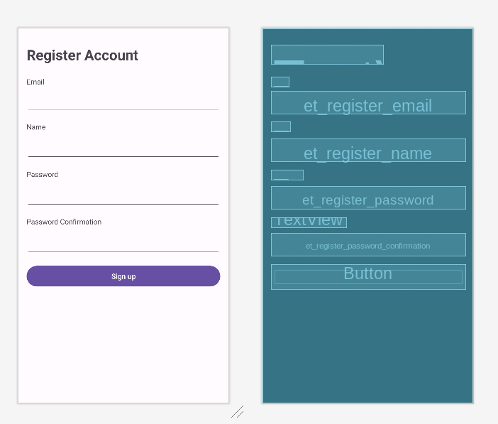
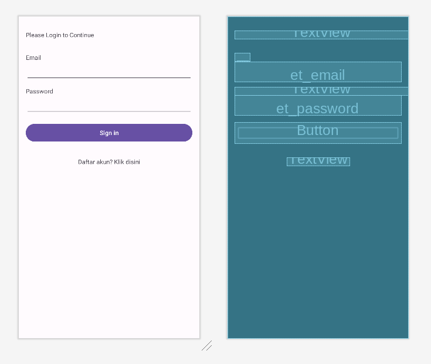

# 9. Membuat Autentikasi

Sekarang saatnya membuat autentikasi, pada kali ini, autentikasi yang akan dibuat tidak akan menggunakan fitur autentikasi dari firebase, melainkan masih menggunakan firestore. Hal ini bertujuan untuk membuat sederhana proses autentikasi tanpa bertele-tele meminta permission ke firebase.

Pertama, buatlah activity baru (pilih empty views activity atau empty activity untuk android studio versi lama) lalu buatlah actvitiy baru bernama RegisterActivity.

Sekarang ubah code layout dari `activity_register.xml` menjadi seperti berikut:

```xml
<?xml version="1.0" encoding="utf-8"?>
<androidx.constraintlayout.widget.ConstraintLayout xmlns:android="http://schemas.android.com/apk/res/android"
    xmlns:app="http://schemas.android.com/apk/res-auto"
    xmlns:tools="http://schemas.android.com/tools"
    android:layout_width="match_parent"
    android:layout_height="match_parent"
    tools:context=".RegisterActivity">

    <androidx.constraintlayout.widget.ConstraintLayout
        android:id="@+id/constraintLayout"
        android:layout_width="match_parent"
        android:layout_height="match_parent"
        tools:context=".LoginActivity"
        tools:layout_editor_absoluteX="0dp"
        tools:layout_editor_absoluteY="47dp">

        <TextView
            android:id="@+id/label_register_email"
            android:layout_width="wrap_content"
            android:layout_height="wrap_content"
            android:layout_marginStart="16dp"
            android:layout_marginTop="24dp"
            android:layout_marginEnd="160dp"
            android:text="Email"
            app:layout_constraintEnd_toEndOf="@+id/label_header3"
            app:layout_constraintHorizontal_bias="0.0"
            app:layout_constraintStart_toStartOf="parent"
            app:layout_constraintTop_toBottomOf="@+id/label_header3" />

        <TextView
            android:id="@+id/label_pass"
            android:layout_width="wrap_content"
            android:layout_height="wrap_content"
            android:layout_marginStart="16dp"
            android:layout_marginTop="16dp"
            android:text="Password"
            app:layout_constraintStart_toStartOf="parent"
            app:layout_constraintTop_toBottomOf="@+id/et_register_name" />

        <TextView
            android:id="@+id/label_password_confirmation"
            android:layout_width="wrap_content"
            android:layout_height="wrap_content"
            android:layout_marginStart="16dp"
            android:layout_marginTop="16dp"
            android:text="Password Confirmation"
            app:layout_constraintStart_toStartOf="parent"
            app:layout_constraintTop_toBottomOf="@+id/et_register_password" />

        <EditText
            android:id="@+id/et_register_password"
            android:layout_width="0dp"
            android:layout_height="wrap_content"
            android:layout_marginStart="16dp"
            android:layout_marginTop="12dp"
            android:layout_marginEnd="16dp"
            android:ems="10"
            android:inputType="textPassword"
            app:layout_constraintEnd_toEndOf="parent"
            app:layout_constraintHorizontal_bias="0.079"
            app:layout_constraintStart_toStartOf="parent"
            app:layout_constraintTop_toBottomOf="@+id/label_pass" />

        <EditText
            android:id="@+id/et_register_password_confirmation"
            android:layout_width="0dp"
            android:layout_height="wrap_content"
            android:layout_marginStart="16dp"
            android:layout_marginTop="12dp"
            android:layout_marginEnd="16dp"
            android:ems="10"
            android:inputType="textPassword"
            app:layout_constraintEnd_toEndOf="parent"
            app:layout_constraintStart_toStartOf="parent"
            app:layout_constraintTop_toBottomOf="@+id/label_password_confirmation" />

        <EditText
            android:id="@+id/et_register_email"
            android:layout_width="0dp"
            android:layout_height="wrap_content"
            android:layout_marginStart="16dp"
            android:layout_marginTop="8dp"
            android:layout_marginEnd="16dp"
            android:ems="10"
            android:inputType="text"
            app:layout_constraintEnd_toEndOf="parent"
            app:layout_constraintHorizontal_bias="0.0"
            app:layout_constraintStart_toStartOf="parent"
            app:layout_constraintTop_toBottomOf="@+id/label_register_email" />

        <TextView
            android:id="@+id/label_header3"
            android:layout_width="wrap_content"
            android:layout_height="wrap_content"
            android:layout_marginTop="32dp"
            android:text="Register Account"
            android:textSize="28dp"
            android:textStyle="bold"
            app:layout_constraintEnd_toEndOf="parent"
            app:layout_constraintHorizontal_bias="0.083"
            app:layout_constraintStart_toStartOf="parent"
            app:layout_constraintTop_toTopOf="parent" />

        <EditText
            android:id="@+id/et_register_name"
            android:layout_width="0dp"
            android:layout_height="wrap_content"
            android:layout_marginStart="16dp"
            android:layout_marginTop="12dp"
            android:layout_marginEnd="16dp"
            android:ems="10"
            android:inputType="text"
            app:layout_constraintEnd_toEndOf="parent"
            app:layout_constraintStart_toStartOf="parent"
            app:layout_constraintTop_toBottomOf="@+id/textView4" />

        <TextView
            android:id="@+id/textView4"
            android:layout_width="wrap_content"
            android:layout_height="wrap_content"
            android:layout_marginStart="16dp"
            android:layout_marginTop="16dp"
            android:text="Name"
            app:layout_constraintStart_toStartOf="parent"
            app:layout_constraintTop_toBottomOf="@+id/et_register_email" />

        <Button
            android:id="@+id/btn_register"
            android:layout_width="0dp"
            android:layout_height="wrap_content"
            android:layout_marginStart="16dp"
            android:layout_marginTop="16dp"
            android:layout_marginEnd="16dp"
            android:text="Sign up"
            app:layout_constraintEnd_toEndOf="parent"
            app:layout_constraintStart_toStartOf="parent"
            app:layout_constraintTop_toBottomOf="@+id/et_register_password_confirmation" />
    </androidx.constraintlayout.widget.ConstraintLayout>

</androidx.constraintlayout.widget.ConstraintLayout>
```

Kamu akan menemukan tampilannya sebagai berikut:



Sekarang pergi ke `RegisterActivity.kt` lalu ubah codenya sebagai berikut:

```kotlin

import android.content.ContentValues.TAG
import androidx.appcompat.app.AppCompatActivity
import android.os.Bundle
import android.util.Log
import android.widget.Button
import android.widget.EditText
import android.widget.Toast
import com.google.firebase.firestore.ktx.firestore
import com.google.firebase.ktx.Firebase

class RegisterActivity : AppCompatActivity() {

    lateinit var btnRegister : Button
    lateinit var etEmail : EditText
    lateinit var etName : EditText
    lateinit var etPassword : EditText
    lateinit var etPasswordConfirmation : EditText

    override fun onCreate(savedInstanceState: Bundle?) {
        super.onCreate(savedInstanceState)
        setContentView(R.layout.activity_register)

        btnRegister = findViewById(R.id.btn_register)
        etEmail = findViewById(R.id.et_register_email)
        etName = findViewById(R.id.et_register_name)
        etPassword = findViewById(R.id.et_register_password)
        etPasswordConfirmation = findViewById(R.id.et_register_password_confirmation)

        btnRegister.setOnClickListener {
            var userModel = UserModel(
                Email = etEmail.text.toString(),
                Name = etName.text.toString(),
                Password = PasswordHelper.md5(etPassword.text.toString())
            )

            checkUser(etEmail.text.toString()) { isSuccess, isRegistered ->
                if (!isSuccess) {
                    Toast.makeText(
                        applicationContext,
                        "Terjadi kesalahan",
                        Toast.LENGTH_SHORT
                    ).show()
                    return@checkUser
                } else if (isRegistered) {
                    Toast.makeText(
                        applicationContext,
                        "Akun dengan email ${etEmail.text.toString()} sudah terdaftar!",
                        Toast.LENGTH_SHORT
                    ).show()
                    return@checkUser
                }

                this.registerUser(userModel)
            }
        }
    }

    private fun checkUser(email: String, checkResult: (isSuccess: Boolean, isRegistered: Boolean) -> Unit) {
        val db = Firebase.firestore
        db.collection("users").whereEqualTo("email", email)
            .get()
            .addOnSuccessListener { documents ->

                var isSuccess = true
                var isRegistered = false

                if (!documents.isEmpty) {
                    isRegistered = true
                }
                checkResult.invoke(isSuccess, isRegistered)
            }
            .addOnFailureListener { exception ->
                checkResult.invoke(false, false)
                Log.w(TAG, "Error getting documents: ", exception)
            }
    }

    fun registerUser(userModel: UserModel) {
        val db = Firebase.firestore
        db.collection("users")
            .add(userModel)
            .addOnSuccessListener { documentReference ->
                Toast.makeText(
                    applicationContext,
                    "Berhasil melakukan registrasi!",
                    Toast.LENGTH_SHORT
                ).show()

                finish()
            }
            .addOnFailureListener { e ->
                Log.w(TAG, "Error adding document", e)
            }
    }
}
```

Sekarang buat Activity baru bernama `LoginActivity`,  lalu ubah layout activity_login.xml dengan kode berikut:

```xml
<?xml version="1.0" encoding="utf-8"?>
<androidx.constraintlayout.widget.ConstraintLayout xmlns:android="http://schemas.android.com/apk/res/android"
    xmlns:app="http://schemas.android.com/apk/res-auto"
    xmlns:tools="http://schemas.android.com/tools"
    android:layout_width="match_parent"
    android:layout_height="match_parent"
    tools:context=".LoginActivity">

    <androidx.constraintlayout.widget.ConstraintLayout
        android:id="@+id/constraintLayout2"
        android:layout_width="match_parent"
        android:layout_height="match_parent"
        tools:context=".CreateTodoActivity"
        tools:layout_editor_absoluteX="-39dp"
        tools:layout_editor_absoluteY="0dp">

        <TextView
            android:id="@+id/label_email"
            android:layout_width="wrap_content"
            android:layout_height="wrap_content"
            android:layout_marginStart="16dp"
            android:layout_marginTop="32dp"
            android:text="Email"
            app:layout_constraintStart_toStartOf="parent"
            app:layout_constraintTop_toBottomOf="@+id/textView5" />

        <EditText
            android:id="@+id/et_email"
            android:layout_width="0dp"
            android:layout_height="wrap_content"
            android:layout_marginStart="16dp"
            android:layout_marginEnd="16dp"
            android:ems="10"
            android:inputType="text"
            app:layout_constraintEnd_toEndOf="parent"
            app:layout_constraintStart_toStartOf="parent"
            app:layout_constraintTop_toBottomOf="@+id/label_email" />

        <EditText
            android:id="@+id/et_password"
            android:layout_width="0dp"
            android:layout_height="wrap_content"
            android:layout_marginStart="16dp"
            android:layout_marginEnd="16dp"
            android:ems="10"
            android:inputType="textPassword"
            app:layout_constraintEnd_toEndOf="parent"
            app:layout_constraintStart_toStartOf="parent"
            app:layout_constraintTop_toBottomOf="@+id/label_password" />

        <TextView
            android:id="@+id/label_password"
            android:layout_width="0dp"
            android:layout_height="wrap_content"
            android:layout_marginStart="16dp"
            android:layout_marginTop="12dp"
            android:text="Password"
            app:layout_constraintEnd_toEndOf="parent"
            app:layout_constraintStart_toStartOf="parent"
            app:layout_constraintTop_toBottomOf="@+id/et_email" />

        <Button
            android:id="@+id/btn_login"
            android:layout_width="0dp"
            android:layout_height="wrap_content"
            android:layout_marginStart="16dp"
            android:layout_marginTop="16dp"
            android:layout_marginEnd="16dp"
            android:text="Sign in"
            app:layout_constraintEnd_toEndOf="parent"
            app:layout_constraintStart_toStartOf="parent"
            app:layout_constraintTop_toBottomOf="@+id/et_password" />

        <TextView
            android:id="@+id/text_page_register"
            android:layout_width="wrap_content"
            android:layout_height="wrap_content"
            android:layout_marginTop="32dp"
            android:text="Daftar akun? Klik disini"
            app:layout_constraintEnd_toEndOf="parent"
            app:layout_constraintStart_toStartOf="parent"
            app:layout_constraintTop_toBottomOf="@+id/btn_login" />

        <TextView
            android:id="@+id/textView5"
            android:layout_width="0dp"
            android:layout_height="wrap_content"
            android:layout_marginStart="16dp"
            android:layout_marginTop="32dp"
            android:text="Please Login to Continue"
            app:layout_constraintEnd_toEndOf="parent"
            app:layout_constraintStart_toStartOf="parent"
            app:layout_constraintTop_toTopOf="parent" />

    </androidx.constraintlayout.widget.ConstraintLayout>

</androidx.constraintlayout.widget.ConstraintLayout>
```

Kamu akan menemukan tampilan halaman login seperti ini:



Sekarang ubah code `LoginActivity.kt` agar menjadi seperti ini:

```kotlin
import android.content.Context
import android.content.Intent
import androidx.appcompat.app.AppCompatActivity
import android.os.Bundle
import android.widget.Button
import android.widget.EditText
import android.widget.TextView
import android.widget.Toast
import com.google.firebase.firestore.ktx.firestore
import com.google.firebase.ktx.Firebase

class LoginActivity : AppCompatActivity() {

    lateinit var btnLogin : Button
    lateinit var etEmail : EditText
    lateinit var etPassword : EditText
    lateinit var txtRegister : TextView

    override fun onCreate(savedInstanceState: Bundle?) {
        super.onCreate(savedInstanceState)
        setContentView(R.layout.activity_login)

        val sharedPreference =  getSharedPreferences(
            "app_preference", Context.MODE_PRIVATE
        )

        var id = sharedPreference.getString("id", "").toString()

        if (!id.isNullOrBlank()) {
            val intent = Intent(this, MainActivity::class.java)
            startActivity(intent)
            finish()
        }


        btnLogin = findViewById(R.id.btn_login)
        etEmail = findViewById(R.id.et_email)
        etPassword = findViewById(R.id.et_password)

        txtRegister = findViewById(R.id.text_page_register)

        txtRegister.setOnClickListener {
            val intent = Intent(this, RegisterActivity::class.java)
            startActivity(intent)
        }

        btnLogin.setOnClickListener {
            this.auth(etEmail.text.toString(), etPassword.text.toString()) { isValid ->
                if (!isValid) {
                    Toast.makeText(
                        applicationContext,
                        "Username atau passworrd salah!",
                        Toast.LENGTH_SHORT
                    ).show()
                    return@auth
                }

                val intent = Intent(this, MainActivity::class.java)
                startActivity(intent)
                finish()
            }
        }
    }

    private fun auth(email: String, password: String, checkResult: (isValid: Boolean) -> Unit) {
        val db = Firebase.firestore
        db.collection("users").whereEqualTo("email", email)
            .get()
            .addOnSuccessListener { documents ->
                    var isValid = false

                    for (document in documents) {
                        var pass = document.data.get("password").toString()

                        if (!pass.equals(PasswordHelper.md5(password).toString() )) {
                            break
                        }

                        val sharedPreference =  getSharedPreferences(
                            "app_preference", Context.MODE_PRIVATE
                        )

                        var editor = sharedPreference.edit()
                        editor.putString("id", document.id.toString())
                        editor.putString("name", document.data.get("name").toString())
                        editor.putString("email", document.data.get("email").toString())
                        editor.commit()

                        isValid = true
                    }

                    checkResult.invoke(isValid)
                }

    }
}
```

Sekarang ini yang akan terjadi apabila kodemu dijalankan:

Sekarang pergi ke `AndroidManifest.xml`, dan ganti pada bagian Activity pada bagian Login agar menjadi activity utama, perhatikan kode berikut dan komparasi dengan punyamu:

> [!NOTE]
> Jangan langsung di copy paste, perhatikan!

```xml
<?xml version="1.0" encoding="utf-8"?>
<manifest xmlns:android="http://schemas.android.com/apk/res/android"
    xmlns:tools="http://schemas.android.com/tools">

    <application
        android:allowBackup="true"
        android:dataExtractionRules="@xml/data_extraction_rules"
        android:fullBackupContent="@xml/backup_rules"
        android:icon="@mipmap/ic_launcher"
        android:label="@string/app_name"
        android:roundIcon="@mipmap/ic_launcher_round"
        android:supportsRtl="true"
        android:theme="@style/Theme.TodoFirebase"
        tools:targetApi="31">
        <activity
            android:name=".LoginActivity"
            android:exported="true">
            <intent-filter>
                <action android:name="android.intent.action.MAIN" />

                <category android:name="android.intent.category.LAUNCHER" />
            </intent-filter>
        </activity>
        <activity
            android:name=".RegisterActivity"
            android:exported="false" />
        <activity
            android:name=".CreateTodoActivity"
            android:exported="false" />
        <activity
            android:name=".MainActivity"
            android:exported="false">
        </activity>
    </application>

    <uses-permission android:name="android.permission.INTERNET"/>

</manifest>
```