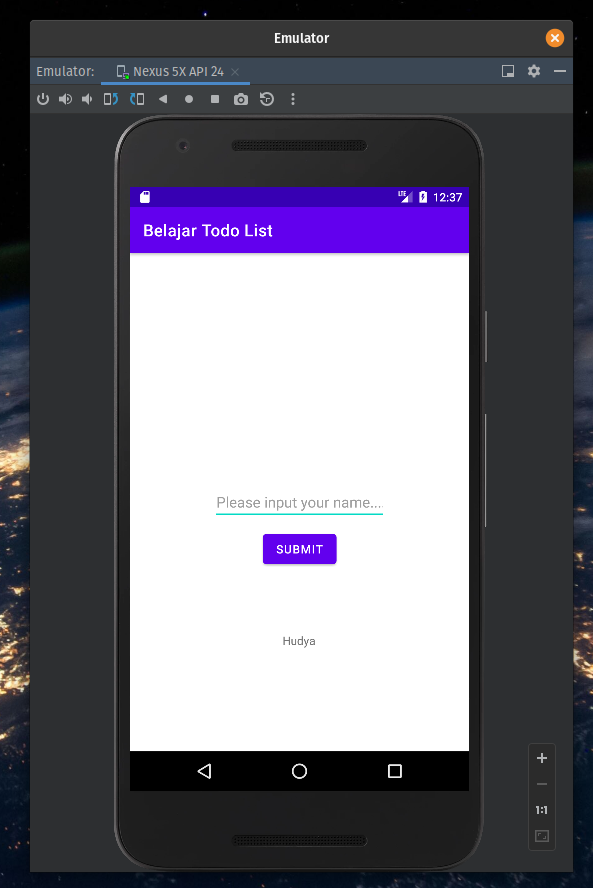

## Answer

Ganti kode pada `MainActivity.kt` menjadi seperti ini:

```kotlin
package com.example.belajartodolist

import androidx.appcompat.app.AppCompatActivity
import android.os.Bundle
import android.widget.Button
import android.widget.EditText
import android.widget.TextView
import android.widget.Toast

class MainActivity : AppCompatActivity() {

    lateinit var btnSubmit : Button
    lateinit var etName : EditText
    lateinit var txtName : TextView

    override fun onCreate(savedInstanceState: Bundle?) {
        super.onCreate(savedInstanceState)
        setContentView(R.layout.activity_main)

        btnSubmit = findViewById(R.id.btn_submit)
        etName = findViewById(R.id.et_name)
        txtName = findViewById(R.id.txt_name)

        btnSubmit.setOnClickListener {
            if (etName.text.isEmpty()) {
                Toast.makeText(
                    applicationContext,
                    "Harap isi nama terlebih dahulu",
                    Toast.LENGTH_SHORT
                ).show()
                return@setOnClickListener
            }

            txtName.text = etName.text
            etName.text = null
        }
    }
}
```

Hasilnya menjadi seperti ini

