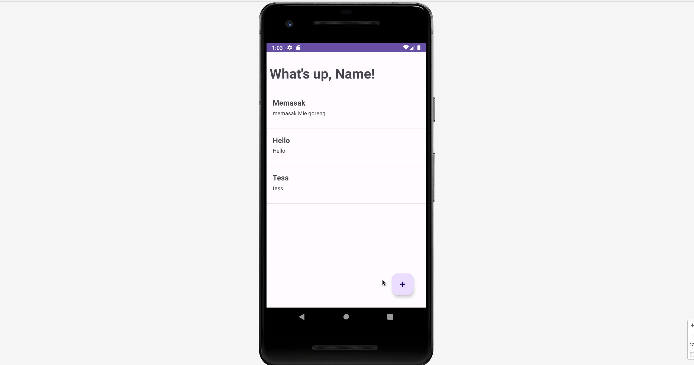

Jawabannya sederhana, kamu hanya perlu membuat sebuah fungsi baru yang melakukan get data dari firebase.

```kotlin
fun getData() {
    val db = Firebase.firestore
    db.collection("todo")
        .get()
        .addOnSuccessListener { result ->
            val Items = ArrayList<TodoModel>()

            for (document in result) {
                Log.d(TAG, "${document.id} => ${document.data}")
                Items.add(
                    TodoModel(
                        document.id.toString(),
                        document.data.get("title").toString(),
                        document.data.get("description").toString()
                    )
                )
            }

            val adapter = TodoAdapter(this, R.layout.todo_item, Items)
            listTodo.adapter = adapter
        }
        .addOnFailureListener { exception ->
            Log.w(TAG, "Error getting documents.", exception)
        }
}
```

Fungsi ini akan dipanggil pada dua tempat, yang pertama pada saat `onCreate`, dan pada saat `onResume` ketika screen kembali berpindah dari layar menambahkan todo.

Secara keseluruhan file, akan menjadi seperti ini:

```kotlin

import android.content.ContentValues.TAG
import androidx.appcompat.app.AppCompatActivity
import android.os.Bundle
import android.util.Log
import android.widget.ListView
import com.google.android.material.floatingactionbutton.FloatingActionButton
import com.google.firebase.firestore.ktx.firestore
import com.google.firebase.ktx.Firebase
import android.content.Intent

class MainActivity : AppCompatActivity() {

    lateinit var listTodo : ListView
    lateinit var btnCreateTodo : FloatingActionButton

    override fun onCreate(savedInstanceState: Bundle?) {
        super.onCreate(savedInstanceState)
        setContentView(R.layout.activity_main)

        listTodo = findViewById(R.id.list_todo)
        btnCreateTodo = findViewById(R.id.btn_create_todo)

        this.getData()

        btnCreateTodo.setOnClickListener {
            val intent = Intent(this, CreateTodoActivity::class.java)
            startActivity(intent)
        }
    }

    override fun onResume() {
        super.onResume()
        this.getData()
    }

    fun getData() {
        val db = Firebase.firestore
        db.collection("todo")
            .get()
            .addOnSuccessListener { result ->
                val Items = ArrayList<TodoModel>()

                for (document in result) {
                    Log.d(TAG, "${document.id} => ${document.data}")
                    Items.add(
                        TodoModel(
                            document.id.toString(),
                            document.data.get("title").toString(),
                            document.data.get("description").toString()
                        )
                    )
                }

                val adapter = TodoAdapter(this, R.layout.todo_item, Items)
                listTodo.adapter = adapter
            }
            .addOnFailureListener { exception ->
                Log.w(TAG, "Error getting documents.", exception)
            }
    }
}
```

Hasil:

