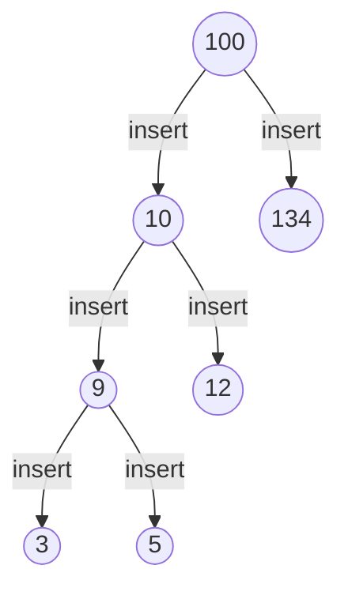
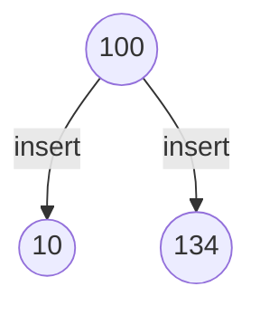
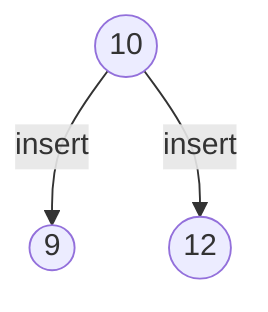
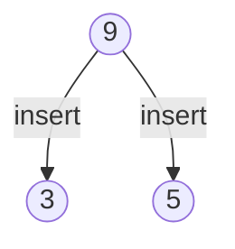
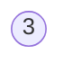

<br/>

by [@perogeremmer](https://twitter.com/perogeremmer)

**Table of contents**

- [Introduction](#introduction)
- [Ngoding](#ngoding)
- [Mengurutkan dari Kiri](#mengurutkan-dari-kiri)
- [Pencarian](#pencarian)
- [Time Complexity](#time-complexity)

## Introduction

Ketika kamu lagi belajar data struktur, tentunya kamu mempelajari salah satu algoritma sorting bernama Tree. Tree ini dasarnya dari binary search tree, cuma yang membedakannya dari tree biasa adalah dimana binary search tree juga akan mengimplementasikan algoritma untuk searching.

Gambaran untuk binary search tree kurang lebih ya sama kaya tree:


Bisa kita lihat bahwa 100 sebagai root akan menggeser ke kanan atau kiri untuk membuat cabang barunya, apabila nilai yang akan dimasukkan lebih kecil dari akarnya pada bagian atas, maka akan ditaruh pada bagian kiri, sedangkan jika lebih besar sama dengan dari akarnya, akan ditaruh di bagian kanan, **as simple as that**.

Misalnya untuk angka 134, 134 lebih besar dari 100 maka taruh sebelah kanan. Untuk angka 101, 101 lebih besar dari 100, maka lempar ke kanan, namun 101 lebih kecil dari 134, maka taruh di sebelah kiri.

Gimana kalo ada angka baru, misalnya 100, dan 101, maka hasilnya akan seperti ini:


Seperti yang saya tulis di atas bahwa 100 lebih besar sama dengan 100 (akar utama), maka taruh sebelah kanan. Kemudian turun ke 134, lempar ke kiri, bertemu 101, lempar lagi ke kiri karena 100 < 101.

Apabila yang masuk nilai baru adalah 101, lempar ke kanan karena 101 > 100 (akar utama), kemudian 101 < 134, lempar ke kiri. Terakhir, 101 tidak lebih kecil dari 101, maka lempar ke kanan.

## Ngoding

Nah setelah belajar teorinya sedikit, kita akan masuk ke bagian kode. Disini saya pake Python biar simple ya, bikin sebuah file dan masukkan kode berikut:

```python
class TreeNode:

    def __init__(self, root):
        self.left = None
        self.right = None
        self.root = root

    def insert(self, value):
        if value < self.root:
            if not self.left:
                self.left = TreeNode(root=value)
            else:
                self.left.insert(value)
        else:
            if not self.right:
                self.right = TreeNode(root=value)
            else:
                self.right.insert(value)

tree = TreeNode(100)
tree.insert(10)
tree.insert(134)
tree.insert(9)
tree.insert(12)
tree.insert(153)
tree.insert(101)

print(tree.left.root)
print(tree.right.root)
print(tree.left.left.root)
```

Apa hasilnya? Yup:

```bash
hudya@pop-os:~/code/data-structure/binary-tree$ python3 main.py 
10
134
9
```

Inilah bentuk graph kita barusan:


<br />
<br />

- Kita cetak tree -> kiri -> root hasilnya adalah 10.
- Kita cetak tree -> kanan -> root hasilnya adalah 134.
- Kita cetak tree -> kiri -> kiri -> root hasilnya adalah 9.

<br />

Sederhana bukan?

## Mengurutkan dari Kiri

Ini belum selesai, sekarang kita pengen supaya kalau kita pengen ngurutin nilai, ubah class `TreeNode` jadi seperti berikut:

```python
class TreeNode:

    def __init__(self, root):
        self.left = None
        self.right = None
        self.root = root

    def insert(self, value):
        if value < self.root:
            if not self.left:
                self.left = TreeNode(root=value)
            else:
                self.left.insert(value)
        else:
            if not self.right:
                self.right = TreeNode(root=value)
            else:
                self.right.insert(value)

    def inorder_traversal(self):
        if self.left:
            self.left.inorder_traversal()
        print(self.root)
        if self.right:
            self.right.inorder_traversal()

tree = TreeNode(100)
tree.insert(10)
tree.insert(134)
tree.insert(9)
tree.insert(12)
tree.insert(153)
tree.insert(101)

tree.inorder_traversal()
```

Hasilnya akan seperti ini:

```bash
hudya@pop-os:~/code/data-structure/binary-tree$ python3 main.py 
9
10
12
100
101
134
153
```

Fungsi ini digunakan untuk mencetak semua nilai dari nilai terkecil pada bagian kiri. Jadi bisa dikatakan algoritmanya adalah, cetak pada bagian kiri, apabila ada cabang kiri, cetak, kemudian cetak akarnya, lalu cetak bagian kanan.

Mengapa kita bisa mendapatkan nilai 100 pada bagian tengah? Karena code ini:

```python
if self.left:
    self.left.inorder_traversal()
```

Dia memanggil dirinya sendiri (rekursif).

Seperti yang kita ketahui, kita menyimpan nilai pada sebuah objek `class TreeNode`. Ketika kita menyimpan objek, otomatis kita dapat memanggil nilai di dalamnya.

Hal inilah yang menyebabkan kita dapat memanggil fungsi `inorder_traversal` dari objek `left`. Mengapa? Karena objek left tersebut adalah `class TreeNode`.

Sekarang tambahkan kode kamu dengan fungsi baru, menjadi seperti ini:

```python
class TreeNode:

    def __init__(self, root):
        self.left = None
        self.right = None
        self.root = root

    def insert(self, value):
        if value < self.root:
            if not self.left:
                self.left = TreeNode(root=value)
            else:
                self.left.insert(value)
        else:
            if not self.right:
                self.right = TreeNode(root=value)
            else:
                self.right.insert(value)

    def inorder_traversal(self):
        if self.left:
            self.left.inorder_traversal()
        print(self.root)
        if self.right:
            self.right.inorder_traversal()

    def preorder_traversal(self):
        print(self.root)
        if self.left:
            self.left.preorder_traversal()
        if self.right:
            self.right.preorder_traversal()

tree = TreeNode(100)
tree.insert(10)
tree.insert(134)
tree.insert(9)
tree.insert(12)
tree.insert(153)
tree.insert(101)

tree.preorder_traversal()
```

Apa hasilnya? Yup:

```bash
hudya@pop-os:~/code/data-structure/binary-tree$ python3 main.py 
100
10
9
12
134
101
153
```

Nilai 100-nya (akar) dicetak duluan, kemudian dia nyetak dari cabang kiri (lebih kecil), baru cabang kanan (lebih besar).

Terakhir, kita cetak dimana akar utamanya dicetak terakhir, ubah kode kamu jadi kaya gini:

```python
class TreeNode:

    def __init__(self, root):
        self.left = None
        self.right = None
        self.root = root

    def insert(self, value):
        if value < self.root:
            if not self.left:
                self.left = TreeNode(root=value)
            else:
                self.left.insert(value)
        else:
            if not self.right:
                self.right = TreeNode(root=value)
            else:
                self.right.insert(value)

    def inorder_traversal(self):
        if self.left:
            self.left.inorder_traversal()
        print(self.root)
        if self.right:
            self.right.inorder_traversal()

    def preorder_traversal(self):
        print(self.root)
        if self.left:
            self.left.preorder_traversal()
        if self.right:
            self.right.preorder_traversal()

    def postorder_traversal(self):
        if self.left:
            self.left.postorder_traversal()
        if self.right:
            self.right.postorder_traversal()
        print(self.root)


tree = TreeNode(100)
tree.insert(10)
tree.insert(134)
tree.insert(9)
tree.insert(12)
tree.insert(153)
tree.insert(101)

tree.postorder_traversal()
```

Hasilnya?

```bash
hudya@pop-os:~/code/data-structure/binary-tree$ python3 main.py 
9
12
10
101
153
134
100
```

Jadi permasalahan inorder, preorder, dan postorder ini cuma peletakan posisi akarnya aja, mau di tengah? Di awal, apa di akhir? Kalian sendiri yang tentuin nilainya :)

## Pencarian

Gimana caranya melakukan pencarian terhadap sebuah nilai? Perhatikan kode berikut gengs:

```python
def find(self, value):
    if value < self.root:
        if not self.left:
            return False
        else:
            return self.left.find(value)
    elif value > self.root:
        if not self.right:
            return False
        else:
            return self.right.find(value)
    else:
        return True
```

Kita hanya perlu menambahkan fungsi di atas untuk mencari nilai yang kita inginkan. Coba deh kalian perhatiin, secara kode sebenernya ini tuh cukup sederhana:

1. Kalo nilainya lebih kecil dari akar, cari ke kiri
2. Kalo nilainya lebih besar dari akar, cari ke kanan
3. Kalo nilainya sama kaya akar, ya kita asumsiin bahwa itu nilai yang dicari.

Pencarian untuk akar kiri dan kanan juga terbilang sederhana, karena kita menjalankan fungsi rekursif, yang mana ia akan memanggil fungsinya sendiri.

Contoh, pencarian ke kiri:

1. Kalo misalnya nilai yang dicari lebih kecil dari akar, cari ke kiri
2. Kalo misalnya nilai sebelah kiri kosong, maka kembalikan false, tapi kalo ada, kita cek lagi di bagian kiri.

Masih bingung? Anggaplah kita punya graph seperti ini, kita misalnya pengen cari angka 3:



Pertama, bentuk pencariannya akan menjadi seperti ini:



Karena nilai yang dicari adalah 3, dan 3 lebih kecil dari akarnya yaitu 100, maka kita pindah ke akar kiri.



Kemudian, karena 3 lebih kecil dari 10 maka kita lari ke kiri, yaitu yang akarnya 9.



Lanjut, karena 3 masih lebih kecil dari 9 maka kita lempar ke akar kiri, yaitu yang akarnya 3.



Di akar terakhir, 3 tidak memiliki cabang manapun, lalu bagaimana bisa dideteksi bahwa 3 merupakan nilai yang dicari? Apabila kita perhatikan algoritma di atas sebagai berikut:

1. Kalo nilai lebih kecil dari 3, maka lempar ke cabang kiri
2. Kalo nilai lebih besar dari 3, maka lempar ke cabang kanan.

Inget, kuncinya ada dua, yaitu lebih kecil atau lebih besar, bukan **lebih kecil sama dengan** atau **lebih besar sama dengan**.

Jelas, 3 itu tidak lebih kecil dari 3, dan 3 juga tidak lebih besar dari 3, tapi 3 itu sama dengan 3, maka masuk ke kondisi else terakhir. Sehingga dianggap true.

Kalo kamu pengen liat bentuk kodenya akan menjadi seperti ini:

```python
class TreeNode:

    def __init__(self, root):
        self.left = None
        self.right = None
        self.root = root

    def insert(self, value):
        if value < self.root:
            if not self.left:
                self.left = TreeNode(root=value)
            else:
                self.left.insert(value)
        else:
            if not self.right:
                self.right = TreeNode(root=value)
            else:
                self.right.insert(value)

    def inorder_traversal(self):
        if self.left:
            self.left.inorder_traversal()
        print(self.root)
        if self.right:
            self.right.inorder_traversal()

    def preorder_traversal(self):
        print(self.root)
        if self.left:
            self.left.preorder_traversal()
        if self.right:
            self.right.preorder_traversal()

    def postorder_traversal(self):
        if self.left:
            self.left.postorder_traversal()
        if self.right:
            self.right.postorder_traversal()
        print(self.root)
        
    def find(self, value):
        if value < self.root:
            if not self.left:
                return False
            else:
                return self.left.find(value)
        elif value > self.root:
            if not self.right:
                return False
            else:
                return self.right.find(value)
        else:
            return True


tree = TreeNode(100)
tree.insert(10)
tree.insert(134)
tree.insert(9)
tree.insert(12)
tree.insert(153)
tree.insert(101)

print(tree.find(9))
```

## Time Complexity

Kompleksitas waktu dari BST (Binary Search Tree) ini sangat bergantung dari tinggi akarnya, semakin balance antara akar kiri dan kanan maka semakin baik. Tapi in general, ya kaya begini kompleksitasnya:

- Mencari nilai: O(log n)
- Menambahkan nilai baru: O(log n)
- Menghapus nilai: O(log n)
- Mencari nilai maksimal: O(log n)
- Mengurutkan nilai (in-order traversal): O(n)

Kalo misalnya akarnya gak balance antara kanan dan kiri jadinya kompleksitas waktu terburuknya malah bisa jadi `O(n)` guys.

Gimana biar tetep seimbang? Ya ada teknik lebih advancenya sih untuk merotasi nilai atau nge-restruktur akarnya supaya balance. Well, kita akan bahas nanti ya~
