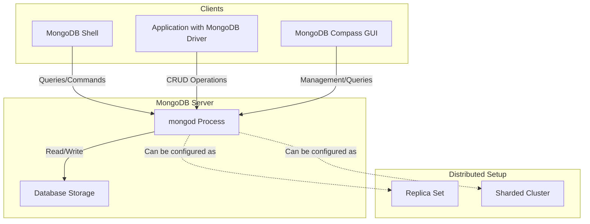
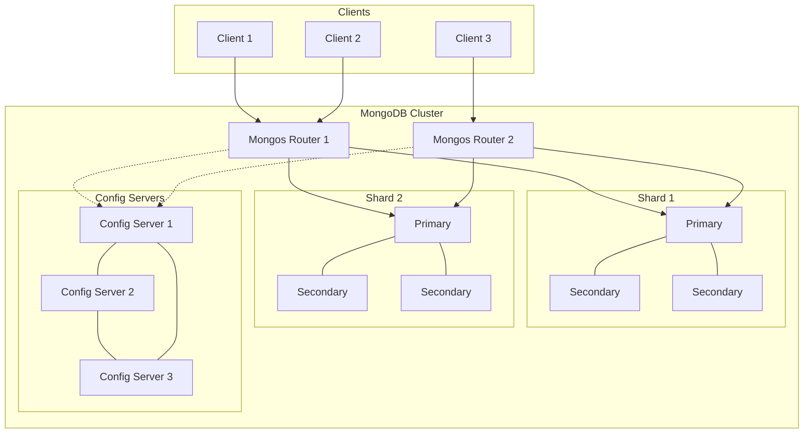

# 2 - Servers and Clients

## Koneksi

Dalam mengakses antara server dan klien, MongoDB secara garis besar sama seperti RDBMS. Perhatikan graph berikut:

## MongoDB Server

Ini adalah inti dari sistem MongoDB, yang menjalankan database engine. Server bertanggung jawab untuk menyimpan, mengambil, dan mengelola data. Biasanya berjalan sebagai proses daemon (mongod) di sistem operasi. Dapat dikonfigurasi untuk berjalan sebagai standalone, replica set, atau sharded cluster.

## MongoDB Clients

Ini adalah aplikasi atau tools yang berinteraksi dengan MongoDB server.

- MongoDB Shell (mongo): Command-line interface untuk berinteraksi dengan database. Biasanya diinstall pada client untuk konfigurasi dan interaksi dasar.
- Driver MongoDB: Library untuk berbagai bahasa pemrograman (seperti Python, Java, Node.js) yang memungkinkan aplikasi berinteraksi dengan MongoDB.
- GUI Tools: Seperti MongoDB Compass untuk manajemen visual database.
- Aplikasi yang Anda kembangkan: Menggunakan driver MongoDB untuk berkomunikasi dengan server.

## Interaksi Client-Server

Clients mengirim permintaan (queries, updates, etc.) ke server. Server memproses permintaan tersebut dan mengembalikan hasilnya ke client. Komunikasi biasanya menggunakan protokol wire yang khusus didesain untuk MongoDB.

## Keamanan

Autentikasi dan otorisasi diterapkan di sisi server.
Clients perlu menyediakan kredensial yang sesuai untuk mengakses database.

## Skalabilitas

MongoDB dapat di-scale secara horizontal dengan menambahkan lebih banyak server (sharding). Clients dapat terhubung ke multiple servers dalam konfigurasi cluster.

Berikut gambaran cluster skalabilitas dalam mongoDB.

