# 3 - Instalasi

MongoDB menawarkan beberapa opsi instalasi yang fleksibel, memungkinkan pengguna untuk memilih metode yang paling sesuai dengan kebutuhan dan lingkungan mereka. Berikut adalah tiga cara umum untuk menginstal dan mengkonfigurasi MongoDB:

## Instalasi Langsung pada Sistem Operasi

### Windows

- MongoDB menyediakan installer khusus untuk Windows yang dapat diunduh dari situs resmi MongoDB.
- Installer ini mencakup MongoDB Server, MongoDB Compass (GUI client), dan MongoDB Shell.
- Proses instalasi melibatkan wizard yang memandu pengguna melalui langkah-langkah konfigurasi awal.
- Setelah instalasi, MongoDB dapat dijalankan sebagai layanan Windows.

### macOS dan Linux

- Untuk macOS, MongoDB dapat diinstal menggunakan Homebrew.
- Pada Linux, instalasi biasanya dilakukan melalui package manager seperti apt untuk Ubuntu atau yum untuk CentOS.
- Setelah instalasi, konfigurasi tambahan mungkin diperlukan, seperti membuat direktori data dan mengatur file konfigurasi.

## Menggunakan Docker

Docker menawarkan cara yang mudah dan konsisten untuk menjalankan MongoDB di berbagai lingkungan:

- image resmi MongoDB tersedia di [Docker Hub](https://hub.docker.com/_/mongo).
- Instalasi melibatkan pulling image MongoDB dan menjalankannya sebagai container.
- Perintah untuk menggunakan docker:
  ```bash
  docker pull mongo
  docker run --name some-mongo -d mongo
  ```
- Docker memungkinkan konfigurasi mudah untuk networking, volume persistence, dan pengaturan environment.
- Ideal untuk pengembangan, testing, dan deployment yang konsisten di berbagai lingkungan.

## MongoDB Atlas (Cloud Service)

MongoDB Atlas adalah layanan cloud yang dikelola oleh MongoDB, Inc.:

- Tidak memerlukan instalasi lokal; semua infrastruktur dikelola di cloud.
- Menawarkan tier gratis untuk pengembangan dan testing.
- Proses setup:

  1. Buat akun di MongoDB Atlas.
  2. Pilih penyedia cloud (AWS, Google Cloud, atau Azure) dan region.
  3. Konfigurasikan cluster (ukuran, replication, dll).
  4. Set up koneksi database dan user authentication.

- Fitur tambahan termasuk backup otomatis, monitoring, dan skalabilitas mudah.
- Cocok untuk aplikasi yang membutuhkan ketersediaan tinggi dan skalabilitas tanpa beban manajemen infrastruktur.

Setiap metode instalasi memiliki kelebihan tersendiri. Instalasi langsung cocok untuk penggunaan lokal dan kontrol penuh. Docker ideal untuk lingkungan pengembangan yang konsisten dan portabel. MongoDB Atlas sempurna untuk yang menginginkan solusi terkelola dengan skalabilitas dan keamanan tingkat enterprise.

## Praktik

Pada tutorial kali ini kita akan menggunakan [Atlas MongoDB](https://www.mongodb.com/products/platform/atlas-database), platform online penyedia mongoDB secara gratis.

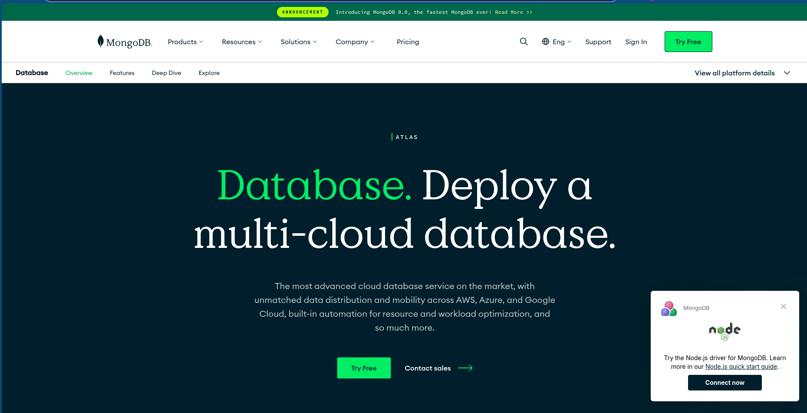

### Register

Silahkan pilih sign in dengan google account atau github. Nantinya kamu akan mendapatkan langkah sebagai berikut, cukup ikuti saja dan isi sesuai yang kamu tahu karena tidak akan berpengaruh apapun.

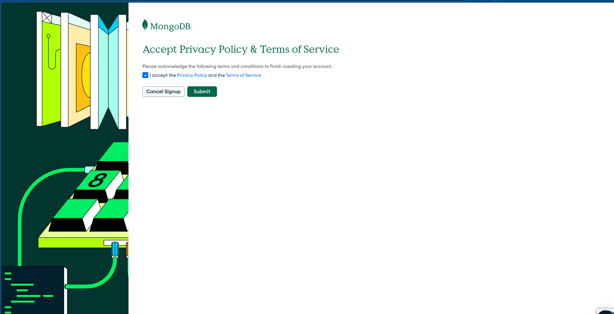

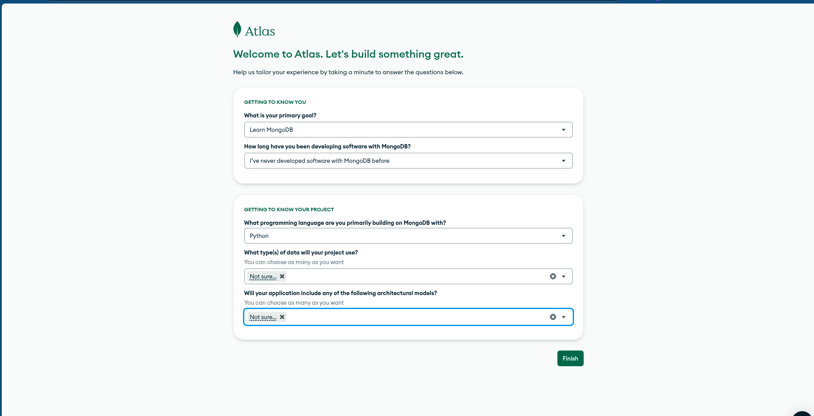

Jika sudah klik finish.

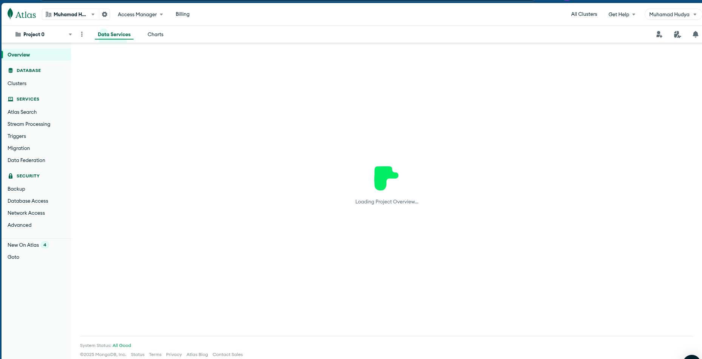

Nantinya kamu akan dibawa ke dashboard untuk layanan mongoDB.

### Membuat database

Perhatikan GIF berikut:


Langkah:

- Klik create cluster
- Pilih tipenya yang Free
- Ganti namanya apabila mau
- Klik create deployment

Tunggu sesaat kemudian kamu akan mendapatkan tampilan berupa credential.

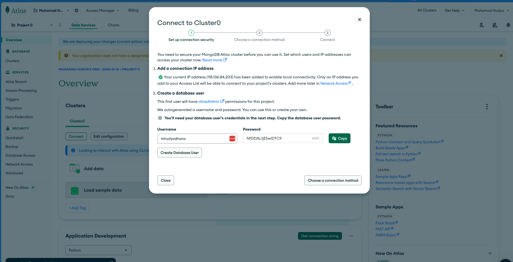

Perhatikan teks pertama, IP Address kita sudah daitambahkan ke local connectivity, **artinya tidak sembarangan IP bisa masuk ke database kita**.

Kita perlu membuat database user, kamu dapat mengganti username dan password.

> [!WARNING]
> Jangan lupa copy password yang sudah ada agar bisa masuk nantinya ke database.

Apabila lupa password nanti bisa mengunjungi halaman database access.

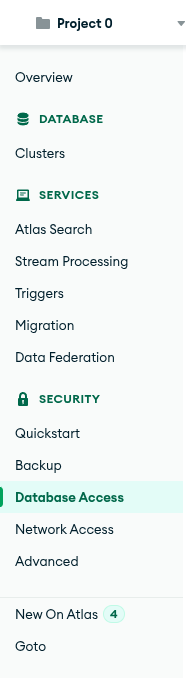

## Terhubung dengan Database

Untuk terkoneksi, kita akan membutuhkan GUI Client, pertama klik connect.

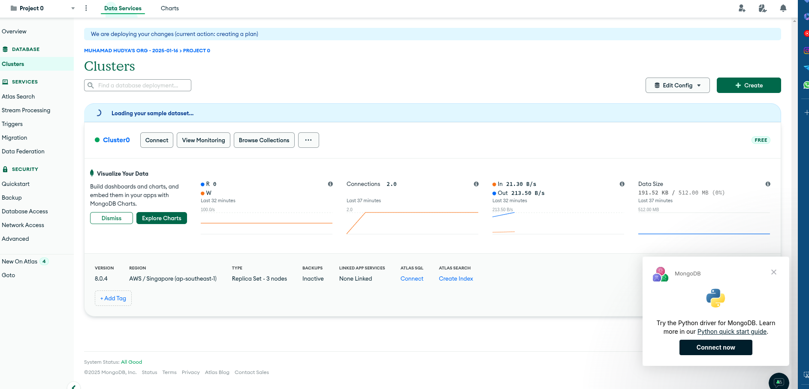

Kemudian pilih shell, kita akan menggunakan Shell untuk memaksimalkan pembelajaran.

Klik Shell.

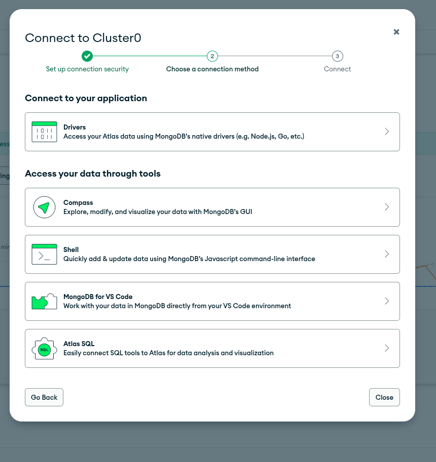

Pilih OS yang sesuai dengan perangkat. Klik download lalu install seperti biasa.

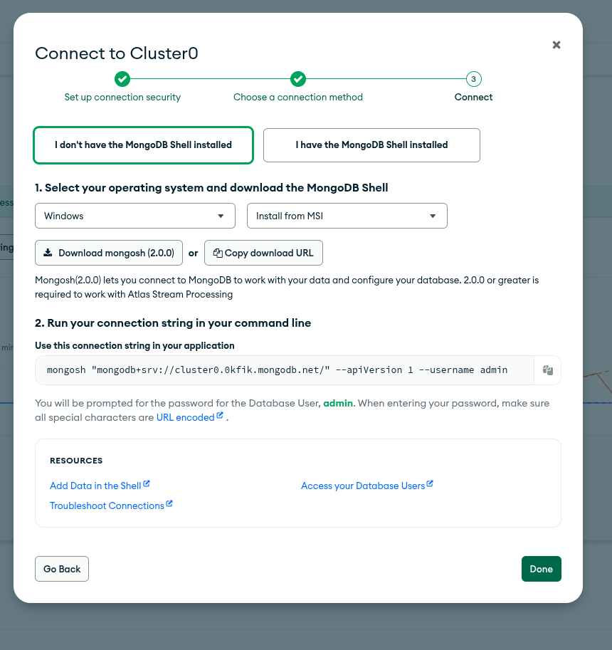

Setelah terinstall buka powershell lalu copy dan paste bagian **"use this connection string in your application"**.

Masukkan ke dalam terminal, lalu masukkan password saat diminta.


Sekarang kamu berhasil masuk ke dalam database mongodb online.

```bash
hudya@perogeremmer-pc:~$ mongosh "mongodb+srv://cluster0.0kfik.mongodb.net/" --apiVersion 1 --username admin
Enter password: ****************
Current Mongosh Log ID:	67891e54a62093eaef0625b2
Connecting to:		mongodb+srv://<credentials>@cluster0.0kfik.mongodb.net/?appName=mongosh+2.0.0
Using MongoDB:		8.0.4 (API Version 1)
Using Mongosh:		2.0.0
mongosh 2.3.8 is available for download: https://www.mongodb.com/try/download/shell

For mongosh info see: https://docs.mongodb.com/mongodb-shell/

Atlas atlas-969x7s-shard-0 [primary] test>
```

Masukkan perintah di bawah untuk melihat daftar database yang tersedia.

```bash
show dbs;
```

Berikut hasilnya.

```bash
Atlas atlas-969x7s-shard-0 [primary] test> show dbs;
belajar         8.00 KiB
sample_mflix  114.23 MiB
admin         348.00 KiB
local           8.96 GiB
```

> [!NOTE]
> Di atas adalah database yang dibuatkan ketika kita membuat cluster. Tidak perlu heran dengan size database local yang mencapai 8.96 GB karena ini merupakan database yang diperlukan mongodb untuk mengelola cluster yang kita gunakan. Karena kita menggunakan versi gratis, maka kita mendapatkan cluster.

Untuk membuat database, cukup masukkan perintah berikut:

```bash
use [namadb]
```

Contoh:

```bash
Atlas atlas-969x7s-shard-0 [primary] as> use latihanmongo;
switched to db latihanmongo
```

Untuk membuat tabel-pun juga mudah, cukup masukkan perintah berikut saat menambahkan data.

```bash
db.[nama table].insert([data dalam bentuk json])
```

Contoh:

```bash
db.users.insert({username: "admin", name: "admin"})
```

Hasil:

```bash
Atlas atlas-969x7s-shard-0 [primary] latihanmongo> db.users.insert({username: "admin", name: "admin"})
DeprecationWarning: Collection.insert() is deprecated. Use insertOne, insertMany, or bulkWrite.
{
  acknowledged: true,
  insertedIds: { '0': ObjectId("67892153a62093eaef0625b3") }
}
```

> [!NOTE]
> MongoDB otomatis membuatkan tabelnya apabila tidak ada.

Untuk melihat datanya cukup gunakan perintah berikut:

```bash
db.[nama tabel].find();
```

Contoh:

```bash
db.users.find();
```

Hasil:

```bash
Atlas atlas-969x7s-shard-0 [primary] latihanmongo> db.users.find();
[
  {
    _id: ObjectId("67892153a62093eaef0625b3"),
    username: 'admin',
    name: 'admin'
  }
]
```

> [!NOTE]
> ID yang di-generate secara otoamtis oleh MongoDB adalah ObjectId, kita tidak perlu menggunakan ID increment ataupun ID dengan spesifik pattern seperti U001 karena ObjectId sudah di-tweak agar performanya lebih baik.

Secara teori, kita bisa saja menambahkan ID dengan angka seperti 1,2,3,4 tapi dalam kasus MongoDB hal tersebut tidak diperlukan.

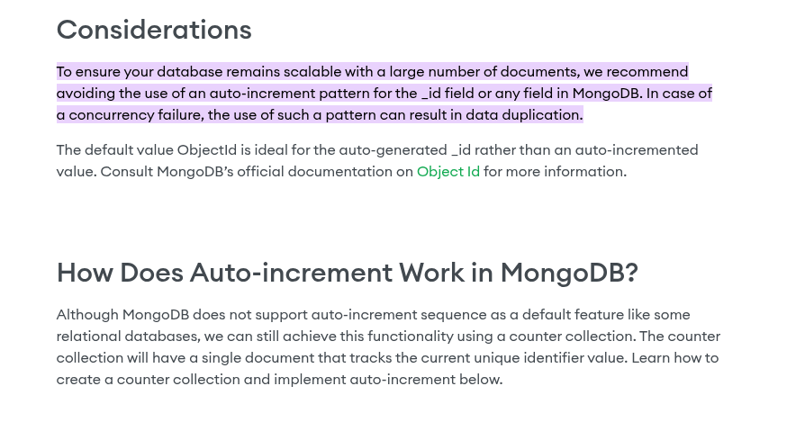

Berdasarkan dokumen [MongoDB](https://www.mongodb.com/resources/products/platform/mongodb-auto-increment#:~:text=To%20ensure%20your%20database%20remains,can%20result%20in%20data%20duplication.), mereka juga menyarankan untuk tidak menggunakan autoincrement.


## Masalah Dengan MongoDB Atlas Cluster

Salah satu masalah paling umum adalah IP kita yang akan berubah ketika kita restart PC ataupun terhubung kembali dengan network.

Contohnya saat login:

```bash
hudya@perogeremmer-pc:~$ mongosh "mongodb+srv://cluster0.0kfik.mongodb.net/" --apiVersion 1 --username admin
Enter password: ****************
Current Mongosh Log ID:	678cab83665ab983e8e9a1a3
Connecting to:		mongodb+srv://<credentials>@cluster0.0kfik.mongodb.net/?appName=mongosh+2.0.0
MongoServerSelectionError: 40D8F0D57B790000:error:0A000438:SSL routines:ssl3_read_bytes:tlsv1 alert internal error:../deps/openssl/openssl/ssl/record/rec_layer_s3.c:1586:SSL alert number 80
. It looks like this is a MongoDB Atlas cluster. Please ensure that your Network Access List allows connections from your IP.
```

Kita tidak perlu panik, cukup login ke dalam dashboard lalu pergi ke **network access**.

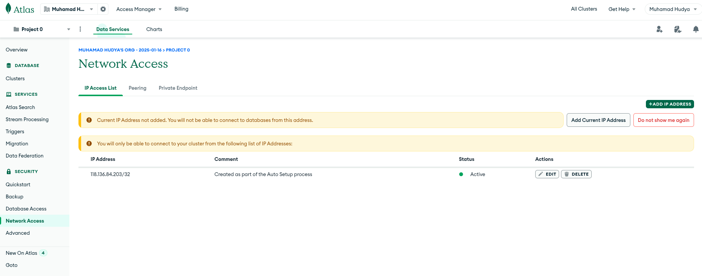

Klik **Add Current IP Address** lalu tunggu hingga selesai. Refresh halamannya dan tunggu karena proses penambahannya sedang dilakukan. Setelah active segera coba kembali.

Hasil:


```bash
hudya@perogeremmer-pc:~$ mongosh "mongodb+srv://cluster0.0kfik.mongodb.net/" --apiVersion 1 --username admin
Enter password: ****************
Current Mongosh Log ID:	678cab83665ab983e8e9a1a3
Connecting to:		mongodb+srv://<credentials>@cluster0.0kfik.mongodb.net/?appName=mongosh+2.0.0
MongoServerSelectionError: 40D8F0D57B790000:error:0A000438:SSL routines:ssl3_read_bytes:tlsv1 alert internal error:../deps/openssl/openssl/ssl/record/rec_layer_s3.c:1586:SSL alert number 80
. It looks like this is a MongoDB Atlas cluster. Please ensure that your Network Access List allows connections from your IP.
hudya@perogeremmer-pc:~$ mongosh "mongodb+srv://cluster0.0kfik.mongodb.net/" --apiVersion 1 --username admin
Enter password: ****************
Current Mongosh Log ID:	678cad8a9a05e75c5db1b0ca
Connecting to:		mongodb+srv://<credentials>@cluster0.0kfik.mongodb.net/?appName=mongosh+2.0.0
Using MongoDB:		8.0.4 (API Version 1)
Using Mongosh:		2.0.0
mongosh 2.3.8 is available for download: https://www.mongodb.com/try/download/shell

For mongosh info see: https://docs.mongodb.com/mongodb-shell/

Atlas atlas-969x7s-shard-0 [primary] test> 
```
