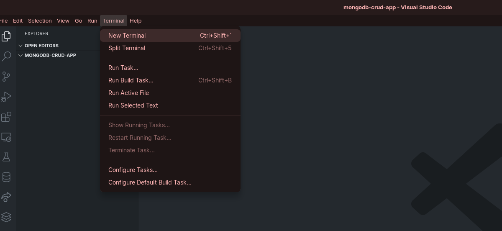
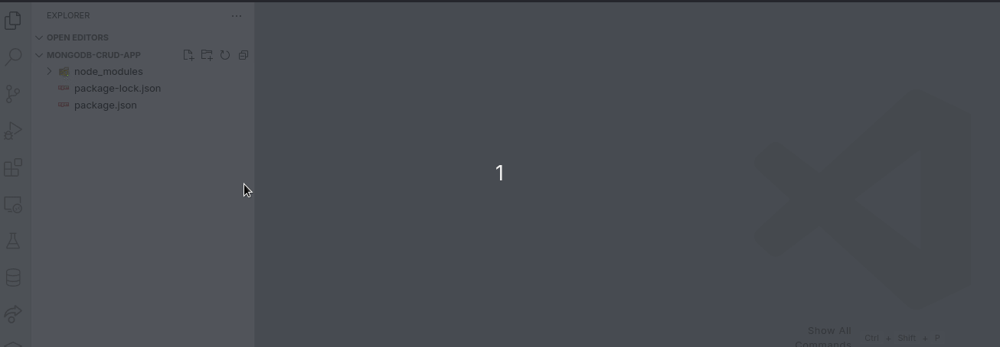
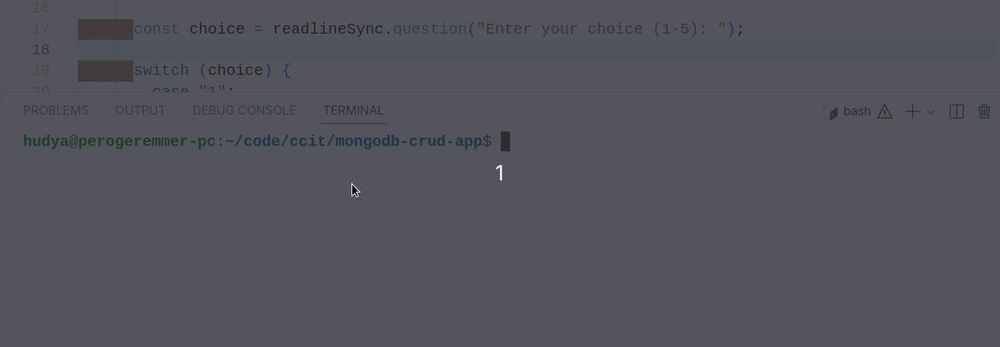

# 7 - Building Todo List with Javascript

Pada artikel ini kamu akan mencoba membuat todo list dengan Javascript. Tujuan dari artikel ini adalah menghubungkan MongoDB Atlas dengan CLI Javascript untuk membuat Todo List

## Persiapan

Pertama, buat folder bernama `mongodb-crud-app` di tempat yang kamu inginkan di komputer/laptopmu.

Kedua, buka visual studio code atau editor yang kamu suka.



Ketiga, jalankan perintah berikut pada terminal:

```bash
npm init -y
```

Hasilnya akan menjadi seperti ini:

```bash
hudya@perogeremmer-pc:~/code/ccit/mongodb-crud-app$ npm init -y
Wrote to /home/hudya/code/ccit/mongodb-crud-app/package.json:

{
  "name": "mongodb-crud-app",
  "version": "1.0.0",
  "description": "",
  "main": "index.js",
  "scripts": {
    "test": "echo \"Error: no test specified\" && exit 1"
  },
  "keywords": [],
  "author": "",
  "license": "ISC"
}

```

Masih berada pada terminal yang sama, jalankan perintah berikut:

```bash
npm install mongodb readline-sync dotenv
```

Kita akan menginstall tiga library, yaitu:

- mongodb: Driver untuk terkoneksi dengan database MongoDB Atlass
- readline-sync: Library untuk menerima input dari CLI
- dotenv: Library untuk membaca file .env

## Membangun Struktur Folder

Perhatikan struktur di bawah ini, kita akan membuat struktur seperti ini:

```text
mongodb-crud-app/
├── app/
│   ├── connection/
│   │   └── mongodb.js
│   └── service/
│       └── item.js
├── node_modules/
├── .env
├── app.js
├── package-lock.json
└── package.json
```

Pertama, buat file `.env` sejajar dengan `package.json`. Perhatikan GIF berikut:



Kedua, buat file `app.js` sejajar dengan `.env`.

Kemudian, buatlah folder `app`. Setelah folder dibuat, dilanjutkan dengan membuat dua buah folder di dalamnya, yaitu `connection` dan `service`.

Langkah terakhir buatlah file `mongodb.js` pada folder `connection` dan file `item.js` pada folder `service`.

Sekarang isi file `mongodb.js` dengan kode berikut:

```javascript
const { MongoClient } = require("mongodb");
require("dotenv").config();

const uri = process.env.MONGODB_URI;
const client = new MongoClient(uri);

async function connect() {
  try {
    await client.connect();
    console.log("Connected to MongoDB Atlas");

    // Nama database dan collection akan ditentukan disini

    return client.db("sample_db").collection("items");
  } catch (error) {
    console.error("Error connecting to database:", error);
    process.exit(1);
  }
}

module.exports = { connect, client };
```

<br />
<br />

Kemudian ubah file `item.js` dengan kode berikut:

```javascript
const { ObjectId } = require("mongodb");

class ItemService {
  constructor(collection) {
    this.collection = collection;
  }

  async insertItem(item) {
    const result = await this.collection.insertOne({
      ...item,
      active: true,
      createdAt: new Date(),
    });
    return result.insertedId;
  }

  async getLatestItems(limit = 5) {
    return await this.collection
      .find({ active: true })
      .sort({ createdAt: -1 })
      .limit(limit)
      .toArray();
  }

  async updateItem(id, updateData) {
    const result = await this.collection.updateOne(
      { _id: new ObjectId(id) },
      { $set: updateData }
    );
    return result.modifiedCount;
  }

  async deleteItem(id) {
    const result = await this.collection.deleteOne({ _id: new ObjectId(id) });
    return result.deletedCount;
  }

  async getItemById(id) {
    return await this.collection.findOne({ _id: new ObjectId(id) });
  }
}

module.exports = ItemService;
```

<br />
<br />

Terakhir ubah file `app.js` dengan kode berikut:

```javascript
const readlineSync = require("readline-sync");
const { connect, client } = require("./app/connection/mongodb");
const ItemService = require("./app/service/item");

async function main() {
  try {
    const collection = await connect();
    const itemService = new ItemService(collection);

    while (true) {
      console.log("\n1. Insert new item");
      console.log("2. Display 5 latest active items");
      console.log("3. Update an item");
      console.log("4. Delete an item");
      console.log("5. Exit");

      const choice = readlineSync.question("Enter your choice (1-5): ");

      switch (choice) {
        case "1":
          await insertItem(itemService);
          break;
        case "2":
          await displayLatestItems(itemService);
          break;
        case "3":
          await updateItem(itemService);
          break;
        case "4":
          await deleteItem(itemService);
          break;
        case "5":
          console.log("Exiting...");
          await client.close();
          return;
        default:
          console.log("Invalid choice. Please try again.");
      }
    }
  } catch (error) {
    console.error("Error:", error);
  } finally {
    await client.close();
  }
}

async function insertItem(itemService) {
  const name = readlineSync.question("Enter item name: ");
  const description = readlineSync.question("Enter item description: ");
  const price = parseFloat(readlineSync.question("Enter item price: "));

  const insertedId = await itemService.insertItem({ name, description, price });
  console.log(`Inserted item with ID: ${insertedId}`);
}

async function displayLatestItems(itemService) {
  const items = await itemService.getLatestItems();

  if (items.length === 0) {
    console.log("No active items found.");
  } else {
    console.log("\n5 Latest Active Items:");
    items.forEach((item, index) => {
      console.log(`${index + 1}. ID: ${item._id}`);
      console.log(`   Name: ${item.name}`);
      console.log(`   Description: ${item.description}`);
      console.log(`   Price: $${item.price}`);
      console.log(`   Created At: ${item.createdAt}`);
      console.log("------------------------");
    });
  }
}

async function updateItem(itemService) {
  const itemId = readlineSync.question("Enter the ID of the item to update: ");

  try {
    const item = await itemService.getItemById(itemId);
    if (!item) {
      console.log("Item not found.");
      return;
    }

    console.log("Current item details:");
    console.log(`Name: ${item.name}`);
    console.log(`Description: ${item.description}`);
    console.log(`Price: ${item.price}`);
    console.log(`Active: ${item.active}`);

    const newName = readlineSync.question(
      "Enter new name (press enter to keep current): "
    );
    const newDescription = readlineSync.question(
      "Enter new description (press enter to keep current): "
    );
    const newPrice = readlineSync.question(
      "Enter new price (press enter to keep current): "
    );
    const newActiveStatus = readlineSync.question(
      "Is item active? (true/false, press enter to keep current): "
    );

    const updateDoc = {};
    if (newName) updateDoc.name = newName;
    if (newDescription) updateDoc.description = newDescription;
    if (newPrice) updateDoc.price = parseFloat(newPrice);
    if (newActiveStatus)
      updateDoc.active = newActiveStatus.toLowerCase() === "true";

    const modifiedCount = await itemService.updateItem(itemId, updateDoc);

    if (modifiedCount === 1) {
      console.log("Item updated successfully.");
    } else {
      console.log("No changes were made to the item.");
    }
  } catch (error) {
    console.error("Error updating item:", error);
  }
}

async function deleteItem(itemService) {
  const itemId = readlineSync.question("Enter the ID of the item to delete: ");

  try {
    const deletedCount = await itemService.deleteItem(itemId);

    if (deletedCount === 1) {
      console.log("Item deleted successfully.");
    } else {
      console.log("Item not found or already deleted.");
    }
  } catch (error) {
    console.error("Error deleting item:", error);
  }
}

main().catch(console.error);
```

<br />
<br />

Untuk menjalankannya kamu dapat menuliskan perintah berikut:

```bash
node app.js
```

Perhatikan GIF berikut untuk demo aplikasi yang baru saja dibangun:

