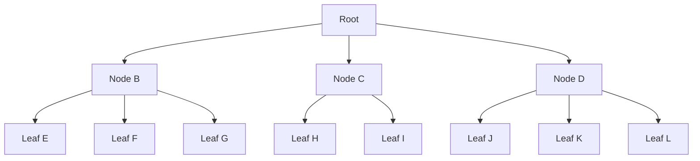
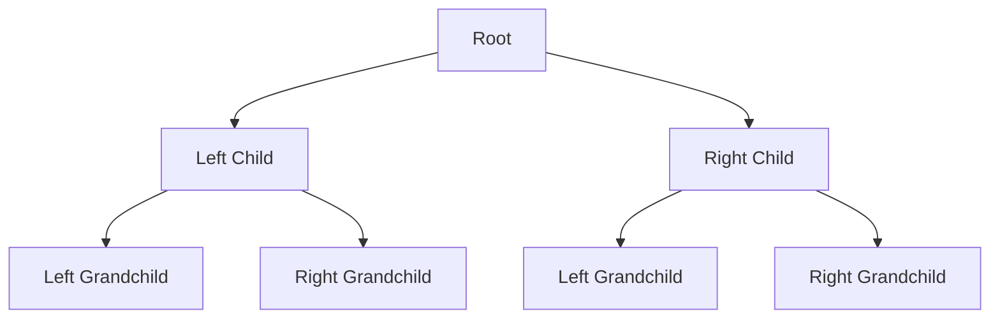
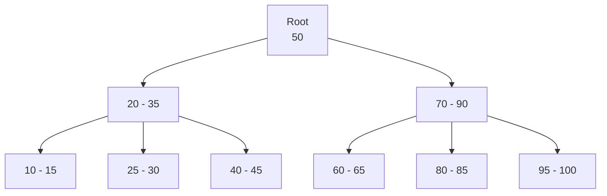
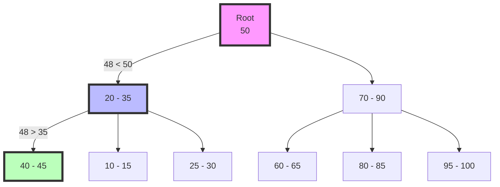
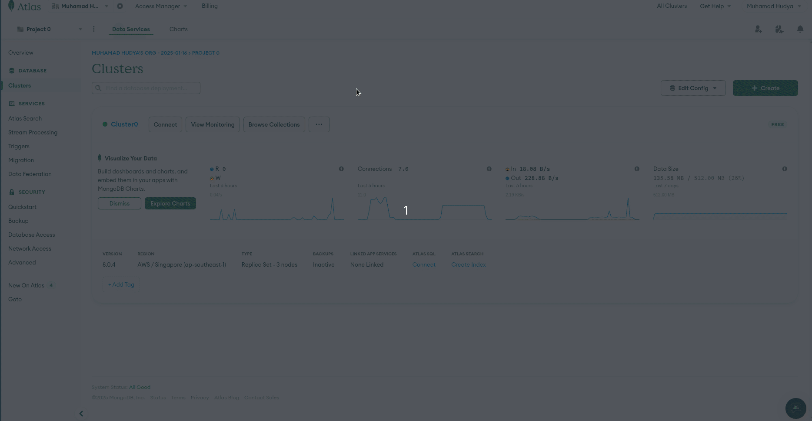

# 8 - Indexing & Performance

- [8 - Indexing \& Performance](#8---indexing--performance)
  - [Overview](#overview)
  - [How Indexing Works](#how-indexing-works)
  - [Algoritma Index](#algoritma-index)
  - [Studi Kasus B-tree Mongo](#studi-kasus-b-tree-mongo)
  - [Jenis-jenis Index dan Penggunaannya](#jenis-jenis-index-dan-penggunaannya)
  - [Cons](#cons)
  - [Best Practices](#best-practices)
  - [Practice](#practice)
  - [Mengenal Composite Index](#mengenal-composite-index)
  - [Deleting Index](#deleting-index)
  - [Another Example Index](#another-example-index)
    - [Multikey Index](#multikey-index)
    - [Text Index](#text-index)
    - [Hashed Index](#hashed-index)
    - [Geospatial Index](#geospatial-index)
    - [Partial Index](#partial-index)
    - [Unique Index](#unique-index)
    - [Case Insensitive Index](#case-insensitive-index)
    - [Wildcard Index](#wildcard-index)
  - [Performance Metrics](#performance-metrics)

## Overview

Indexing pada MongoDB adalah mekanisme untuk meningkatkan efisiensi dan performa pada saat melakukan operasi membaca data (read operations).

Index menyimpan nilai field tertentu atau set fields, diurutkan berdasarkan nilai tersebut. Ini memungkinkan MongoDB untuk menemukan dan mengembalikan hasil query dengan lebih cepat.

## How Indexing Works

Pada dasarnya ada tiga cara bagaimana index bekerja untuk mengoptimalkan performa pencarian data.

- Mempercepat Pencarian
  - Tanpa index, MongoDB harus melakukan collection scan, memeriksa setiap dokumen dalam koleksi. Dengan index, MongoDB dapat dengan cepat menemukan lokasi data tanpa memeriksa setiap dokumen.
- Mengurangi I/O Disk
  - Index biasanya lebih kecil dari data lengkap, sehingga bisa disimpan dalam RAM, mengurangi kebutuhan akses disk.
- Mengoptimalkan Sorting
  - Index yang sesuai dapat menghilangkan kebutuhan untuk melakukan operasi sort in-memory yang mahal.

## Algoritma Index

MongoDB menggunakan struktur data yang disebut B-tree (B-pohon) untuk indexing, bukan binary tree seperti yang umumnya digunakan dalam beberapa RDBMS.

B-tree vs Binary Tree

- B-tree:
  - Memiliki lebih dari dua anak per node.
  - Lebih seimbang dan lebih lebar dibandingkan binary tree.
  - Lebih efisien untuk sistem yang melibatkan pembacaan dan penulisan data dari disk.
  - Mengurangi jumlah operasi I/O disk yang diperlukan untuk mencari data.
- Binary Tree:
  - Hanya memiliki dua anak per node.
  - Bisa menjadi tidak seimbang, yang dapat mengurangi efisiensi pencarian.

Keuntungan B-tree untuk MongoDB:

- Kinerja yang Lebih Baik: B-tree memungkinkan pencarian, penyisipan, dan penghapusan yang lebih efisien, terutama untuk dataset besar.
- Optimisasi I/O: Mengurangi jumlah akses disk yang diperlukan, yang sangat penting untuk database berbasis dokumen seperti MongoDB.
- Skalabilitas: Lebih baik dalam menangani volume data yang besar dan operasi yang sering.

Implementasi Spesifik MongoDB:

WiredTiger Storage Engine: Sejak MongoDB 3.2, WiredTiger menjadi mesin penyimpanan default. WiredTiger menggunakan variasi B-tree yang dioptimalkan untuk performa dan efisiensi penyimpanan.

Perbedaan dengan MySQL:

- MySQL (dengan InnoDB) menggunakan struktur B+tree untuk indexing, yang sedikit berbeda dari B-tree standar.
- B+tree menyimpan semua data di node daun, sementara B-tree dapat menyimpan data di node internal juga.

Implikasi Performa:

- MongoDB's B-tree implementation sangat efisien untuk operasi read dan write pada dataset besar.
- Memungkinkan MongoDB untuk menangani data semi-terstruktur dengan lebih baik, yang merupakan salah satu kekuatan utama database dokumen.

Fleksibilitas:

- Struktur B-tree MongoDB mendukung berbagai jenis index (single-field, compound, multikey, dll.) dengan efisien.
- Ini memungkinkan fleksibilitas yang lebih besar dalam desain schema dan query optimization dibandingkan dengan sistem yang hanya menggunakan binary tree.

<br/>
<br/>

**Grafik B-tree MongoDB**



<br/>
<br/>

**Grafik Binary Tree MySQL**



## Studi Kasus B-tree Mongo

Perhatikan grafik di bawah ini.



> [!INFO]
> Angka di atas tidak merepresentasikan angka real yang disimpan, namun blok disk I/O pada mesin

Apabila kita mencari sebuah data dan setelah digunakan rumus untuk mencari blok data tersebut, anggap saja blok data tersebut berada pada blok 48, sehingga secara teori ia akan mencari di blok root, karena blok 48 lebih kecil dari 50.

Kemudian ia akan turun ke kiri, karena blok 48 lebih besar diantara 20-35 maka akan turun ke blok kanan yaitu 40-45 namun karena 48 > 45 maka pencariannya akan dilakukan sedikit ke atas.

<br/>
<br/>

Apabila digambarkan akan menjadi seperti ini.



<br/>
<br/>

## Jenis-jenis Index dan Penggunaannya

| Jenis Index        | Deskripsi                                         | Contoh Penggunaan                                      | Sintaks                                                                                       |
| ------------------ | ------------------------------------------------- | ------------------------------------------------------ | --------------------------------------------------------------------------------------------- |
| Single Field       | Index pada satu field                             | Pencarian berdasarkan nama                             | `db.collection.createIndex({ name: 1 })`                                                      |
| Compound           | Index pada multiple fields                        | Pencarian berdasarkan nama dan umur                    | `db.collection.createIndex({ name: 1, age: -1 })`                                             |
| Unique             | Memastikan nilai unik dalam field                 | Email unik untuk setiap user                           | `db.users.createIndex({ email: 1 }, { unique: true })`                                        |
| Text               | Untuk pencarian full-text                         | Pencarian dalam deskripsi produk                       | `db.products.createIndex({ description: "text" })`                                            |
| Geospatial         | Untuk data geografis                              | Pencarian lokasi terdekat                              | `db.places.createIndex({ location: "2dsphere" })`                                             |
| Hashed             | Distribusi data yang lebih baik untuk sharding    | Sharding berdasarkan userID                            | `db.users.createIndex({ userID: "hashed" })`                                                  |
| TTL (Time-To-Live) | Otomatis menghapus dokumen setelah waktu tertentu | Menghapus sesi yang kadaluarsa                         | `db.sessions.createIndex({ createdAt: 1 }, { expireAfterSeconds: 3600 })`                     |
| Partial            | Index hanya pada subset dokumen                   | Index harga untuk produk premium                       | `db.products.createIndex({ price: 1 }, { partialFilterExpression: { category: "premium" } })` |
| Wildcard           | Index dinamis pada fields yang tidak diketahui    | Mendukung queries pada dokumen dengan struktur dinamis | `db.products.createIndex({ "attributes.$**": 1 })`                                            |
| Case Insensitive   | Pencarian tanpa memperhatikan huruf besar/kecil   | Pencarian nama user tanpa case sensitive               | `db.users.createIndex({ username: 1 }, { collation: { locale: 'en', strength: 2 } })`         |

Beberapa catatan penting:

1. Full-Text Search: Menggunakan Text Index, sangat berguna untuk pencarian dalam konten teks panjang.
2. Geospatial Queries: 2dsphere index sangat penting untuk aplikasi berbasis lokasi.
3. Compound Indexes: Sangat efektif untuk query yang sering melibatkan multiple fields.
4. Partial Indexes: Berguna untuk mengoptimalkan performa dan penggunaan storage ketika hanya sebagian data yang sering diakses.
5. Wildcard Indexes: Berguna untuk schema yang fleksibel atau tidak konsisten.
6. Case Insensitive Indexes: Membantu dalam pencarian yang tidak sensitif terhadap huruf besar/kecil tanpa perlu mengubah data asli.

Pemilihan jenis index yang tepat tergantung pada pola query aplikasi Anda, struktur data, dan kebutuhan performa spesifik. Selalu lakukan pengujian dan monitoring untuk memastikan index yang Anda buat benar-benar meningkatkan performa query.

Catatan:

1. Full-Text Search: Menggunakan Text Index, sangat berguna untuk pencarian dalam konten teks panjang.
2. Geospatial Queries: 2dsphere index sangat penting untuk aplikasi berbasis lokasi.
3. Compound Indexes: Sangat efektif untuk query yang sering melibatkan multiple fields.
4. Partial Indexes: Berguna untuk mengoptimalkan performa dan penggunaan storage ketika hanya sebagian data yang sering diakses.
5. Wildcard Indexes: Berguna untuk schema yang fleksibel atau tidak konsisten.
6. Case Insensitive Indexes: Membantu dalam pencarian yang tidak sensitif terhadap huruf besar/kecil tanpa perlu mengubah data asli.

## Cons

- **Write Performance**
  Indexing dapat memperlambat operasi tulis karena setiap update juga harus memperbarui index.
- **Storage Overhead**
  Index membutuhkan ruang penyimpanan tambahan.
- **Index Maintenance**
  Index perlu dikelola dan dioptimalkan secara berkala.
- **RAM Usage**
  Index yang sering digunakan idealnya harus muat dalam RAM untuk performa optimal.

## Best Practices

- **Analisis Query Patterns**
  Buat index berdasarkan pola query yang paling sering digunakan.
- **Use Compound Indexes Wisely**
  Desain compound index untuk mendukung multiple query patterns.
- **Regular Review**
  Secara berkala review dan hapus index yang tidak digunakan.
- **Test Before Production**
  Selalu uji performa index dengan dataset representatif sebelum diterapkan di produksi.

## Practice

Sekarang kita akan coba membuat indexing sederhana menggunakan MongoDB. Mari gunakan database `sample_mflix` untuk mempercepat proses.

Pertama, cobalah untuk menjalankan query berikut.

```bash
db.movies.getIndexes()
```

Hasilnya adalah sebagai berikut:

```bash
Atlas atlas-969x7s-shard-0 [primary] sample_mflix> db.movies.getIndexes()
[
  { v: 2, key: { _id: 1 }, name: '_id_' },
  {
    v: 2,
    key: { _fts: 'text', _ftsx: 1 },
    name: 'cast_text_fullplot_text_genres_text_title_text',
    weights: { cast: 1, fullplot: 1, genres: 1, title: 1 },
    default_language: 'english',
    language_override: 'language',
    textIndexVersion: 3
  }
]
```

Artinya pada collection `movies` hanya ada dua index yaitu `_id` dan `full-text index` untuk key `cast`, `fullplot`, `genres`, dan `title`.

<br />
<br />

Sekarang kita akan coba untuk menganalisi performa dari query yang akan dijalankan berikut.

```javascript
db.movies.find({ year: { $gt: 2000 } }).explain("executionStats");
```

Kamu akan melihat hasil seperti ini.

```json
{
  explainVersion: '1',
  queryPlanner: {
    namespace: 'sample_mflix.movies',
    parsedQuery: { year: { '$gt': 2000 } },
    indexFilterSet: false,
    planCacheShapeHash: 'F6B88568',
    planCacheKey: 'AED4D798',
    optimizationTimeMillis: 0,
    maxIndexedOrSolutionsReached: false,
    maxIndexedAndSolutionsReached: false,
    maxScansToExplodeReached: false,
    prunedSimilarIndexes: false,
    winningPlan: {
      isCached: false,
      stage: 'COLLSCAN',
      filter: { year: { '$gt': 2000 } },
      direction: 'forward'
    },
    rejectedPlans: []
  },
  executionStats: {
    executionSuccess: true,
    nReturned: 11988,
    executionTimeMillis: 16,
    totalKeysExamined: 0,
    totalDocsExamined: 21349,
    executionStages: {
      isCached: false,
      stage: 'COLLSCAN',
      filter: { year: { '$gt': 2000 } },
      nReturned: 11988,
      executionTimeMillisEstimate: 16,
      works: 21350,
      advanced: 11988,
      needTime: 9361,
      needYield: 0,
      saveState: 1,
      restoreState: 1,
      isEOF: 1,
      direction: 'forward',
      docsExamined: 21349
    }
  },
  queryShapeHash: '869CFCEC80FCF3AF179D0808267B1BA141691B7F1286DCAC3E1FA9767E281D2A',
  command: {
    find: 'movies',
    filter: { year: { '$gt': 2000 } },
    '$db': 'sample_mflix'
  },
  serverInfo: {
    host: 'cluster0-shard-00-01.0kfik.mongodb.net',
    port: 27017,
    version: '8.0.4',
    gitVersion: 'bc35ab4305d9920d9d0491c1c9ef9b72383d31f9'
  },
  serverParameters: {
    internalQueryFacetBufferSizeBytes: 104857600,
    internalQueryFacetMaxOutputDocSizeBytes: 104857600,
    internalLookupStageIntermediateDocumentMaxSizeBytes: 16793600,
    internalDocumentSourceGroupMaxMemoryBytes: 104857600,
    internalQueryMaxBlockingSortMemoryUsageBytes: 33554432,
    internalQueryProhibitBlockingMergeOnMongoS: 0,
    internalQueryMaxAddToSetBytes: 104857600,
    internalDocumentSourceSetWindowFieldsMaxMemoryBytes: 104857600,
    internalQueryFrameworkControl: 'trySbeRestricted',
    internalQueryPlannerIgnoreIndexWithCollationForRegex: 1
  },
  ok: 1,
  '$clusterTime': {
    clusterTime: Timestamp({ t: 1737554284, i: 58 }),
    signature: {
      hash: Binary.createFromBase64("F3LC4o1nbvuQ6Tm+PFLMBMsEXl4=", 0),
      keyId: Long("7409267693150273538")
    }
  },
  operationTime: Timestamp({ t: 1737554284, i: 58 })
}
```

Memang cukup memusingkan karena tidak ada cara untuk mempermudah pembacaan query ini, tapi kamu cukup peduli kepada beberapa hal saja, yaitu:

- **queryPlanner.winningPlan.stage: 'COLLSCAN'**
  - `'COLLSCAN'` berarti full collection scan, yang menandakan tidak ada index yang digunakan.
- **executionStats.executionTimeMillis: 16**
  - Ini menunjukkan bahwa query menghabiskan 16 milliseconds untuk dieksekusi.
- **executionStats.totalDocsExamined: 21349**
  - Ini menunjukkan bahwa 21,349 dokumen diperiksa selama eksekusi query.
- **executionStats.nReturned: 11988**
  - Query mengembalikan 11,988 dokumen yang memenuhi kriteria.
- **executionStats.totalKeysExamined: 0**
  - Nilai 0 ini konsisten dengan fakta bahwa tidak ada index yang digunakan.

Sekarang kita coba tambahkan index pada tahun rilis movies dengan cara memasukkan perintah berikut:

```bash
db.movies.createIndex({ year: 1 })
```

Sekarang jalankan perintah untuk explain query di atas kembali dan perhatikan beberapa kolom berikut:

- **executionStats.executionTimeMillis: 15**
- **executionStats.totalKeysExamined: 11988**
- **executionStats.totalDocsExamined: 11988**
- **executionStats.nReturned: 11988**
- **queryPlanner.winningPlan.inputStage.keyPattern: { year: 1 }**
- **queryPlanner.winningPlan.inputStage.indexName: 'year_1': 'IXSCAN'**

Artinya query kita berhasil dan efektif karena `totalKeysExamined` menjadi 11988 serta `totalDocsExamined` juga menjadi 11988.

<br/>
<br/>

## Mengenal Composite Index

Composite Index (Compound Index) adalah index yang digunakan pada lebih dari satu kolom. Biasanya yang diajarkan adalah untuk mengindex hanya satu kolom saja, tapi sebenarnya kita dapat melakukan index pada lebih dari satu kolom secara bersamaan.

Contoh query yang bisa dijalankan:

```bash
db.movies.find({
    year: { $gte: 2000 },
    "imdb.rating": { $gte: 7 },
    genres: "Drama", countries: "USA"
}).sort({
    "imdb.rating": -1,
    year: -1
}).limit(20).explain("executionStats")
```

Query di atas mencari film drama AS yang dibuat sejak tahun 2000 dengan rating IMDB minimal 7, diurutkan berdasarkan rating (tertinggi) dan tahun (terbaru).

<br/>
<br/>

Ketika dijalankan perhatikan bagian-bagian berikut:

```json
"inputStage": {
  "stage": "IXSCAN",
  "keyPattern": { "year": 1 },
  "indexName": "year_1"
}
```

Query menggunakan index pada key `year` dengan baik, tapi hanya untuk satu kriteria dari empat yang ada.

<br/>
<br/>

```json
"totalKeysExamined": 12569,
"totalDocsExamined": 12569
```

Meskipun hanya mengembalikan 20 dokumen (nReturned: 20), query memeriksa 12,569 dokumen. Ini menunjukkan bahwa filtering untuk kriteria lain ('imdb.rating', 'genres', 'countries') dilakukan setelah dokumen diambil dari disk.

<br/>
<br/>

```json
"executionTimeMillis": 50
```

50 milidetik mungkin terdengar cepat, tapi untuk query yang hanya mengembalikan 20 dokumen, ini bisa dianggap lambat, terutama jika query ini sering dijalankan.

<br/>
<br/>

```json
"stage": "SORT",
"sortPattern": { "imdb.rating": -1, year: -1 }
```

Sorting dilakukan in-memory setelah filtering, yang bisa menjadi operasi yang mahal untuk dataset besar.

<br/>
<br/>

```json
"filter": {
  "$and": [
    { "countries": { "$eq": "USA" } },
    { "genres": { "$eq": "Drama" } },
    { "imdb.rating": { "$gte": 7 } }
  ]
}
```

Filtering untuk `countries`, `genres`, dan `imdb.rating` dilakukan setelah dokumen diambil, bukan saat scanning index.

Sekarang jalankan perintah ini untuk melakukan index terhadap kolom yang digunakan pada saat operasi.

```javascript
db.movies.createIndex(
  { year: 1, "imdb.rating": -1 },
  { partialFilterExpression: { countries: "USA", genres: "Drama" } }
);
```

Menggunakan index di atas kita akan melakukan index terhadap key `year` dan `imdb.rating`, kemudian kita tambahkan lagi partial index untuk negara `USA` dan genre `Drama`.

Apabila kita cek kembali explainnya maka kamu akan melihat hasil sebagai berikut:

```json
"executionTimeMillis": 6,
"totalKeysExamined": 1013,
"totalDocsExamined": 20,
"nReturned": 20
```

Waktu eksekusi turun drastis dari 70ms menjadi hanya 6ms. Jumlah dokumen yang diperiksa turun dari 4,674 menjadi hanya 20 (sama dengan jumlah yang dikembalikan).

```json
"inputStage": {
  "stage": "IXSCAN",
  "indexName": "year_1_imdb.rating_-1",
  "isPartial": true
}
```

Query menggunakan index partial yang baru dibuat dan mencakup `year` dan `imdb.rating` sesuai dengan query.

```json
"winningPlan": {
  "stage": "FETCH",
  "inputStage": {
    "stage": "SORT",
    "inputStage": {
      "stage": "IXSCAN"
    }
  }
}
```

- IXSCAN digunakan untuk efisiensi pencarian.
- SORT dilakukan setelah IXSCAN, yang efisien karena hanya mengurutkan hasil yang sudah difilter.
- FETCH digunakan untuk mengambil dokumen lengkap setelah sorting.

## Deleting Index

Untuk menghapus index pada sebuah collection terdapat dua perintah, yaitu:

```bash
db.collection.dropIndex("nama_index") // untuk index satuan

db.collection.dropIndex("*") // untuk semua index
```

## Another Example Index

### Multikey Index

```javascript
db.movies.createIndex({ cast: 1 });
```

Kode di atas membuat multikey index pada array field `cast`.

### Text Index

```javascript
db.movies.createIndex({ title: "text", fullplot: "text" });
```

Kode di atas membuat text index pada fields `title` dan `fullplot`.

### Hashed Index

```javascript
db.users.createIndex({ email: "hashed" });
```

Kode di atas membuat hashed index pada field `email`. Namun karena pada kasus ini kita menggunakan MongoDB Free Cluster, maka efeknya tidak terasa karena ini akan lebih baik untuk sharding.

### Geospatial Index

```javascript
db.theaters.createIndex({ "location.geo": "2dsphere" });
```

Kode di atas membuat 2dsphere index pada field `location` untuk query geospasial. Namun index di atas sudah dibuat oleh sample dataset.

Contoh query:

```javascript
db.theaters.find({
  "location.geo": {
    $near: {
      $geometry: {
        type: "Point",
        coordinates: [-93.24565, 44.85466],
      },
      $maxDistance: 5000, // dalam meter
    },
  },
});
```

### Partial Index

```javascript
db.movies.createIndex(
  { title: 1 },
  { partialFilterExpression: { year: { $gt: 2000 } } }
);
```

Kode di atas membuat partial index pada `title` hanya untuk film yang dibuat setelah tahun 2000.

### Unique Index

```javascript
db.users.createIndex({ email: 1 }, { unique: true });
```

Kode di atas membuat unique index pada field `email`.

Contoh:

```bash
Atlas atlas-969x7s-shard-0 [primary] sample_mflix> db.users.findOne()
{
  _id: ObjectId("59b99db4cfa9a34dcd7885b6"),
  name: 'Ned Stark',
  email: 'sean_bean@gameofthron.es',
  password: '$2b$12$UREFwsRUoyF0CRqGNK0LzO0HM/jLhgUCNNIJ9RJAqMUQ74crlJ1Vu'
}
Atlas atlas-969x7s-shard-0 [primary] sample_mflix> db.users.insertOne({email: "sean_bean@gameofthron.es"})
MongoServerError: E11000 duplicate key error collection: sample_mflix.users index: email_1 dup key: { email: "sean_bean@gameofthron.es" }
```

### Case Insensitive Index

```javascript
db.movies.createIndex(
  { title: 1 },
  { collation: { locale: "en", strength: 2 } }
);
```

Ini membuat case-insensitive index pada field `title`.

- `strength: 2` mengatur index untuk case-insensitive (tidak peka huruf besar/kecil).
- Ini berarti pencarian untuk kata "Star Wars", "STAR WARS", atau "star wars" akan memberikan hasil yang sama.
- `locale: "en"` mengatur index untuk menggunakan aturan bahasa Inggris dalam perbandingan string.

Contoh:

```javascript
db.movies
  .find({
    title: { $regex: "THe GREAt Train RoBBery", $options: "i" },
  })
  .collation({ locale: "en", strength: 2 });
```

Penjelasan query di atas :

- `$regex`: Digunakan untuk melakukan pencarian menggunakan regular expression.
- `$options`: "i": Opsi "i" membuat regex menjadi case-insensitive.

- Apabila query dijalankan tanpa fungsi collaction seperti:

```javascript
db.movies.find({
  title: { $regex: "THe GREAt Train RoBBery", $options: "i" },
});
```

- Query ini akan bekerja dan melakukan pencarian case-insensitive.
  Menggunakan $options: "i" sudah cukup untuk membuat pencarian case-insensitive.
- Performa mungkin tidak optimal karena tidak menggunakan index yang Anda buat dengan collation.

Apabila dengan Collation memungkinkan query untuk memanfaatkan index yang telah Anda buat. Collation juga menawarkan lebih banyak kontrol atas bagaimana string dibandingkan, termasuk penanganan aksen dan karakter khusus.

Performa:

- Tanpa collation, query mungkin melakukan collection scan, yang bisa lambat untuk koleksi besar.
- Dengan collation yang sesuai dengan index, MongoDB bisa menggunakan index untuk mempercepat query.

### Wildcard Index

```javascript
db.comments.createIndex({ "movie.$**": 1 });
```

Kode di atas membuat wildcard index pada semua fields dalam subdokumen `movie`.

## Performance Metrics

Untuk melihat performance metrics maka pada kasus MongoDB Atlas Free Tier, kita bisa mengaksesnya pada dashboard seperti GIF berikut.



Di dalamnya akan tersedia *metric* sepert Opcounters dimana artinya operation counters atau seberapa sering query berjalan setiap detiknya, jumlah koneksi, jumlah size disk yang dipakai, dan bandwidth yang digunakan.
