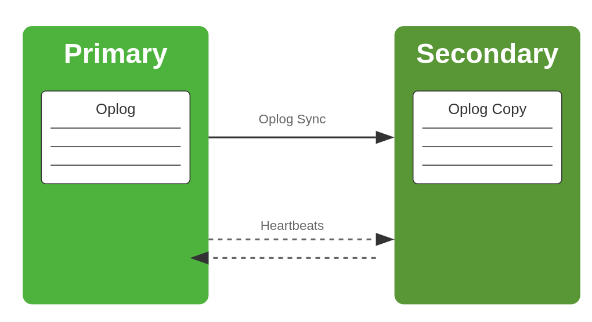
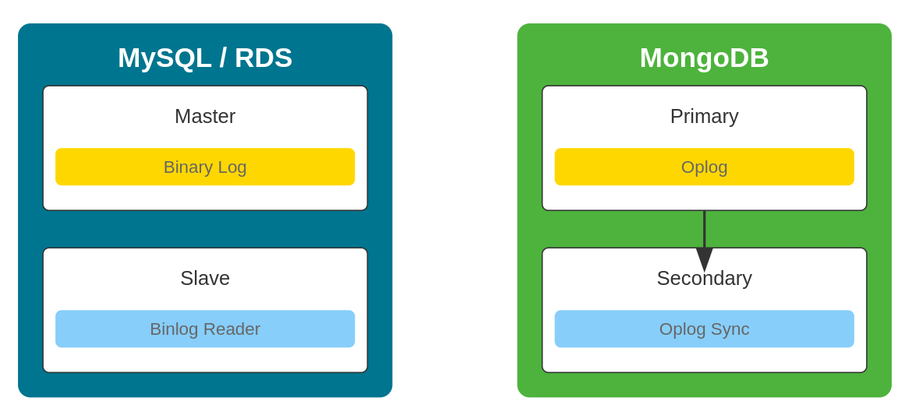

# 9 - Replication

- [9 - Replication](#9---replication)
  - [Overview](#overview)
  - [Alur Replikasi di MongoDB](#alur-replikasi-di-mongodb)
    - [Kriteria Pemilihan Primary Baru](#kriteria-pemilihan-primary-baru)
    - [Proses Pemilihan](#proses-pemilihan)
    - [Operasi Baca dan Tulis pada Primary Baru](#operasi-baca-dan-tulis-pada-primary-baru)
  - [Perbandingan Replikasi MongoDB dan MySQL](#perbandingan-replikasi-mongodb-dan-mysql)

## Overview

Replication (Replika) dalam konteks database adalah salinan data yang identik dengan data asli, yang disimpan di server terpisah. Tujuan utama replikasi adalah:

1. Meningkatkan ketersediaan data (high availability)
2. Meningkatkan toleransi terhadap kegagalan (fault tolerance)
3. Meningkatkan kinerja dengan mendistribusikan beban baca (read scaling)
4. Mendukung disaster recovery

Tidak memungkinkan untuk terhubung ke salah satu shard cluster menggunakan **MongoDB Atlas Free Tier**, karena fitur sharding tidak tersedia pada tingkat layanan ini. Agar dapat digunakan maka perlu meningkatkan ke tier berbayar yang mendukung fitur ini.

## Alur Replikasi di MongoDB

MongoDB menggunakan model replikasi yang disebut Replica Set. Berikut adalah alur replikasi di MongoDB:

1. **Inisialisasi Replica Set**:

   - Satu node diinisialisasi sebagai Primary, sisanya sebagai Secondary.

2. **Operasi Tulis**:

   - Klien mengirim operasi tulis ke node Primary.
   - Primary mencatat operasi dalam oplog (operations log).
   - Primary menerapkan perubahan ke datanya sendiri.

3. **Replikasi ke Secondary**:

   - Node Secondary secara asinkron menyalin oplog dari Primary.
   - Secondary menerapkan operasi dari oplog ke data mereka.

4. **Sinkronisasi Berkelanjutan**:

   - Secondary terus memantau oplog Primary untuk perubahan baru.
   - Jika tertinggal, Secondary akan melakukan sinkronisasi penuh jika diperlukan.

5. **Heartbeats dan Pemilihan**:

   - Semua node bertukar heartbeat secara teratur.
   - Jika Primary tidak tersedia, Secondary akan memilih Primary baru.

6. **Pembacaan dari Secondary** (opsional):
   - Klien dapat dikonfigurasi untuk membaca dari Secondary untuk load balancing.

### Kriteria Pemilihan Primary Baru

Ketika primary node dalam MongoDB replica set tidak tersedia, proses pemilihan primary baru (election) terjadi dengan kriteria sebagai berikut:

1. **Eligibility**:

   - Hanya secondary node yang eligible dapat menjadi primary.
   - Node harus memiliki `{priority: 1}` atau lebih tinggi.

2. **Oplog Currency**:

   - Node dengan oplog paling up-to-date memiliki peluang lebih besar terpilih.

3. **Connectivity**:

   - Node harus dapat berkomunikasi dengan mayoritas anggota replica set.

4. **Priority Setting**:

   - Node dengan priority setting lebih tinggi akan diutamakan.

5. **Votes**:

   - Node harus menerima mayoritas suara dari anggota replica set yang memiliki hak suara.

6. **Tiebreaker**:
   - Jika terjadi seri, node dengan optime (timestamp operasi terakhir) tertinggi akan menang.

### Proses Pemilihan

1. Inisiasi pemilihan ketika primary tidak merespon heartbeat.
2. Eligible secondary mempromosikan diri sebagai kandidat.
3. Kandidat meminta suara dari anggota lain.
4. Anggota memberikan suara berdasarkan kriteria di atas.
5. Kandidat dengan mayoritas suara menjadi primary baru.

### Operasi Baca dan Tulis pada Primary Baru

Ketika sebuah secondary node terpilih menjadi primary baru:

1. **Transisi Peran**:

   - Node mengubah statusnya dari secondary menjadi primary.
   - Proses ini biasanya berlangsung sangat cepat (dalam hitungan detik).

2. **Kemampuan Operasional**:

   - Segera setelah menjadi primary, node dapat melakukan operasi baca DAN tulis.
   - Tidak ada "warm-up period" – operasi baca/tulis dapat langsung dilakukan.

3. **Konsistensi**:

   - Primary baru menjamin bahwa ia memiliki data paling up-to-date sebelum menerima operasi tulis.

4. **Penyesuaian Klien**:

   - Driver MongoDB yang kompatibel akan otomatis mendeteksi primary baru dan mengarahkan operasi tulis ke sana.

5. **Read Preference**:
   - Operasi baca tetap dapat dikonfigurasi untuk membaca dari secondary jika diinginkan.

 
 
 

## Perbandingan Replikasi MongoDB dan MySQL

| Aspek             | MongoDB                                         | MySQL                                                           |
| ----------------- | ----------------------------------------------- | --------------------------------------------------------------- |
| Model Replikasi   | Replica Set                                     | Master-Slave atau Group Replication                             |
| Log Replikasi     | Oplog (Operations Log)                          | Binary Log (Binlog)                                             |
| Pemilihan Leader  | Otomatis (dalam Replica Set)                    | Manual (dalam Master-Slave), Otomatis (dalam Group Replication) |
| Konsistensi       | Eventually Consistent (default)                 | Strongly Consistent (default)                                   |
| Skalabilitas Baca | Built-in dengan Secondary Reads                 | Memerlukan konfigurasi tambahan                                 |
| Format Log        | BSON (Binary JSON)                              | Row-based, Statement-based, atau Mixed                          |
| Topologi          | Biasanya odd-numbered set (e.g., 3, 5, 7 nodes) | Flexible (Master-Slave atau Multi-Master)                       |
| Failover          | Otomatis dalam Replica Set                      | Manual dalam Master-Slave, Otomatis dalam Group Replication     |
| Sharding          | Native support                                  | Memerlukan konfigurasi tambahan (MySQL Cluster)                 |
| Replikasi Partial | Tidak didukung                                  | Didukung (dapat mereplikasi tabel tertentu)                     |
