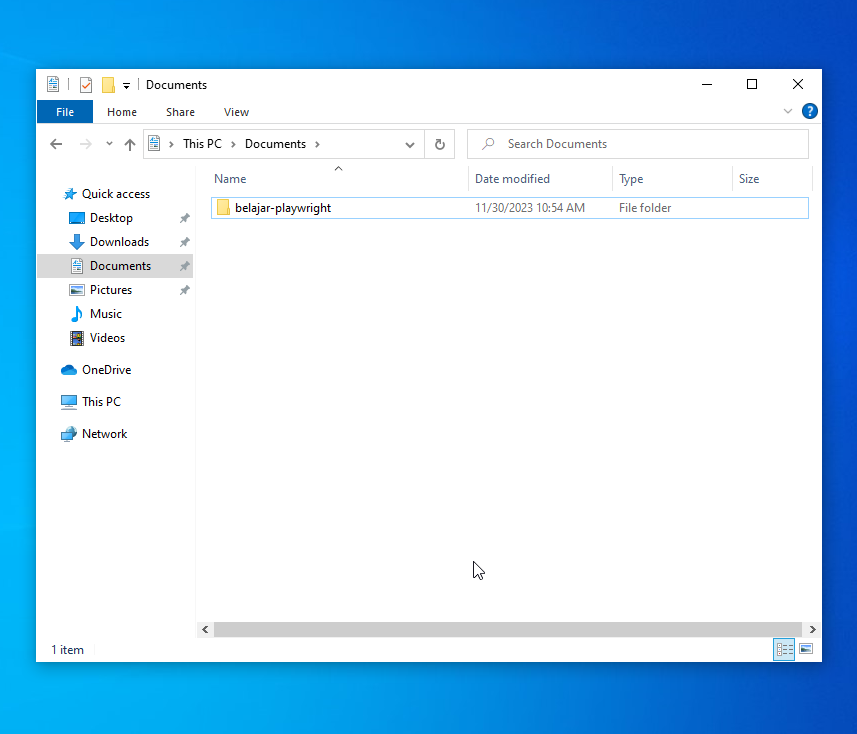
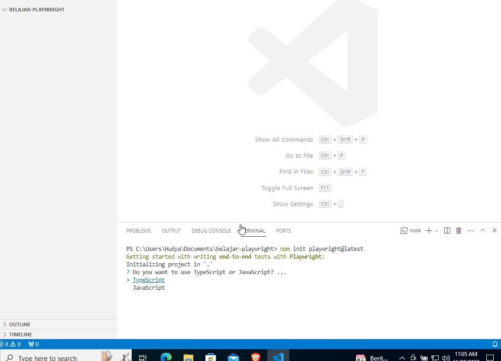
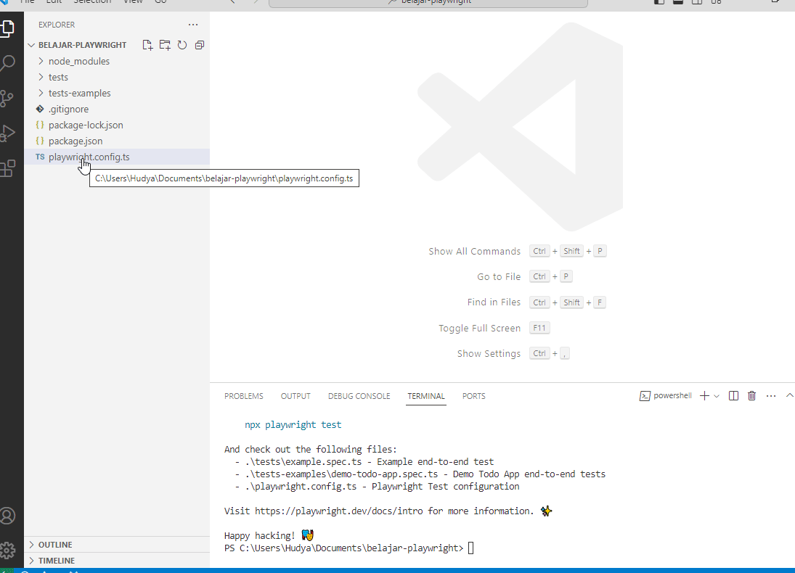
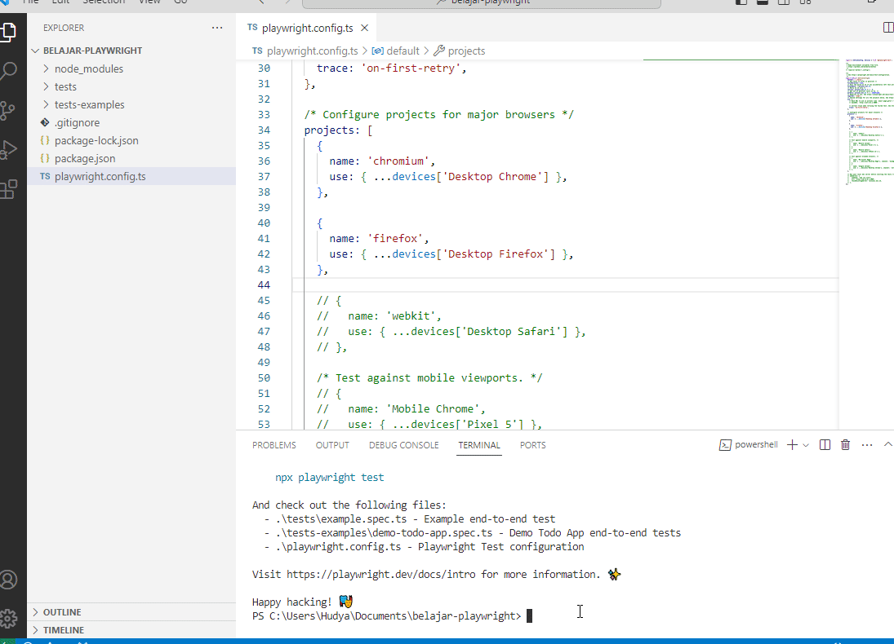

# 1. Menginstall Playwright

Sebelum kita melakukan instalasi playwright, buatlah folder pada tempat yang kalian inginkan, bisa di dalam `My Documents`, atau dimanapun.

Selanjutnya, untuk melakukan instalasi Playwright, cukup install NodeJS seperti yang sudah dijabarkan pada *introduction*.

## Instalasi Projek

Buka file explorer kalian, lalu buat folder dimanapun yang kalian mau untuk membuat projeknya.



Selanjutnya, buka visual studio code, lalu klik open folder, dan pilih folder yang telah kalian buat.

Selanjutnya, buka terminal lalu ketikkan perintah berikut:

```bash
npm init playwright@latest
```

Perhatikan GIF berikut:



Perhatikan beberapa catatan berikut:

- Disini kita menggunakan Typescript, apa bedanya dengan Javascript? Sebenarnya secara karakteristik sama, namun Typescript mengutamakan safety data types yang mana menjaga agar tipe data yang dinamis pada Javascript tidak menyebabkan error ghoib yang menyulitkan developer.
- Kita memasukkan seluruh unit tests pada folder tests, hal ini akan memudahkan kita untuk melakukan organisir terhadap projek test kita.
- Kita tidak men-setting CI/CD, karena ini masih pembelajaran awal, kita tidak perlu melakukan setting terhadap CI/CD. Nantinya ketika di level industri yang membutuhkan pengujicobaan lebih ketat, bisa ditambahkan.

## Mematikan konfigurasi webkit

Selanjutnya kita perlu mematikan konfigurasi webkit, webkit adalah browser yang bisa dikatakan mirip safari. Tujuan utamanya adalah memeriksa sebuah website pada beberapa browser guna memastikan pengalaman yang baik bagi seluruh pengguna.

Sayangnya, pada windows, hal ini menyebabkan error. Sehingga kita perlu mematikan konfigurasi webkit.

Perhatikan cara mematikannya:



Cukup tekan `CTRL + /` pada saat memblocking, akan membuat kode menjadi ter-comment secara multiline.

## Jalankan projek

Terakhir kita bisa menjalankan projek dengan cara memasukkan perintah berikut pada terminal:

```bash
npx playwright test --ui
```

Perhatikan hasilnya:



Viola, kita sudah berhasil menjalankan playwright dan kita bisa masuk ke step selanjutnya yaitu membuat unit test.
