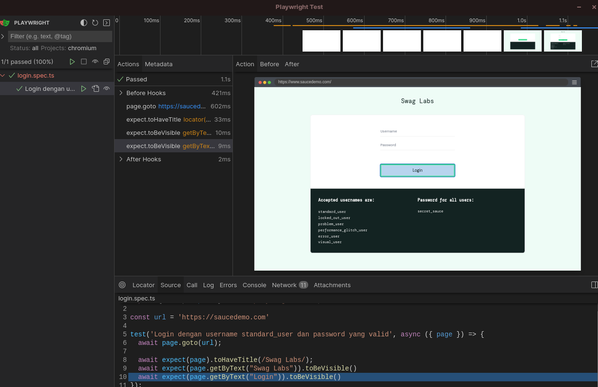
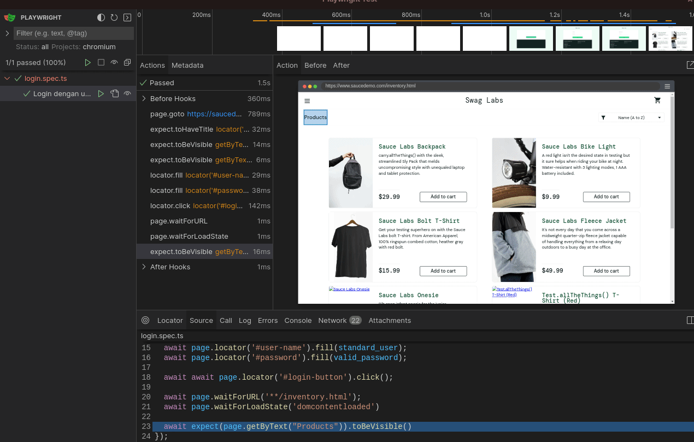

# 2. Membuat Skenario

Ketika kita melakukan testing secara automation, kita perlu membuat skenario, skenario ini akan menjadi guidance seperti apa harusnya kita membuat uji coba (test).

## Buat skenario

Pada latihan ini, kita akan website <https://www.saucedemo.com> dari SwagLabs. Jadi, kita akan membuat test otomatis untuk memeriksa skenario yang akan kita buat.

Anggaplah kita akan membuat skenario sebagai berikut:

| Skenario      | Tipe | Expected |
| ----------- | ----------- | ------ |
| Login dengan username `standard_user` dan password yang valid      | Positive       | Berhasil masuk ke halaman dashboard |
| Login dengan username `standard_user` dan password yang tidak valid      | Positive       | Tidak berhasil masuk ke halaman dashboard |
| Login dengan username `locked_out_user` dan password yang valid      | Positive       | Tidak berhasil masuk ke halaman dashboard |
| Login dengan username `standard_user` dan password 1000 karakter      | Negative       | Tidak berhasil masuk ke halaman dashboard |
| Login dengan username `standard_user` dan password kosong  (0 karakter)      | Negative       | Tidak berhasil masuk ke halaman dashboard |

## Time to Code

Buatlah sebuah file baru pada folder `tests` dengan nama `login.spec.ts`, jadi kita akan membuat unit tests khusus untuk mengerjakan halaman `login`.

Isi file `login.spec.ts` dengan kode berikut:

```ts
import { test, expect } from '@playwright/test';

const url = 'https://saucedemo.com'

test('Login dengan username standard_user dan password yang valid', async ({ page }) => {
  await page.goto(url);

  await expect(page).toHaveTitle(/Swag Labs/);
  await expect(page.getByText("Swag Labs")).toBeVisible()
  await expect(page.getByText("Login")).toBeVisible()
});
```

Sekarang jalankan kembali dengan menekan tombol play pada UI Playwright.



---

## Full test case

Sekarang ubah kembali kode `login.spec.ts` dengan kode berikut:


```ts
import { test, expect } from '@playwright/test';


const url = 'https://saucedemo.com'
const standard_user = "standard_user"
const valid_password = "secret_sauce"

test('Login dengan username standard_user dan password yang valid', async ({ page }) => {
  await page.goto(url);

  await expect(page).toHaveTitle(/Swag Labs/);
  await expect(page.getByText("Swag Labs")).toBeVisible()
  await expect(page.getByText("Login")).toBeVisible()

  await page.locator('#user-name').fill(standard_user);
  await page.locator('#password').fill(valid_password);

  await await page.locator('#login-button').click();

  await page.waitForURL('**/inventory.html');
  await page.waitForLoadState('domcontentloaded')

  await expect(page.getByText("Products")).toBeVisible()
});
```

<br />

Inilah hasilnya:



---

Sekarang adalah penjelasan dari baris ke baris:

```ts
const url = 'https://saucedemo.com'
const standard_user = "standard_user"
const valid_password = "secret_sauce"
```

Kita membuat tiga constant variable, dimana variabel ini akan digunakan secara berulang kali tanpa perlu kita tulis pada setiap test.

```ts
await page.goto(url)

await expect(page).toHaveTitle(/Swag Labs/)
await expect(page.getByText("Swag Labs")).toBeVisible()
await expect(page.getByText("Login")).toBeVisible()
```

- `page.goto(url)`: Artinya kita pergi ke URL yang diinginkan, dimana variabel yang digunakan adalah constant url yang telah kita buat.
- `expect(page).toHaveTitle(/Swag Labs/)`: Artinya kita berekspektasi bahwa page yang dituju telah memiliki judul `Swag Labs`, dan ini menggunakan regex.
- `expect(page.getByText("Swag Labs")).toBeVisible()`: Artinya kita berekspektasi bahwa page yang dituju memiliki teks `Swag Labs` pada body page, bedanya, ini tidak menggunakan regex.
- `expect(page.getByText("Login")).toBeVisible()`: Artinya sama seperti sebelumnya, kita berekespektasi bahwa page yang dituju memiliki teks `Login` pada body page.


<br />

```ts
await page.locator('#user-name').fill(standard_user);
await page.locator('#password').fill(valid_password);

await await page.locator('#login-button').click();
```

- `page.locator('#user-name').fill(standard_user)`: Menggunakan Selector ID HTML, kita mengisi nilai teks input dengan nilai dari variabel constant `standard_user`.
- `page.locator('#password').fill(valid_password)`: Menggunakan Selector ID HTML, kita mengisi nilai teks input dengan nilai dari variabel constant `valid_password`.
- `await await page.locator('#login-button').click()`: Menggunakan selector ID HTML, kita melakukan click terhadap selector id button.


<br />

```ts
await page.waitForURL('**/inventory.html')
await page.waitForLoadState('domcontentloaded')

await expect(page.getByText("Products")).toBeVisible()
```

- `page.waitForURL('**/inventory.html')`: Menggunakan perintah `waitForURL`, kita menunggu hingga page berubah ke halaman `inventory.html`, yaitu halaman apabila autentikasi valid.
- `page.waitForLoadState('domcontentloaded')`: Menggunakan perintah `waitForLoadState`, kita memastikan bahwa sebelum kita melakukan ekspektasi, kita akan menunggu hingga seluruh konten berhasil ditayangkan. Hal ini guna mencegah apabila baris selanjutnya melakukan ekspektasi namun ternyata internet yang kita gunakan saat ini sedang lambat, atau bahkan aplikasi yang sedang kita uji memiliki kendala performa (lemot).
- `expect(page.getByText("Products")).toBeVisible()`: Artinya kita berekspektasi bahwa page yang dituju memiliki teks `Swag Labs` pada body page, bedanya, ini tidak menggunakan regex.


<br />

> ![NOTE]
> await selalu ada karena kita menggunakan playwright yang bersifat asynchronous, untuk membuatnya synchronous atau menunggu baris saat ini sebelum melakukan eksekusi terhadap baris selanjutnya, maka digunakanlah `await`.


Sekarang tunggu apa lagi? Coba selesaikan empat kasus selanjtunya. Semua yang kamu butuhkan terkait fungsi sudah tersedia pada dokumentasi dari [Playwright](https://playwright.dev/docs).

Berikut beberapa bagian yang telah saya gunakan:

- [Locators](https://playwright.dev/docs/locators)
- [Actions](https://playwright.dev/docs/input)
- [Navigations](https://playwright.dev/docs/navigations)

Semoga membantu dan tetap semangat belajar ya! 😄