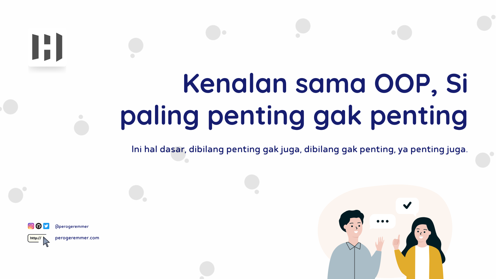
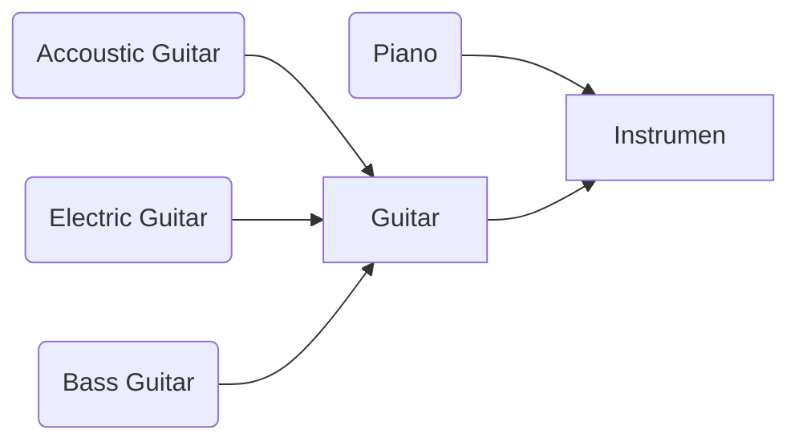
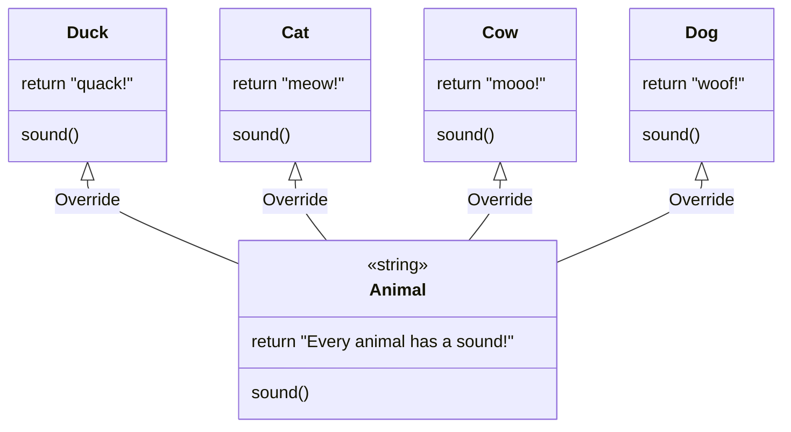
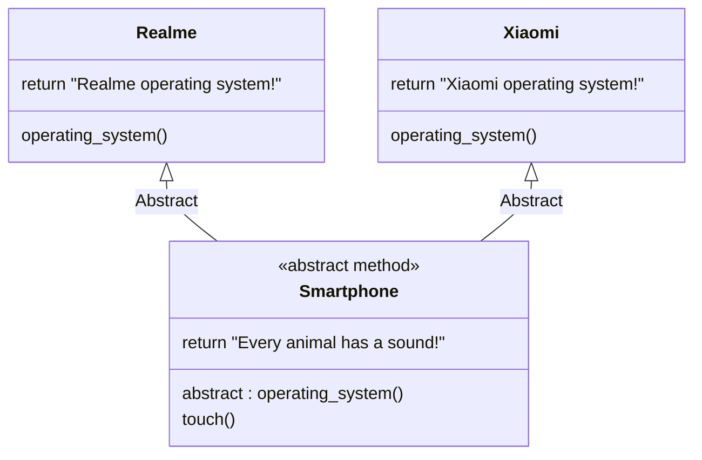
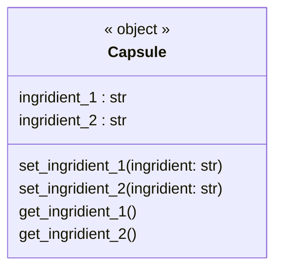

# Kenalan sama OOP, penting gak penting sih

Ketika belajar di perkuliahan, kalian pasti bakalan ketemu mata kuliah PBO (Pemrograman Beroirentasi Objek). Mata kuliah ini akan memungkinkan kamu belajar tentang bagaimana program akan memiliki sebuah orientasi berbasis objek. OOP ini masuknya ke paradigma pemrograman yang membuat kita selalu menggunakan class sebagai objek.

## Paradigma

Paradigma tuh kaya pola pandang, ibarat kaya sebuah pattern yang kita udah sama-sama tahu. Misalnya kalo mau ke Jerman dari Indonesia harus transit dulu ke Singapore sebelum pergi ke Jerman.

Nah pattern ini udah sama-sama diketahui sama banyak orang, sehingga ketika bilang ke jerman, bisa jadi ada orang lain yang bilang "Nitip tas dong pas lo di singapore", atau "Ketemu gue di terminal 1 ya pas di singapore".

Hal-hal kaya gini yang bikin kamu gak usah jelasin banyak-banyak ketika kamu bilang Paradigma X, orang yang paham langsung tau polanya seperti apa.

### Seberapa penting Paradigma?

Dibilang penting ya penting, soalnya kan ketika kita pengen bikin suatu pattern, kita dapat dengan mudah jelasin ke tim ataupun orang yang kerja bareng kita.

Pada beberapa kasus yang membutuhkan algoritma dengan code yang banyak, OOP bakalan ngebantu kita banget buat bikin objeknya jadi makin ringkas, dan kodenya terorganisir.

Kalo dibilang gak penting, ya emang untuk belajar frontend gak akan terlalu kepake, karena frontend khususnya pake javascript nggak terlalu fokus ke orientasi objek, tapi buat backend, **ya penting lah**~
<hr/>

```text
Bahasa yang digunakan adalah bahasa Python
```

<hr/>

## Class adalah Objek

Ketika ngomongin OOP, kita akan selalu ngetreat class sebagai objek, disini gue akan jelasin pake Python ya.

```python
class Message:
    title = "Hello"

m = Message()
print(m.title)
```

Nah kita nge-treat atau memperlakukan si class ```Message``` ini sebagai sebuah objek yang kita beri nama objek ```m```. Kita bisa mengakses apapun yang ada di dalamnya.

## Jenis OOP

OOP itu ada empat jenis,  yaitu:

- Inheritance
- Abstraction
- Polymorphism
- Encapsulation

Lebih lanjutnya bakalan  kita lanjut di bawah ini guys.

## Inheritance



<br/>

Alat musik berfungsi untuk menghasilkan suara. Terdapat banyak jenis instrumen musik, misalnya piano dan gitar. Piano dan gitar merupakan turunan dari instrumen alat musik, dimana keduanya dapat menghasilkan suara. Suara yang dihasilkan gitar tentu berbeda dengan suara yang dihasilkan piano, selain suara cara bermain gitar juga berbeda dengan piano.

Gitar merupakan alat musik yang dimainkan dengan cara dipetik, sehingga untuk menghasilkan suara setiap senarnya wajib kamu petik sehingga muncul lah suara gitar. Gitar memiliki banyak jenis, yaitu gitar akustik, gitar elektrik, dan gitar Bass. Setiap suara yang dihasilkan juga berbeda, gitar akustik cenderung agak lembut sedangkan gitar elektrik cenderung agak keras.

Dapat ditarik kesimpulan bahwa objek instrumen menurunkan sifat kepada gitar, sifat turunannya adalah bahwa gitar akan menghasilkan suara. Objek gitar menurunkan sifat kepada gitar akustik, yaitu bermain dengan cara dipetik. Gitar akustik menerima turunan sifat dari objek gitar, yaitu bermain dengan cara dipetik serta mendapatkan turunan sifat dari objek instrumen, yaitu menghasilkan suara. Inilah yang disebut dengan **Inheritance**.

```python
class Instrument:
    def music(self):
        print("Every Music Instrument has a sound")
        
class Guitar(Instrument):
    def play(self):
        print("How to play guitar is just strum the guitar!")

class AcousticGuitar(Guitar):
    def sound(self):
        print("The sound of the acoustic guitar is very soft!")
        
ag = AcousticGuitar()
ag.music()
ag.play()
ag.sound()
```

Apa yang akan terjadi ketika dijalankan?

```bash
Every Music Instrument has a sound
How to play guitar is just strum the guitar!
The sound of the acoustic guitar is very soft!
```

Kalian perhatiin gak? Bahwa class `AcousticGuitar` bisa memanggil fungsi play yang ada pada class `Guitar`, dan fungsi music yang ada pada class `Instrument`. Ini menunjukan bahwa sifat (fungsi dan atribut) `Instrument` diturunkan kepada `Guitar`, dan sifat dari `Guitar` diturunkan kembali ke `AcousticGuitar`.

Inilah yang menyebabkan kelas `AcousticGuitar` juga dapat mengakses fungsi pada class `Instrument`.

<br/>

## Polymoprhism

Polymorphism (Polimorfisme) adalah salah satu bentuk OOP yang secara harfiah mirip dengan penerapan bunglon. Bunglon dapat berubah sesuai keadaan yang dibutuhkan.

Sehingga, polymorphism adalah bentuk OOP yang dapat berubah-ubah menyesuaikan siapa yang memanggil. Agar lebih mudah simak ilustrasi berikut:



<br/>

Nah dari diagram di atas udah keliatan kan bahwa sifat dasar polimorfisme adalah sifatnya yang bisa berubah, misalnya kalau kamu perhatikan pada diagram diatas, class Animal akan ditiban sifatnya pada fungsi sound dengan masing-masing class yang akan mengimplementasikan class tersebut.

Misalnya, class `Duck` yang mengimplementasi class `Animal`, maka class `Duck` dapat menimpa fungsi `sound` yang asli pada `Animal`.

<br/>

Kodenya akan jadi seperti ini:

```python
class Animal:
    def sound(self):
        return "Every animal has sound!"
    
class Cat(Animal):
    def sound(self):
        return "meow!"
    
class Dog(Animal):
    def sound(self):
        return "woof!"
    
class Cow(Animal):
    def sound(self):
        return "moo!"
    
class Duck(Animal):
    def sound(self):
        return "quack!"
    
c = Cat()
result = c.sound()
print(result)

d = Dog()
result = d.sound()
print(result)

cow = Cow()
result = cow.sound()
print(result)

duck = Duck()
result = duck.sound()
print(result)
```

<br/>

Bisa diliat kan bahwa masing-masing class yang mengimplementasikan `Animal`, akan membuat nama fungsi yang sama seperti `Animal`, yaitu `sound()`.

Alhasil, fungsi `sound()` pada `Animal` akan ditiban dengan fungsi dengan **nama yang sama pada class** yang dibuat dengan action atau kembalian yang berbeda.

## Abstraction

Abstraction adalah salah satu bentuk OOP yang menerapkan abstraksi di dalam sebuah smarthphone. Abstraksi adalah bentuk dimana kita tidak mengetahui isi fungsi di dalamnya. Layaknya sebuah smartphone kita tidak diberi tahu tampilan LCD/Screen secara langsung, namun dibungkus oleh sebuah casing.

Kasus lainnya adalah ibarat smartphone, setiap smartphone pasti memiliki fungsi pada saat melakukan booting atau konfigurasi sistem operasinya. Kedua fungsi ini merupakan fungsi dasar pada sebuah smartphone. Pada kasus ini, realme dan xiaomi merupakan pabrikan smartphone yang sudah pasti **harus menurunkan** sifat dari smartphone, yaitu sistem operasi dan booting.



Hasilnya adalah:

```python
from abc import ABC, abstractmethod

class Smartphone(ABC):
    @abstractmethod
    def operating_system(self):
        return "Operating System!"
    
    def touch(self):
        return "You can touch the phone"
    
class Xiaomi(Smartphone):
    def operating_system(self):
        return "Xiaomi Operating System!"
    
class Realme(Smartphone):
    def operating_system(self):
        return "Realme Operating System!"
        
r = Realme()
result = r.operating_system()
result_2 = r.touch()
print(result)
print(result_2)

x = Xiaomi()
result = x.operating_system()
result_2 = x.touch()
print(result)
print(result_2)
```

Apa yang terjadi kalau seperti ini:

```python
from abc import ABC, abstractmethod

class Smartphone(ABC):
    @abstractmethod
    def operating_system(self):
        return "Operating System!"
    
    def touch(self):
        return "You can touch the phone"
    
class Xiaomi(Smartphone):
    def os(self):
        return "Xiaomi Operating System!"
    
x = Xiaomi()
result = x.os()
result_2 = x.touch()
print(result)
print(result_2)
```

Class `Xiaomi` di atas tidak mengimplementasikan (membuat) fungsi `operating_system()` yang ada pada class `Smartphone`. Hal ini akan menyebabkan error saat dieksekusi, gak percaya? Udah cobain aja 🤣

> ⚠️ Perbedaan Abstraction dan Inheritance terletak pada penerapan fungsinya. Apabila kita menurunkan sifat dari class abstraction maka fungsi yang dibuat abstract harus diterapkan (dibuat) pada class yang menurunkan sifat tersebut.

## Encapsulation

Encapsulation adalah salah satu bentuk OOP yang mengenkapsulasi atribut pada sebuah class. Gambarannya hampir sama dengan sebuah kapsul yang mengenkapsulasi isi obat pada sebuah kapsul. Apabila kalau bubuk pada kapsul dapat kita akses atau telan secara langsung tentu akan terasa pahit bukan? Simak ilustrasi berikut:



<br>

Jadi alurnya adalah kita akan mengganti nilai pada variabel `ingridient_1` dan `ingridient_2` menggunakan method `set_ingridient_1` dan `set_ingridient_2`. Nantinya nilainya akan kita ambil dengan fungsi `get_ingridient_1` dan `get_ingridient_2`.

Contoh kodenya seperti ini:

```python
class Capsule:
    def __init__(self) -> None:
        self.__ingridient_1 = None
        self.__ingridient_2 = None
        
    def set_ingridient_1(self, ingridient_1: str):
        self.__ingridient_1 = ingridient_1
            
    def get_ingridient_1(self):
        return self.__ingridient_1
    
    def set_ingridient_2(self, ingridient_2: str):
        self.__ingridient_2 = ingridient_2
    
    def get_ingridient_2(self):
        return self.__ingridient_2
    
c = Capsule()
c.set_ingridient_1("600mg paracetamol")
c.set_ingridient_2("50mg caffeine")

print(c.get_ingridient_1())
print(c.get_ingridient_2())
```

Kita bisa liat ada dua atribut pada method constructor yaitu `__ingridient_1` dan `__ingridient_2`. Kenapa ada dua underscore? Karena menandakan variabel itu private, sehingga kita gak bisa ngakses variabel tersebut secara langsung, misalnya `c.__ingridient_1`, ini gak akan bisa karena variabelnya bersifat private.

> Private artinya variabel tersebut hanya bisa diakses di dalam class itu sendiri.

Karena variabelnya private maka kita perlu fungsi yang dapat mengakses variabel tersebut.

#### Kenapa variabelnya harus dibuat private?

Iya, gue tau lo akan kepikiran pertanyaan ini kan? Biar gue bantu. Sebenernya salah satu alasannya adalah agar membuat variabel terorganisir sehingga hanya dapat diubah nilainya pada class itu sendiri.

Kemudian kita juga dapat mengurangi atribut yang dapat diakses dari class lain sehingga hanya satu pintu melalui fungsi saja.

Terakhir, kita mencegah supaya kamu fokus menggunakan satu fungsi untuk mengambil nilai tersebut, sehingga apabila terjadi perubahan nama atribut, kamu tidak perlu mengganti kode pada berbagai class yang menggunakan data tersebut.
