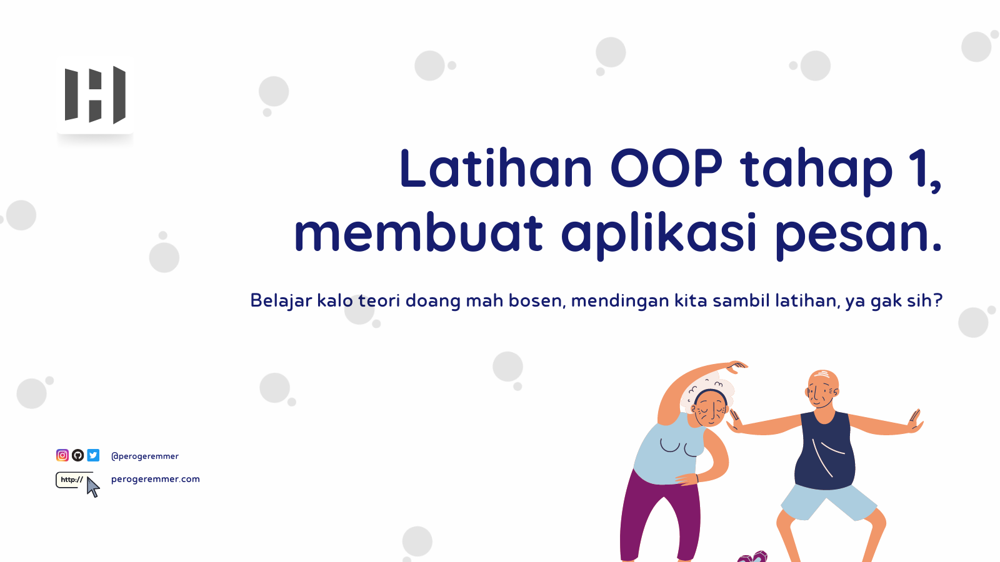

# Latihan OOP - Tahap 1 - Membuat aplikasi pesan

Gimana ges, udah belajar dan kenalan sama OOP kan? Kalo belom dan belom paham, jangan buru-buru kesini, better kamu [kesini dulu](https://github.com/perogeremmer/blog/blob/master/tutorial/series/python-programming/oop/1.%20Kenalan%20sama%20OOP.md).

## Overview

Jadi gini, kamu bakalan ditantang untuk membuat aplikasi sederhana, yaitu aplikasi pesan.
Aplikasi ini bakalan memungkinkan kamu untuk ngirim pesan melalui email, atau nomor telfon (sms).

### Pertama, bikin struktur folder kaya gini

```
.
├── core                    # Folder core, isinya logic business kita
│   ├── message.py          # Parent class, isinya fungsi abstraction dan untuk inheritance
│   ├── sms.py              # class SMS
│   └── email.py            # class Email
└── main.py                 # main class sebagai main program
```

Kita bikin semua logic business di dalam folder core supaya lebih terorganisir ges.

<hr/>

> Bahasa yang digunakan adalah bahasa Python

<hr/>

### Kedua, kita prepare dulu untuk perang


### Eh salah, maksudnya kita bikin masing-masing file berikut

message.py

```python
from abc import ABC, abstractmethod


class Message(ABC):
    def __init__(self) -> None:
        self.__title = None
        self.__message = None
        self.__target = None
        
    @abstractmethod
    def validate(self):
        pass
    
    def send(self):
        print("Sending message")
    
    def set_title(self, title: str):
        self.__title = title
        
    def get_title(self):
        return self.__title
    
    def set_message(self, message: str):
        self.__message = message
        
    def get_message(self):
        return self.__message
    
    def set_target(self, target: str):
        self.__target = target
        
    def get_target(self):
        return self.__target
```

<br/>

sms.py

```python
from core.message import Message

class SMS(Message):
    def __init__(self) -> None:
        super().__init__()

    def validate(self):
        message = []

        if not self.get_message():
            message.append("Please insert the message!")
        if not self.get_target():
            message.append("Please insert the phone number!")

        return message

    def send(self):
        target = self.get_target()
        message = self.get_message()
        print("Sending SMS...")
        print(f"Phone: {target}")
        print(f"Message: {message}")   
```

<br />

email.py

```python
from core.message import Message

class Email(Message):
    def __init__(self) -> None:
        super().__init__()
        
    def validate(self):
        message = []
        
        if not self.get_title():
            message.append("Please insert the title!")
        if not self.get_message():
            message.append("Please insert the message!")
        if not self.get_target():
            message.append("Please insert the email!")
            
        return message
    
    def send(self):
        target = self.get_target()
        title = self.get_title()
        message = self.get_message()
        print("Sending Email...")
        print(f"Email: {target}")
        print(f"title: {title}")
        print(f"Message: {message}")
```

<br/>

Last but not least...

<br/>

main.py

```python
import sys
from time import sleep

from core.email import Email
from core.sms import SMS


class Main:
    def run(self):
        print("Welcome to Message App")
        print("1. SMS")
        print("2. Email")
        print("3. Exit")
        print()

        choice = input("Please choose the options (1-3): ")

        if choice == "1":
            service = SMS()
            phone = input("Please input phone number: ")
            message = input("Please input message: ")

            service.set_message(message)
            service.set_target(phone)

        elif choice == "2":
            service = Email()
            email = input("Please input email: ")
            title = input("Please input title: ")
            message = input("Please input message: ")

            service.set_message(message)
            service.set_target(email)
            service.set_title(title)
        elif choice == "3":
            sys.exit()
        else:
            print("Choice is not found!")
            sleep(3)
            return

        validation = service.validate()

        print()
        if len(validation) > 1:
            for item in validation:
                print(item)

            print()
            return

        service.send()
        print()
        return


m = Main()

while True:
    try:
        m.run()
    except Exception as e:
        print(e)

```

<br />

## Hasil

```shell
Welcome to Message App
1. SMS
2. Email
3. Exit

Please choose the options (1-3): 1
Please input phone number: 082213308462
Please input message: Hi, Hudya

Sending SMS...
Phone: 082213308462
Message: Hi, Hudya
```

```shell
Welcome to Message App
1. SMS
2. Email
3. Exit

Please choose the options (1-3): 2
Please input email: hudya@perogeremmer.com
Please input title: Hi, Hudya
Please input message: How are you mate? 😃

Sending Email...
Email: hudya@perogeremmer.com
title: Hi, Hudya
Message: How are you mate? 😃
```

Gimana ges? Udah pada bisa jalan kan? 😆

Pertanyaanya, udah pada paham belom? Yaudah, gue bantu untuk jelasin ke klean-klean semuanya.

## Bedah Kode

Pertama, kalian cek class `Message`, disini kita nerapin empat hal OOP secara langsung.

- Fungsi `validate` ini nerapin abstraction, artinya nanti siapapun yang implementasi class message harus bikin fungsi ini. Kita pake abstraction soalnya nantinya SMS dan Email akan punya validasi yang berbeda tentunya.
- Fungsi `send` ini nerapin inheritance dan juga polymorphism, artinya ini akan diturunin sama class `Message` yang mana juga akan dipake sama SMS dan email, tentunya juga kode pada fungsi `send` pada class SMS dan Email pasti beda.
- Disini juga ada Setter Getter, yang mana ini penerapan encapsulation. Kita bahkan menurunkan sifat ini kepada class SMS dan Email yang mana atribut title, message, dan target ini dibuat private sehingga yang bisa akses ya cuma class Message aja, class yang nurunin bisa pake getter (fungsi get).

Kedua, pada masing-masing class SMS dan Email, kita nerapin dua fungsi validasi yang beda, tentunya kalo SMS kan ngga butuh judul lah ya, cuma message aja.

SMS.py validate function

```python
def validate(self):
    message = []
    
    if not self.get_message():
        message.append("Pesan tidak boleh kosong!")
    if not self.get_target():
        message.append("Target tidak boleh kosong!")
        
    return message
```

Email.py validate function

```python
def validate(self):
    message = []
    
    if not self.get_title():
        message.append("Judul tidak boleh kosong!")
    if not self.get_message():
        message.append("Pesan tidak boleh kosong!")
    if not self.get_target():
        message.append("Target tidak boleh kosong!")
        
    return message
```

Disini kita pake array, supaya kita bisa nampilin pesan kalo misalnya kejadiannya, salah satu data gak diisi atau bahkan semuanya.

Dimana itu diperiksa? Pada class main.py

```python
validation = service.validate()

if len(validation) > 1:
    for item in validation:
        print(item)
```

Disini kita akan mengeluarkan pesan seperti ini

```plain
Welcome to Message App
1. SMS
2. Email
3. Exit

Please choose the options (1-3): 1
Please input phone number: 
Please input message: 

Please insert the message!
Please insert the phone number!
```

<br/>

Jadi gimana? Udah pada ngerti kan? Semoga tetep semangat belajar ya guys! :wink:

