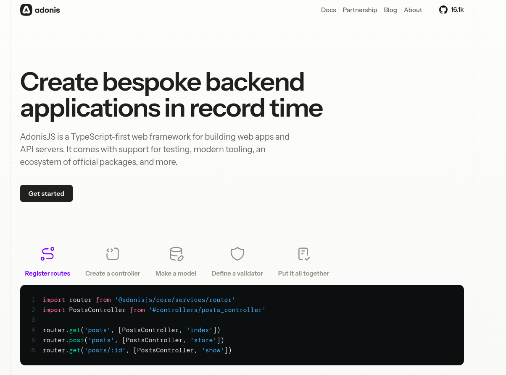
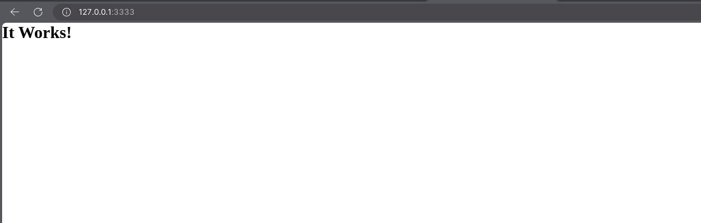

<br/>

by [@perogeremmer](https://twitter.com/perogeremmer)

## Kenalan dengan AdonisJS

Ngoding dengan Laravel tentu udah biasa, tapi kalian pernah denger gak framework dengan nama Adonis?

Yep framework ini emang bukan yang terkenal banget, tapi framework ini juga salah satu framework web yang cukup ramai dibicarakan terutama buat orang-orang yang memang menggeluti di bidang web development.

[Adonis](https://adonisjs.com/) ini adalah framework buatan [Harminder Virk](https://x.com/AmanVirk1). Tujuan beliau ngebangun ini adalah ngebangun web framework yang sederhana dan elegan ✨

## Install Adonis



Untuk mengunduh adonis, kita harus memastikan bahwa node kita memiliki versi di atas `20.6`. Cara ngeceknya gampang, cukup ketik kode berikut di terminal kalian:

```bash
node -v

# Contoh hasil yang keluar: 
# v22.0.0
```

Sekarang pergi ke folder yang kalian ingin buat projeknya lalu ketikkan perintah berikut:

```bash
npm init adonisjs@latest [nama projek]
```

Contoh:

```bash
hudya@perogeremmer-pc:~/code/perogeremmer$ npm init adonisjs@latest hello-world
Need to install the following packages:
create-adonisjs@2.4.0
Ok to proceed? (y) 
```

Ketik `y` dan tunggu aja hasilnya sampai seluruh file adonis disiapkan.

```bash

     _       _             _         _ ____  
    / \   __| | ___  _ __ (_)___    | / ___| 
   / _ \ / _` |/ _ \| '_ \| / __|_  | \___ \ 
  / ___ \ (_| | (_) | | | | \__ \ |_| |___) |
 /_/   \_\__,_|\___/|_| |_|_|___/\___/|____/ 
                                             

❯ Which starter kit would you like to use …  Press <ENTER> to select
▸ Slim Starter Kit A lean AdonisJS application with just the framework core
  Web Starter Kit Everything you need to build a server render app
  API Starter Kit AdonisJS app tailored for creating JSON APIs
  Inertia Starter Kit Inertia app with a frontend framework of your choice
```

Kamu akan dihadapkan dengan pilihan berikut.

- slim: projek adonis versi slim, biasanya untuk orang yang sudah paham atau familiar.
- web: projek khusus versi web dengan library yang dibutuhkan.
- api: projek khusus untuk api dengan library yang dikurangi kompleksitasnya dari web.
- inertia: projek web khusus yang akan di-integrasikan dengan framework frontend yang kita suka, misalnya react, svelte, vue, dan solid

Pada ini kita pilih saja web, arahkan kursor ke bawah dan tekan enter.

Kemudian kita juga ditemukan dengan pilihan (lagi).

```bash
❯ Which authentication guard you want to use …  Press <ENTER> to select
▸ Session Authenticate users using cookies and session
  Access Token Authenticate clients using API tokens
  Basic Auth Authenticate users using HTTP Basic Auth
  Skip I want to configure the Auth package manually
```

Karena kita membangun web, maka pilih saja session. Pilihan access token dan basic auth hanya ditujukan untuk pembuatan API.

Kemudian kita kembali ditanya:

```bash
❯ Which database driver you want to use …  Press <ENTER> to select
  SQLite
  LibSQL
▸ MySQL
  PostgreSQL
  MS SQL
  Skip I want to configure Lucid manually
```

Saya sarankan menggunakan MySQL untuk mempermudah pengembangan kalian, tapi kalau kalian sudah familiar dengan PostgreSQL, why not? Sama saja kok.

Kemudian tunggu hingga proses instalasi berhasil.

```bash
hudya@perogeremmer-pc:~/code/perogeremmer$ npm init adonisjs@latest hello-world
Need to install the following packages:
create-adonisjs@2.4.0
Ok to proceed? (y) y

     _       _             _         _ ____  
    / \   __| | ___  _ __ (_)___    | / ___| 
   / _ \ / _` |/ _ \| '_ \| / __|_  | \___ \ 
  / ___ \ (_| | (_) | | | | \__ \ |_| |___) |
 /_/   \_\__,_|\___/|_| |_|_|___/\___/|____/ 
                                             

❯ Which starter kit would you like to use · Web Starter Kit
❯ Which authentication guard you want to use · session
❯ Which database driver you want to use · mysql
❯ Download starter kit (3.1 s)
  Downloaded "github:adonisjs/web-starter-kit"
❯ Install packages (1.07 min)
  Packages installed using "npm"
❯ Prepare application (721 ms)
  Application ready
❯ Configure Lucid (6.44 s)
  Lucid configured to use "mysql" database
❯ Configure Auth (2.18 s)
  Auth configured to use "session" guard

╭──────────────────────────────────────────────────────────────────╮
│    Your AdonisJS project has been created successfully!          │
│──────────────────────────────────────────────────────────────────│
│                                                                  │
│    ❯ cd hello-world                                              │
│    ❯ npm run dev                                                 │
│    ❯ Open http://localhost:3333                                  │
│    ❯                                                             │
│    ❯ Have any questions?                                         │
│    ❯ Join our Discord server - https://discord.gg/vDcEjq6        │
│                                                                  │
╰──────────────────────────────────────────────────────────────────╯
```

## Menjalankan proyek

Sebelum menjalankan proyeknya, silahkan buka melalui Visual Studio Code atau editor lainnya yang kalian suka.

Buka file bagian .env dan lihat bagian ini:

```plain
TZ=UTC
PORT=3333
HOST=localhost
LOG_LEVEL=info
APP_KEY=OOEM9clhqcOD0h2d43T5Gnd0jIzO7Jnd
NODE_ENV=development
SESSION_DRIVER=cookie
DB_HOST=127.0.0.1
DB_PORT=3306
DB_USER=root
DB_PASSWORD=
DB_DATABASE=
```

Kita perlu mengisi nilai `DB_DATABASE` karena kita akan menggunakan database. Silahkan isi dengan nama database kalian.

> [!NOTE]
> Disini saya asumsikan kalian sudah menjalankan MySQL atau PHPMyAdmin pada laptop kalian.

Apabila kalian ingin membuat docker-compose dan paham cara pakainya, bisa membuat file `docker-compose.yml` dan isikan dengan kode di bawah ini:

```yml
version: '3.8'

services:
  mysql:
    image: mysql:8.0.36
    container_name: mysql_container
    environment:
      MYSQL_ROOT_PASSWORD: root
      MYSQL_DATABASE: adonis
      MYSQL_USER: adonis
      MYSQL_PASSWORD: secret-password
    ports:
      - "3306:3306"
    volumes:
      - mysql_data:/var/lib/mysql
    networks:
      - mysql_network

volumes:
  mysql_data:

networks:
  mysql_network:
```

Jangan lupa untuk mengganti nilai DB_DATABASE dengan nama databasenya.

Sebagai contoh apabila menggunakan `docker-compose.yaml` di atas kalian bisa mengganti data .env di atas dengan nilai berikut:

```text
DB_HOST=127.0.0.1
DB_PORT=3306
DB_USER=adonis
DB_PASSWORD=secret-password
DB_DATABASE=adonis
```

> [!NOTE]
> Bagi yang menggunakan PHPMyAdmin silahkan sesuaikan nama database yang kalian punya

Untuk menjalankan projek yang telah kita buat, cukup lakukan saja perintah yang ditulis oleh terminal.

```bash
npm run dev
```

Apabila berhasil maka akan muncul teks sebagai berikut:

```bash
[ info ] starting HTTP server...
╭─────────────────────────────────────────────────╮
│                                                 │
│    Server address: http://localhost:3333        │
│    Watch Mode: HMR                              │
│    Ready in: 1.11 s                             │
│                                                 │
╰─────────────────────────────────────────────────╯
[15:15:04.017] INFO (282496): started HTTP server on localhost:3333
```

Silahkan akses ke <http://127.0.0.1:3333> dan kamu akan menemukan gambar di bawah ini:



## Struktur

Sekarang kita lihat struktur folder kita sebagai berikut

```plain
hello-world/
├── app/
├── bin/
│ ├── console.ts
│ ├── server.ts
│ └── test.ts
├── config/
├── database/
│ └── migrations/
│ └── 1723215580268_create_users_table.ts
├── node_modules/
├── resources/
│ ├── css/
│ ├── js/
│ └── views/
├── start/
│ ├── env.ts
│ ├── kernel.ts
│ └── routes.ts
├── tests/
│ └── bootstrap.ts
├── .editorconfig
├── .env
├── .env.example
├── .gitignore
├── ace.js
├── adonisrc.ts
├── docker-compose.yml
├── package-lock.json
├── package.json
├── tsconfig.json
└── vite.config.ts
```

Berikut penjelasannya dari bagian yang perlu dijelaskan.

Karena adonis menggunakan pattern MVC (Model View Controller), otomatis kalian hanya perlu berfokus kepada folder `app` saja karena semua logika kode akan ditempatkan pada folder tersebut.


- `app/` : Folder ini berisi file-file aplikasi utama, seperti controller, model, dan middleware.
- `bin/`
  - `console.ts`: File ini digunakan untuk mendefinisikan perintah-perintah konsol yang dapat dijalankan.
  - `server.ts`: File ini digunakan untuk menjalankan server.
  - `test.ts`: File ini konfigurasi terkait pengujian otomatis.
- `config/`: Folder ini berisi file konfigurasi untuk aplikasi AdonisJS.
- `database/`
  - `migrations/`: Folder ini berisi file migrasi database.
    - `1723215580268_create_users_table.ts`: Contoh file migrasi untuk membuat tabel pengguna.
- `resources/`
  - `css/`: Folder untuk menyimpan file CSS.
  - `js/`: Folder untuk menyimpan file JavaScript.
  - `views/`: Folder untuk menyimpan file template atau view.
- `start/`
  - `env.ts`: File ini berisi konfigurasi env.
  - `kernel.ts`: File ini berisi konfigurasi kernel proyek, seperti middleware global.
  - `routes.ts`: File ini berisi definisi rute untuk aplikasi.
- `tests/`
  - `bootstrap.ts`: File ini digunakan untuk mengkonfigurasi pengujian yang akan dijalankan.
- `.editorconfig`: File ini berisi konfigurasi editor untuk menjaga konsistensi gaya kode.
- `.env`: File ini berisi variabel lingkungan untuk konfigurasi aplikasi.
- `.env.example`: Contoh file .env untuk referensi.
- `ace.js`: File ini digunakan untuk mengkonfigurasi perintah Ace dari Adonis.
- `adonisrc.ts`: File konfigurasi utama untuk AdonisJS.
- `vite.config.ts`: File ini berisi konfigurasi untuk Vite, alat pembangun frontend.

Demikian tutorial AdonisJS bagian pertama :)
