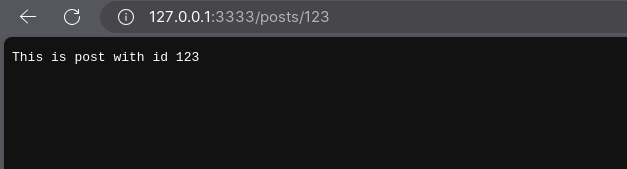
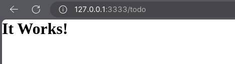

<br/>

by [@perogeremmer](https://twitter.com/perogeremmer)

## Routing

Routing merupakan fitur untuk menentukan URL pada sebuah aplikasi web. Menggunakan library [routing](https://docs.adonisjs.com/guides/basics/routing) di adonisJS tidak sulit, karena berdasarkan dokumentasi kita hanya perlu menggunakan file `start/routes.ts` untuk menambahkan rute.

Apabila kamu buka file tersebut kamu akan menemukan kode berikut:

```typescript
/*
|--------------------------------------------------------------------------
| Routes file
|--------------------------------------------------------------------------
|
| The routes file is used for defining the HTTP routes.
|
*/

import router from '@adonisjs/core/services/router'

router.on('/').render('pages/home')
```

Sekarang kita coba ubah dengan kode berikut:

```typescript
/*
|--------------------------------------------------------------------------
| Routes file
|--------------------------------------------------------------------------
|
| The routes file is used for defining the HTTP routes.
|
*/

import router from '@adonisjs/core/services/router'

router.get('/', () => {
  return 'Hello world from the home page.'
})

router.get('/about', () => {
  return 'This is the about page.'
})

router.get('/posts/:id', ({ params }) => {
  return `This is post with id ${params.id}`
})
```

Karena kita menjalankan proyek dengan `npm run dev`, otomatis aplikasi melakukan refresh untuk memperbarui tampilan.

```bash
full-reload start/routes.ts
╭─────────────────────────────────────────────────╮
│                                                 │
│    Server address: http://localhost:3333        │
│    Watch Mode: HMR                              │
│    Ready in: 1.17 s                             │
│                                                 │
╰─────────────────────────────────────────────────╯
[15:39:54.048] INFO (298477): started HTTP server on localhost:3333
```

Sekarang kamu dapat mengakses tiga rute:

- home dengan rute `localhost:3333/`
- about dengan rute `localhost:3333/about`
- post dengan rute `localhost:3333/posts/id_post`

Catatan, rute post menerima parameter `:id` sehingga nilai parameter tersebut dapat kita tampilkan.



### Routing dengan Controller

Karena kita menggunakan aplikasi yang berbasis MVC (Model View Controller), kita akan membuat controller baru.

Pertama, buat controller baru dengan cara

```bash
node ace make:controller todo
```

kamu akan melihat file `todos_controller.ts` pada folder `app/controllers`.

Sekarang kita perlu mengubahnya agar menjadi seperti ini:

```typescript
import type { HttpContext } from '@adonisjs/core/http'

export default class TodosController {
  /**
   * Display a list of resource
   */
  async index({ view }: HttpContext) {
    return view.render("pages/home");
  }
}
```

Disini kita mengubah controller agar menampilkan halaman home pada `resources/views/pages/home.edge`. Halaman tersebut merupakan views yang akan ditampilkan melalui controller.

Kemudian ubah `start/routes.ts` agar menjadi seperti ini:

```typescript
/*
|--------------------------------------------------------------------------
| Routes file
|--------------------------------------------------------------------------
|
| The routes file is used for defining the HTTP routes.
|
*/

import router from '@adonisjs/core/services/router'

import TodosController from '#controllers/todos_controller'
router.get('/todo', [TodosController, 'index'])


router.get('/', () => {
  return 'Hello world from the home page.'
})

router.get('/about', () => {
  return 'This is the about page.'
})

router.get('/posts/:id', ({ params }) => {
  return `This is post with id ${params.id}`
})
```

Disini kita menambahkan satu rute baru untuk menampilkan `TodoController` fungsi `index` pada rute `/todo`.

Sekarang hentikan aplikasi dengan cara menekan `CTRL + C` pada terminal lalu jalankan ulang dengan cara menuliskan `npm run dev`.

Sekarang akses `localhost:3333/todo` lalu kamu akan melihat ini:


