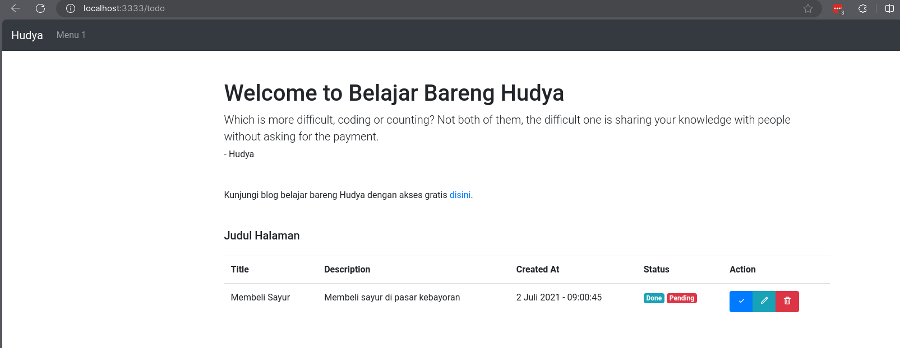

<br/>

by [@perogeremmer](https://twitter.com/perogeremmer)

## Templating

Templating merupakan fitur untuk menampilkan sebuah halaman. Adonis menerapkan pattern MVC (Model View Controller) sehingga kita bisa menggunakan views untuk menampilkan halaman, nah templating ini berfungsi untuk membuat tampilan yang reusable. Artinya diibaratkan kamu memiliki tubuh yang sama, tapi bisa berganti-ganti pakaian.

Berikut kurang lebih diagram dari template.


Dapat kita lihat bahwa bagian Body bisa kita ubah menyesuaikan keadaan yang kita inginkan.

## Membuat Template

Membuat template di adonis tidaklah mudah, apabila kalian terbiasa dengan laravel, kalian pasti tau dengan template engine yang bernama `blade`.

Pada Adonis, template engine yang digunakan bernama `edge`.  Kita akan membuat basis dari template yang akan digunakan. Pertama, buat dulu struktur pada folder `resources/views` agar menjadi seperti ini:

```plain
views
├── components
├── layouts
├── pages
```

Kemudian isi folder layouts dengan struktur seperti ini:

```plain
layouts
├── footer.edge
├── head.edge
├── jumbotron.edge
├── navbar.edge
├── scripts.edge
```

> [!NOTE]
> Buat file di atas pada folder layouts

Sekarang buatlah folder `public` sejajar dengan folder lain pada bagian awal.

```plain

hello-world/
├── app/
├── bin/
├── config/
├── database/
├── node_modules/
├── public/ <-- Buat folder ini
├── resources/
├── start/
```

Buat folder css di dalamnya seperti ini:

```plain
public/
├── css/
```

Buat file `main.css` di dalamnya lalu masukkan kode berikut:

```css
/* Sticky footer styles
-------------------------------------------------- */

html {
    position: relative;
    min-height: 100%;
}

body {
    /* Margin bottom by footer height */
    margin-bottom: 60px;
}

.footer {
    position: absolute;
    bottom: 0;
    width: 100%;
    /* Set the fixed height of the footer here */
    height: 60px;
    line-height: 60px;
    /* Vertically center the text there */
    background-color: #f5f5f5;
}


/* Custom page CSS
  -------------------------------------------------- */


/* Not required for template or sticky footer method. */

body>.container {
    padding: 60px 15px 0;
}

.footer>.container {
    padding-right: 15px;
    padding-left: 15px;
}

code {
    font-size: 80%;
}
```

Sekarang masukkan kode berikut satu persatu pada folder `layouts`:

`footer.edge`

```html
<footer class="footer ">
  <div class="container ">
      <span class="text-muted ">Place sticky footer content here.</span>
  </div>
</footer>
```

<br />

`head.edge`

```html
<!-- Required meta tags -->
<meta charset="utf-8">
<meta name="viewport" content="width=device-width, initial-scale=1">

<!-- Bootstrap CSS -->
<link rel="stylesheet" href="https://stackpath.bootstrapcdn.com/bootstrap/4.3.1/css/bootstrap.min.css"
  integrity="sha384-ggOyR0iXCbMQv3Xipma34MD+dH/1fQ784/j6cY/iJTQUOhcWr7x9JvoRxT2MZw1T" crossorigin="anonymous">
<link rel="stylesheet" href="css/main.css">
<link href='https://unpkg.com/boxicons@2.0.9/css/boxicons.min.css' rel='stylesheet'>

<title>Hello, world!</title>
```

<br />

`jumbotron.edge`

```html
<div class="container">
  <h1 class="mt-5 ">Welcome to Belajar Bareng Hudya</h1>
  <p class="lead mb-5">Which is more difficult, coding or counting? Not both of them, the difficult one is sharing
    your knowledge with people without asking for the payment. <br /> <small>- Hudya</small></p>
  <p>Kunjungi blog belajar bareng Hudya dengan akses gratis <a href="https://hudya.xyz ">disini</a>.</p>
</div>
```

<br />

`navbar.edge`

```html
<header>
  <!-- Fixed navbar -->
  <nav class="navbar navbar-expand-lg navbar-dark bg-dark fixed-top">
      <a class="navbar-brand" href="#">Hudya</a>
      <!-- Navbar brand yo -->
      <button class="navbar-toggler" type="button" data-toggle="collapse" data-target="#navbarTop" aria-controls="navbar" aria-expanded="false" aria-label="Toggle navigation">
          <span class="navbar-toggler-icon"></span>
      </button>

      <div class="collapse navbar-collapse" id="navbarTop">
          <ul class="navbar-nav mr-auto">
              <li class="nav-item"><a class="nav-link" href="#about">Menu 1</a> </li>
          </ul>
      </div>
  </nav>
</header>
```

<br />

`scripts.edge`

```html
<!-- Optional JavaScript -->
<!-- jQuery first, then Popper.js, then Bootstrap JS -->
<script src="https://ajax.googleapis.com/ajax/libs/jquery/3.2.1/jquery.min.js"></script>
<script src="https://cdnjs.cloudflare.com/ajax/libs/popper.js/1.12.6/umd/popper.min.js"></script>
<script src="https://maxcdn.bootstrapcdn.com/bootstrap/4.0.0/js/bootstrap.min.js"></script>
```

<br />

Terakhir, buat file `base.edge` di dalam folder `components` lalu masukkan kode berikut:

```jinja
<!doctype html>
<html lang="en">

<head>
  @include('layouts/head')
</head>

<body>
  @include('layouts/navbar')


  <main role="main " class="container">
    @include('layouts/jumbotron')

    {{{ await $slots.content() }}}
  </main>

  @include('layouts/footer')

  @include('layouts/scripts')
</body>
</html>
```

Jadi setelah kita membuat masing-masing setiap bagian yang dapat digunakan kembali (reusable), kita satukan semuanya di dalam sebuah file base.

Kita membuatnya di dalam folder `components` karena memang aturan dari engine `edge` dari Adonis seperti itu, jadi kita hanya perlu mengikutinya.

Dapat dilihat dari kode di atas bahwa bagian `include` artinya kita sisipkan seluruh kode di file `layouts/head.edge` ke dalam tag `head`.

Terakhir, ubah file `resources/views/pages/home.edge` dengan kode berikut:

```jinja
@base()
@slot("content")
<div class="container mt-5">
  <div class="row mb-4">
    <div class="col-12">
      <h5 class="mb-4">Judul Halaman</h5>

      <table class="table table-hover ">
        <thead>
          <tr>
            <th scope="col ">Title</th>
            <th scope="col ">Description</th>
            <th scope="col ">Created At</th>
            <th scope="col ">Status</th>
            <th scope="col ">Action</th>
          </tr>
        </thead>
        <tbody>
          <tr>
            <td>Membeli Sayur</td>
            <td>Membeli sayur di pasar kebayoran</td>
            <td>2 Juli 2021 - 09:00:45</td>
            <td>
              <span class="badge badge-info text-white ">Done</span>
              <span class="badge badge-danger text-white ">Pending</span>
            </td>
            <td>
              <div class="btn-group " role="group " aria-label="Basic example ">
                <a href="# " class="btn btn-primary text-white ">
                  <i class='bx bx-check'></i>
                </a>
                <a href="# " class="btn btn-info text-white ">
                  <i class='bx bx-pencil'></i>
                </a>
                <a href="# " class="btn btn-danger text-white ">
                  <i class='bx bx-trash'></i>
                </a>
              </div>
            </td>
          </tr>
        </tbody>
      </table>
    </div>
  </div>
</div>
@end
```

Sekarang jalankan kembali `npm run dev` dan akses url `localhost:3333/`, maka akan muncul tampilannya:


