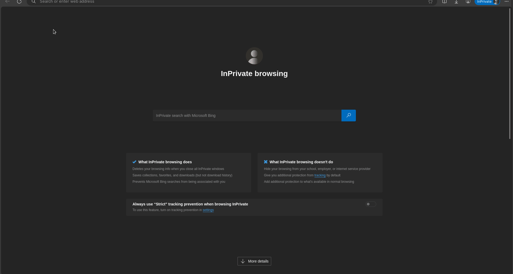

<br/>

by [@perogeremmer](https://twitter.com/perogeremmer)

## CRUD (Create, Read, Update, Delete)

Fitur CRUD adalah salah satu fitur paling basic di dalam pembelajaran pemrograman. Fitur CRUD merupakan aksi dasar dalam membuat program, karena hampir semua program pasti memiliki fitur CRUD.

Perbedaan paling dasar pada CRUD di setiap program adalah kompleksitas dari proses akhir CRUD. Untuk pembelajaran, fitur CRUD paling awal biasanya hanya melibatkan sedikit proses yang mana langsung disimpan perubahannya menuju ke database.

Pada kasus kali ini, kita akan belajar CRUD todo-list dengan template yang kemarin kita gunakan.

## Migration

Pertama kita perlu membuat migration terlebih dahulu. Migration adalah file dimana kita dapat melakukan perubahan data pada database sehingga kita tidak perlu melakukan perubahan secara langsung pada database.

Hal ini penting dilakukan mengingat bahwa menyentuh database secara langsung dapat saja melakukan hal-hal yang malah nantinya merusak tabel atau data pada database itu sendiri.

Pertama, pastikan kalian sudah mengaktifkan atau menyalakan MySQL baik menggunakan PHPMyAdmin (sangat disarankan bagi pemula), atau kamu juga dapat menggunakan docker.

Kedua, pastikan kalian sudah menyiapkan databasenya, seharusnya sudah karena di tutorial pertama kita sudah harus menyiapkan databasenya.

Ketiga, silahkan masukkan perintah berikut untuk membuat migration.

```bash
node ace make:migration todo

# Hasil
# hudya@perogeremmer-pc:~/code/perogeremmer/hello-world$ node ace make:migration todo
# DONE:    create database/migrations/1723422869961_create_todos_table.ts
```

Menulis migration pada adonis juga memiliki grammar tersendiri, hal ini sama dengan Laravel yang memiliki Migration. Untuk melihat dokumentasi lengkapnya kamu bisa mengunjungi [adonis lucid disini](https://lucid.adonisjs.com/docs/migrations).

Kita akan membuat struktur yang sederhana yaitu:

- judul todo
- deskripsi
- status todo
- waktu dibuat
- waktu dihapus

Sehingga, file migration todo yang berada pada folder `database/migrations` akan menjadi seperti ini:

```typescript
import { BaseSchema } from '@adonisjs/lucid/schema'

export default class extends BaseSchema {
  protected tableName = 'todos'

  async up() {
    this.schema.createTable(this.tableName, (table) => {
      table.increments('id')
      table.string('title').notNullable()
      table.text('description').nullable()
      table.string('status', 30)
      table.timestamp('created_at')
      table.timestamp('updated_at')
      table.datetime('deleted_at').nullable()
    })
  }

  async down() {
    this.schema.dropTable(this.tableName)
  }
}
```

Secara default library migration zaman sekarang sudah menyiapkan `created_at` dan `updated_at` secara default untuk migrationnya. Hal ini dikarenakan kedua kolom ini sangat penting untuk mendeteksi kapan data dibuat dan kapan data diperbarui.

Sekarang kita bisa menguji coba terlebih dahulu apakah struktur ini berjalan atau tidak. Masukkan perintah berikut:

```bash
node ace migration:run

# Hasil

# [ info ] Upgrading migrations version from "1" to "2"
# ❯ migrated database/migrations/1723215580268_create_users_table
# ❯ migrated database/migrations/1723422869961_create_todos_table
# Migrated in 333 ms
```

Dapat kita lihat semua migrations berjalan dan kita bisa mengeceknya ke database, apabila kamu menggunakan PHPMyAdmin silahkan buka halamannya.

```plain
mysql> show tables;
+------------------------+
| Tables_in_adonis       |
+------------------------+
| adonis_schema          |
| adonis_schema_versions |
| todos                  |
| users                  |
+------------------------+
4 rows in set (0.00 sec)

mysql> show columns from todos;
+-------------+--------------+------+-----+---------+----------------+
| Field       | Type         | Null | Key | Default | Extra          |
+-------------+--------------+------+-----+---------+----------------+
| id          | int unsigned | NO   | PRI | NULL    | auto_increment |
| title       | varchar(255) | NO   |     | NULL    |                |
| description | text         | YES  |     | NULL    |                |
| status      | varchar(30)  | YES  |     | NULL    |                |
| created_at  | timestamp    | YES  |     | NULL    |                |
| updated_at  | timestamp    | YES  |     | NULL    |                |
| deleted_at  | datetime     | YES  |     | NULL    |                |
+-------------+--------------+------+-----+---------+----------------+
7 rows in set (0.00 sec)
```

> [!NOTE]
> Kelebihan dari migration itu sendiri adalah developer bisa melakukan rollback (mundur ke belakang), apabila terjadi sesuatu yang tidak diinginkan pada struktur database, hal ini dapat dilakukan di level development karena bisa saja perubahannya seperti menghapus kolom, maupun menghilangkan atribut.

## Seeder

Setelah membuat tabel, tentu tabel tersebut masih berisi data yang kosong. Kelebihan adonis JS adalah kita dapat membuat data seeder, artinya seperti memberikan biji ke dalam pot yang akan tumbuh.

Seeder ini merupakan fitur penting dalam pengembangan aplikasi, karena apabila sebuah proyek dilempar ke tim atau developer lain, developer tersebut dapat melihat seperti apa data awal (dasar) pada saat proyek dibangun.

Untuk membuatnya tidak sulit, cukup masukkan perintah:

```bash
node ace make:seeder todo

# Hasil
# DONE:    create database/seeders/todo_seeder.ts
```

Sekarang ubah `todo_seeder.ts` dengan kode berikut:

```ts
import db from '@adonisjs/lucid/services/db'
import { BaseSeeder } from '@adonisjs/lucid/seeders'

export default class extends BaseSeeder {
  async run() {

    let i = 0;
    while (i < 10) {
      await db
        .table('todos')
        .insert({
          "title": `Judul Todo ke-${i}`,
          "description": `Deskripsi Todo ke-${i}`,
          "status": "TODO",
          "created_at": new Date(),
          "updated_at": new Date()
        })
      i++;
    }
  }
}
```

Berdasarkan kode di atas, kita akan membuat sepuluh data baru pada table `todos` dengan judul, deskripsi dan status dasar.

Kode di atas menggunakan library DB dari lucid dimana kita tidak perlu membuat model untuk memasukannya ke DB, hal ini tentu memudahkan kita dalam memanipulasi data yang sifatnya seeding atau data awal.

Setelah merubah isi kode, jalankan dengan menuliskan perintah berikut:

```bash
node ace db:seed

# Hasil
# ❯ completed database/seeders/todo_seeder
```

<br />

Sekarang apabila kamu lihat ke database kamu akan melihat data tersebut:

```plain
mysql> select * from todos;
+----+-----------------+---------------------+--------+---------------------+---------------------+------------+
| id | title           | description         | status | created_at          | updated_at          | deleted_at |
+----+-----------------+---------------------+--------+---------------------+---------------------+------------+
|  1 | Judul Todo ke-0 | Deskripsi Todo ke-0 | TODO   | 2024-08-12 02:44:37 | 2024-08-12 02:44:37 | NULL       |
|  2 | Judul Todo ke-1 | Deskripsi Todo ke-1 | TODO   | 2024-08-12 02:44:37 | 2024-08-12 02:44:37 | NULL       |
|  3 | Judul Todo ke-2 | Deskripsi Todo ke-2 | TODO   | 2024-08-12 02:44:37 | 2024-08-12 02:44:37 | NULL       |
|  4 | Judul Todo ke-3 | Deskripsi Todo ke-3 | TODO   | 2024-08-12 02:44:37 | 2024-08-12 02:44:37 | NULL       |
|  5 | Judul Todo ke-4 | Deskripsi Todo ke-4 | TODO   | 2024-08-12 02:44:37 | 2024-08-12 02:44:37 | NULL       |
|  6 | Judul Todo ke-5 | Deskripsi Todo ke-5 | TODO   | 2024-08-12 02:44:38 | 2024-08-12 02:44:38 | NULL       |
|  7 | Judul Todo ke-6 | Deskripsi Todo ke-6 | TODO   | 2024-08-12 02:44:38 | 2024-08-12 02:44:38 | NULL       |
|  8 | Judul Todo ke-7 | Deskripsi Todo ke-7 | TODO   | 2024-08-12 02:44:38 | 2024-08-12 02:44:38 | NULL       |
|  9 | Judul Todo ke-8 | Deskripsi Todo ke-8 | TODO   | 2024-08-12 02:44:38 | 2024-08-12 02:44:38 | NULL       |
| 10 | Judul Todo ke-9 | Deskripsi Todo ke-9 | TODO   | 2024-08-12 02:44:38 | 2024-08-12 02:44:38 | NULL       |
+----+-----------------+---------------------+--------+---------------------+---------------------+------------+
10 rows in set (0.00 sec)
```

Viola, sepuluh data awal sudah berhasil kita tambahkan!

## Operasi Create, Read, Update, dan Delete

Setelah berhasil membuat data awal, kita akan coba untuk membuat CRUD yang menjadi tujuan utama. Sekarang hapus kedua file `seconds_controller.ts` dan `todos_controller.ts` karena kita sudah tidak membutuhkannya.

Alasan kita tidak membutuhkan `todos_controller.ts` adalah karena saya ingin memberitahu cara membuat controller dengan konsep restful dimana sudah tersedia banyak method bawaan, masukkan perintah berikut pada terminal:

```bash
node ace make:controller todo --resource

# Hasil
# DONE:    create app/controllers/todos_controller.ts
```

Sekarang kamu akan melihat isi file `todos_controller.ts` seperti ini:

```typescript
import type { HttpContext } from '@adonisjs/core/http'

export default class TodosController {
  /**
   * Display a list of resource
   */
  async index({}: HttpContext) {}

  /**
   * Display form to create a new record
   */
  async create({}: HttpContext) {}

  /**
   * Handle form submission for the create action
   */
  async store({ request }: HttpContext) {}

  /**
   * Show individual record
   */
  async show({ params }: HttpContext) {}

  /**
   * Edit individual record
   */
  async edit({ params }: HttpContext) {}

  /**
   * Handle form submission for the edit action
   */
  async update({ params, request }: HttpContext) {}

  /**
   * Delete record
   */
  async destroy({ params }: HttpContext) {}
}
```

Atribut `--resource` merupakan atribut yang dapat disisipkan pada saat membuat controller untuk menerapkan konsep RESTful yaitu `GET`, `POST`, `PUT`, dan `DELETE`.

Sebelum kita coba menampilkan data, kita perlu membuat model terlebih dahulu, masukkan perintah berikut:

```bash
node ace make:model todo

# Hasil
# DONE:    create app/models/todo.ts
```

Kemudian ubah isi file app/models/todo.ts dengan kode berikut:

```typescript
import { DateTime } from 'luxon'
import { BaseModel, column } from '@adonisjs/lucid/orm'

export default class Todo extends BaseModel {
  static table = 'todos'

  @column({ isPrimary: true })
  declare id: number

  @column()
  declare title: string

  @column()
  declare description: string

  @column()
  declare status: string

  @column.dateTime({ autoCreate: true })
  declare createdAt: DateTime

  @column.dateTime({ autoCreate: true, autoUpdate: true })
  declare updatedAt: DateTime

  @column.dateTime()
  declare deletedAt: DateTime
}
```

Kita memastikan semua kolom yang berada pada database ditulis di dalam model dimana Model Todo ini sendiri bertugas menjadi jembatan untuk mengelola data pada tabel todos.

Kita juga menambahkan `static table = 'todos'` karena `class Todo` mereprenstasikan table `todo`, sedangkan nama tabel kita adalah `todos` sehingga kita perlu menambahkan baris kode tersebut.

Sekarang kembali ke `todo controller` dan ubah kode pada fungsi index agar menjadi seperti ini:

```typescript
import type { HttpContext } from '@adonisjs/core/http'
import Todo from '#models/todo'

export default class TodosController {
  /**
   * Display a list of resource
   */
  async index({ view }: HttpContext) {
    const allTodos = await Todo.all()
    return view.render("pages/home", { todos: allTodos })
  }
```

Berdasarkan kode di atas, kita akan menampilkan seluruh data pada tabel `todos` dengan menggunakan model Todo. Memanggil model Todo tidaklah sulit, cukup import saja pada bagian paling atas lalu panggil dengan `await Todo.all()` untuk mengksekusi query dasar yaitu `SELECT * FROM todos`.

Data yang telah didapatkan disimpan dalam bentuk array di dalam variabel `allTodos` kemudian dioper ke views di dalam objek `todos`.

Sekarang pergi ke resources/views/pages/home.edge lalu ubah agar menjadi seperti ini:

```jinja
@base()
@slot("content")
<div class="container mt-5">
  <div class="row mb-4">
    <div class="col-12">
      <h5 class="mb-4">Judul Halaman</h5>

      <table class="table table-hover ">
        <thead>
          <tr>
            <th scope="col ">Title</th>
            <th scope="col ">Description</th>
            <th scope="col ">Created At</th>
            <th scope="col ">Status</th>
            <th scope="col ">Action</th>
          </tr>
        </thead>
        <tbody>
          @each(todo in todos)
          <tr>
            <td>{{ todo.title }}</td>
            <td>{{ todo.description }}</td>
            <td>{{ todo.createdAt }}</td>
            <td>
              <span class="badge badge-info text-white ">{{ todo.status }}</span>
            </td>
            <td>
              <div class="btn-group " role="group " aria-label="Basic example ">
                <a href="# " class="btn btn-primary text-white ">
                  <i class='bx bx-check'></i>
                </a>
                <a href="# " class="btn btn-info text-white ">
                  <i class='bx bx-pencil'></i>
                </a>
                <a href="# " class="btn btn-danger text-white ">
                  <i class='bx bx-trash'></i>
                </a>
              </div>
            </td>
          </tr>
          @end
        </tbody>
      </table>
    </div>
  </div>
</div>
@end
@end
```

Menggunakan sintaks `@each` sesuai dengan library [edge js](https://edgejs.dev/docs/loops), kita menampilkan semua data yang berada pada objek `todos` dari controller.

Terakhir, file `start/routes.ts` kita ubah terlebih dahulu agar bersih dari kode-kode sebelumnya:

```typescript
/*
|--------------------------------------------------------------------------
| Routes file
|--------------------------------------------------------------------------
|
| The routes file is used for defining the HTTP routes.
|
*/

import router from '@adonisjs/core/services/router'
import TodosController from '#controllers/todos_controller'


router.get('/todo', [TodosController, 'index'])
```

Sekarang coba jalankan `npm run dev` lalu akses `localhost:3333/todo`.


