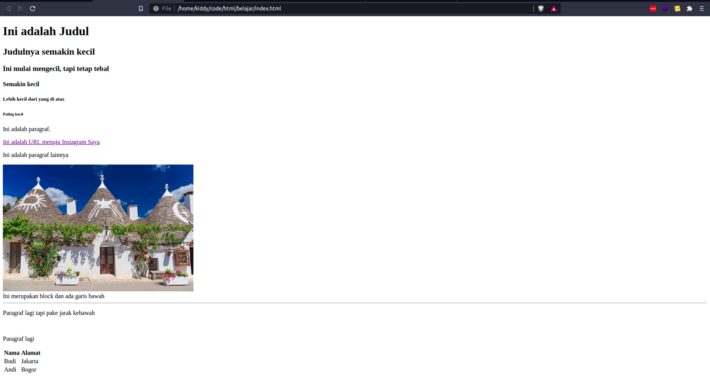
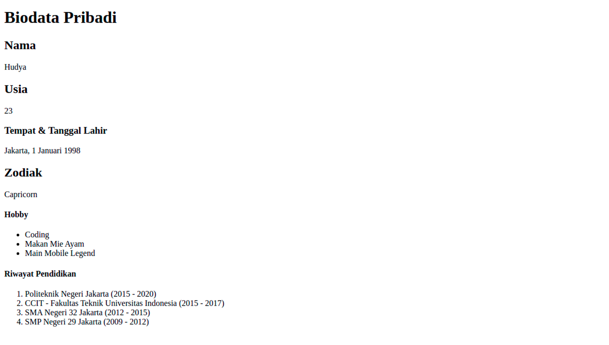

**Table of contents**

- [Overview](#overview)
- [Tag Dasar](#tag-dasar)
- [HTML berisi Elemen dan Atribut](#html-berisi-elemen-dan-atribut)
  - [Definisi Atribut](#definisi-atribut)
- [HTML Diberi Sebuah Format](#html-diberi-sebuah-format)
- [HTML Juga Bisa Bergaya](#html-juga-bisa-bergaya)
- [Challenge](#challenge)

# Overview

Pada materi sebelumnya yaitu kita sudah belajar mengenai cara eksekusi file HTML dan menuliskannya pada teks editor milik kita.

Sekarang kita akan lebih dalam membahas HTML, siapkan waktu dan bensin (semangat) milikmu!

# Tag Dasar

Ada banyak tag yang terdapat pada HTML, namun kita tidak perlu menghafal semuanya. Kita hanya perlu mengingat dan mengulang daftar tag berikut:

- html → Tag HTML
- head → Tag bagian kepala
- body → Tag bagian badan
- footer → Tag bagian kaki
- h → Untuk membuat heading (judul)
- p → Untuk membuat paragraf
- a → Untuk membuat URL (LINK)
- img → Untuk menyisipkan gambar
- div → Untuk membuat sebuah section (block)
- hr → Untuk memberikan garis bawah
- br → Untuk memberi jarak (break)
- ul → Untuk membuat daftar tidak berurutan
- ol → Untuk membuat daftar berurutan
- li → Untuk item dari daftar
- table → Untuk membuat Tabel
- form → Untuk membuat form

<br/>

⚠️ Ngga perlu dihafalkan, sambil berlatih juga nantinya akan hafal.

<br/>

Mari kita coba, tuliskanlah kode berikut pada kode editor kamu:

```html
<!DOCTYPE html>
<html>

<head>
    <title>Belajar HTML</title>
</head>

<body>

    <h1>Ini adalah Judul</h1>
    <h2>Judulnya semakin kecil</h2>
    <h3>Ini mulai mengecil, tapi tetap tebal</h3>
    <h4>Semakin kecil</h4>
    <h5>Lebih kecil dari yang di atas</h5>
    <h6>Paling kecil</h6>

    <p>Ini adalah paragraf.</p>

    <a href="https://instagram.com/perogeremmer"> Ini adalah URL menuju Instagram Saya</a>

    <p>Ini adalah paragraf lainnya</p>

    

    <div>
        Ini merupakan block dan ada garis bawah
    </div>

    <hr/>

    <p>
        Paragraf lagi tapi pake jarak kebawah
    </p>
    <br/>
    <p>
        Paragraf lagi
    </p>

    <table>
        <tr>
            <th>Nama</th>
            <th>Alamat</th>
        </tr>
        <tr>
            <td>Budi</td>
            <td>Jakarta</td>
        </tr>
        <tr>
            <td>Andi</td>
            <td>Bogor</td>
        </tr>
    </table>

    <br/>

    <h1>Makanan Kesukaan Raja</h1>
    <ul>
        <li>Anggur</li>
        <li>Daging Sapi</li>
        <li>Daging Ayam</li>
    </ul>

    <br />

    <h1>Makanan Terenak</h1>
    <ol>
        <li>Warteg</li>
        <li>Nasi Padang</li>
        <li>Nasi Goreng Tek Tek</li>
    </ol>

</body>

</html>
```



Mudah sekali bukan? Kita telah menggunakan tag-tag dasar pada HTML, dan tentunya kamu juga sudah melihat hasilnya secara langsung, contohnya untuk tag a berupa URL dapat kita klik dan menuju instagram saya.

<aside>
⚠️ tag Heading memiliki nomor maksimal yaitu 6, semakin kecil angkanya maka hasil teksnya menjadi semakin besar. Namun, semakin besar nomornya maka hasil teksnya menjadi semakin kecil.

</aside>

# HTML berisi Elemen dan Atribut

Ya, HTML berisikan sebuah elemen dan atribut, yaitu bagian yang menjadi kebutuhan dari HTML.

Elemen disini bukanlah elemen api, air, angin, ataupun tanah ya. Namun elemen merupakan **isi dari sebuah tag HTML.** Contoh penerapan Elemen pada HTML:

```html
<p>ELEMEN API</p>
```

Kalimat **ELEMEN API** merupakan elemen pada HTML.

Atribut adalah.... ya sebuah atribut, apalagi?

Atribut adalah parameter tambahan yang dapat mempengaruhi elemen maupun tag HTML itu sendiri. Contoh penerapan atribut pada HTML:

```html
<a href="https://instagram.com/perogeremmer"> Ini adalah URL menuju Instagram Saya</a>

```

Ya, **href** pada tag `a`, dan **src**, serta **alt** pada tag `img` merupakan sebuah atribut. Kita dapat menuliskan banyak atribut secara acak, namun ada beberapa atribut dasar yang digunakan sebagai default attribute pada sebuah tag, contohnya ya kode yang di atas ini.

## Definisi Atribut

- src → Sumber gambar
- alt → Alternatif teks apabila gambar tidak ditemukan
- href → URL yang dituju

# HTML Diberi Sebuah Format

HTML dapat diberikan sebuah format. Format disini bukanlah .jpg, .png, atau bahkan .mp4, melainkan tag itu sendiri, dapat diberi format layaknya editor word, yaitu seperti tebal, miring, garis bawah, superscrpt, dan lain-lain. Lihatlah format yang bisa kamu lakukan

- `<b>` - Menebalkan teks
- `<strong>` - Menunjukan bahwa teks penting (tebal juga) (tag ini baik untuk SEO)
- `<i>` - Memiringkan teks
- `<u>` - Teks dengan garis bawah
- `<em>` - Membuat teks emphasis bahwa tandanya menjadi penting
- `<mark>` - Teks bertanda
- `<small>` - Teks kecil
- `<del>` - Teks yang diberi strike seperti terhapus
- `<ins>` - Teks garis bawah seperti penanda bahwa teks tersebut dimasukkan
- `<sub>` - Teks kecil di bawah
- `<sup>` - Teks kecil di atas

Cobalah kode berikut:

```html
<!DOCTYPE html>
<html>

<head>
    <title>Belajar HTML</title>
</head>

<body>

    <p>Teks ini menjadi <b>tebal</b></p>

    <p>Emphasis tandanya merupakan teks <em>penting</em></p>

    <p>Teks ini <i>miring</i> seperti menara pisa</p>

    <p>Teks ini <mark>bertanda</mark></p>
    <p>Teks ini <small>kecil sekali</small></p>
    <p>Aku <del>sayang</del> tidak sayang padamu</p>

    <p>Teks ini baru saja <ins>ditambahkan</ins></p>

    <p><u>Teks ini garis bawah</u></p>

    <p>Hasil dari X<sub>2</sub> + Y<sub>4</sub> = Z<sub>6</sub></p>
    <p>Manusia membutuhkan O<sup>2</sup> untuk bernafas</p>

</body>

</html>
```

Kita dapat melihat ada beberapa persamaan hasil yaitu `em` dengan `i`, dan `ins` dengan `u`. Secara visual memang sama, namun menurut teori, ada bedanya. Saya tidak ingin kamu untuk memusingkan apa bedanya, yang paling sering digunakan adalah `i` dan `u`.

Namun kalau kamu masih kepo, here's the resource:

- [The Emphasis element - HTML: HyperText Markup Language | MDN](https://developer.mozilla.org/en-US/docs/Web/HTML/Element/em)
- [Whats the difference between the u tag and the ins tag?](https://stackoverflow.com/questions/12148517/whats-the-difference-between-the-u-tag-and-the-ins-tag)

# HTML Juga Bisa Bergaya

Tidak hanya jamet yang bisa bergaya, HTML juga bisa memiliki gaya. Gaya disini bukanlah simbol  F dengan satuan newton pada fisika, namun dapat dikatakan yaitu sebuah **Style** 😎. Perhatikan kode berikut:

```html
<tagname style="property:value;">
```

Sebuah tag dapat ditambahkan atribut style. Atribut style adalah atribut default untuk memberikan seni pada sebuah tag, jadi kamu bisa bergaya dengan HTML. Pada atribut style berisi sebuah property dan juga value, property adalah key dari sebuah gaya, sedangkan value adalah isinya.

Jika diilustrasikan, property bisa diibaratkan tas, dan value bisa diibaratkan hermes. Tentunya tas hermes. Tentu dengan tas yang bernilai hermes bisa dibayangkan property tersebut bernilai tinggi sekali.

Hubungannya dengan gaya adalah kode CSS, dan ketika kamu memberikan gaya pada HTML, sebenarnya kamu menggunakan syntax CSS di dalamnya. Contoh:

```html
<p style="background-color: blue;">Warna latarnya menjadi biru</p>
```

Apabila kamu coba, warna latarnya berubah menjadi biru.

# Challenge

Buatlah biodata pribadi kamu seperti gambar di bawah ini:



⚠️ Gunakan `ol` dan `ul` untuk membuat hobby dan riwayat pendidikan
