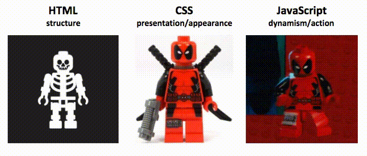

**Table of contents**

- [5. Javascript — Membuat Website Lebih Aktif, Bund](#5-javascript--membuat-website-lebih-aktif-bund)
- [Overview](#overview)
  - [Ilustrasi](#ilustrasi)
- [Javascript](#javascript)
- [Perbedaan HTML, CSS, dan Javascript](#perbedaan-html-css-dan-javascript)
  - [Ilustrasi](#ilustrasi-1)
- [Javascript Tidak Berbeda](#javascript-tidak-berbeda)
- [Tipe Variable di Javascript](#tipe-variable-di-javascript)
  - [var](#var)
  - [let](#let)
- [Tipe Data di Javascript](#tipe-data-di-javascript)
- [Fungsi di Javascript](#fungsi-di-javascript)
- [Object di Javascript](#object-di-javascript)
- [Javascript Events](#javascript-events)
  - [Selector](#selector)
    - [innerHTML](#innerhtml)
    - [attribute](#attribute)
    - [style](#style)
    - [setAttribute](#setattribute)
- [Latihan dengan Javascript](#latihan-dengan-javascript)
  - [Penjelasan](#penjelasan)
    - [Fungsi changeColor](#fungsi-changecolor)
    - [Fungsi addTodo](#fungsi-addtodo)

# 5. Javascript — Membuat Website Lebih Aktif, Bund

# Overview

Seperti judulnya, pada materi ini kita akan membuat website menjadi lebih aktif. Aktif disini diartikan bukan seperti anak kecil yang berlari-lari di padang savana ya, namun membuat website kita dapat berinteraksi dengan pengguna.

## Ilustrasi

Budi memiliki sebuah website, ia ingin apabila pengunjungnya menekan sebuah tombol, maka tombol tersebut akan berubah teksnya menjadi "Hayo salah tekan", lalu merubah warna tombol tersebut dari biru menjadi merah.

# Javascript

<aside>
✅ JavaScript is the programming language of the Web.

</aside>

Javascript adalah bahasa pemrograman untuk membangun sebuah web. Pada dasarnya Javascript menempel pada browser kita, sehingga kita dapat menggunakan Javascript dengan browser kita.

# Perbedaan HTML, CSS, dan Javascript

Kita sudah belajar mengenai HTML, CSS, dan sekarang kita mulai masuk kepada Javascript. Namun, bisa jadi dari kamu ada yang masih bertanya, sebenarnya, apasih perbedaan dari ketiganya?

## Ilustrasi



src: <https://moz.com/>

✅ HTML berfungsi sebagai struktur, CSS berfungsi sebagai tampilan, Javascript berfungsi sebagai aksi (action)

Dari gambar di atas, tentu kamu langsung memahami apa fungsi dari Javascript. Ya, selain sudah saya jelaskan di atas secara teori, kamu juga sudah melihatnya berdasarkan ilustrasi. Jadi, tidak sulit kan memahami perbedaan ketiganya?

# Javascript Tidak Berbeda

Dari kelima bahasa di bawah ini mana yang sudah kamu pelajari?

- PHP
- Python
- Pascal
- C++
- Java

Tentu javascript tidak jauh berbeda dengan mereka. Javascript juga memiliki tipe data, fungsi, dan hal lainnya yang ada pada fundamental programming.

Javascript berbeda penggunaannya pada kasus web design, Javsascript cenderung lebih berfungsi terhadap elemen-elemen yang ada pada web. Lihatlah kode berikut:

```jsx
document.getElementById("my-id").innerHTML = "Hello JavaScript";
```

Kode ini menunjukan bahwa pada element tag dengan ID demo, kita akan mengganti teks dengan teks **Hello Javascript**. Cobalah kode berikut:

```jsx
<!DOCTYPE html>
<html>

<head>
    <style>
        h1 {
            color: blue;
            text-align: right;
        }
        
        #my-id {
            color: red;
            text-align: center
        }
        
        .my-class {
            color: green !important;
            text-align: left;
        }
        
        .my-second-class {
            font-size: 2rem;
            color: blue;
        }
    </style>
</head>

<body>

    <h1>Hello World!</h1>
    <p>Headingnya dibuat dengan CSS.</p>

    <p class="my-class my-second-class">Paragraf ini menggunakan selector class untuk CSS</p>
    <p id="my-id">Paragraf ini menggunakan selector ID untuk CSS</p>

    <script>
        document.getElementById("my-id").innerHTML = "Hello JavaScript";
    </script>
</body>

</html>
```

Kamu tidak akan melihat teks **Paragraf ini menggunakan selector ID untuk CSS**, melainkan kamu akan melihat **Hello Javascript**. Hal ini dikarenakan kita sudah mengganti isi dalam HTML tag dengan id `my-id`.

# Tipe Variable di Javascript

Ada tiga tipe data di Javascript sebagai berikut:

<aside>
✅ Cara eksekusinya adalah buka console pada browser kamu, klik kanan > inspect element dan cari tab console atau tekan CTRL + SHIFT + i

</aside>

## var

`var` adalah tipe data javascript yang dapat dideklarasikan lebih dari satu kali dengan nama yang sama. Cobalah kode berikut:

```jsx
<!DOCTYPE html>
<html>

<head>
    <style>
        h1 {
            color: blue;
            text-align: right;
        }
        
        #my-id {
            color: red;
            text-align: center
        }
        
        .my-class {
            color: green !important;
            text-align: left;
        }
        
        .my-second-class {
            font-size: 2rem;
            color: blue;
        }
    </style>
</head>

<body>

    <h1>Hello World!</h1>
    <p>Headingnya dibuat dengan CSS.</p>

    <p class="my-class my-second-class">Paragraf ini menggunakan selector class untuk CSS</p>
    <p id="my-id">Paragraf ini menggunakan selector ID untuk CSS</p>

    <script>
        document.getElementById("my-id").innerHTML = "Hello JavaScript";

        var x = 10
        console.log(x)
        var x = 20
        console.log(x)
    </script>
</body>

</html>
```

## let

`let` adalah tipe data yang tidak dapat dideklarasikan kembali, namun dapat diubah isinya.

Contoh kode error

```jsx
let x = 10
console.log(x)
let x = 20
console.log(x)
```

Contoh kode yang benar

```jsx
let x = 10
console.log(x)
x = 20
console.log(x)
```

- const

`const` adalah tipe data yang tidak dapat dideklarasikan kembali dan tidak dapat diubah isinya

Contoh kode error

```jsx
const x = 10
console.log(x)
const x = 20
console.log(x)
```

Contoh kode error

```jsx
const x = 10
console.log(x)
x = 20
console.log(x)
```

Contoh kode yang benar

```jsx
const x = 10
console.log(x)
```

# Tipe Data di Javascript

Javascript juga support tipe data pada bahasa pemrograman pada umumnya

- String
- Double/Float
- Number
- Boolean
- Dictionary/Object
- List/Array

✅ Javascript bersifat dinamis value, sehingga bisa diganti dengan value apa saja dan tidak membutuhkan identitas seperti C++, atau Java. Javascript dinamis seperti Python.

# Fungsi di Javascript

Javascript juga bisa membuat fungsi, cobalah kode berikut:

```jsx
<!DOCTYPE html>
<html>

<head>
    <style>
        h1 {
            color: blue;
            text-align: right;
        }
        
        #my-id {
            color: red;
            text-align: center
        }
        
        .my-class {
            color: green !important;
            text-align: left;
        }
        
        .my-second-class {
            font-size: 2rem;
            color: blue;
        }
    </style>
</head>

<body>

    <h1>Hello World!</h1>
    <p>Headingnya dibuat dengan CSS.</p>

    <p class="my-class my-second-class">Paragraf ini menggunakan selector class untuk CSS</p>
    <p id="my-id">Paragraf ini menggunakan selector ID untuk CSS</p>

    <script>
        function sayMyName(name) {
            document.getElementById("my-id").innerHTML = "Hello " + name + "!";
        }

        let name = "Hudya"
        sayMyName(name)
    </script>
</body>

</html>
```

Kode tersebut akan mengganti kalimat **Paragraf ini menggunakan selector ID untuk CSS** dengan kalimat **Hello Hudya!**

Silahkan ganti dengan nama yang kamu inginkan 😄

# Object di Javascript

Membuat objek di Javascript sangat mudah, cobalah kode berikut:

```jsx
<!DOCTYPE html>
<html>

<head>
    <style>

    </style>
</head>

<body>

    <h1>Biodata</h1>

    <p>Name: <span id="my-name"></span></p>
    <p>Borndate: <span id="my-borndate"></span></p>
    <p>Zodiac: <span id="my-zodiac"></span></p>
    <p>Hobby: <span id="my-hobbies"></span></p>
    <script>
        function writeMyBio(bio) {
            document.getElementById("my-name").innerHTML = bio.name;
            document.getElementById("my-borndate").innerHTML = bio.borndate;
            document.getElementById("my-zodiac").innerHTML = bio.zodiac;
            document.getElementById("my-hobbies").innerHTML = bio.hobbies;
        }

        let bio = {
            name: "Hudya",
            borndate: "01/01/1998",
            zodiac: "Capricorn",
            hobbies: ["coding", "playing games", "culinary"]
        }

        writeMyBio(bio)
    </script>
</body>

</html>
```

Kita menggabungkan objek dengan array pada bagian hobi, sehingga kita dapat melakukan iterasi apabila kita membutuhkannya.

# Javascript Events

Event adalah sebuah kejadian dimana Javascript berperan sebagai triggernya. Javascript akan bergerak sebagai motor penggerak untuk mengubah elemen yang ada pada halaman web.

Contoh pertama

```jsx
<!DOCTYPE html>
<html>

<body>
    <p>Date: <span id="my-date"></span></p>
    <button onclick="document.getElementById('my-date').innerHTML = Date()">
        Klik disini untuk merubah tanggal di atas
    </button>
</body>

</html>
```

Contoh kedua

```jsx
<!DOCTYPE html>
<html>

<body>
    <button onclick="this.innerHTML = Date()">The time is?</button>
</body>

</html>
```

✅ Kita dapat menggunakan `this` apabila ingin mengganti bagian dari elemen yang menjadi trigger. Jadi elemen sama saja dengan fungsi `document.getElementById('elemen-tersebut')`.

## Selector

Terdapat tiga cara untuk mengambil elemen yang ingin dijadikan target.

1. `document.getElementById(id)` → Mencari elemen dengan nama ID
2. `document.getElementsByTagName(name)` → Mencari elemen dengan nama tag
3. `document.getElementsByClassName(name)` → Mencari elemen dengan nama class

Setelah menentukan selector kita dapat menggunakan beberapa fungsi sebagai berikut:

### innerHTML

Mengganti bagian dalam dari HTML

```jsx
element.innerHTML = new html

// Contoh
document.getElementByClass("my-class").innerHTML = "New text!";
```

### attribute

Mengganti atribut dari HTML

```jsx
element.innerHTML = new html

// Contoh
document.getElementById("gambar").src = "gambar-baru.jpg";
```

### style

Mengganti Style CSS pada HTML

```jsx
element.style.property = new style

// Contoh
document.getElementById("my-id").style.color = "darkblue";
document.getElementById("my-name").style.font-size = "33px";*
```

### setAttribute

Mengubah attribute yang sudah ada

```jsx
element.setAttribute(attribute, value)

// Contoh

document.getElementById("my-link").setAttribute("href", "https://perogeremmer.com");

/**

Before
<a id="my-link" href="#">Link</a>

After
<a id="my-link" href="https://perogeremmer.com">Link</a>
**/*
```

Kita juga dapat berinteraksi dengan elemen

- `document.createElement(element)`
- `document.removeChild(element)`
- `document.appendChild(element)`
- `document.replaceChild(new, old)`
- `document.write(text)`

⚠️ Kamu tidak perlu langsung mempelajari dan memahami interaksi dengan elemen, namun suatu saat berguna apabila kamu memerlukan pengolahan elemen dengan Javascript. Contoh: Apabila sebuah tombol diklik, maka ada elemen yang dihapus, ditambahkan, atau digantikan.

# Latihan dengan Javascript

Mari latihan membuat program menggunakan Javascript sederhana.

Studi kasus:

1. Mengganti background color dengan tombol
2. Menambahkan dafftar todo pada input

```jsx
<!DOCTYPE html>
<html>

<body>
    <p id='my-text' style="color: red;background-color: black; padding:10px;">Hello World!</p>
    <button onclick="changeColor()">Click this to change the color of text</button>
    <br />
    <br />
    <input type="text" id="my-input" />
    <button onclick="addTodo()">Add Todo</button>

    <ul id="my-list">

    </ul>

    <script>
        function changeColor() {
            let color = document.getElementById("my-text").style.color

            if (color === 'red') {
                document.getElementById("my-text").style.color = 'yellow'
            } else if (color === 'yellow') {
                document.getElementById("my-text").style.color = 'green'
            } else if (color === 'green') {
                document.getElementById("my-text").style.color = 'red'
            }
        }

        function addTodo() {
            let input = document.getElementById("my-input").value

            var node = document.createElement("li"); // Membuat cabang <li>
            var textnode = document.createTextNode(input); // Memasukkan teks ke cabang
            node.appendChild(textnode);

            document.getElementById("my-list").appendChild(node)
            document.getElementById("my-input").value = ""
        }
    </script>

</body>

</html>
```

## Penjelasan

Terdapat dua tombol, yaitu tombol untuk mengganti warna teks pada bagian atas, serta tombol untuk menambahkan isi todo list.

Pertama kita pastikan dulu dari sisi HTML masing-masing elemen telah terbuat.

Setelahnya, kita buat dua fungsi, yaitu `addTodo` untuk menambahkan to-do, dan `changeColor` untuk mengganti warna.

### Fungsi changeColor

Fungsi ini mengganti warna teks layaknya lampu lalu lintas. Awalnya merah, apabila diklik maka fungsi ini akan berfungsi lalu javascript akan mencari elemen dengan ID `my-text`.

Setelahnya akan masuk pada sebuah kondisi. Apabila style colornya berwarna merah maka diganti menjadi kuning, apabila kuning maka diganti menjadi hijau, dan apabila kedua kondisi tidak terpenuhi (yaitu tombolnya hijau) maka diganti menjadi merah kembali.

### Fungsi addTodo

Fungsi ini menambahkan nilai yang kita input pada text input kedalam sebuah node (cabang). Setelah kita masukkan teks pada text input dan menekan tombol Add Todo, maka fungsi ini akan dijalankan.

Pertama fungsi ini akan mencari elemen dengan ID `my-input` dan mengambil nilainya.

Setelahnya, akan dibuat sebuah variabel dimana javascript akan membuat sebuah element dengan tag `li`.  Elemen yang dibuat akan diberikan teks didalamnya yaitu nilai dari ID `my-input`, lalu node tersebut akan ditambahkan sebagai child pada element dengan ID `my-list`.

Di akhir fungsi, kita menghapus nilai yang ada pada elemen ID `my-input` agar text input menjadi kosong kembali.
