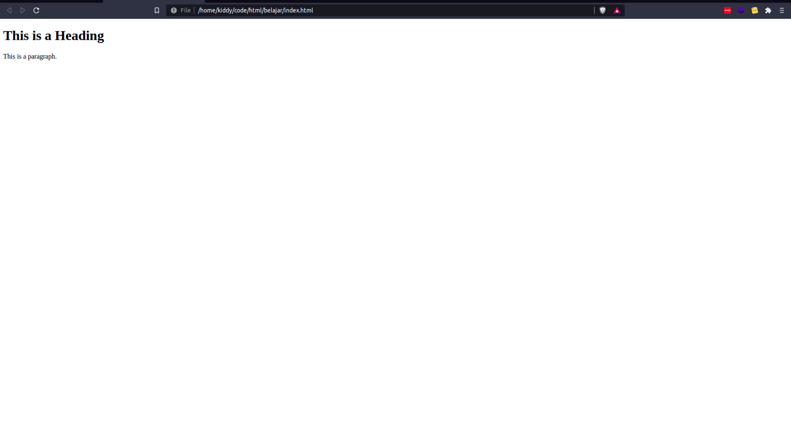

**Table of contents**

- [HTML: Short Introduction](#html-short-introduction)
  - [Secara Online](#secara-online)
  - [Secara Offline](#secara-offline)
- [Buatlah Sebuah Folder](#buatlah-sebuah-folder)
- [Bukalah Kode Editormu](#bukalah-kode-editormu)
- [Jalankan Filenya](#jalankan-filenya)

# HTML: Short Introduction

HTML adalah bahasa markup untuk membangun sebuah website. Dengan HTML, kita dapat membuat website sesuai dengan keinginan kita. Jika diilustrasikan, HTML adalah kerangka tubuh kita. Kerangka tubuh setiap manusia berbeda-beda, ada yang memiliki tulang tangan yang kuat, ada yang memiliki tulang kaki yang panjang (tinggi), dan lain-lain.

Penulisan HTML dikenal dengan TAG (baca: teg), adalah sebuah tanda untuk membuat kode HTML. Tag pada HTML menggunakan simbol berikut  `<tag html>`.

Kerangka dasar HTML terdiri sebagai berikut:

- Tag HTML → Kerangka dasar sebuah file dianggap HTML
  - Tag Head → Kerangka kepala dari HTML
  - Tag Body → Kerangka badan dari HTML
    - Tag Footer →  Kerangka kaki dari HTML

> ✅ Semakin menjorok ke dalam berarti tag tersebut adalah bagian dari tag di atasnya (children).

<br />

Agar dapat lebih mudah simaklah kode berikut:

```html
<!DOCTYPE html>
<html>
 <head>
  <title>Page Title</title>
 </head>
 <body>
  <h1>This is a Heading</h1>
  <p>This is a paragraph.</p>
 </body>
</html>
```

Dapat kita lihat pada kode di atas bahwa setiap tag dibungkus dengan simbol `<>`.

Lantas bagaimana membuat dan menjalankan kode di atas?

## Secara Online

Gunakan editor online yang langsung dapat menjalankan kode HTML seperti:

- [JSFiddle](https://jsfiddle.net/)
- [CodeSandbox: Online Code Editor and IDE for Rapid Web Development](https://codesandbox.io/)
- [CodePen](https://codepen.io/)

Mana yang terbaik? Masing-masing dapat digunakan dan tidak ada yang terbaik untuk versi gratis.

## Secara Offline

Kamu dapat mengunduh teks editor sederhana seperti notepad++ pada Windows,  [download disini](https://notepad-plus-plus.org/downloads/).

Namun saya menyarankan kamu menggunakan kode editor yang lebih besar seperti:

- [Visual Studio Code - Code Editing. Redefined](https://code.visualstudio.com/)
- [Atom](https://atom.io/)

Keduanya sama-sama bagus! Namun, saya sarankan pilih visual studio code karena banyak plugin dari community yang dapat membantu kamu untuk melakukan coding lebih cepat.

Pada materi ini, saya lebih berfokus kepada pembuatan kode secara offline, jadi apabila kamu menggunakan metode online, harap dapat menyesuaikan dengan platformnya.

# Buatlah Sebuah Folder

Silahkan buat folder dimana saja kamu mau, baik di D: atau di Documents, atau dimanapun bagian komputermu, itu tidak penting, yang penting adalah semangatmu.

Bingung memberi nama apa? Tenang, saya tahu memberi nama adalah hal yang paling menyulitkan, namun daripada kamu bingung untuk memberi nama, beri saja nama folder tersebut **belajar HTML**.

# Bukalah Kode Editormu

Saya sarankan kamu menggunakan **Visual Studio Code**. Buatlah file baru dengan nama `index.html` , lalu tulislah kode berikut:

```html
<!DOCTYPE html>
<html>
 <head>
  <title>Page Title</title>
 </head>
 <body>
  <h1>This is a Heading</h1>
  <p>This is a paragraph.</p>
 </body>
</html>
```

<aside>
⚠️ Mau copy paste? Silahkan. Akan lebih baik kamu menulisnya secara  secara manual agar terbiasa dalam menulis kode pemrograman.

</aside>

# Jalankan Filenya

Jangan lupa untuk save dengan cara menekan CTRL + S pada keyboard atau kamu dapat mengaktifkan fitur autosave pada visual studio code dengan cara membuka bagian file dan mencentrang auto-save.

Klik kanan pada file `index.html`, pilih open with, lalu pilih browser kalian.



Semudah itu kan membuat file HTML? Tentu saja. Sekarang kamu sudah dapat membuat HTML dan siap belajar lebih dalam.
