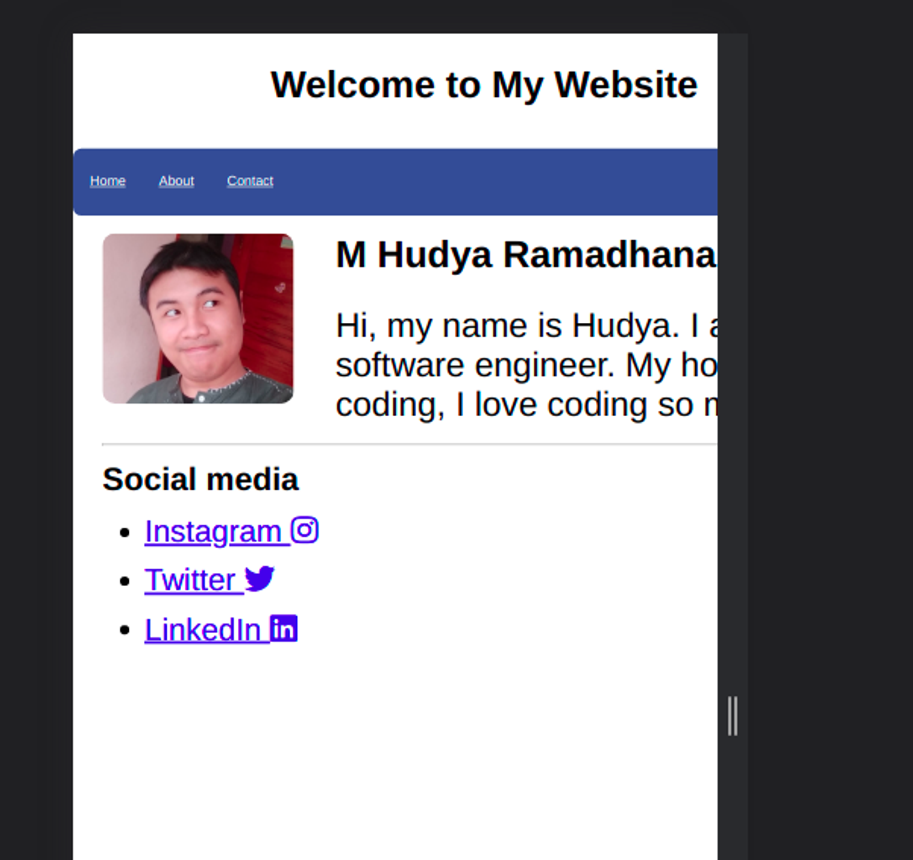
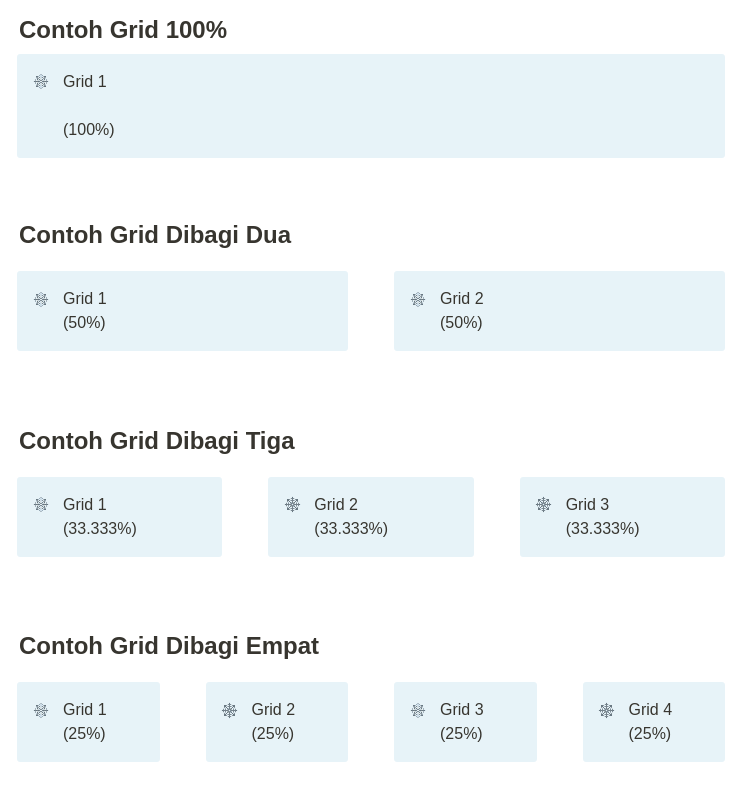
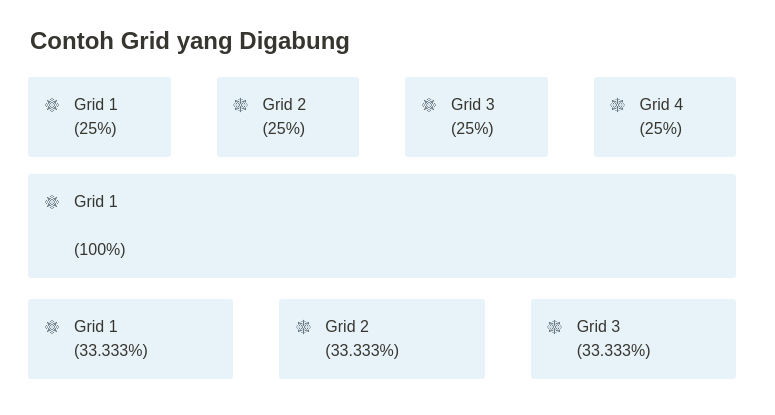
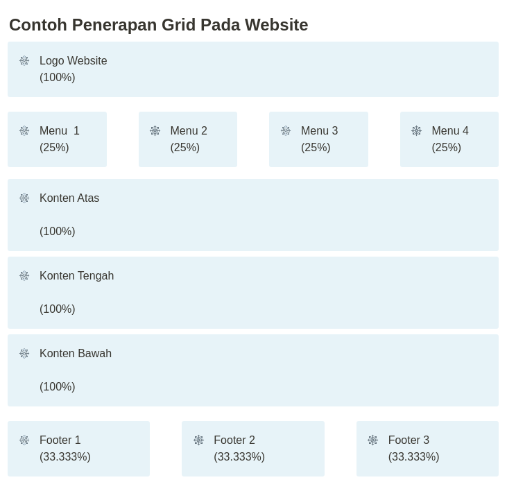

**Table of contents**

- [4. CSS — Membuat Website Responsif](#4-css--membuat-website-responsif)
- [Overview](#overview)
- [Ukuran Layar](#ukuran-layar)
- [Viewport](#viewport)
  - [Perbedaan Penggunaan Viewport](#perbedaan-penggunaan-viewport)
- [Grid](#grid)
  - [Contoh Penerapan Grid Pada Website](#contoh-penerapan-grid-pada-website)
- [Contoh Halaman dengan Grid](#contoh-halaman-dengan-grid)
- [12 Grid Rules](#12-grid-rules)
- [Contoh Penerapan Grid](#contoh-penerapan-grid)
  - [Hasil](#hasil)
- [Media Query](#media-query)
  - [Hasil](#hasil-1)

# 4. CSS — Membuat Website Responsif

# Overview

Pernahkah kamu membuat sebuah website dimana tampilannya berbeda antara versi desktop/pc, dengan versi tablet, lalu versi mobile? Padahal mereka menggunakan basis kode yang sama loh! Mereka bermain dengan yang namanya ukuran layar (display), dimana hal ini sangat mempengaruhi desain sebuah web kamu.

Mengapa seperti itu? Tidak mungkin kita akan menampilkan informasi dan tampilan yang kompleks dengan versi mobile, kan? Maka dari itu kita menggunakan tampilan versi mobile agar ramah saat dibuka dengan smartphone.

Tentu saja kita juga tidak akan menggunakan versi mobile pada PC / desktop kan? Hal ini dikarenakan sangat tidak menyenangkan membuat sebuah website apabila menggunakan versi mobile.

# Ukuran Layar

Ketahui ukuran layar terdapat banyak sekali loh, lihat layar berikut:

<aside>
⚠️ Satuan ukuran, px (pixel)
</aside>

- 60 x 640 , 360 x 740 , 480 x 853, 411 x 731 – ukuran ini biasanya digunakan pada Smartphone. Cuma untuk ukuran ini hanya untuk viewport(lebar fisik layar). Bukan resolusi Smartphone nya sendiri.
- 1024 x 768 – ukuran ini biasanya digunakan pada Tablet & Smartphone.
- 1280 x 720 – ukuran ini biasanya digunakan pada Laptop, beberapa Tablet & Smartphone(mid-end).
- 1366 x 768 – ukuran ini biasanya digunakan pada Laptop.
- 1920 x 1080 – ukuran ini biasanya digunakan pada Laptop dan juga Monitor Komputer (FullHD).
- 2560 x 1440 – ukuran ini biasanya digunakan pada Monitor Komputer dan beberapa High-end Laptop dan juga Smartphone(Quad HD).
- 3840 x 2160 – ukuran ini biasanya digunakan pada (high-end) Monitor Gaming (4k)
- 7680 x 4320 – ukuran ini biasanya digunakan pada (high-end) Monitor Gaming (8k)

<aside>
✅ Sumber: https://digonyze.com/

</aside>

# Viewport

Untuk membuat sebuah website responsif, kamu membutuhkan tag bernama viewport.

<aside>
✅ Viewport merupakan bagian yang terlihat oleh pengguna pada sebuah halaman

</aside>

Untuk menambahkan sebuah viewport, kamu hanya perlu menambahkan kode berikut pada bagiab head.

```html
<meta name="viewport" content="width=device-width, initial-scale=1.0">
```

## Perbedaan Penggunaan Viewport



Tanpa View Port


Dengan View Port

<br />

Apabila kita tidak menggunakan viewport, maka konten paragraf menjadi tertutup dan harus digeser ke sebelah kanan. Jelek sekali bukan?

# Grid

✅ Grid adalah baris pada website. Satu baris pada website disebut dengan grid. Setiap grid bisa memiliki grid lagi (nested).

Untuk bermain dengan grid, kamu memerlukan property CSS yaitu **width**.





## Contoh Penerapan Grid Pada Website



# Contoh Halaman dengan Grid

```html
<!DOCTYPE html>
<html>

<head>
    <meta name="viewport" content="width=device-width, initial-scale=1.0">

    <style>
        * {
            box-sizing: border-box;
        }
        
        body {
            max-width: 100rem;
            margin: auto;
            font-family: sans-serif;
            width: 100%;
        }
        
        .container {
            border: 1px solid;
            max-width: 100%;
            padding: 0;
            width: 100%;
        }
        
        .menu {
            width: 30%;
            float: left;
            border: 1px solid;
            margin: auto;
            padding: auto;
        }
        
        .content {
            width: 70%;
            float: left;
            border: 1px solid;
            margin: auto;
            padding: auto;
        }
    </style>
</head>

<body>
    <div class="container" style="margin-top:30px;">
        <h1>My Website</h1>
    </div>
    <div class="container">
        <div class="menu">
            <ul>
                <li><a href="index.html">Home</a></li>
                <li><a href="about.html">About</a></li>
            </ul>
        </div>
        <div class="content">
            <p>Ini adalah konten grid</p>
        </div>
    </div>
</body>

</html>
```

⚠️ Kunci dari grid adalah code berikut

```css
* {
    box-sizing: border-box;
}
```

Kode ini membuat semua bagian padding dan border diikutsertakan pada total perhitungan panjang dan lebar pada sebuah elemen.

# 12 Grid Rules

Lebar 100% pada sebuah web dapat dipecah menjadi 12 bagian, sebenarnya tidak ada standarisasi sih, kamu juga dapat membuatnya hingga menjadi 14 atau bahkan 26. Pembagian hingga 12 grid ini sudah menyentuh angka maksimal dan apabila lebih akan membuat webmu menjadi berantakan. Lihatlah code class CSS berikut:

```css
.col-1 {width: 8.33%;}
.col-2 {width: 16.66%;}
.col-3 {width: 25%;}
.col-4 {width: 33.33%;}
.col-5 {width: 41.66%;}
.col-6 {width: 50%;}
.col-7 {width: 58.33%;}
.col-8 {width: 66.66%;}
.col-9 {width: 75%;}
.col-10 {width: 83.33%;}
.col-11 {width: 91.66%;}
.col-12 {width: 100%;}
```

Apabila kamu ingin menggunakan panduan 12 grid di atas, maka kamu juga harus menambahkan class berikut:

```css
[class*="col-"] {
  float: left;
  padding: 15px;
  border: 1px solid red;
}
```

Class ini memastikan bahwa setiap class yang memiliki unsur col-<panjang> akan dibuat menjadi float, dan memiliki padding serta border.

Untuk mencobanya kamu dapat menggunakan kode berikut

```html
<!-- 33.33% -->
<div class="col-4">...</div> 

<!-- 66.66% -->
<div class="col-8">...</div> 
```

⚠️ Ingat selalu bahwa maksimal grid adalah 12, maka kamu tidak boleh membuat jumlah col lebih dari 12.

Contoh: Apabila div pertama memiliki class col-4 maka div kedua haruslah col-8. Jika kamu menggunakan col-9, col-10, col-11, atau col-12 maka tidak dapat memenuhi ruang kosong dan elemen akan turun kebawah.

Contoh lainnya: Apabila div pertama memiliki class col-3, lalu div kedua memiliki class col-6, maka div ketiga dapat menggunakan class col-3. (3+6+3 = 12)

Ingat selalu rumusnya, 12 adalah maksimal!

Dasar matematika sangat diperlukan disini, mencoba lari dari matematika?  😄

# Contoh Penerapan Grid

Cobalah salin kode berikut:

```html
<!DOCTYPE html>
<html>

<head>
    <meta name="viewport" content="width=device-width, initial-scale=1.0">

    <style>
        * {
            box-sizing: border-box;
        }
        
        [class*="col-"] {
            float: left;
            padding: 15px;
        }
        
        body {
            max-width: 100rem;
            margin: auto;
            font-family: sans-serif;
            width: 100%;
        }
        
        .menu {
            float: left;
            margin: auto;
            padding: 10px;
            background-color: wheat;
            color: black;
        }
        
        .menu a {
            color: black;
        }
        
        .content {
            float: left;
            padding-left: 30px;
            padding-right: 30px;
        }
        
        .title {
            text-align: center;
            background-color: indigo;
            border: 1px solid indigo;
            color: whitesmoke;
            margin-bottom: 10px;
        }
        
        .row::after {
            content: "";
            clear: both;
            display: table;
        }
        
        .col-1 {
            width: 8.33%;
        }
        
        .col-2 {
            width: 16.66%;
        }
        
        .col-3 {
            width: 25%;
        }
        
        .col-4 {
            width: 33.33%;
        }
        
        .col-5 {
            width: 41.66%;
        }
        
        .col-6 {
            width: 50%;
        }
        
        .col-7 {
            width: 58.33%;
        }
        
        .col-8 {
            width: 66.66%;
        }
        
        .col-9 {
            width: 75%;
        }
        
        .col-10 {
            width: 83.33%;
        }
        
        .col-11 {
            width: 91.66%;
        }
        
        .col-12 {
            width: 100%;
        }
    </style>
</head>

<body>
    <div class="row">
        <div class="col-12 title" style="margin-top:30px;">
            <h1>My Website</h1>
        </div>
    </div>
    <div class="row">
        <div class="col-12">
            <div class="col-3 menu">
                <ul>
                    <li><a href="index.html">Home</a></li>
                    <li><a href="about.html">About</a></li>
                </ul>
            </div>
            <div class="col-9 content">
                <p>Lorem, ipsum dolor sit amet consectetur adipisicing elit. Labore doloribus quaerat nisi ipsam dolorem dolorum rerum quod, sunt magni delectus nostrum soluta, incidunt odio et. Tempore recusandae dolor nemo optio.</p>
                <p>Lorem, ipsum dolor sit amet consectetur adipisicing elit. Labore doloribus quaerat nisi ipsam dolorem dolorum rerum quod, sunt magni delectus nostrum soluta, incidunt odio et. Tempore recusandae dolor nemo optio.</p>
                <p>Lorem, ipsum dolor sit amet consectetur adipisicing elit. Labore doloribus quaerat nisi ipsam dolorem dolorum rerum quod, sunt magni delectus nostrum soluta, incidunt odio et. Tempore recusandae dolor nemo optio.</p>
                <p>Lorem, ipsum dolor sit amet consectetur adipisicing elit. Labore doloribus quaerat nisi ipsam dolorem dolorum rerum quod, sunt magni delectus nostrum soluta, incidunt odio et. Tempore recusandae dolor nemo optio.</p>
            </div>
        </div>
    </div>
</body>

</html>
```

Perhatikan kode berikut pada CSS.

```css
.row::after {
    content: "";
    clear: both;
    display: table;
}
```

Apa fungsi dari kode ini?

⚠️ Karena kita menggunakan float left maka konten dianggap keluar dari halaman (mengambang). Oleh sebabnya bagian ini dapat diisi oleh konten lain yang tidak menggunakan float. Untuk mencegah konten tersebut mengisi bagian float, maka diberikan property clear, content, dan display.

## Hasil


# Media Query

⚠️ Media Query digunakan untuk menambahkan, atau merubah isi value dari property pada ukuran layar tertentu.

Cobalah tambahkan kode CSS berikut pada kode html kamu di atas

```css
@media only screen and (max-width: 600px) {
    body {
        background-color: lightblue;
    }
}
```

## Hasil

<https://www.loom.com/share/72c75e5ae4334856892111df0434d91a>

⚠️ Media query membuat web ketika ukuran layar ≤ 600px, maka background color otomatis berubah.
